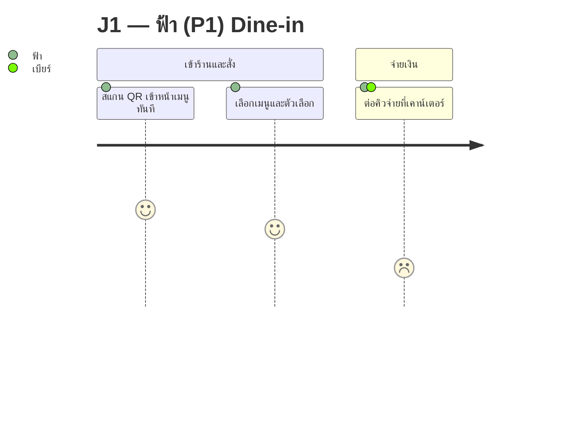

# Feature List & User Journey

Produces the two views a flat backlog cannot give: the **hierarchy** (what the product is made of) and the **sequence** (what a persona actually experiences, in order, with the low points visible).

Pairs with `/product-backlog`: that skill produces user stories and priority; this one produces the feature tree and the journey diagrams for the same requirements. Neither replaces the other.

## When to use
- Touch asks for a "feature list", "ฟีเจอร์ทั้งหมดมีอะไรบ้าง", or wants the product's shape at a glance.
- Touch asks for a user journey, journey map, customer flow, or wants a journey "เป็นแผนภาพ / เป็น diagram".
- The backlog has grown and nobody can tell any more whether a capability is covered twice or not at all.
- A new persona or channel appears and its journey has never been drawn.

## Prerequisite — read before writing

Never write from memory of the conversation. Read these first, in this order:

1. `CLAUDE.md` — the founding brief and the SDLC folder rules
2. `docs/01-requirements/01-spec/product-backlog-v1.md` — **all of it**: user stories, business rules, scope, NEED-INPUT
3. `docs/01-requirements/01-spec/ux-persona-v1.md` — the persona roster; use these names verbatim
4. `docs/01-requirements/01-spec/ux-journey-map-v1.md` — existing journeys and their stage names
5. `docs/01-requirements/02-plan/release-roadmap-v1.md` — which phase each item belongs to

If a journey already exists as a table, **your diagram must match its stages** — you are visualising it, not rewriting it.

## Workflow

### 1. Build the feature hierarchy

Group every capability under a feature and sub-feature. Format:

```
## F-01 <ชื่อฟีเจอร์>
คำอธิบายหนึ่งบรรทัด

| Sub-feature | Capability | US ที่รองรับ | Persona | Phase | สถานะ |
|---|---|---|---|---|---|
```

Two checks that make this worth doing — run both and report the result explicitly:

- **Coverage** — every US in the backlog appears somewhere in the tree. A US that fits under no feature is a finding, not something to force in.
- **Gaps** — a capability implied by a business rule or a persona need but owned by no US. Mark it 🔴 and propose a new US with a suggested ID and one-line rationale. **Do not write it into the backlog** — that is XAVIER's and Touch's call.

### 2. Choose the diagram type

| Situation | Use |
|---|---|
| Straight sequence, want to show how the persona feels | `journey` |
| There is a branch, a condition, an error path, or a business rule with "ถ้า…" | `flowchart` |
| Two actors handing work back and forth | `sequenceDiagram` |

Most personas need a `journey` **and** a `flowchart` — the journey diagram cannot show a branch, and that is exactly where the interesting failures live.

### 3. Draw the journey



**Emotion scale — use exactly this, and print the table under the diagram:**

| ในตาราง journey map | คะแนน Mermaid |
|---|---|
| 😄 +2 | 5 |
| 🙂 +1 | 4 |
| 😐 0 | 3 |
| 😕 −1 | 2 |
| 😣 −2 | 1 |

### 4. Syntax rules that actually break things

- **No comma inside a step label.** Mermaid treats everything after the second colon as a comma-separated actor list; a comma in the label silently turns the rest into actors.
- **No colon inside a label.** It terminates the label.
- One source row carrying two emotions (`🙂 +1 / 😕 −1 ถ้าคิวยาว`) → **split into two steps**, never average. The drop is the finding; averaging deletes it.
- Actor names come from `ux-persona-v1.md` verbatim (ฟ้า / ต้น / ป้าน้อย / เบียร์ / คุณแอน). No new names.
- Keep labels short. A step label longer than ~40 characters wraps badly and stops being readable.

### 5. Mark the low points

A journey rendered as all-happy is worse than no journey. After each diagram, write:

- **Moment of truth** — the 1–2 points where failure loses the customer
- **จุดที่ยังไม่มี US รองรับ** — gaps this journey exposes

### 6. Where the output goes

Feature list and journeys are **requirement-level** → `docs/01-requirements/01-spec/`.
Update that folder's `index.md` to link any new file, and add a line to `docs/05-log/changelog.md` describing what changed and why.

Never write these into `02-design` — a journey is what happens, not what it looks like.

## Guardrails

- **Trace everything.** Every feature row and every journey step points at a US ID, a business rule number, or an explicit Touch decision. If it points at nothing, it is a proposal and must be labelled as one.
- **Do not change** priority, phase, or the wording of an existing user story.
- **Do not delete** a document — superseded versions go to `docs/00-archived`.
- Thai throughout; Obsidian wikilinks must resolve to real files; escape `\|` inside table cells.
- Verify diagrams render before claiming done — a Mermaid block with a syntax error shows as an error box, not as a diagram.
