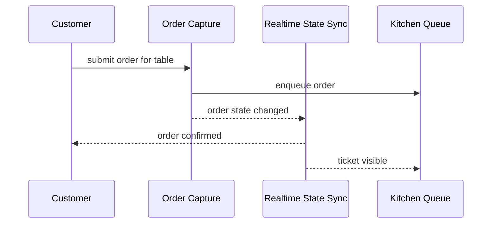

# High-Level Architecture (Conceptual)

Produces the architecture view that comes **before** any technology choice: what logical pieces the system is made of, how data flows through them as a customer/staff/admin actually moves through a journey, and where the trust boundaries sit — all stated so it would still be true if the entire tech stack were swapped out tomorrow.

This is not a replacement for COULSON's `architecture-v1.md`, `data-model-v1.md`, or `api-design-v1.md` — those decide the concrete stack, schema, and endpoints. This skill produces the document those should trace back to.

## When to use

- Touch asks for a "high-level architecture", "conceptual architecture", "ภาพรวมสถาปัตยกรรม" that must not name a framework/database/vendor.
- Touch asks for "data flow" mapped to a specific user journey.
- The existing `architecture-v1.md` is too stack-committed to answer "what does this system conceptually consist of" on its own, and that question needs its own document.
- COULSON is about to make (or has made) a stack decision and Touch wants a capability-level check of what that decision actually needs to satisfy.

## Prerequisite — read before writing

Never write from memory of the conversation. Read these first, in this order:

1. `CLAUDE.md` — founding brief and SDLC folder rules
2. `docs/01-requirements/01-spec/product-backlog-v1.md` — user stories, business rules, scope, NEED-INPUT
3. `docs/01-requirements/01-spec/ux-persona-v1.md` and `ux-journey-map-v1.md` — personas and journeys
4. Any Feature List / Mermaid user-journey docs PEGGY has produced in `docs/01-requirements/01-spec/`
5. `docs/02-design/02-technical/architecture-v1.md` §1 ("ข้อจำกัดจริงที่กำหนดสถาปัตยกรรม") — read this **only** to extract the constraints as capability requirements; do not carry over any of its technology decisions

If a user journey needed for step 3 below doesn't exist yet, say so explicitly and point back to PEGGY/`/feature-journey` rather than inventing one.

## Hard rule — no technology names

Nothing in the output document may name a specific framework, language, database engine, cloud vendor, protocol, or library. Every mechanism must be phrased as the **capability** it provides:

| ❌ Don't write | ✅ Write instead |
|---|---|
| "Supabase Realtime / WebSocket" | "a push mechanism delivering state changes to subscribed devices within N seconds" |
| "Next.js server components" | "a component that renders the menu server-side so it's visible without a client loading step" |
| "Postgres row lock / transaction" | "a data store with cross-entity transactional guarantees" |
| "Cloudflare / VPS / Vercel" | "a hosting boundary" (only if the boundary itself matters conceptually — usually it doesn't belong here at all) |

If a sentence would be equally at home in a `package.json` or a vendor's pricing page, rewrite it or delete it. This is the rule that makes the document worth having as something separate from COULSON's — breaking it collapses the two documents into one.

## Workflow

### 1. System context

List every actor and external touchpoint (customer, staff, admin, and anything implied by requirements — e.g. "a payment collection point"). For each, state what crosses the system boundary and in which direction. Draw as a Mermaid `flowchart` or `graph` using generic node labels (no product names in the boxes).

### 2. Logical components

Group system responsibilities into named capability blocks (e.g. "Menu Catalog," "Order Capture," "Kitchen Queue," "Billing & Settlement," "Realtime State Sync," "Store Administration"). Use this format per component:

```
### <Component Name>
Responsibility: <one sentence, capability language only>
Data it owns: <conceptual data domains — not schema, not column names>
Talks to: <other components + what crosses the boundary>
Traced from: <US IDs / business rules / journey IDs>
```

Every component must trace to something real in the backlog or journeys. A component with no trace is a proposal — label it as one.

### 3. Data flow per user journey

For **each** journey PEGGY has drawn, produce a conceptual flow diagram (Mermaid `sequenceDiagram` or `flowchart`) showing which logical component receives, transforms, or emits which data, in what order, as that journey unfolds. Reuse the journey's stage names — you are translating the persona's experience into the system's-eye view of the same events, not inventing a new journey.

Example shape (illustrative — component names only, no tech):



### 4. Conceptual data domains

Describe the kinds of data that exist and their lifecycle rules (e.g. "an order line, once confirmed, keeps its price even if the catalog changes later") — never a schema, table, or column name. If it would appear in `data-model-v1.md`'s ER diagram, it's too concrete for here.

### 5. Trust & access boundaries

State who can see/do what, conceptually — e.g. "a customer sees only their own table's activity; staff sees all open activity; admin can change the catalog" — without naming an auth mechanism, token format, or session technology.

### 6. Cross-cutting capability needs

Restate every NFR/constraint that shapes architecture (realtime-ness, concurrency safety, offline resilience, privacy stance) as a required capability, each traced to its source. Table format:

| Capability required | Traced from | Why it constrains the architecture |
|---|---|---|

This table is what any future technology choice — COULSON's or a replacement — must satisfy. If a COULSON decision in `architecture-v1.md` appears to conflict with a row here, flag it explicitly rather than silently reconciling it.

### 7. Explicit non-goals

State plainly what this document does not decide: stack, schema, deployment topology, specific vendor. Point to the COULSON docs that decide each (`architecture-v1.md`, `data-model-v1.md`, `api-design-v1.md`).

### 8. Open questions → elicit, don't guess

When a component boundary, data-flow trigger, or trust boundary is genuinely ambiguous from the source docs, do not silently resolve it and do not ask a bare open-ended question either. Present it as a decision with **at least 3 concrete options**, each with real pros and cons grounded in this project's actual constraints — use `AskUserQuestion` when available. This is a standing rule for every run of this skill, not a one-time setup step.

## Where the output goes

Write to `docs/02-design/02-technical/` as a **new, separate file** — e.g. `high-level-architecture-conceptual-v1.md`. Never edit `architecture-v1.md`, `data-model-v1.md`, or `api-design-v1.md` — those stay COULSON's, untouched.

Header the document the same way `architecture-v1.md` does: source docs it traces from, author, date, and an explicit line stating this is the conceptual precursor that COULSON's stack-bound architecture should trace back to (not the other way around).

Add the new file to `docs/02-design/02-technical/index.md`'s table so the Obsidian link isn't orphaned, and log the change in `docs/05-log/changelog.md`.

## Guardrails

- **Trace everything** — every component, flow step, and capability row points at a US ID, business rule number, or journey ID. Unsourced content is a labeled proposal, not a fact.
- **No technology names anywhere in the output** — see the Hard Rule above. This is the one thing that must never slip.
- **Do not touch** COULSON's existing `02-technical` documents — additive only.
- **Do not redraw** PEGGY's journeys — consume them; if one is missing, say so and stop rather than inventing it.
- **Never delete** a superseded version — move it to `docs/00-archived`.
- Thai throughout; Obsidian wikilinks must resolve to real files; verify every Mermaid diagram actually renders before calling the doc done.
