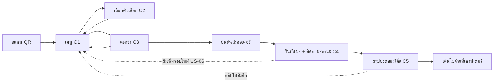
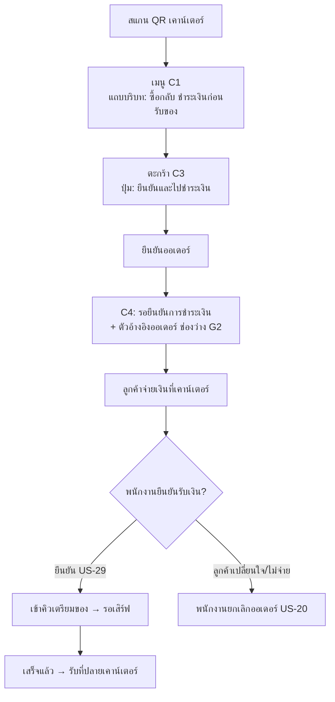
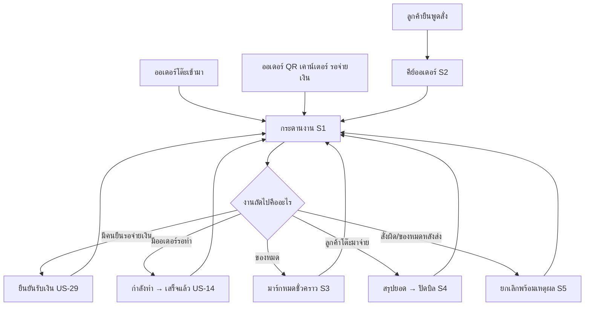

# UX Principles & User Flow v1 — ระบบสั่งอาหารด้วย QR Code

> **ต้นทาง:** [[personas-v1-alt|personas-v1]] (ใครใช้) + [[user-journey-map-v1-alt|user-journey-map-v1]] (เจ็บที่ไหน) + [[../01-requirements/01-spec/product-backlog-v1|01-spec/product-backlog-v1]] (ระบบต้องทำอะไร)
> **สเตจ:** `02-design/01-prototypes` — งานออกแบบเน้นผู้ใช้
> **ขอบเขตสัปดาห์:** งานสัปดาห์ที่ 3 (8–9 ส.ค. · ออกแบบเน้นผู้ใช้ + TPQI 7002) — เอกสารนี้จบที่ **หลักการ + รายการหน้าจอ + user flow** ตั้งใจ**ไม่**วาด wireframe/mockup เพราะนั่นเป็นสโคปของสัปดาห์ที่ 4 (Prototype)
> **จัดทำโดย:** Claude Code (ในบทบาท SHURI — UI/UX ของ `02-design`) · วันที่ 2026-08-12

กลับไปที่ [[index|01-prototypes]] · ก่อนหน้า: [[personas-v1-alt|Personas]] · [[user-journey-map-v1-alt|Journey Map]] · ต่อไปที่ [[../02-design/02-technical/index|02-technical]] และ [[../02-design/02-technical/ai-landscape-v1|AI Landscape]]

---

## 1. หลักการออกแบบ (UX Principles) — 9 ข้อ

หลักการทุกข้อ **สืบย้อนได้** ว่ามาจาก persona/pain point ไหน (ไม่ใช่หลักการทั่วไปที่ลอกมาจากตำรา) และเขียนให้ **ตรวจสอบได้** ว่าละเมิดหรือไม่ตอนรีวิว prototype สัปดาห์หน้า

| # | หลักการ | มาจาก | เกณฑ์ตรวจสอบ (pass/fail ได้จริง) |
|---|---|---|---|
| **1** | **สแกนแล้วถึงเมนูทันที (Zero-step entry)** — ห้ามมีหน้ากลาง ห้ามติดตั้งแอป ห้ามล็อกอิน | US-01 AC ข้อ 1 · P1, P2 | นับจำนวนการแตะจากสแกนถึงเห็นชื่อสินค้าชิ้นแรก = **0 แตะ** |
| **2** | **ออกแบบสองมาตรฐาน: ลูกค้า = เรียนรู้เป็นศูนย์ / พนักงาน = เร็วสูงสุด** | P1–P3 vs P4 (design implication ข้อ 1) | ฝั่งลูกค้า: คนที่ไม่เคยใช้ต้องทำสำเร็จโดยไม่มีใครสอน · ฝั่งพนักงาน: งานที่ทำบ่อยสุดต้องจบใน ≤4 แตะ |
| **3** | **บอกบริบทและกฎการจ่ายเงินก่อนลงมือ ไม่ใช่หลังกดยืนยัน** | J2 ขั้น 4 (moment of truth #4) · BR ข้อ 12 | ทุกหน้าจอสั่งอาหารต้องตอบได้ตลอดเวลาว่า "นี่โต๊ะอะไร/ซื้อกลับ" และ "จ่ายก่อนหรือหลัง" โดยไม่ต้องเลื่อนจอ |
| **4** | **ทุกการกระทำต้องมีผลตอบกลับที่มองเห็นได้ (Visible feedback)** — ระบบนี้แทนที่ "พนักงานพยักหน้ารับออเดอร์" | J1 ขั้น 6 (moment of truth #3) | หลังกดยืนยัน ต้องเห็นทั้ง (ก) ยืนยันว่ารับแล้ว (ข) เวลาที่ส่ง (ค) สถานะปัจจุบัน — ครบ 3 อย่างในจอเดียวโดยไม่ต้องกดอะไรอีก |
| **5** | **สถานะต้องอ่านได้จากการชำเลืองครั้งเดียว (Glanceable)** และอัปเดตเองไม่ต้องรีเฟรช | P1 (ทำงานอยู่) · P2 (ยืนรอ) · US-05, US-13 | อ่านสถานะถูกต้องได้ในเวลา ≤2 วินาที และห้ามมีปุ่มรีเฟรชในทุกหน้าจอสถานะ |
| **6** | **มือเดียว นิ้วโป้ง มือเปียก (One-thumb & wet-hand safe)** | P2 (ยืนถือของ) · P4 (มือเปียก) | ปุ่มหลักอยู่ครึ่งล่างของจอ · เป้าแตะ ≥44×44px (ฝั่งพนักงาน ≥56px) · ระยะห่างปุ่ม ≥8px |
| **7** | **แยกการกระทำที่ย้อนไม่ได้ออกจากการกระทำที่ทำบ่อย** | J4 ขั้น 5 · US-20, US-22 | ปุ่มยกเลิก/คืนเงินต้องไม่อยู่ติดกับปุ่ม "เสร็จแล้ว"/"ยืนยันรับเงิน" และต้องมีขั้นยืนยัน + ระบุเหตุผล (US-20 AC) |
| **8** | **ไม่มีทางตัน (No dead end)** — flow ของลูกค้า dine-in เป็นวง ไม่ใช่เส้นตรง | J1 ขั้น 9 · US-06 | จากทุกหน้าจอฝั่งลูกค้า ต้องกลับไปหน้าเมนูได้ใน 1 แตะ · ห้ามมีหน้า "ขอบคุณ" ที่จบตาย |
| **9** | **ไม่มีทางที่ระบบบังคับอุปกรณ์ของลูกค้า (Non-digital fallback)** | P3 · US-30 | ทุกสิ่งที่ลูกค้าทำได้ผ่าน QR พนักงานต้องทำแทนได้จากหน้าจอตัวเอง |

### หลักการที่**ตั้งใจไม่**ใส่ใน Phase 0 (และเหตุผล)

| ไม่ทำ | เหตุผล |
|---|---|
| ระบบสมาชิก/ล็อกอินฝั่งลูกค้า | BR ข้อ 8 — guest ordering ทั้งหมด · loyalty เป็น Phase 1 |
| popup consent / privacy notice ในหน้าสั่งอาหาร | BR ข้อ 14 + US-32 notes — Phase 0 ไม่เก็บข้อมูลส่วนบุคคลเลย จึงไม่มีอะไรต้องขอความยินยอม **การใส่เกินคือ UX ที่แย่ลงโดยไม่ได้ compliance เพิ่ม** |
| ธีมมืด/สลับภาษา/animation ประณีต | ไม่แก้ pain point ใดในหัวข้อ 5.2 ของ journey map · i18n เตรียมโครงไว้แต่ไม่ทำ UI (US-10 Phase 2) |
| split bill | BR ข้อ 2 — ตะกร้าต่อโต๊ะ ไม่ใช่ต่อคน |

---

## 2. รายการหน้าจอของ Phase 0 (Screen Inventory)

จำนวนหน้าจอที่ต้องออกแบบจริงลดลงเพราะ 2 การตัดสินใจใน backlog: **(ก)** ฝั่งพนักงานเป็นสถานีรวมเดียว (BR ข้อ 13) ไม่แยกจอครัว/แคชเชียร์ **(ข)** ช่องทางโต๊ะและเคาน์เตอร์ใช้หน้าเมนู/ตะกร้าร่วมกัน ต่างกันแค่บริบทและกฎจ่ายเงิน (US-28 AC ข้อ 1)

### 2.1 ฝั่งลูกค้า (ใช้ร่วมกันทั้ง dine-in และ takeaway)

| รหัส | หน้าจอ | หน้าที่ | US | หมายเหตุ |
|---|---|---|---|---|
| **C1** | เมนู (หน้าแรกหลังสแกน) | หมวดหมู่ + สินค้า + สถานะหมด + แถบบริบท (โต๊ะ/ซื้อกลับ) | US-01, US-02, US-16 | **เป็นหน้าแรกจริง** ห้ามมีหน้าใดก่อนหน้านี้ |
| **C2** | แผ่นตัวเลือกสินค้า | ระดับคั่ว/เมล็ดพิเศษ + จำนวน → เพิ่มลงตะกร้า | US-35, US-03 | เป็น bottom sheet ทับ C1 ไม่ใช่หน้าใหม่ (ลดการหลุดบริบท) · default "กลาง" เลือกไว้แล้ว |
| **C3** | ตะกร้าของโต๊ะ/ออเดอร์ | รายการ + แก้/ลบ + ยอดรวมสด + ปุ่มยืนยัน | US-03, BR ข้อ 2 | รองรับรายการที่คนอื่นเพิ่มเข้ามาแบบเรียลไทม์ (J1b) |
| **C4** | ผลการยืนยัน + ติดตามสถานะ | ยืนยันรับออเดอร์ + เวลา + สถานะเรียลไทม์ + (takeaway) คำสั่งให้ไปจ่ายเงิน + **เลขคิวรูปแบบ A01** | US-04, US-05, US-28, **US-38** | **จอที่ข้อความต่างกันตามช่องทางมากที่สุด** · ต้องมีปุ่มกลับไปเมนู (หลักการ 8) · takeaway: เลขคิว A01 ต้องเด่นที่สุดในจอ (ยื่นให้พนักงานดูได้) · dine-in: ไม่มีเลขคิว ใช้เลขโต๊ะ T01–T10 · **รูปแบบเลขคิวต้องต่างจากเลขโต๊ะด้วยตา** เพื่อกันสับสนบนหน้าจอพนักงาน |
| **C5** | สรุปยอดของโต๊ะ | ทุกออเดอร์ทุกรอบของโต๊ะ + ยอดรวม + ข้อความให้ไปจ่ายที่เคาน์เตอร์ | US-07 | dine-in เท่านั้น · ยอดต้องมาจากแหล่งเดียวกับ S4 |
| **C6** | หน้าสถานะผิดปกติ | QR ไม่ถูกต้อง/โต๊ะไม่มีอยู่/ร้านปิดรับออเดอร์ | US-01 AC ข้อ 4, US-26 | ต้องบอกทางออก ("เรียกพนักงาน") ไม่ใช่แสดง error เปล่า |

### 2.2 ฝั่งพนักงานหน้าร้าน (P4 — UI ชุดเดียว เปิดพร้อมกัน 2–4 เครื่องในนาทีพีค)

| รหัส | หน้าจอ | หน้าที่ | US | หมายเหตุ |
|---|---|---|---|---|
| **S0** | เข้าสู่ระบบ | login ต่อสถานี | BR ข้อ 9 | session ต้องอยู่ยาวตลอดกะ (ช่องว่าง G4) |
| **S1** | **กระดานงานหน้าร้าน (จอหลัก)** | คิวเตรียมของ + คิว "รอยืนยันการชำระเงิน" แยกให้เห็นชัด + แจ้งเตือนออเดอร์ใหม่ + ป้ายช่องทาง (โต๊ะ/เคาน์เตอร์) | US-13, US-14, US-15, US-29 | **หน้าจอที่เสี่ยงที่สุดของโปรเจกต์** (moment of truth #1) — ต้องทำ prototype ก่อนทุกจอ · **(อัปเดต 2026-08-12) เป็นจอที่เปิดพร้อมกัน 2–4 เครื่องในนาทีพีค** ⇒ การเปลี่ยนสถานะจากเครื่องหนึ่งต้องปรากฏบนเครื่องอื่นทันที เพื่อกันสองคนหยิบออเดอร์เดียวกัน (BR ข้อ 13) |
| **S2** | คีย์ออเดอร์แทนลูกค้า | เลือกสินค้าเอง + ปุ่มลัดสินค้าขายดี + รับเงินในขั้นตอนเดียว | US-30 | ตัวชี้วัด: เร็วกว่าจดกระดาษ (moment of truth #2) |
| **S3** | ความพร้อมขายของสินค้า | มาร์ก/ปลดหมดชั่วคราว ทั้งระดับสินค้าและระดับตัวเลือก (เมล็ดพิเศษ) | US-16, BR ข้อ 4 | ต้องเข้าถึงได้จาก S1 ในไม่กี่คลิก ไม่ใช่ซ่อนในหน้าแอดมิน |
| **S4** | สรุปยอด/ปิดบิลต่อโต๊ะ | **แสดงทุกโต๊ะ (5–10 โต๊ะ) พร้อมกันในจอเดียว** พร้อมสถานะว่าง/ไม่ว่าง + ยอดค้าง → เลือกโต๊ะ → ปิดบิล (โต๊ะกลับเป็นว่างอัตโนมัติ) | US-18, US-19, BR ข้อ 11 | ยอดต้องตรงกับ C5 เป๊ะ · **(อัปเดต 2026-08-12) ไม่ต้องมีช่องค้นหา/แบ่งหน้าโต๊ะ** — ร้านมี 5–10 โต๊ะ เห็นครบในจอเดียวเร็วกว่าและพลาดน้อยกว่าการค้นหาตอนมือเปียก |
| **S5** | ยกเลิกออเดอร์/รายการ | ยกเลิกพร้อมเหตุผล | US-20 | เป็น flow ที่ต้องยืนยัน ไม่ใช่ปุ่มเดี่ยวบน S1 (หลักการ 7) |

### 2.3 ฝั่งแอดมิน (P5)

| รหัส | หน้าจอ | หน้าที่ | US | หมายเหตุ |
|---|---|---|---|---|
| **A1** | จัดการเมนู | เพิ่ม/แก้/ลบสินค้า หมวดหมู่ ราคา รูป | US-23 | ต้องใช้จากมือถือได้จริง |
| **A2** | จัดการเมล็ดพิเศษ/ตัวเลือก | รายการเมล็ดพิเศษแบบ dynamic + สถานะหมด | US-36 | ใช้กลไกเดียวกับ A1/S3 ไม่ใช่ระบบใหม่ |
| **A3** | โต๊ะและ QR | สร้างโต๊ะ + สร้าง/ดาวน์โหลด QR (โต๊ะ + เคาน์เตอร์) | US-24, BR ข้อ 10 | ใช้ครั้งเดียวก่อนเปิดร้าน (QR static) — ไม่ต้องประณีตเท่า A1 |

### 2.4 ชิ้นงานออกแบบที่ไม่ใช่หน้าจอ (Physical touchpoint)

| รหัส | ชิ้นงาน | หน้าที่ | US | หมายเหตุ |
|---|---|---|---|---|
| **X1** | ป้าย/สติกเกอร์ QR ติดโต๊ะ | สื่อ 3 อย่าง: สั่งเองได้ที่นี่ / เลขโต๊ะ / "ชำระเงินที่เคาน์เตอร์ก่อนกลับ" + ไม่ต้องติดตั้งแอป | **US-37**, US-24, BR ข้อ 22 | เลขโต๊ะอ่านออกจากระยะ ~1 ม. · เป็นจุดสัมผัสแรกของทุก journey |
| **X2** | ป้ายตั้ง/ติดหน้าเคาน์เตอร์ | เหมือน X1 แต่ข้อความคือ "สั่งเองไม่ต้องรอคิว — ชำระเงินที่เคาน์เตอร์ก่อนรับของ" | **US-37**, BR ข้อ 12, 22 | ต้องอยู่ในตำแหน่งที่คนต่อคิวมองเห็น |

> ป้ายทั้งสองแบบต้องออกมาเป็น **ไฟล์พร้อมพิมพ์ที่ระบบสร้างให้** (QR + เลขโต๊ะ + ข้อความในไฟล์เดียว ตาม AC ใหม่ของ US-24) ไม่ใช่ไฟล์ที่เจ้าของร้านต้องไปจัดหน้าเองก่อนพิมพ์

**รวม Phase 0: 15 หน้าจอ + 2 ชิ้นงานสิ่งพิมพ์** (ลูกค้า 6 · พนักงาน 6 · แอดมิน 3 · ป้าย 2) — ถ้ายังไม่รวมการตัดสินใจเรื่องสถานีรวมเดียว ตัวเลขหน้าจอจะเป็น ~19–20 จอ

---

## 3. User Flow

### 3.1 ภาพรวม: 3 ทางเข้า → คิวเดียวของพนักงาน

```mermaid
flowchart TD
    subgraph ทางเข้า
        A1[สแกน QR โต๊ะ<br/>channel=table] --> M[หน้าเมนู C1<br/>ใช้ร่วมกัน]
        A2[สแกน QR เคาน์เตอร์<br/>channel=counter] --> M
        A3[ลูกค้าพูดสั่ง<br/>origin=staff-entered] --> S2[พนักงานคีย์แทน S2]
    end
    M --> C3[ตะกร้าของโต๊ะ/ออเดอร์ C3]
    C3 --> Q{ช่องทางไหน?}
    Q -- โต๊ะ dine-in --> K[เข้าคิวเตรียมของทันที<br/>ไม่รอจ่ายเงิน]
    Q -- เคาน์เตอร์ takeaway --> P[สถานะ: รอยืนยันการชำระเงิน]
    P --> PC[พนักงานยืนยันรับเงิน US-29]
    PC --> K
    S2 --> SP[คีย์ + รับเงินในขั้นตอนเดียว] --> K
    K --> S1[กระดานงานหน้าร้าน S1]
    S1 --> D{ช่องทางของออเดอร์}
    D -- โต๊ะ --> SV[พนักงานเสิร์ฟที่โต๊ะ]
    D -- เคาน์เตอร์ --> PU[ลูกค้ารับที่ปลายเคาน์เตอร์]
    SV --> B[ลูกค้ามาจ่ายเงิน → ปิดบิล S4<br/>โต๊ะกลับเป็นว่าง]
    PU --> E[จบออเดอร์]
    B --> E
```

**สิ่งที่ flow นี้ยืนยัน:** ทางเข้ามี 3 ทางแต่ **ปลายทางบรรจบที่คิวเดียว** (S1) ตาม BR ข้อ 12 — จุดที่ flow แตกต่างกันจริงมีแค่ 2 จุด: กฎจ่ายเงิน (ก่อน/หลัง) และจุดส่งมอบ (เสิร์ฟที่โต๊ะ/รับที่ปลายเคาน์เตอร์)

### 3.2 Flow ลูกค้า dine-in (P1) — เป็นวง ไม่ใช่เส้นตรง



เส้นประคือเส้นที่ทำให้ **หลักการข้อ 8 (ไม่มีทางตัน)** เป็นจริง — ถ้า prototype สัปดาห์หน้าไม่มีเส้นประเหล่านี้ ถือว่า fail หลักการข้อ 8

### 3.3 Flow ลูกค้า takeaway (P2) — กฎจ่ายก่อนบังคับ



**ข้อความบนปุ่มยืนยันต้องต่างจาก dine-in** ("ยืนยันและไปชำระเงิน" vs "ส่งออเดอร์") — นี่คือวิธีทำหลักการข้อ 3 ให้เป็นจริงด้วยต้นทุนต่ำสุด

### 3.4 Flow พนักงานในนาทีพีค (P4) — 3 แหล่งเข้าพร้อมกัน



**ข้อสังเกตสำคัญ:** ทุกงานย่อยต้องกลับมาที่ S1 ได้ในแตะเดียว เพราะพนักงานถูกขัดจังหวะตลอดเวลา — S1 คือ "บ้าน" ไม่ใช่เมนูตั้งต้นที่กดออกไปแล้วหาทางกลับยาก

---

## 4. โครงสร้างข้อมูลบนหน้าจอ (Information Hierarchy)

สิ่งที่ต้องเด่นที่สุดในแต่ละหน้าจอ — เขียนไว้เพื่อให้สัปดาห์ prototype ไม่ต้องเถียงกันเรื่องลำดับความสำคัญใหม่

| หน้าจอ | เด่นอันดับ 1 | อันดับ 2 | อันดับ 3 | สิ่งที่ห้ามเด่นเกิน |
|---|---|---|---|---|
| C1 เมนู | ชื่อ + ราคาสินค้า | หมวดหมู่ | สถานะหมด | โลโก้ร้าน, แบนเนอร์โปรโมชัน |
| C3 ตะกร้า | ยอดรวม | รายการ + จำนวน | ตัวเลือกของแต่ละรายการ | ปุ่มลบทั้งตะกร้า |
| C4 ยืนยัน/สถานะ | สถานะปัจจุบัน | (takeaway) คำสั่งไปจ่ายเงิน + ตัวอ้างอิง | เวลาที่ส่ง | ปุ่มแชร์/ให้คะแนน (ไม่มีใน Phase 0) |
| S1 กระดานงาน | ออเดอร์ที่รอทำนานสุด | เลขโต๊ะ/ป้ายช่องทาง | รายการ + ตัวเลือก/หมายเหตุ | ยอดเงิน (ไม่ใช่ข้อมูลที่ใช้ตอนชง) |
| S2 คีย์ออเดอร์ | ปุ่มลัดสินค้าขายดี | ยอดที่ต้องเก็บ | เมนูเต็ม | ประวัติออเดอร์ |
| S4 ปิดบิล | ยอดรวมสุทธิ | รายการแยกรอบ | เวลา | ปุ่มคืนเงิน (Phase 1 และเป็น destructive) |

---

## 5. กรณีขอบและสถานะผิดปกติที่ต้องออกแบบ (Edge Cases)

ไม่ใช่ของแถม — 4 ข้อแรกเกิดขึ้นจริงในสัปดาห์แรกของการเปิดร้านแน่นอน

| # | กรณี | ต้องเกิดอะไร | อ้างอิง |
|---|---|---|---|
| 1 | สินค้า/เมล็ดพิเศษหมดในจังหวะที่ลูกค้ากดยืนยันพอดี (race condition) | reject **เฉพาะรายการนั้น** แจ้งลูกค้า และให้ยืนยันส่วนที่เหลือต่อได้ — ห้ามปฏิเสธทั้งออเดอร์ | BR ข้อ 4 |
| 2 | สแกน QR ของโต๊ะที่ยังไม่ปิดบิลของลูกค้าคนก่อน | ตามกฎคือ session ต่อโต๊ะ — ลูกค้าใหม่จะเห็นออเดอร์ค้างของคนก่อน **ถ้าพนักงานลืมปิดบิล** ⇒ ต้องออกแบบให้พนักงานเห็นชัดว่าโต๊ะไหนยังเปิดค้างอยู่ (S1/S4) | BR ข้อ 7, 11 |
| 3 | ร้านปิดรับออเดอร์ระหว่างที่ลูกค้ากำลังเลือกของอยู่ | แจ้งบนหน้าจอลูกค้าว่าปิดรับแล้ว พร้อมบอกให้ติดต่อพนักงาน (ไม่ปล่อยให้กดยืนยันแล้วเงียบ) | US-26 |
| 4 | ลูกค้าปิดแท็บ/มือถือแบตหมดหลังส่งออเดอร์ | ออเดอร์ยังอยู่ในระบบและผูกกับโต๊ะ — กลับมาสแกนใหม่ต้องเห็นออเดอร์เดิม ไม่ใช่เริ่มใหม่จากศูนย์ | BR ข้อ 2, 7 |
| 5 | สัญญาณเน็ตของลูกค้าหลุดตอนกดยืนยัน | ต้องไม่เกิดออเดอร์ซ้ำจากการกดยืนยันซ้ำ — เป็นข้อกำหนดที่ต้องส่งต่อ `02-technical` (idempotency) | — (ใหม่จากเอกสารนี้) |
| 6 | QR ถูกถ่ายรูปไปสั่งจากนอกร้าน | QR static ตาม BR ข้อ 10 จึงเปิดโอกาสนี้จริง — Phase 0 ยอมรับความเสี่ยงนี้ได้เพราะ dine-in จ่ายที่เคาน์เตอร์และ takeaway จ่ายก่อน (ไม่มีการสูญเสียเงิน) แต่พนักงานควรยกเลิกออเดอร์ที่ไม่มีคนอยู่จริงได้ | BR ข้อ 10, US-20 |
| 7 | **(ใหม่ 2026-08-12)** พนักงาน 2 คนกดจัดการออเดอร์เดียวกันพร้อมกันจากคนละอุปกรณ์ | ต้องไม่ทำให้สถานะย้อนกลับหรือระบบพัง — ผลลัพธ์ต้องเป็นสถานะที่ก้าวหน้าที่สุด และอีกเครื่องต้องเห็นการเปลี่ยนแปลงทันที (กันการชงซ้ำ/รับเงินซ้ำ) | BR ข้อ 13, 25 · AC ใหม่ US-14 |
| 8 | **(ใหม่ 2026-08-12)** พนักงานเปิดหน้าจอเครื่องที่ 2/3/4 ด้วยบัญชีสถานีเดียวกัน | ทุกเครื่องต้องอยู่ในระบบพร้อมกัน — **ห้ามเด้งเครื่องแรกออก** (single-session-per-account ใช้กับร้านนี้ไม่ได้) | BR ข้อ 25 |

---

## 6. Design System เบื้องต้น (แนวทาง ไม่ใช่ข้อสรุปสุดท้าย)

ระดับที่พอใช้เริ่ม prototype โดยไม่ล็อกการตัดสินใจด้านแบรนด์ (ยังไม่มี brand identity ของร้าน)

| หมวด | แนวทาง Phase 0 | เหตุผลจาก persona/journey |
|---|---|---|
| ขนาดตัวอักษรพื้นฐาน | ≥16px ฝั่งลูกค้า · ≥18px ฝั่งพนักงาน · ราคา/ยอดรวมใหญ่กว่าปกติชัดเจน | P3 (ตาไม่ค่อยดี) · P4 (มองผ่าน ๆ ระหว่างชง) |
| เป้าแตะ | ลูกค้า ≥44px · พนักงาน ≥56px ระยะห่าง ≥8px | P2 (มือเดียว) · P4 (มือเปียก) |
| สี | ใช้สีสื่อ **สถานะ** เป็นหลัก (รอ/กำลังทำ/เสร็จ/รอชำระเงิน) ไม่ใช่สื่อความสวย · ต้องแยกออกได้ด้วยรูปร่าง/ข้อความด้วย ไม่พึ่งสีเดียว | J4 (แยกช่องทาง/สถานะเร็ว) · เผื่อผู้ใช้ที่แยกสีได้ไม่ดี |
| ป้ายช่องทาง | โต๊ะ vs เคาน์เตอร์ ต้องต่างกันทั้งสีและข้อความ | J4 ขั้น 3–4 |
| ภาษา | ไทยเป็นหลัก แต่ห้ามฝังข้อความแบบถอดออกเป็น key ไม่ได้ | P6 (Phase 2) |
| การแจ้งเตือนฝั่งพนักงาน | เสียง + ภาพ (badge/แถบ) พร้อมกันเสมอ | J4 (เสียงเครื่องบดกลบเสียงแจ้งเตือน) |

---

## 7. Checklist สำหรับรีวิว Prototype สัปดาห์ที่ 4

ใช้เป็นเกณฑ์ตรวจงานตัวเองก่อนส่ง — แต่ละข้อ pass/fail ได้จริง

- [ ] สแกน → เห็นชื่อสินค้าชิ้นแรก = 0 แตะ ไม่มีหน้ากลาง (หลักการ 1)
- [ ] ทุกหน้าจอลูกค้าตอบได้ว่า "โต๊ะไหน/ซื้อกลับ" และ "จ่ายก่อนหรือหลัง" โดยไม่ต้องเลื่อนจอ (หลักการ 3)
- [ ] หน้ายืนยันมีครบ 3 อย่าง: รับแล้ว + เวลา + สถานะ (หลักการ 4)
- [ ] จากทุกหน้าจอลูกค้ากลับไปหน้าเมนูได้ใน 1 แตะ · ไม่มีหน้าจบตาย (หลักการ 8)
- [ ] S1 แสดงคิวเตรียมของและคิวรอยืนยันชำระเงินแยกกันชัดในจอเดียว โดยไม่ต้องเลื่อน (moment of truth #1)
- [ ] S2 คีย์เมนูขายดี + รับเงินจบใน ≤4 แตะ (moment of truth #2)
- [ ] ปุ่มยกเลิก/คืนเงินไม่อยู่ติดปุ่มที่กดบ่อย และมีขั้นยืนยัน (หลักการ 7)
- [ ] ทุกอย่างที่ลูกค้าทำได้ พนักงานทำแทนได้ (หลักการ 9)
- [ ] **เลขคิว A01** แสดงเด่นที่สุดในจอลูกค้า takeaway หลังยืนยัน และแสดงในคิวพนักงานทั้งคิวรอชำระเงินและคิวเตรียมของ โดยดูต่างจากเลขโต๊ะ T01–T10 ด้วยตาทันที (US-38 — ปิดช่องว่าง G2 แล้ว)
- [ ] ออเดอร์เคาน์เตอร์มีปุ่ม **"ส่งมอบแล้ว"** ต่อจาก "เสร็จแล้ว" และกดแล้วออเดอร์หลุดจากคิวหน้าจอหลัก · ออเดอร์โต๊ะ **ไม่มี**ปุ่มนี้ (US-14 — ปิดช่องว่าง G3 แล้ว)
- [ ] ป้าย QR ทั้ง 2 แบบ (X1/X2) สื่อครบ 3 อย่าง + "ไม่ต้องติดตั้งแอป" และออกมาเป็นไฟล์พร้อมพิมพ์จากระบบ (US-37 — ปิดช่องว่าง G1 แล้ว)
- [ ] **(ใหม่ 2026-08-12)** S1 ใช้งานพร้อมกันได้จาก 2–4 เครื่อง: กดสถานะที่เครื่องหนึ่งแล้วอีกเครื่องเห็นทันที และเครื่องที่เข้าทีหลังไม่เด้งเครื่องแรกออก (BR ข้อ 13, 25)
- [ ] **(ใหม่ 2026-08-12)** S4 แสดงทุกโต๊ะ (5–10 โต๊ะ) ครบในจอเดียว โดยไม่ต้องค้นหา/เลื่อนหา (US-18)
- [ ] ไม่มี popup consent/privacy notice ในหน้าจอสั่งอาหารของ Phase 0 (BR ข้อ 14)

---

## 8. การส่งต่อ (Handoff)

- **สัปดาห์ที่ 4 (Prototype) — ลำดับที่ยืนยันแล้ว:** **S1 → S2 → C1/C3/C4 (ช่องทางเคาน์เตอร์) → S4 → C1/C3/C4/C5 (ช่องทางโต๊ะ) → A1/A2 → A3 → X1/X2 (ป้าย)** · ใช้ checklist หัวข้อ 7 เป็นเกณฑ์ส่งงาน
  - เหตุผลของลำดับ: (1) **S1/S2 มาก่อนเสมอ** เพราะเป็น moment of truth #1 และ #2 และเป็นจอที่ใช้งานในสภาพแวดล้อมแย่ที่สุด (2) **ช่องทางเคาน์เตอร์มาก่อนช่องทางโต๊ะ** เพราะ Touch ยืนยัน (2026-08-12) ว่าวันเปิดร้านคาดว่า**ลูกค้าซื้อกลับเยอะกว่า dine-in** — ของที่ลูกค้าเจอบ่อยกว่าควรถูกทดลองและแก้ก่อน (3) หน้าจอแอดมิน (A1–A3) ใช้ไม่บ่อยและไม่มีความกดดันด้านเวลา จึงไว้ท้าย
- **✅ ช่องว่าง G1–G4 ปิดแล้ว (2026-08-12):** ไม่มีอะไรค้างที่ต้องรอคำตอบก่อนเริ่มวาดหน้าจอ — ของที่ตัดสินแล้วและต้องรับไปใช้: ป้าย 2 แบบ (X1/X2 ในหัวข้อ 2.4) · เลขคิว **A01** บน C4 และคิวพนักงาน (ต้องดูต่างจากเลขโต๊ะ T01–T10) · สถานะ "ส่งมอบแล้ว" บน S1 เฉพาะออเดอร์เคาน์เตอร์ · session พนักงานตลอดกะ + ปลดล็อกด้วย PIN — ดูรายละเอียดที่หัวข้อ 7 ของ [[../01-requirements/01-spec/product-backlog-v1|product-backlog-v1]] และหัวข้อ 6 ของ [[user-journey-map-v1-alt|user-journey-map-v1]]
- **ส่งต่อ [[../02-design/02-technical/index|02-technical]] (COULSON/BANNER):** อายุ session พนักงาน (G4) · การป้องกันออเดอร์ซ้ำเมื่อเน็ตหลุด (edge case 5) · ความต้องการอัปเดตเรียลไทม์ของ C4/S1 · field ภาษาที่สองและ channel/origin ที่ต้องแสดงผลต่างกันบน UI
- **ส่งต่อ [[../03-testing/01-test-plan/index|03-testing/01-test-plan]] (OKOYE):** checklist หัวข้อ 7 และ edge case หัวข้อ 5 แปลงเป็น test case ได้โดยตรง
