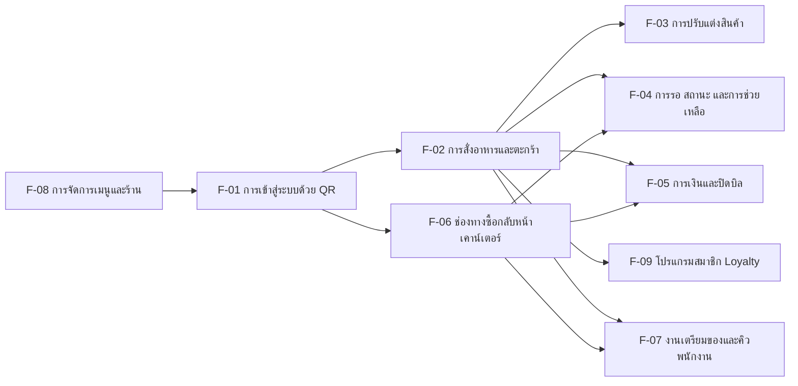

# Feature List v1 — ระบบสั่งอาหารด้วย QR Code

> **สถานะ: DRAFT (ร่าง — รออนุมัติจาก Touch)**
> ต้นทาง: [[product-backlog-v1|Product Backlog v1]] (US-01 ถึง US-45 ครบทุกตัว, Business Rule ข้อ 1-27, หัวข้อ 3.5 MoSCoW, หัวข้อ 4 Scope), [[ux-persona-v1|UX Persona v1]] (persona roster 5 ตัว), [[ux-journey-map-v1|UX Journey Map v1]] (J1-J4 + gap analysis)
> จัดทำโดย: PEGGY (Feature List & User Journey Analyst) — วันที่ 2026-08-15
> ใช้ skill: `/feature-journey`

กลับไปที่ [[index|01-spec]] · เอกสารต้นทาง: [[product-backlog-v1|Product Backlog v1]] · [[ux-persona-v1|UX Persona v1]] · [[ux-journey-map-v1|UX Journey Map v1]] · [[ux-requirements-v1|UX Requirements v1]]

---

## หัวเอกสาร

| รายการ | รายละเอียด |
|---|---|
| สถานะ | **DRAFT (ร่าง — รออนุมัติจาก Touch)** |
| ต้นทาง | [[product-backlog-v1\|Product Backlog v1]] (US-01–US-45, BR 1-27, หัวข้อ 3.5) |
| ผู้จัดทำ | PEGGY (Feature List & User Journey Analyst) |
| วันที่ | 2026-08-15 |
| Scope | Feature hierarchy เต็มระบบ (feature → sub-feature → capability) + coverage check ครบ 45 US + gap check ย้อนกลับ — **ไม่ครอบคลุม User Journey (Mermaid)** ซึ่งเป็นงานชิ้นถัดไปแยกต่างหาก |

---

## 0. เอกสารนี้ต่างจาก backlog อย่างไร

[[product-backlog-v1|Product Backlog v1]] คือ **รายการ story เรียงตามลำดับความสำคัญ** (P0/P1/P2, Phase, MoSCoW) — ตอบคำถามว่า "ต้องสร้างอะไรบ้าง และทำอันไหนก่อน-หลัง" อ่านแบบไล่ทีละ US จึงเห็น**ความลึก**ของแต่ละเรื่องได้ดี แต่ไม่เห็น**รูปทรงรวม**ของระบบ — 45 story เรียงเป็นเส้นตรงบังไว้ว่าอะไรเป็นความสามารถเดียวกันที่ถูกพูดถึงคนละที่ (option-group ของ US-08/35/36/43) หรือ business rule ข้อไหนที่ไม่มี story เป็นเจ้าของ

เอกสารนี้ทำหน้าที่ตรงข้าม — จัดกลุ่มความสามารถทั้งหมดเป็น **feature → sub-feature → capability** เพื่อ:
1. เห็นรูปทรงของผลิตภัณฑ์ทั้งระบบในหน้าเดียว
2. ตรวจว่า US ทุกตัวมีที่อยู่ (coverage) และไม่มี sub-feature ไหนไม่มีเจ้าของ (reverse gap)
3. เผยความสามารถที่ถูกอธิบายซ้ำด้วยคำต่างกันในหลาย story
4. เสนอ (ไม่ใช่เปิด) backlog item ใหม่เมื่อ feature tree ชี้ให้เห็นช่องว่างที่ไม่มี US รองรับ

**เอกสารนี้ไม่มีอำนาจเหนือ backlog — ขัดกันที่ไหนให้ยึด [[product-backlog-v1|Product Backlog v1]] เป็นหลักเสมอ** ทุกแถวในตารางด้านล่างต้องสืบกลับไปยัง US ID / Business Rule เลข / persona ที่มีอยู่จริง — แถวไหนสืบกลับไม่ได้ ถูก label ไว้ชัดว่าเป็น **proposal ที่ยังไม่อยู่ใน backlog** ต้องรอ XAVIER/Touch อนุมัติก่อนเสมอ ไม่ใช่การเปิด backlog item เอง และ**ไม่มีการเปลี่ยน priority, phase, MoSCoW หรือถ้อยคำของ US ใดในเอกสารนี้แม้แต่ตัวเดียว**

---

## 1. ภาพรวม Feature Tree

9 feature หลัก ครอบคลุม 45 user story ทั้งหมด — รายละเอียดแต่ละ feature อยู่ในหัวข้อ 2 ด้านล่าง ตารางคอลัมน์ Phase/MoSCoW ทุกแถวคัดลอกตรงจาก [[product-backlog-v1|Product Backlog v1]] หัวข้อ 3.5.3 ไม่มีการตีความใหม่

---

## 2. Feature Tree เต็ม

## F-01 การเข้าสู่ระบบสั่งอาหารด้วย QR (Entry Point)
จุดสัมผัสแรกของทุก journey — ทำให้ลูกค้าเริ่มสั่งเองได้โดยไม่ต้องมีพนักงานมาอธิบาย/รับออเดอร์

| Sub-feature | Capability | US ที่รองรับ | Persona | Phase | MoSCoW | สถานะ |
|---|---|---|---|---|---|---|
| F-01.1 สแกน QR โต๊ะ (dine-in) | เข้าหน้าเมนูทันที ไม่มีหน้ากลาง รู้เลขโต๊ะอัตโนมัติ | US-01 | ฟ้า (เจ้าของ) · ป้าน้อย (ตัวแทนกรณีเสี่ยง) | 0 | Must | มีใน backlog แล้ว |
| F-01.2 ป้าย/สติกเกอร์ QR สื่อสารวิธีใช้ (ทั้ง 2 ช่องทาง) | ป้ายบอกว่าสั่งเองได้ + ช่องทางอะไร + กฎจ่ายเงิน โดยไม่ต้องมีพนักงานเดินอธิบาย | US-44 | ฟ้า · ต้น · ป้าน้อย (ทุกคนที่เดินเข้าร้าน) | 0 | Must | มีใน backlog แล้ว |
| F-01.3 สร้าง/พิมพ์ QR ผูกกับโต๊ะและเคาน์เตอร์ (แอดมิน) | สร้าง QR static ต่อโต๊ะ/เคาน์เตอร์ ผลิตเป็นป้ายพร้อมพิมพ์ | US-24 | คุณแอน | 0 | Must | มีใน backlog แล้ว |
| F-01.4 จัดผังโต๊ะ (แอดมิน) | จัดกลุ่มโซน/ลำดับ/ตำแหน่งโต๊ะอย่างง่าย เพิ่ม/แก้/ปลดระวางโต๊ะได้เอง | US-42 | คุณแอน | 0 | Should | มีใน backlog แล้ว |

## F-02 การสั่งอาหารและจัดการตะกร้า (Ordering Core)
กลไกหลักที่ทำให้ลูกค้าเลือก-ยืนยันออเดอร์ได้เองโดยไม่ต้องมีพนักงานมารับออเดอร์ — หน้าจอชุดนี้ใช้ร่วมกันทั้งช่องทางโต๊ะและเคาน์เตอร์

| Sub-feature | Capability | US ที่รองรับ | Persona | Phase | MoSCoW | สถานะ |
|---|---|---|---|---|---|---|
| F-02.1 ดูเมนูสินค้า | เห็นรายการแบ่งหมวดหมู่ ราคา รูป สถานะหมดชั่วคราว | US-02 | ฟ้า · ต้น | 0 | Must | มีใน backlog แล้ว |
| F-02.2 จัดการตะกร้า (concurrent) | เพิ่ม/แก้/ลบก่อนยืนยัน แชร์ตะกร้าต่อโต๊ะแบบหลายคน/หลายอุปกรณ์พร้อมกัน | US-03 (+ Business Rule ข้อ 2) | ฟ้า | 0 | Must | มีใน backlog แล้ว |
| F-02.3 ยืนยันส่งออเดอร์เข้าครัว | กดยืนยันแล้วออเดอร์ถึงพนักงานทันที + เปลี่ยนสถานะโต๊ะอัตโนมัติ | US-04 (+ Business Rule ข้อ 11) | ฟ้า | 0 | Must | มีใน backlog แล้ว |
| F-02.4 สั่งเพิ่มหลายรอบในโต๊ะเดียว | กลับไปสั่งซ้ำได้จาก session เดิม ไม่ต้องสแกนใหม่ | US-06 | ฟ้า | 0 | Should | มีใน backlog แล้ว |
| F-02.5 หมายเหตุพิเศษต่อรายการ | ช่องข้อความอิสระ เช่น ไม่ใส่น้ำแข็ง/แพ้ถั่ว | US-09 | ฟ้า · ต้น | 1 | Should ⚠️ | มีใน backlog แล้ว — **มีข้อสังเกตด้านความปลอดภัยที่ backlog เอง flag ไว้แล้ว ดูหัวข้อ 6** |
| F-02.6 เลือกภาษาเมนู | สลับเมนูไทย/อังกฤษ | US-10 | — (ไม่มี persona ในบัญชี 5 ตัว) | 2 | Could | มีใน backlog แล้ว — **gap persona ดูหัวข้อ 5** |

## F-03 การปรับแต่งสินค้า (Product Customization / Option Groups)
กลไก option-group เดียวที่ใช้ซ้ำในหลาย story — เห็นชัดว่าเป็นระบบเดียว ไม่ใช่ 4 ระบบแยกกัน

| Sub-feature | Capability | US ที่รองรับ | Persona | Phase | MoSCoW | สถานะ |
|---|---|---|---|---|---|---|
| F-03.1 ตัวเลือกเสริมทั่วไป (น้ำแข็ง/ไซส์/ท็อปปิ้ง/เพิ่มช็อต) | เลือกก่อนเพิ่มลงตะกร้า แสดงในตั๋วออเดอร์ | US-08 | ฟ้า (benefit) · ต้น (benefit) | 1 | Should | มีใน backlog แล้ว |
| F-03.2 ระดับการคั่ว/เมล็ดพิเศษ (ลูกค้า) | เลือกอ่อน/กลาง/เข้ม (default กลาง) หรือเมล็ดพิเศษที่เปิดขาย ณ ขณะนั้น | US-35 | ฟ้า (benefit) · ต้น (benefit) | 0 | Should | มีใน backlog แล้ว |
| F-03.3 จัดการรายการเมล็ดพิเศษ (แอดมิน) | เพิ่ม/ลบ/เปิด-ปิดการมองเห็นเมล็ดพิเศษ | US-36 | คุณแอน | 0 | Should | มีใน backlog แล้ว |
| F-03.4 ระดับความหวาน | เลือก 0/25/50/75/100% (default 50% แสดงชัด) | US-43 | ฟ้า (benefit) · ต้น (benefit) | 0 | Should | มีใน backlog แล้ว |

## F-04 การรอ สถานะออเดอร์ และการช่วยเหลือ (Waiting Experience, Status & Assistance)
มาจากหมวด 2.8 ของ backlog ตรงตัว — กลุ่มความสามารถที่ตอบ pain point "ไม่รู้ต้องรออีกนานแค่ไหน" ข้ามทั้ง 2 ช่องทาง

| Sub-feature | Capability | US ที่รองรับ | Persona | Phase | MoSCoW | สถานะ |
|---|---|---|---|---|---|---|
| F-04.1 ติดตามสถานะออเดอร์ (3 ระดับ) | รอดำเนินการ/กำลังทำ/เสร็จแล้ว แบบเรียลไทม์ | US-05 | ฟ้า | 0 | Should | มีใน backlog แล้ว |
| F-04.2 แสดง ETA/คิวที่เหลือ | เวลาโดยประมาณหรือจำนวนคิวก่อนหน้า | US-38 | ฟ้า · ต้น | 1 | Should | มีใน backlog แล้ว |
| F-04.3 แจ้งเตือนเชิงรุก in-app | เสียง/สั่น/เปลี่ยนหน้าจอเมื่อสถานะเปลี่ยน (session-scoped เท่านั้น) | US-39 (+ Business Rule ข้อ 22) | ต้น · ฟ้า | 1 | Should | มีใน backlog แล้ว |
| F-04.4 ปุ่มเรียกพนักงานดิจิทัล | กดขอความช่วยเหลือจากหน้าจอลูกค้าโดยไม่ต้องเดินไปเรียก | US-37 | ฟ้า · ป้าน้อย | 1 | Should | มีใน backlog แล้ว |
| F-04.5 โหมดเข้าถึงง่าย (ตัวอักษร/ปุ่มใหญ่) | toggle ขยายขนาดตัวอักษร/ปุ่มเหนือ baseline ปกติ | US-40 | ป้าน้อย | 2 | Could ⚠️ | มีใน backlog แล้ว |

## F-05 การเงินและปิดบิล (Payment & Billing — ฝั่งโต๊ะ/dine-in)
ฝั่งเก็บเงินของช่องทางโต๊ะ ที่จ่ายทีหลังไม่บล็อกครัว (Business Rule ข้อ 3)

| Sub-feature | Capability | US ที่รองรับ | Persona | Phase | MoSCoW | สถานะ |
|---|---|---|---|---|---|---|
| F-05.1 ดูสรุปยอดรวมก่อนจ่าย (ลูกค้า) | เห็นทุกรายการ+ยอดสุทธิของโต๊ะก่อนไปจ่าย | US-07 | ฟ้า | 0 | Should | มีใน backlog แล้ว |
| F-05.2 จ่ายเงินออนไลน์ผ่าน QR (dine-in, อนาคต) | จ่ายพร้อมเพย์/บัตรตอนยืนยันออเดอร์แทนจ่ายที่เคาน์เตอร์ | US-12 | ฟ้า | 2 | Could | มีใน backlog แล้ว |
| F-05.3 ดูยอดเรียกเก็บต่อโต๊ะ (พนักงาน) | เห็นทุกโต๊ะพร้อมยอดค้างในจอเดียว (5-10 โต๊ะ) | US-18 | เบียร์ | 0 | Must | มีใน backlog แล้ว |
| F-05.4 ปิดบิล/เคลียร์โต๊ะ | จุดเดียวที่ทำให้โต๊ะกลับเป็นว่าง (Business Rule ข้อ 11) | US-19 | เบียร์ | 0 | Must | มีใน backlog แล้ว |
| F-05.5 ยกเลิกออเดอร์/รายการ | ยกเลิกพร้อมระบุเหตุผล คำนวณยอดใหม่ทันที | US-20 | เบียร์ | 0 | Must | มีใน backlog แล้ว |
| F-05.6 ออกใบเสร็จ | พิมพ์/ดิจิทัล เป็นหลักฐานชำระเงิน | US-21 | เบียร์ | 1 | Should | มีใน backlog แล้ว |
| F-05.7 คืนเงิน | คืนเต็ม/บางส่วนพร้อมบันทึกเหตุผล มี audit trail | US-22 | เบียร์ | 1 | Should | มีใน backlog แล้ว |

## F-06 ช่องทางซื้อกลับหน้าเคาน์เตอร์ (Takeaway Channel)
ตัดข้าม actor (ลูกค้า+พนักงาน) ตรงตามหมวด 2.5 ของ backlog — จ่ายก่อนเสมอ (Business Rule ข้อ 12) และมีตัวอ้างอิงออเดอร์ของตัวเอง

| Sub-feature | Capability | US ที่รองรับ | Persona | Phase | MoSCoW | สถานะ |
|---|---|---|---|---|---|---|
| F-06.1 สั่งเองผ่าน QR เคาน์เตอร์ | สแกน QR เคาน์เตอร์ → เมนู/ตะกร้าเดียวกับ dine-in แต่รู้ว่าเป็นช่องทางซื้อกลับ | US-28 | ต้น | 0 | Should | มีใน backlog แล้ว |
| F-06.2 คีย์ออเดอร์แทนลูกค้าที่สั่งด้วยวาจา | พนักงานเลือกสินค้า+รับเงินในขั้นตอนเดียวสำหรับลูกค้าที่ไม่สแกนเอง | US-30 | เบียร์ · ป้าน้อย (ผู้ได้ประโยชน์) | 0 | Must | มีใน backlog แล้ว |
| F-06.3 ยืนยันรับชำระเงิน (ซื้อกลับ) | กดยืนยันจ่ายเงินแล้วเข้าคิวเตรียมของ | US-29 | เบียร์ | 0 | Should | มีใน backlog แล้ว — **เข้าข่ายฟีเจอร์การเงินด้วย ดูหัวข้อ 4** |
| F-06.4 เลขคิวอ้างอิงออเดอร์ (A01) | ตัวอ้างอิงสั้นที่แยกจากเลขโต๊ะได้ด้วยตา รีเซ็ตรายวัน | US-45 (+ Business Rule ข้อ 25) | ต้น · เบียร์ | 0 | Must | มีใน backlog แล้ว — **US-28/29/30 ใช้ร่วมกัน ดูหัวข้อ 4** |

## F-07 งานเตรียมของและคิวพนักงาน (Prep & Staff Queue)
หน้าจอสถานีเดียวของพนักงานแคชเชียร์/หน้าร้าน (Business Rule ข้อ 13) — single point of failure ของทุก journey ตาม [[ux-persona-v1|UX Persona v1]]

| Sub-feature | Capability | US ที่รองรับ | Persona | Phase | MoSCoW | สถานะ |
|---|---|---|---|---|---|---|
| F-07.1 เห็นออเดอร์ใหม่แบบเรียลไทม์ | เห็นเลขโต๊ะ/รายการ/เวลาที่สั่ง โดยไม่ต้องรีเฟรช | US-13 | เบียร์ | 0 | Must | มีใน backlog แล้ว |
| F-07.2 อัปเดตสถานะออเดอร์ (multi-device sync) | 3 สถานะ + "ส่งมอบแล้ว" (เคาน์เตอร์) + sync ข้ามอุปกรณ์ 2-4 เครื่องกันทำงานซ้ำ | US-14 (+ Business Rule ข้อ 26, 27) | เบียร์ | 0 | Must | มีใน backlog แล้ว |
| F-07.3 แจ้งเตือนเมื่อมีออเดอร์ใหม่ | เสียง/popup/badge ทุกครั้งที่มีออเดอร์เข้า | US-15 | เบียร์ | 0 | Must | มีใน backlog แล้ว |
| F-07.4 มาร์กสินค้าหมดชั่วคราว | ปิด/เปิดขายสินค้าได้ทันที เมนูฝั่งลูกค้าอัปเดตทันที | US-16 (+ Business Rule ข้อ 4) | เบียร์ | 0 | Should | มีใน backlog แล้ว |
| F-07.5 ดูประวัติออเดอร์ของกะ | ค้นหาออเดอร์ที่เสร็จแล้วของวันนั้นด้วยเลขโต๊ะ/เวลา | US-17 | เบียร์ | 1 | Should | มีใน backlog แล้ว |
| F-07.6 จัดลำดับความสำคัญ + aging indicator | ไฮไลต์ออเดอร์ที่ค้างนานผิดปกติ (ทั้งคิวทำและคิวรอจ่ายเงิน) | US-41 | เบียร์ | 1 | Should ⚠️ | มีใน backlog แล้ว — อาจเลื่อนเป็น Phase 0/Must ถ้า Touch ยืนยันความรุนแรงของ peak |
| F-07.7 กำหนดค่าสถานีเตรียมของ (multi-station, อนาคต) | เพิ่มสถานีที่ 2 ขึ้นไป แบ่งออเดอร์อัตโนมัติตามสถานี | US-31 | คุณแอน | 2 | Could | มีใน backlog แล้ว |

## F-08 การจัดการเมนูและร้าน (Admin — Menu & Store Config)
ให้เจ้าของร้านควบคุมเมนู/ร้านได้เองโดยไม่ต้องพึ่งโปรแกรมเมอร์ทุกครั้ง

| Sub-feature | Capability | US ที่รองรับ | Persona | Phase | MoSCoW | สถานะ |
|---|---|---|---|---|---|---|
| F-08.1 จัดการเมนู | เพิ่ม/แก้/ลบสินค้า ราคา รูป หมวดหมู่ มีผลทันที | US-23 | คุณแอน | 0 | Must | มีใน backlog แล้ว |
| F-08.2 เปิด/ปิดรับออเดอร์ของร้าน | ปิดรับออเดอร์เมื่อร้านจะปิด | US-26 | คุณแอน | 1 | Should | มีใน backlog แล้ว |
| F-08.3 จัดการผู้ใช้งานพนักงาน/สิทธิ์ | เพิ่ม/ลบบัญชีพนักงาน กำหนด role | US-27 | คุณแอน | 2 | Could | มีใน backlog แล้ว |
| F-08.4 ดูรายงานยอดขาย | ยอดขายรายวัน/สินค้าขายดี เป็น aggregate เท่านั้น | US-25 (+ Business Rule ข้อ 19) | คุณแอน | 1 | Should | มีใน backlog แล้ว |

## F-09 โปรแกรมสมาชิก Loyalty (Stamp Card)
จุดเดียวในทั้ง backlog ที่เก็บข้อมูลส่วนบุคคลของลูกค้า (Business Rule ข้อ 14) — 4 story ต้อง ship พร้อมกันเสมอ

| Sub-feature | Capability | US ที่รองรับ | Persona | Phase | MoSCoW | สถานะ |
|---|---|---|---|---|---|---|
| F-09.1 สมัคร+สะสมแต้ม (ลูกค้า) | opt-in stamp card ซื้อครบ 10 แถม 1 | US-11 | ฟ้า (benefit) | 1 | Should | มีใน backlog แล้ว |
| F-09.2 Privacy Notice ตอนสมัคร | แจ้งเก็บอะไร/เพื่ออะไร/นานแค่ไหน/ติดต่อใคร ก่อนยินยอม | US-32 | ฟ้า (ผู้สมัคร) | 1 | **Must ของ Phase 1** | มีใน backlog แล้ว — คู่บังคับของ US-11 |
| F-09.3 สิทธิ์ลูกค้า (เข้าถึง/ลบ/เพิกถอน) | ช่องทางที่ลูกค้ารู้ว่าจะขอลบ/แก้ไข/เพิกถอนได้อย่างไร | US-33 | ฟ้า (ผู้สมัคร) | 1 | **Must ของ Phase 1** | มีใน backlog แล้ว — คู่บังคับของ US-11 |
| F-09.4 จัดการข้อมูลลูกค้ารายบุคคล (แอดมิน) | ค้นหา/ลบ/แก้ไขข้อมูลลูกค้าด้วยเบอร์โทร | US-34 | คุณแอน | 1 | **Must ของ Phase 1** | มีใน backlog แล้ว — คู่บังคับของ US-11 |

---

## 3. 🔴 Coverage Check — US-01 ถึง US-45 ครบทุกตัว

ตารางนี้ไล่ทีละ US ว่าเข้า F-xx.y ไหน **ครบ 45 แถว**

| US | เข้า Feature | US | เข้า Feature | US | เข้า Feature |
|---|---|---|---|---|---|
| US-01 | F-01.1 | US-16 | F-07.4 | US-31 | F-07.7 |
| US-02 | F-02.1 | US-17 | F-07.5 | US-32 | F-09.2 |
| US-03 | F-02.2 | US-18 | F-05.3 | US-33 | F-09.3 |
| US-04 | F-02.3 | US-19 | F-05.4 | US-34 | F-09.4 |
| US-05 | F-04.1 | US-20 | F-05.5 | US-35 | F-03.2 |
| US-06 | F-02.4 | US-21 | F-05.6 | US-36 | F-03.3 |
| US-07 | F-05.1 | US-22 | F-05.7 | US-37 | F-04.4 |
| US-08 | F-03.1 | US-23 | F-08.1 | US-38 | F-04.2 |
| US-09 | F-02.5 | US-24 | F-01.3 | US-39 | F-04.3 |
| US-10 | F-02.6 | US-25 | F-08.4 | US-40 | F-04.5 |
| US-11 | F-09.1 | US-26 | F-08.2 | US-41 | F-07.6 |
| US-12 | F-05.2 | US-27 | F-08.3 | US-42 | F-01.4 |
| US-13 | F-07.1 | US-28 | F-06.1 | US-43 | F-03.4 |
| US-14 | F-07.2 | US-29 | F-06.3 | US-44 | F-01.2 |
| US-15 | F-07.3 | US-30 | F-06.2 | US-45 | F-06.4 |

**ผลตรวจสอบ: ครบ 45/45 — ไม่มี US ตัวไหน "ไม่เข้าฟีเจอร์ไหนเลย"** ทุกตัวมีที่อยู่ในต้นไม้ feature ข้างต้น ไม่มีการยัดเข้าไปเพื่อให้ดูครบ — ตรวจแล้วว่าครบจริงจึงรายงานตรง ๆ

**"เข้าได้หลายฟีเจอร์จนคลุมเครือ" มี 3 จุด (ไม่ใช่ปัญหา แต่เป็นสัญญาณของ feature ที่ตัดข้าม actor โดยเจตนา — ดูหัวข้อ 4):**
- **US-29** (ยืนยันรับชำระเงินซื้อกลับ) — เป็นได้ทั้ง F-05 (การเงิน) และ F-06 (ช่องทางเคาน์เตอร์) จัดไว้ที่ F-06.3 เพราะเป็นกลไกเฉพาะของช่องทางนี้ แต่ทำหน้าที่เดียวกับ US-18/19/20/22 ใน F-05 คือ "งานการเงิน"
- **US-45** (เลขคิว) — จัดไว้ที่ F-06.4 แต่ปรากฏจริงในหน้าจอของ F-04 (ลูกค้าเห็นเลขคิวตอนรอ) และ F-07 (พนักงานเห็นเลขคิวในคิวเตรียมของ) ด้วย
- **US-09** (หมายเหตุพิเศษ) — จัดไว้ F-02.5 (ordering core) แต่เนื้อหาจริง (แพ้อาหาร) แตะประเด็นความปลอดภัยที่ควรแยกพิจารณาต่างหากจากหมายเหตุทั่วไป (ดูหัวข้อ 6)

### ตรวจย้อนกลับ — sub-feature ที่ไม่มี US รองรับเลย

ไล่ทุก sub-feature ในหัวข้อ 2 เทียบกับรายการ business rule และ persona need แล้ว **ไม่มี sub-feature ไหนใน feature tree ปัจจุบันที่ว่างเปล่า** (ทุก sub-feature มี US อย่างน้อย 1 ตัวเป็นเจ้าของ) — sub-feature ที่ **ควรมีอยู่ตาม journey/persona need แต่ยังไม่ถูกสร้างเป็น sub-feature เลยในโครงนี้** ถูกยกไปพูดในหัวข้อ 5 (ช่องว่าง) แทน เพราะเป็นคนละสถานะกัน (sub-feature ว่างเปล่า vs. sub-feature ที่ยังไม่มีอยู่)

---

## 4. ความสามารถที่ซ้ำซ้อนข้ามหลาย story

การอ่าน backlog แบบเรียงบรรทัดบัง 4 กลไกนี้ไว้ — ถ้าไม่เห็นว่าเป็นกลไกเดียวกัน ความเสี่ยงคือ**สร้างระบบซ้ำโดยไม่จำเป็น** (เขียนโค้ด option-group 4 ครั้ง แทนที่จะเขียนครั้งเดียวแล้ว config เพิ่ม):

1. **กลไก option-group เดียวกัน — US-08, US-35, US-36, US-43 (F-03 ทั้งหมด)**
   ทั้ง 4 ตัวคือกลไกเดียวกัน: "สินค้าหนึ่งชิ้นมีกลุ่มตัวเลือก (fixed-list หรือ dynamic-list) ที่ผูกกับสินค้ารายตัว มี default ได้ ไม่บังคับเลือก" — US-35 (คั่ว, Phase 0) เป็นตัวที่สร้างกลไกนี้ก่อน US-43 (หวาน, Phase 0) และ US-08 (น้ำแข็ง/ไซส์/ท็อปปิ้ง, Phase 1) แค่ "เพิ่มข้อมูลตัวเลือกใหม่" เข้ากลไกเดิม backlog เองระบุเรื่องนี้ไว้ชัดแล้วในหลายจุด (Notes ของ US-08, US-43) — feature tree นี้ยืนยันซ้ำด้วยการจัดทั้ง 4 ตัวไว้ใน feature เดียว (F-03) **ถ้าไม่รู้ว่าซ้ำ: COULSON อาจสร้าง UI/schema แยกกัน 3-4 ชุดสำหรับแต่ละตัวเลือก แทนที่จะสร้าง option-group engine ครั้งเดียว**

2. **กลไก "หมดชั่วคราว" เดียวกัน — US-16, US-23, US-36 (F-07.4, F-08.1, F-03.3)**
   toggle เปิด/ปิดการมองเห็น/ขายได้ ใช้ทั้งระดับสินค้าเต็ม (US-16 มาร์กสินค้าหมด, US-23 จัดการเมนู) และระดับตัวเลือกย่อย (US-36 เมล็ดพิเศษ) — Business Rule ข้อ 4 ยืนยันเองว่า "กลไกเดียวกันนี้ใช้ได้ทั้งระดับสินค้าเต็มและระดับตัวเลือกย่อย ไม่ต้องแยกระบบ" **ถ้าไม่รู้ว่าซ้ำ: อาจสร้าง availability flag คนละ field/คนละ endpoint สำหรับสินค้ากับตัวเลือกย่อย ทำให้ sync พลาดง่าย (เช่น สินค้าปิดแล้วแต่ตัวเลือกยังเปิดอยู่)**

3. **กลไกอ้างอิงออเดอร์ — US-45 ที่ US-28/29/30 พึ่งร่วมกัน (F-06 ทั้งหมด)**
   เลขคิว A01 ไม่ใช่ความสามารถแยกของตัวเอง แต่เป็น **field ร่วม** ที่ทั้ง 3 story (สั่งเอง, ยืนยันจ่ายเงิน, คีย์แทน) ต้องอ่าน/แสดงผลตรงกัน — Business Rule ข้อ 25 ยืนยันว่าต้องเป็นตัวนับชุดเดียวกันไม่ว่าที่มาของออเดอร์จะเป็น origin ไหน **ถ้าไม่รู้ว่าซ้ำ: อาจให้แต่ละ story คิดเลขอ้างอิงของตัวเอง ทำให้เลขชนกันหรือมี 2 ชุดเลขที่ไม่ sync กัน (เช่น US-30 ออกเลขคนละชุดจาก US-28)**

4. **สถานะโต๊ะที่ derive อัตโนมัติ — Business Rule ข้อ 11 ผูกกับ US-04, US-19, US-42 (F-01.4, F-02.3, F-05.4)**
   สถานะโต๊ะ (ว่าง/ไม่ว่าง) ไม่ใช่ field ที่พนักงานหรือแอดมินกดเปลี่ยนเอง แต่ derive จาก 2 เหตุการณ์เท่านั้น (ออเดอร์แรก → ไม่ว่าง, ปิดบิล → ว่าง) — US-42 (จัดผังโต๊ะ) ต้องเคารพกฎเดียวกันนี้ทุกโต๊ะรวมถึงโต๊ะที่เพิ่มใหม่ **ถ้าไม่รู้ว่าเป็นกฎเดียวกัน: หน้าจอจัดผังโต๊ะของ US-42 อาจถูกออกแบบให้มีปุ่ม "เปิด/ปิดโต๊ะ" ด้วยมือ ซึ่งขัดกับ Business Rule ข้อ 11 ตรง ๆ**

---

## 5. ช่องว่างที่ feature list เผยออกมา (Proposal เท่านั้น — ยังไม่เข้า backlog)

> ทุกข้อด้านล่างเป็น **proposal ที่ยังไม่ผ่านการอนุมัติจาก XAVIER/Touch** — เลข US ต่อจาก **US-45** (ล่าสุดในบ backlog) PEGGY ไม่มีอำนาจเปิด backlog item เอง เขียนไว้เพื่อให้ XAVIER/Touch พิจารณาเท่านั้น

### US-46 (เสนอ) สัญญาณสำรองแจ้งเสร็จสำหรับลูกค้าที่สั่งด้วยวาจา (ไม่มีหน้าจอในมือ)
เป็น พนักงานแคชเชียร์/หน้าร้าน ฉันต้องการ ให้ระบบแสดงรายการออเดอร์ที่ **เสร็จแล้วแต่ยังไม่ถูกกดว่า "ส่งมอบแล้ว"** ค้างอยู่นานผิดปกติ เพื่อ ไม่ลืมเรียกลูกค้าที่สั่งด้วยวาจา (US-30) ซึ่งไม่มีหน้าจอของตัวเองให้พึ่งพา

**เหตุผลจาก feature tree:** F-06.2 (US-30) และ F-06.4 (US-45, เลขคิว) แก้ปัญหา "ระบุตัวตนออเดอร์" ได้แล้ว แต่ไม่แก้ปัญหา "แจ้งเตือน" — ต่างจาก F-04.3 (US-39, แจ้งเตือนเชิงรุก in-app) ที่ใช้ได้เฉพาะลูกค้าที่มี session/หน้าจอเปิดอยู่ ลูกค้าที่ใช้ US-30 ไม่เคยมี session ของตัวเองเลย จึงไม่มีทางได้รับสัญญาณอะไรนอกจากพนักงานจำได้เอง — เป็นคนละปัญหาจากที่ [[ux-journey-map-v1|UX Journey Map v1]] J3 เคยตั้งคำถามไว้ (ตอนนั้นยังไม่มี US-45) ตอนนี้ US-45 แก้เรื่อง "รู้ว่าออเดอร์ไหนเป็นของใคร" แล้ว แต่ยังไม่แก้เรื่อง "ระบบเตือนพนักงานเองถ้าลืมเรียก" ซึ่งใกล้เคียงกับกลไกของ US-41 (aging indicator) แต่ US-41 มองจากมุม "จัดลำดับงานที่ยังไม่เสร็จ" ไม่ใช่ "งานที่เสร็จแล้วแต่ยังไม่ส่งมอบ"
**Phase/MoSCoW ที่เสนอ:** P1/Phase 1, Should — ผูกกับ US-41 อาจรวมเป็น AC เดียวกันได้ถ้า Touch เห็นว่าไม่คุ้มเปิด story แยก

### US-47 (เสนอ) พนักงานคีย์ออเดอร์แทนลูกค้าที่โต๊ะ (Staff-Assisted Table Ordering)
เป็น พนักงานแคชเชียร์/หน้าร้าน ฉันต้องการ คีย์ออเดอร์แทนลูกค้าที่นั่งโต๊ะแต่สแกน/สั่งเองไม่ได้ (เช่น ป้าน้อยใน J3) โดยผูกออเดอร์เข้ากับโต๊ะที่ถูกต้อง เพื่อ ให้ลูกค้าที่ติดขัดยังได้รับบริการแบบเดียวกับที่โต๊ะปกติ โดยไม่ต้องบังคับให้เดินไปสั่งที่เคาน์เตอร์

**เหตุผลจาก feature tree:** F-06.2 (US-30 คีย์แทนลูกค้า) ครอบคลุมเฉพาะ**ช่องทางเคาน์เตอร์**ตามชื่อ story ("ที่เคาน์เตอร์") ตรงตัว — ไม่มี sub-feature คู่ขนานใน F-02 (ordering core, ช่องทางโต๊ะ) [[ux-journey-map-v1|UX Journey Map v1]] J3 (flowchart หัวข้อ 4.5.2) แสดง flow ของป้าน้อยเองว่าจบที่ "เรียกพนักงาน" แต่ไม่ได้ระบุว่าพนักงานคีย์แทนที่หน้าจอไหน/ผูกกับโต๊ะอย่างไร — ปัจจุบัน**ไม่มี US ใดรองรับ "พนักงานคีย์แทนลูกค้าที่โต๊ะ" อย่างเป็นทางการ** ต่างจากช่องทางเคาน์เตอร์ที่มี US-30 ชัดเจน
**Phase/MoSCoW ที่เสนอ:** P0/Phase 0, Should — เหตุผล: เป็น fallback ของ flow หลัก (dine-in) ที่ backlog เองยืนยันว่าต้อง "ไม่ทำให้ป้าน้อยรู้สึกถูกทิ้งไว้ข้างหลัง" มี workaround ชั่วคราวคือพนักงานสั่งแทนผ่านหน้าจอ US-30 แล้วผูกเข้าโต๊ะด้วยมือ (จดเลขโต๊ะเอง) แต่เสี่ยงข้อมูลไม่ตรงกับระบบ

### US-48 (เสนอ) แยกเคส "แจ้งแพ้อาหาร" ออกจากหมายเหตุทั่วไป เป็น Must แยกต่างหาก
เป็น ลูกค้า ฉันต้องการ ช่องแจ้งข้อมูลแพ้อาหาร/ข้อจำกัดด้านสุขภาพที่**เห็นแยกจากหมายเหตุทั่วไป**และบังคับให้พนักงานยืนยันรับทราบก่อนเริ่มทำ เพื่อ ลดความเสี่ยงด้านความปลอดภัยจากการที่ไม่มีใครคุยกับฉันก่อนเครื่องดื่มถูกทำเสร็จ (ต่างจากร้านที่พนักงานรับออเดอร์ปากเปล่า)

**เหตุผลจาก feature tree:** F-02.5 (US-09 หมายเหตุพิเศษ) ครอบทั้ง "ไม่ใส่น้ำแข็ง" และ "แพ้ถั่ว" เป็นความสามารถเดียวกัน แต่ backlog เองใน [[product-backlog-v1|Product Backlog v1]] หัวข้อ 3.5.3 (แถว US-09) ได้ flag ไว้แล้วด้วย ⚠️ ว่านี่คือ**ข้อสังเกตด้านความปลอดภัยที่ Touch ควรพิจารณาแยก** ไม่ใช่แค่ความสะดวก feature tree นี้ยืนยันซ้ำจากมุมมองโครงสร้าง: การที่ "แพ้อาหาร" กับ "ไม่ใส่น้ำแข็ง" อยู่ sub-feature เดียวกันทำให้ไม่มีอะไรบังคับว่าพนักงานต้อง**เห็น/ยืนยันรับทราบ**ข้อมูลแพ้อาหารก่อนเริ่มทำ ต่างจากหมายเหตุทั่วไปที่พลาดแล้วแค่ทำผิด ไม่ใช่เสี่ยงต่อสุขภาพ
**Phase/MoSCoW ที่เสนอ:** P0/Phase 0, Must (เฉพาะกรณีแพ้อาหาร) — ส่วน US-09 เดิม (หมายเหตุทั่วไปที่ไม่ใช่แพ้อาหาร) คง P1/Phase 1/Should ตามเดิมไม่เปลี่ยน

### US-49 (เสนอ) หยุดรับออเดอร์ชั่วคราวระดับสถานี (Station-Level Pause)
เป็น พนักงานแคชเชียร์/หน้าร้าน ฉันต้องการ กดหยุดรับออเดอร์ใหม่ชั่วคราวจากหน้าจอสถานีของตัวเอง (ไม่ใช่ปิดร้านทั้งร้าน) เพื่อ จัดการคิวที่ล้นมือช่วง peak โดยไม่ต้องรอแอดมินมากดปิดรับออเดอร์ทั้งร้าน

**เหตุผลจาก feature tree:** F-08.2 (US-26 เปิด/ปิดรับออเดอร์) เป็นการตัดสินใจระดับแอดมิน/ทั้งร้าน — [[ux-journey-map-v1|UX Journey Map v1]] J4 หัวข้อ "จุดที่ระบบยังไม่มี US รองรับ" ระบุไว้ตรง ๆ ว่า "ไม่มี US ให้พนักงานกด หยุดรับออเดอร์ชั่วคราว ระดับสถานีเมื่อคิวล้นเกินมือ (มีแค่ US-26 ปิดรับออเดอร์ทั้งร้านระดับแอดมิน ซึ่งเป็นคนละระดับการตัดสินใจและอาจช้าเกินไปสำหรับสถานการณ์ peak ฉับพลัน)" — feature tree นี้ยืนยันว่าไม่มี sub-feature ไหนใน F-07 (งานเตรียมของ) ที่ตอบโจทย์นี้เลย
**Phase/MoSCoW ที่เสนอ:** P1/Phase 1, Should — เกี่ยวโยงกับ NEED-INPUT ที่ยังเปิดอยู่ในหัวข้อ 5 ของ backlog (ความรุนแรงของ peak จริง กระทบ US-41 ด้วย) ควรพิจารณาพร้อมกัน

---

## 6. สิ่งที่ไม่ใช่ user story แต่ต้องอยู่ใน feature list

Business rule เหล่านี้ไม่มีหน้าจอ/US เป็นของตัวเอง แต่เป็น**เงื่อนไขที่ผูกพันหลาย feature พร้อมกัน** — ถ้าไม่ปรากฏในเอกสารนี้ ทีมออกแบบอาจมองว่าเป็นแค่รายละเอียดใน backlog ไม่ใช่ constraint ที่ต้องใส่ในทุกจอที่เกี่ยวข้อง

| Business Rule | เนื้อหา | ผูกกับ Feature | หมายเหตุ |
|---|---|---|---|
| BR-09 | พนักงานทุกบทบาทต้อง login ก่อนเข้าใช้งาน | F-07 ทั้งหมด, F-08 ทั้งหมด | Non-functional — ไม่มี US เจาะจง แต่เป็นเงื่อนไขของทุกหน้าจอฝั่ง internal |
| BR-13 | Station model configurable — default สถานีเดียว แต่ data model ต้องเผื่อขยายได้ | F-07 (โดยเฉพาะ F-07.7/US-31) | Constraint ด้าน data model ไม่ใช่ capability ที่มองเห็นได้ใน Phase 0 |
| BR-14 | Phase 0 ห้ามเก็บข้อมูลส่วนบุคคลของลูกค้าเลย (PDPA guardrail) | F-01, F-02, F-03, F-04, F-06 (ทุก feature ฝั่งลูกค้ายกเว้น F-09 Loyalty) | Guardrail ที่ต้อง "คงไว้" ไม่ใช่งานที่ต้องสร้างเพิ่ม |
| BR-20 | หน้าที่แจ้งเหตุข้อมูลรั่วไหลภายใน 72 ชม. | F-09 (Loyalty) | **ไม่ใช่ feature ในระบบ** เป็น business process/SOP ระดับองค์กร — ตั้งใจไม่ใส่ใน feature tree เพื่อไม่ให้สับสนว่าต้องมี UI |
| BR-23 | Accessibility baseline (font ≥16px, contrast ≥4.5:1, touch target ≥44px, ไม่พึ่งสีเดี่ยว) ทุกหน้าจอลูกค้าตั้งแต่ Phase 0 | F-01, F-02, F-03, F-04, F-06 (ทุกหน้าจอลูกค้า) | **Must ตั้งแต่ Phase 0** แยกจาก US-40 (F-04.5, โหมดพิเศษ, Could/Phase 2) — การที่ US-40 เป็น Could ไม่ใช่ข้ออ้างให้ baseline นี้หลุด |
| BR-24 | ป้าย QR เป็นจุดสัมผัสทางกายภาพจุดแรก ต้องสื่อ 3 อย่างขั้นต่ำ | F-01.2 (elaborates US-44) | ขยายความของ US-44 ไม่ใช่ capability ใหม่ |
| BR-25 | ตัวอ้างอิงออเดอร์ต่างกันตามช่องทาง (เลขโต๊ะ vs เลขคิว A01) | F-05.3/F-05.4 (เลขโต๊ะ), F-06.4 (เลขคิว, elaborates US-45) | คนละ mechanism คนละ feature อย่างตั้งใจ ไม่ใช่ความไม่สอดคล้อง |
| BR-26 | พนักงาน 2-4 คนพร้อมกันในนาทีพีค ต้องกันทำงานซ้ำ (multi-device sync) | F-07.2 (elaborates US-14) | Non-functional requirement ผูกกับ US-14 ไม่ใช่ story แยก |
| BR-27 | Session พนักงานอยู่ได้ตลอดกะ (≥12 ชม.) หลาย session พร้อมกัน ปลดล็อกด้วย PIN | F-07 ทั้งหมด (ฝั่งพนักงาน) | Non-functional requirement ไม่มี UI ของตัวเอง |

---

## 7. สรุปตัวเลขท้ายเอกสาร

| รายการ | จำนวน |
|---|---|
| Feature หลัก | 9 (F-01 ถึง F-09) |
| Sub-feature ทั้งหมด | 45 |
| US ที่ครอบคลุมครบ | 45 / 45 (100%) |
| US ที่ไม่เข้าฟีเจอร์ไหนเลย | 0 |
| US ที่เข้าได้หลายฟีเจอร์จนคลุมเครือ (ไม่ใช่ปัญหา แต่ flag ไว้) | 3 (US-29, US-45, US-09) |
| Sub-feature ที่ไม่มี US รองรับเลย (ภายในโครงปัจจุบัน) | 0 |
| ความสามารถซ้ำซ้อนข้าม story ที่พบ | 4 (option-group, หมดชั่วคราว, ตัวอ้างอิงออเดอร์, สถานะโต๊ะ) |
| ช่องว่างที่เสนอเป็น US ใหม่ | 4 (US-46 ถึง US-49 — ทั้งหมดเป็น proposal รอ Touch/XAVIER อนุมัติ) |
| Business Rule ที่ต้องอยู่ใน feature list แต่ไม่ใช่ US | 8 (BR-09, 13, 14, 20, 23, 24, 25, 26, 27 — นับ BR-20 ที่ตั้งใจไม่ผูกกับ feature ใด) |

**แยกตาม Phase (สอดคล้องกับ [[product-backlog-v1|Product Backlog v1]] หัวข้อ 3.5.4 ทุกประการ):**

| Phase | US ที่ครอบคลุมโดย feature tree นี้ | Sub-feature ที่สังกัด |
|---|---|---|
| Phase 0 | 25 | F-01 ทั้งหมด (4), F-02.1-2.4 (4), F-03.2-3.4 (3), F-05.3-5.5 (3), F-06 ทั้งหมด (4), F-07.1-7.4 (4), F-08.1 (1), 2 sub-feature เพิ่มเติมนับซ้ำข้าม feature (US-16 นับใน F-07.4) |
| Phase 1 | 15 | F-02.5 (1), F-03.1 (1), F-04.2-4.4 (3), F-05.1-5.2 (partial), F-05.6-5.7 (2), F-07.5-7.6 (2), F-08.2, F-08.4 (2), F-09.1-9.4 (4) |
| Phase 2 | 5 | F-02.6 (1), F-04.5 (1), F-05.2 (1), F-07.7 (1), F-08.3 (1) |
| **รวม** | **45** | **45 sub-feature** |

---

ส่งงาน — PEGGY → ทัช (งาน / ผลลัพธ์ / ค้าง-เสี่ยง / skill ที่ใช้)

**งาน:** สร้าง Feature List v1 (DRAFT) จาก [[product-backlog-v1|Product Backlog v1]] ครบทั้ง 45 user story — จัดกลุ่มเป็น 9 feature หลัก (F-01 ถึง F-09) แต่ละตัวแตกเป็น sub-feature พร้อมแม็ป US ID, persona, Phase, MoSCoW ตรงจาก backlog หัวข้อ 3.5 ทุกประการ พร้อม coverage check เต็มรูปแบบและ gap check ย้อนกลับ

**ผลลัพธ์:** ไฟล์ `docs/01-requirements/01-spec/feature-list-v1.md` —
- Feature tree ครบ 9 feature / 45 sub-feature ครอบคลุม US-01 ถึง US-45 **100% ไม่มีตัวไหนตกหล่น** (ตรวจแล้วครบจริง ไม่ได้แต่งปัญหาขึ้นมา)
- 3 US ที่เข้าได้หลายฟีเจอร์จนคลุมเครือ (US-29 การเงิน/เคาน์เตอร์, US-45 ลูกค้า/พนักงาน, US-09 ordering/safety) — flag ไว้เป็นสัญญาณ ไม่ใช่ข้อผิดพลาด
- ไม่มี sub-feature ว่างเปล่าในโครงปัจจุบัน — ช่องว่างทั้งหมดที่พบถูกยกเป็น proposal แยกต่างหาก
- 4 กลไกซ้ำซ้อนข้าม story ที่ถูกเผยออกมา (option-group US-08/35/36/43, หมดชั่วคราว US-16/23/36, ตัวอ้างอิงออเดอร์ US-45↔US-28/29/30, สถานะโต๊ะ BR-11↔US-04/19/42)
- 4 ช่องว่างเสนอเป็น backlog item ใหม่ (US-46 ถึง US-49) — สัญญาณสำรองแจ้งเสร็จสำหรับลูกค้าสั่งวาจา, พนักงานคีย์แทนลูกค้าที่โต๊ะ (gap ที่ระบุไว้ในโจทย์), แยกแจ้งแพ้อาหารเป็น Must (gap ที่ระบุไว้ในโจทย์), หยุดรับออเดอร์ชั่วคราวระดับสถานี — **ทั้งหมด label ชัดว่าเป็น proposal รอ XAVIER/Touch อนุมัติ ไม่ได้เขียนลง backlog เอง**
- 9 Business Rule (BR-09,13,14,20,23,24,25,26,27) ที่ไม่ใช่ user story แต่ผูกพันหลาย feature ถูกรวมไว้เป็นหัวข้อแยก
- gap persona: US-10 (เลือกภาษาเมนู) ไม่มี persona ในบัญชี 5 ตัวที่เป็นเจ้าของโดยตรง (ลูกค้าต่างชาติ) — signal ว่า persona roster ยังไม่ครอบคลุมกลุ่มนี้

**ค้าง/เสี่ยง:** เอกสารนี้ derive จาก backlog v1 ที่ยังมี NEED-INPUT เปิดอยู่หลายข้อ (peak severity กระทบ US-41, สัดส่วนผู้สูงวัยกระทบ US-40) — ถ้า Touch ตอบ NEED-INPUT เหล่านี้จนกระทบ Phase/Priority ของ US ใด ต้องอัปเดต feature tree ตาม (โดยเฉพาะ F-04.5, F-07.6) · ข้อเสนอ US-46 ถึง US-49 ยังไม่ผ่านการอนุมัติ ไม่ควรใช้เป็นสโคปจริงจนกว่า XAVIER/Touch จะตัดสินใจ · **ไม่ได้ทำ User Journey (Mermaid diagram) ในรอบนี้** — เป็นงานถัดไปที่ยังต้องทำแยกต่างหากตาม scope ของ `/feature-journey`

**skill ที่ใช้:** `/feature-journey` (ขั้น "Build the feature hierarchy" + coverage check + gap check ตามที่ระบุ)
