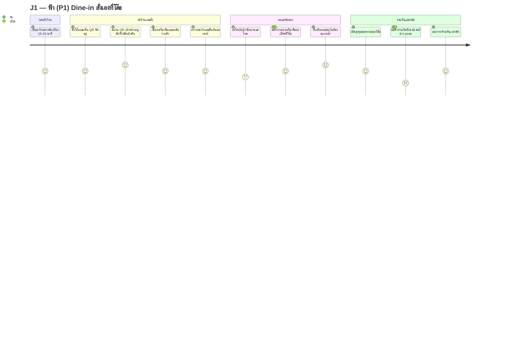
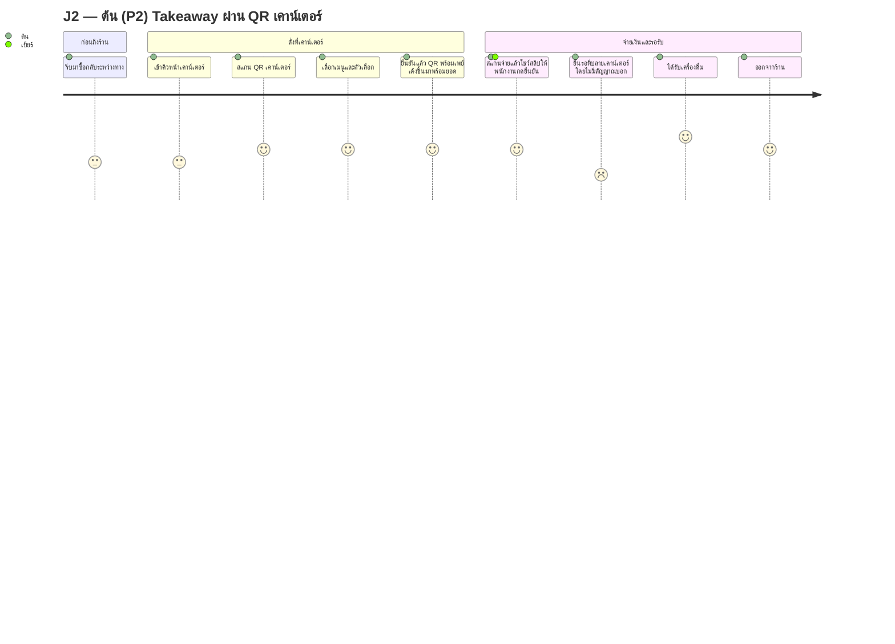
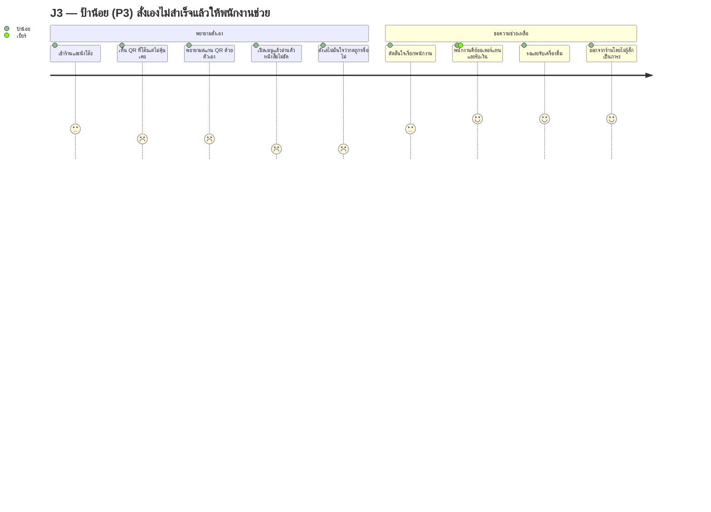
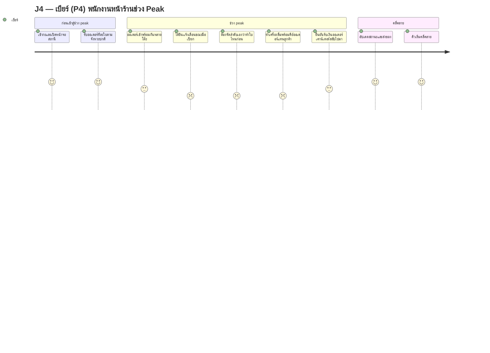
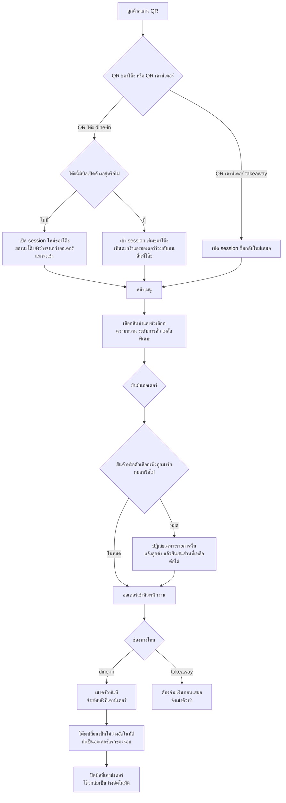
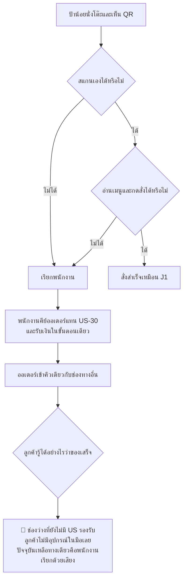

# UX Journey Map v1 — ระบบสั่งอาหารด้วย QR Code

> **สถานะ: DRAFT (ร่าง — รออนุมัติจาก Touch)**
> ต้นทาง: [[ux-persona-v1|Persona v1]] (roster คงที่ 5 ตัว: ฟ้า/ต้น/ป้าน้อย/เบียร์/คุณแอน) และ [[product-backlog-v1|Product Backlog v1]] (US-01 ถึง US-36, Business Rule ข้อ 1-21, in/out of scope)
> จัดทำโดย: XAVIER (Business Analyst & Product Owner) — วันที่ 2026-08-11
> Scope: Week 3 — Journey Map ต่อยอดจาก [[ux-persona-v1|Persona v1]] ที่ทำไว้ก่อนหน้า

กลับไปที่ [[index|01-spec]]

---

## หัวเอกสาร

| รายการ | รายละเอียด |
|---|---|
| สถานะ | **DRAFT (ร่าง — รออนุมัติจาก Touch)** |
| ต้นทาง | [[ux-persona-v1|Persona v1]] + [[product-backlog-v1|Product Backlog v1]] |
| ผู้จัดทำ | XAVIER (Business Analyst & Product Owner) |
| วันที่ | 2026-08-11 |
| Scope | Week 3 — Journey Map ครอบคลุม 4 เส้นทาง (J1-J4) ตาม persona roster ที่ยืนยันแล้ว |
| อัปเดตล่าสุด | 2026-08-16 — (1) ขั้น "รอ" ของ J1 ใช้แอนิเมชันกำลังชงแทน ETA (หัวข้อ 4.6) · (2) **MoT #1 ของ J2 ปิดแล้วด้วย US-52** พร้อมเพย์ QR ฝังยอด (หัวข้อ 4.7) |

---

## 0. จุดประสงค์ของเอกสาร

เอกสารนี้แปลง persona 5 ตัวใน [[ux-persona-v1|Persona v1]] ให้เป็น **journey map ที่มีลำดับเวลา, จุดสัมผัส, อารมณ์, pain point และโอกาสปรับปรุงที่จับต้องได้** เพื่อให้ COULSON และทีมออกแบบ (SHURI) เห็นภาพรวมของ flow จริงก่อนเริ่มออกแบบหน้าจอ/สถาปัตยกรรม ไม่ใช่แค่รายการ user story แยกชิ้น

เลือกทำ 4 journey ที่ครอบคลุมทั้ง happy path หลักของ MVP, ช่องทางรอง, worst-case ที่ต้อง fallback, และมุมมองฝั่ง internal ที่เป็น single point of failure ของระบบทั้งหมด (ตามที่วิเคราะห์ไว้ใน [[ux-persona-v1|Persona v1]] หัวข้อ 3)

---

## 0.5 วิธีอ่านแผนภาพ Mermaid ในเอกสารนี้ (เพิ่ม 2026-08-15)

ทุก journey ด้านล่างมี **แผนภาพ Mermaid กำกับคู่กับตาราง** — แผนภาพให้เห็นรูปทรงของเส้นอารมณ์ในพริบตา ส่วนตารางคือรายละเอียดเต็ม (touchpoint / pain point / US ที่รองรับ) **ทั้งสองอย่างมาจากข้อมูลชุดเดียวกัน ถ้าขัดกันเมื่อไหร่ให้ยึดตาราง**

**สเกลอารมณ์ที่ใช้แปลงเป็นคะแนน Mermaid (0-5):**

| ในตาราง | คะแนนในแผนภาพ |
|---|---|
| 😄 +2 | 5 |
| 🙂 +1 | 4 |
| 😐 0 | 3 |
| 😕 −1 | 2 |
| 😣 −2 | 1 |

> **กฎการแปลงที่ต้องรู้:** แถวไหนในตารางที่มี **2 อารมณ์** (เช่น `🙂 +1 / 😕 −1 ถ้าคิวจ่ายเงินยาว`) จะถูก **แยกเป็น 2 ขั้นในแผนภาพ ไม่ใช่เฉลี่ยกัน** — เพราะจุดที่อารมณ์ตกคือสาระของ journey map การเฉลี่ยจะกลบสิ่งที่ต้องเห็นพอดี
> แผนภาพชนิด `journey` **แสดงทางแยกไม่ได้** จุดที่มีเงื่อนไข/ทางแยกจริงจึงใช้ `flowchart` แยกต่างหาก (ดูหัวข้อ 4.5)

---

## 1. J1 — ฟ้า (P1): Dine-in สั่งเอง กินที่ร้าน จ่ายเงิน (Happy Path หลักของ MVP)

> ขั้น **"ดูสรุปยอด/จ่ายเงิน"** ในตารางมี 2 อารมณ์ จึงถูกแยกเป็น 2 ขั้นในแผนภาพ (เปิดดูยอด = 4 · ต่อคิวจ่าย = 2) ตามกฎในหัวข้อ 0.5 — จุดที่ตกลงไปที่ 2 คือ **Moment of truth #2** พอดี

| Stage | สิ่งที่ทำ (Action) | จุดสัมผัส (Touchpoint) | ความคิด (Thinking) | อารมณ์ | Pain point | โอกาสปรับปรุง (Opportunity) | US ที่รองรับ |
|---|---|---|---|---|---|---|---|
| ก่อนถึงร้าน | เดินจากออฟฟิศมาร้านช่วงพักเที่ยง | — (ยังไม่แตะระบบ) | "มีเวลาพัก 15-20 นาทีเท่านั้น ต้องเร็ว" | 🙂 +1 | เวลาจำกัด กดดันตั้งแต่ยังไม่เข้าร้าน | — | — |
| เข้าร้าน/นั่งโต๊ะ | หาที่นั่งว่าง นั่งลง | โต๊ะ + QR code ที่ติดอยู่ | "มี QR แปะอยู่แล้ว คุ้นเคยดี" | 🙂 +1 | ถ้าโต๊ะยังไม่ถูกเคลียร์จากลูกค้าก่อนหน้า (สถานะยังไม่ว่าง) จะสับสน | ป้ายบอกสถานะโต๊ะทางกายภาพชัดเจน (operational ไม่ใช่ backlog) | US-24, Business Rule 11 |
| สแกน QR | สแกนด้วยกล้องมือถือ | มือถือส่วนตัว, เว็บ/แอปสั่งอาหาร | "ขอให้เจอเมนูปั๊บ ไม่มีหน้าคั่น" | 😄 +2 (ถ้าสำเร็จ) / 😣 -2 (ถ้ามีหน้ากลาง) | **Moment of truth #1** — ถ้ามีหน้า splash/landing คั่น หรือ QR หมดอายุ/ผิดพลาด เธอจะหงุดหงิดทันทีเพราะเวลาน้อย | เข้าหน้าสั่งอาหารตรงภายใน 1 ขั้นตอนเสมอ (ยืนยันแล้วโดย Touch) | US-01, Business Rule 10 |
| ดูเมนู/เลือกสินค้า+ตัวเลือกเสริม | ไล่ดูหมวดหมู่ เลือกเครื่องดื่ม เลือกระดับการคั่ว | หน้าจอเมนู | "อยากรู้ว่ามีอะไรบ้าง ราคาเท่าไหร่ อันไหนหมด" | 🙂 +1 | ถ้าสินค้าที่อยากได้เพิ่งถูกมาร์กหมดกลางคัน (race condition) จะรู้สึกเสียเวลา | เมนู realtime, สินค้าหมดแสดงชัดเจนกดสั่งไม่ได้ | US-02, US-08, US-35, Business Rule 4 |
| จัดการตะกร้า/ยืนยันออเดอร์ | ปรับจำนวน ใส่หมายเหตุ ตรวจยอดรวม กดยืนยัน | หน้าจอตะกร้า | "เช็คให้ถูกก่อนกด เพราะแก้เองทีหลังไม่ได้แล้ว" | 🙂 +1 | ต้องแก้ผ่านพนักงานเท่านั้นหลังยืนยัน อาจรู้สึกไม่สะดวกถ้าสั่งผิด | ให้เห็นยอดรวมและรายการชัดก่อนกดยืนยันครั้งสุดท้าย | US-03, US-04, US-09, Business Rule 5 |
| รอ/ติดตามสถานะ | เปิดจอดูสถานะเป็นระยะ หรือคุยงานรอไป | หน้าจอติดตามสถานะ | "กำลังทำอยู่หรือเปล่า ไม่อยากเดินไปถาม" | 😐 0 | **(แก้ไข 2026-08-16)** จอนิ่งสนิทหลังกดยืนยัน — ต้นเหตุคือ **ไม่มีสัญญาณว่ามีอะไรเกิดขึ้น** ไม่ใช่ "รอนาน" เพราะช่วงปกติกาแฟเสร็จแก้วต่อแก้วอยู่แล้ว | **แอนิเมชันกำลังชง** ทันทีที่ส่งออเดอร์ ผูกกับสถานะจริง ไม่ใช่ timer ปลอม (ตัดสินแล้ว — เป็น AC ของ US-05 ใน Phase 0) · แจ้งเตือนเชิงรุกเมื่อสถานะเปลี่ยนยังเป็นของ US-39 | US-05 (เพิ่ม AC 2026-08-16 — ดูหัวข้อ 4.6) |
| รับของที่โต๊ะ | พนักงานนำเครื่องดื่มมาเสิร์ฟที่โต๊ะ | พนักงานหน้าร้าน | "มาไวกว่าที่คิด" หรือ "รอนานกว่าที่คิด" | 🙂 +1 / 😕 -1 | ไม่รู้ล่วงหน้าว่าใกล้เสร็จหรือยัง | เดียวกับข้อบน (ETA/notification) | US-14 (ฝั่งพนักงาน) |
| สั่งเพิ่มรอบสอง (ถ้ามี) | กลับไปหน้าเมนูสั่งของหวาน/เครื่องดื่มเพิ่ม | session เดิมของโต๊ะ | "ไม่ต้องสแกนซ้ำ สะดวกดี" | 😄 +2 | ถ้าเห็นรายการที่คนอื่นที่โต๊ะเดียวกันเพิ่งเพิ่มเข้ามาโดยไม่มีคำอธิบาย อาจงงว่าใครสั่ง | อธิบาย mechanic ตะกร้าที่แชร์กันทั้งโต๊ะให้เข้าใจง่าย (เช่น badge "เพิ่มโดยคนอื่นที่โต๊ะ") | US-06, Business Rule 1, 2 |
| ดูสรุปยอด/จ่ายเงิน | เปิดดูยอดรวมทั้งหมดของโต๊ะ เดินไปจ่ายที่เคาน์เตอร์ | หน้าจอสรุปยอด + เคาน์เตอร์แคชเชียร์ | "รวมเท่าไหร่แล้ว ต้องต่อคิวจ่ายไหม" | 🙂 +1 / 😕 -1 (ถ้าคิวจ่ายเงินยาว) | **Moment of truth #2** — ถ้าคิวจ่ายเงินที่เคาน์เตอร์ยาวช่วง peak เธอจะรู้สึกว่าระบบ QR "เร็วแต่จ่ายช้า" เสียภาพลักษณ์ทั้งระบบ | ทางเลือกจ่ายเงินออนไลน์ในอนาคต (US-12, P2) จะช่วยจุดนี้โดยตรง | US-07, Business Rule 3 |
| ออกจากร้าน | จ่ายเงินเสร็จ กลับไปทำงาน/กลับโต๊ะ | — | "ทันเวลาพักพอดีไหม" | 🙂 +1 | — | — | US-19 (ปิดบิลฝั่งพนักงาน) |

### Moment of truth (J1)
1. **สแกน QR แล้วเจอเมนูทันที ไม่มีหน้าคั่น** — ถ้าพลาดจุดนี้ (ช้า/มีหน้ากลาง/QR error) ฟ้าจะรู้สึกว่าระบบไม่ต่างจากการรอพนักงาน ซึ่งขัดกับเหตุผลที่เธอเลือกร้านนี้ตั้งแต่แรก
2. **คิวจ่ายเงินที่เคาน์เตอร์ตอนจบมื้อ** — ถ้าคิวจ่ายเงินยาวช่วง peak ประสบการณ์ "เร็ว" ทั้งหมดที่สร้างมาตลอด flow จะถูกทำลายในนาทีสุดท้าย

### จุดที่ระบบยังไม่มี US รองรับ (gap)
- ~~ไม่มี US รองรับ ETA/จำนวนคิวที่เหลือ~~ **ปิดแล้ว 2026-08-16 (ดูหัวข้อ 4.6)** — Touch ตัดสินว่าช่วงปกติไม่ต้องมี ETA เป็นตัวเลข ใช้ **แอนิเมชันกำลังชง** แทน เขียนเป็น AC เพิ่มใน US-05 ไม่เปิด US ใหม่ · US-38 (ETA ตัวเลข) ลดชั้นเหลือจำเป็นเฉพาะกรณี peak ซึ่งขึ้นกับ US-41
- **gap ที่เหลือจากข้อบน:** ช่วง peak ที่คิวยาวจริง แอนิเมชันอย่างเดียวจะกลายเป็นการสร้างความคาดหวังเกินจริงถ้าไม่ผูกกับสถานะจากหน้าจอพนักงาน — โยงตรงกับ J4 และ US-41
- ไม่มี US รองรับการแจ้งเตือนเชิงรุก (เสียง/สั่น) เมื่อสถานะออเดอร์เปลี่ยน — ปัจจุบันเป็นแค่ real-time update ที่ลูกค้าต้องเปิดจอเองถึงจะเห็น (**ยังเปิดอยู่** — แอนิเมชันแก้ไม่ได้ เพราะต้องเปิดจอดูอยู่ดี ดู US-39)
- ไม่มี US อธิบาย mechanic ตะกร้าที่แชร์กันทั้งโต๊ะ (concurrent, Business Rule 2) ให้ลูกค้าเข้าใจตอนเห็นรายการที่คนอื่นเพิ่มเข้ามา
- ไม่มี US รองรับปุ่มเรียกพนักงานแบบดิจิทัลสำหรับกรณีทั่วไป (เช่น ของหก อยากได้ช้อนเพิ่ม) — ปัจจุบันต้องเดินไปเรียกเองหรือโบกมือแบบร้านทั่วไป

---

## 2. J2 — ต้น (P2): Takeaway ผ่าน QR เคาน์เตอร์ จ่ายก่อน รอรับ

> ต่างจาก J1 ตรงที่ **ต้องจ่ายก่อนเสมอ** ตาม Business Rule ข้อ 12 และ **จุดรับของแยกทางกายภาพจากจุดสั่ง**
> **อัปเดต 2026-08-16 (ดูหัวข้อ 4.7):** ขั้น "ยืนยันออเดอร์" ขยับจาก 2 → 4 เพราะ **US-52** (พร้อมเพย์ QR ฝังยอด) ปิด MoT #1 ทิ้ง — **เหลือหลุมเดียวในเส้นนี้คือขั้นยืนรับของ** ซึ่งยังรอ US-39/US-45

| Stage | สิ่งที่ทำ (Action) | จุดสัมผัส (Touchpoint) | ความคิด (Thinking) | อารมณ์ | Pain point | โอกาสปรับปรุง (Opportunity) | US ที่รองรับ |
|---|---|---|---|---|---|---|---|
| ก่อนถึงร้าน | เดินทาง/แวะระหว่างทาง รีบมาก | — | "แวะซื้อกาแฟแป๊บเดียวแล้วไปต่อ" | 😐 0 | เวลาจำกัดกว่าลูกค้า dine-in | — | — |
| เข้าคิวหน้าเคาน์เตอร์ | เดินเข้าไปยืนหน้าเคาน์เตอร์ เห็น QR ติดอยู่ | เคาน์เตอร์ + QR เคาน์เตอร์ | "ต้องสแกนตรงนี้ไม่ใช่ QR โต๊ะใช่ไหม" | 😐 0 | อาจสับสนระหว่าง QR เคาน์เตอร์กับ QR โต๊ะถ้าป้ายไม่ชัด | ป้าย/ตำแหน่ง QR เคาน์เตอร์ต้องแยกชัดเจนทางกายภาพ (operational) | US-28, Business Rule 12 |
| สแกน QR เคาน์เตอร์ | สแกนแล้วเข้าหน้าเมนูแบบเดียวกับ dine-in | มือถือส่วนตัว | "หน้าตาเหมือนกับที่เพื่อนเคยใช้ตอนนั่งกินในร้าน" | 🙂 +1 | ถ้าหน้าตาเหมือนกันเป๊ะกับ dine-in อาจไม่รู้ตัวว่าอยู่คนละช่องทาง (กฎจ่ายเงินต่างกัน) | ต้องมี indicator ชัดเจนว่ากำลังอยู่ในโหมด "ซื้อกลับ" | US-28 |
| เลือกเมนู+ตัวเลือก | เลือกเครื่องดื่มเร็ว ๆ ไม่อ่านรายละเอียดนาน | หน้าจอเมนู | "อย่าให้มีขั้นตอนเยอะ ตัดสินใจเร็ว" | 🙂 +1 | ไม่มีเวลาตัดสินใจหลายตัวเลือก | UI ที่ไม่บังคับให้เลือกทุกอย่าง (default ค่าเริ่มต้น เช่น US-35 default "กลาง") | US-02, US-08, US-35 |
| ยืนยันออเดอร์ | กดยืนยัน → เข้าสถานะ "รอยืนยันการชำระเงิน" | หน้าจอยืนยันออเดอร์ | "ต้องจ่ายตอนนี้เลยใช่ไหม จ่ายที่ไหน" | ~~😕 -1~~ → **🙂 +1 (แก้ 2026-08-16)** | ~~**Moment of truth #1** — ถ้าข้อความไม่ชัด ลูกค้าจะยืนงงหรือเดินหนีไป~~ **ปิดแล้ว** — **QR พร้อมเพย์ฝังยอดเด้งขึ้นมาเองในหน้าเดียวกัน (US-52) คือคำตอบของคำถามนี้ในตัวเอง** ไม่ต้องพึ่งข้อความอธิบายอีกต่อไป | ทำแล้ว: QR ฝังยอด + เลขคิว A01 + ข้อความ "จ่ายแล้วโชว์สลิปกับพนักงาน" ในหน้าเดียว | US-28 (AC เพิ่ม 2026-08-16), **US-52**, US-45 |
| จ่ายเงินที่เคาน์เตอร์ | จ่ายเงินสด/บัตร **หรือสแกน QR แล้วโชว์สลิป** กับแคชเชียร์ | แคชเชียร์ (คนเดียวกับที่ทำเครื่องดื่ม) | "จ่ายเสร็จแล้วใช่ไหม เริ่มทำหรือยัง" | 🙂 +1 | **(แก้ 2026-08-16)** ยังต้องเจอพนักงานอยู่ดี — US-52 ทำให้คิวสั้นลง (ไม่ต้องนับเงินทอน) แต่**ไม่ได้ตัดขั้นตอนนี้ออก** การตัดออกจริงต้องยืนยันอัตโนมัติผ่าน webhook = US-12 (P2) | ระยะสั้น: พนักงานดูสลิปแล้วกดยืนยันรวดเดียว · ระยะยาว: auto-confirm ผ่าน US-12 | US-29 (AC เพิ่ม 2026-08-16), **US-52** |
| รอที่ปลายเคาน์เตอร์ | ยืนรอที่จุดรับของแยกจากจุดสั่ง/จ่าย | จุด "ปลายเคาน์เตอร์" | "รู้ไหมว่าแก้วไหนของฉัน จะรู้ได้ยังไงว่าเสร็จ" | 😐 0 / 😕 -1 | **Moment of truth #2** — ไม่มีแจ้งเตือนเชิงรุกเมื่อของเสร็จ ต้องคอยเหลือบดูจอ/ถามพนักงานเอง ขัดกับเป้าหมาย "รีบ" | ระบบแจ้งเตือนเชิงรุก (เสียง/จอแสดงชื่อ-หมายเลขออเดอร์) เมื่อของเสร็จพร้อมรับ | US-14, Business Rule 12 (gap — ดูหัวข้อ gap) |
| รับของ | รับเครื่องดื่มจากพนักงาน | จุดรับของ | "ได้แล้ว ไปได้เลย" | 😄 +2 | — | — | US-29 |
| ออกจากร้าน | เดินออกไปต่อทาง | — | "เร็วดี" หรือ "รอนานกว่าที่คิด" | 🙂 +1 / 😕 -1 | — | — | — |

### Moment of truth (J2)
1. ~~**ข้อความหลังกดยืนยันออเดอร์ต้องชัดว่าต้องไปจ่ายเงินที่เคาน์เตอร์ทันที**~~ — **🟢 ปิดแล้ว 2026-08-16 ด้วย US-52** · เดิมจุดนี้ฝากความอยู่รอดไว้กับ *ถ้อยคำ* บนหน้าจอ ซึ่งลูกค้าที่รีบมากมักไม่อ่าน · ตอนนี้ **QR พร้อมเพย์ฝังยอดเด้งขึ้นมาเอง** จึงไม่ต้องอ่านอะไรเลยก็รู้ว่าต้องทำอะไรต่อ — เปลี่ยนจากการ*บอก*เป็นการ*ยื่นเครื่องมือให้*
2. **การแจ้งเมื่อของเสร็จที่ปลายเคาน์เตอร์** — ถ้าไม่มีสัญญาณชัดเจน ต้นต้องยืนคอยเดาเอง ขัดกับเป้าหมายหลักของ persona นี้คือ "เร็วที่สุด"

### จุดที่ระบบยังไม่มี US รองรับ (gap)
- ~~ไม่มี US บอกลูกค้าว่าต้องจ่ายอย่างไร/เท่าไหร่หลังกดยืนยัน~~ **ปิดแล้ว 2026-08-16 — US-52** (ดูหัวข้อ 4.7)
- ไม่มี US แสดงคิว/ลำดับก่อนหลังของออเดอร์ที่รอจ่ายเงิน หรือประมาณเวลารอที่เคาน์เตอร์ (**ยังเปิด** — US-52 ไม่ได้ตัดคิวจ่ายเงินออก แค่ทำให้สั้นลง)
- ไม่มี US รองรับการแจ้งเตือนเชิงรุกเมื่อของเสร็จพร้อมรับที่ปลายเคาน์เตอร์ (ปัจจุบันมีแค่การอัปเดตสถานะแบบ passive)
- ไม่มี US ระบุว่าจะเกิดอะไรขึ้นถ้าลูกค้ายืนอยู่ที่เคาน์เตอร์แต่แคชเชียร์ไม่ทันเห็นออเดอร์ "รอยืนยันการชำระเงิน" (เช่น มัวทำเครื่องดื่มออเดอร์ก่อนหน้าอยู่) — ไม่มี timeout/escalation · **(2026-08-16) US-52 ทำให้ข้อนี้แหลมขึ้น ไม่ใช่เบาลง** — ลูกค้าที่จ่ายผ่าน QR เสร็จแล้วจะรู้สึกว่า "จ่ายแล้วนะ" และรอให้ระบบเดินต่อ ทั้งที่ออเดอร์ยังค้างจนกว่าพนักงานจะเห็นสลิป → ช่องว่างระหว่างความคาดหวังกับความจริงกว้างกว่าเดิม

---

## 3. J3 — ป้าน้อย (P3): พยายามสั่งเองแล้วติด → Fallback ให้พนักงานช่วย (Worst-case/Recovery)

> เส้นนี้คือ **worst case ที่ต้องออกแบบให้รองรับ ไม่ใช่เส้นที่ต้องกำจัดทิ้ง** — จุดต่ำสุดอยู่ที่ 1 สองขั้นติดกัน (อ่านไม่ชัด → ลังเล) ซึ่งเป็นช่วงที่ลูกค้าจะเลิกใช้เองถ้าไม่มีทางออก · ทางออกปัจจุบันคือ **US-30** (พนักงานคีย์แทน) และ **US-40** จะช่วยลดการพึ่งพาเส้นนี้ในอนาคต

| Stage | สิ่งที่ทำ (Action) | จุดสัมผัส (Touchpoint) | ความคิด (Thinking) | อารมณ์ | Pain point | โอกาสปรับปรุง (Opportunity) | US ที่รองรับ |
|---|---|---|---|---|---|---|---|
| เข้าร้าน | เข้าร้านพร้อมเพื่อน/ลูกหลาน นั่งโต๊ะ | โต๊ะ + QR | "ร้านนี้มี QR ด้วย ไม่เคยใช้เลย" | 😐 0 | ไม่คุ้นเคยตั้งแต่เห็น QR | ป้ายอธิบายวิธีสแกนแบบง่าย ตัวใหญ่ (operational + UX) | — |
| เห็น QR ที่โต๊ะ | มองหาแอปกล้องที่อ่าน QR ได้ | มือถือของตัวเอง | "กดตรงไหนสแกน จำวิธีไม่ได้" | 😕 -1 | ไม่มีแอปกล้องที่อ่าน QR ในตัว หรือลืมวิธีเปิด | — (เป็นข้อจำกัดอุปกรณ์ ไม่ใช่สิ่งที่ระบบแก้ได้ตรง ๆ) | US-01 (ตัวแทนกรณีเสี่ยง) |
| พยายามสแกน QR ด้วยตัวเอง | ลองสแกนหลายครั้ง | มือถือ | "ทำถูกไหมนะ" | 😕 -1 | กดผิด/สแกนไม่ติด เสียเวลา | — | US-01 |
| เปิดเมนู/พยายามอ่าน | ถ้าสแกนสำเร็จ พยายามอ่านเมนูบนจอเล็ก | หน้าจอเมนู | "ตัวหนังสือเล็กมาก อ่านไม่ออก" | 😣 -2 | **Moment of truth #1** — อ่านไม่ออก ไม่รู้จะกดตรงไหน กลัวกดผิดแล้วเสียเงิน/สั่งผิด | โหมดตัวอักษรใหญ่/ปุ่มใหญ่ (accessibility mode) ในหน้าเมนู | US-02 (ตัวแทนกรณีเสี่ยง) — ไม่มี US ตรง ๆ รองรับ (gap) |
| รู้สึกไม่มั่นใจ/ลังเล | หยุดพยายาม รู้สึกเกรงใจคนต่อคิวข้างหลัง | — | "หนูสั่งไม่เป็นหรอก จะรบกวนใครดี" | 😣 -2 | รู้สึกเป็นภาระ ไม่อยากรบกวนคนอื่น | ไม่มีสัญญาณให้พนักงานรู้ว่ามีคนกำลังลังเลอยู่ที่โต๊ะนี้ (ต้องพึ่งสายตาพนักงานเท่านั้น) | — (gap) |
| ตัดสินใจเรียกพนักงาน | เรียกพนักงานด้วยเสียง/โบกมือ | พนักงานหน้าร้าน | "ขอสั่งกับน้องที่เคาน์เตอร์แบบเดิมได้ไหม" | 😐 0 | **Moment of truth #2** — ถ้าพนักงานตอบสนองช้าหรือรู้สึกเป็นภาระ ป้าน้อยจะรู้สึกแย่และอาจไม่กลับมาอีก | พนักงานต้องพร้อมช่วยทันทีโดยไม่ทำให้รู้สึกแปลก (เป็นเรื่อง service training ไม่ใช่แค่ระบบ) | US-30 |
| พนักงานคีย์ออเดอร์แทน+รับเงิน | บอกพนักงานด้วยปากเปล่า พนักงานกดในระบบแทนและรับเงินรวดเดียว | หน้าจอพนักงาน (US-30) | "ง่ายกว่าเยอะ เหมือนสั่งกาแฟทั่วไป" | 🙂 +1 | — | — | US-30, Business Rule 12 |
| รอ/รับของ | รอรับเครื่องดื่มตามปกติ | พนักงาน | "รอไม่นานเหมือนที่คิด" | 🙂 +1 | — | — | US-14, US-30 |
| หลังได้รับความช่วยเหลือ/ออกจากร้าน | ได้เครื่องดื่ม รู้สึกโล่งใจ | — | "ครั้งหน้ากล้าลองสแกนเองไหมนะ" | 🙂 +1 (ถ้าประสบการณ์ดี) / 😣 -2 (ถ้าพนักงานทำให้รู้สึกแย่) | ถ้าประสบการณ์ครั้งนี้ไม่ดี อาจไม่กลับมาร้านอีกเลย | ทำให้ทางเลือก "สั่งปากเปล่า" รู้สึกเป็นเรื่องปกติ ไม่ใช่ทางออกสำรองที่น่าอาย | — |

### Moment of truth (J3)
1. **จังหวะที่พยายามอ่านเมนู/สแกนแล้วล้มเหลว** — ถ้าไม่มีทางออกที่เป็นมิตร (ตัวอักษรใหญ่ หรือพนักงานสังเกตเห็นและเข้าช่วยเอง) ลูกค้ากลุ่มนี้จะรู้สึกถูกทิ้งไว้ข้างหลังตั้งแต่ขั้นแรก
2. **ปฏิกิริยาของพนักงานตอนถูกเรียกให้ช่วย** — ถ้าพนักงานทำให้รู้สึกเป็นภาระหรือปฏิเสธ (แม้ระบบจะรองรับ US-30 ทางเทคนิคแล้วก็ตาม) ป้าน้อยจะไม่กลับมาร้านนี้อีก — นี่คือความเสี่ยงด้าน service ไม่ใช่ด้านระบบ แต่ระบบควรลดภาระของพนักงานให้ตอบสนองไวที่สุด

### จุดที่ระบบยังไม่มี US รองรับ (gap)
- ไม่มี US ที่ปรับ UI ของหน้าเมนู/QR flow เองให้เข้าถึงง่ายขึ้น (ตัวอักษรใหญ่, ปุ่มใหญ่, โหมดช่วยเหลือ) — ปัจจุบันมีแค่ "ทางเลือกสำรอง" (US-30) ที่ข้ามระบบ QR ไปเลย ไม่ใช่การแก้ที่ตัวประสบการณ์ QR เอง
- ไม่มี US ที่ช่วยให้พนักงานสังเกตเห็นลูกค้าที่กำลังลังเล/มีปัญหาก่อนที่ลูกค้าจะต้องเดินมาเรียกเอง — ทั้งหมดพึ่งพาการสังเกตด้วยสายตาของพนักงานเพียงอย่างเดียว

---

## 4. J4 — เบียร์ (P4): มุมพนักงานหน้าจอครัว-บาร์ ช่วง Peak รับหลายโต๊ะพร้อมกัน

> เบียร์เป็น **single point of failure ของทุก flow** — ทั้ง J1 J2 และ J3 วิ่งมาจบที่คนคนนี้ · ช่วงที่ตกอยู่ที่ 2 ติดกัน 3 ขั้นคือช่วงที่ **US-41** (จัดลำดับ + aging indicator) ถูกเสนอขึ้นมาเพื่อแก้โดยตรง

---

## 4.5 แผนภาพทางแยกที่ `journey` แสดงไม่ได้ (เพิ่ม 2026-08-15)

แผนภาพชนิด `journey` เดินเป็นเส้นตรงเท่านั้น แต่จุดที่ระบบพังจริงมักอยู่ที่ **ทางแยก** — ส่วนนี้จึงใช้ `flowchart` แสดงเงื่อนไขที่มาจาก Business Rule โดยตรง

### 4.5.1 สแกน QR แล้วเกิดอะไรขึ้น (Business Rule ข้อ 2, 7, 10, 11, 12)

> 🔴 จุดที่มักออกแบบพลาด และแผนภาพนี้ทำให้เห็นชัด:
> **(1)** สถานะโต๊ะไม่เคยถูกกดเปลี่ยนด้วยมือเลยสักจุดเดียว — มันเปลี่ยนเองจากเหตุการณ์ออเดอร์ (Business Rule ข้อ 11)
> **(2)** ของหมดกลางคัน **ปฏิเสธเฉพาะรายการนั้น ไม่ล้มทั้งบิล** (Business Rule ข้อ 4)
> **(3)** ทางแยก dine-in กับ takeaway อยู่ที่ **หลังยืนยันออเดอร์** ไม่ใช่ตอนสแกน — กฎจ่ายเงินต่างกันแต่เข้าคิวทำเครื่องดื่มที่เดียวกัน (Business Rule ข้อ 12)

### 4.5.2 เส้นทางกู้สถานการณ์ของป้าน้อย (J3)

> ช่องว่างในกล่องสุดท้ายคือประเด็นเดียวกับที่ COULSON ทั้งสองฝั่งจับได้ตอนออกแบบ `02-design` — **ยังไม่มี US รองรับ และรอ Touch ตัดสิน**

| Stage | สิ่งที่ทำ (Action) | จุดสัมผัส (Touchpoint) | ความคิด (Thinking) | อารมณ์ | Pain point | โอกาสปรับปรุง (Opportunity) | US ที่รองรับ |
|---|---|---|---|---|---|---|---|
| ก่อนเข้ากะ | Login เข้าระบบสถานี | หน้าจอ/แท็บเล็ตสถานี | "พร้อมทำงานวันนี้" | 🙂 +1 | — | — | Business Rule 9 |
| ช่วงเวลาปกติ | รับออเดอร์ทีละใบ ทำทัน | หน้าจอสถานี | "ยังจัดการไหว" | 🙂 +1 | — | — | US-13, US-14 |
| เริ่มเข้าสู่ช่วง peak | ออเดอร์จากหลายโต๊ะ (dine-in) + เคาน์เตอร์ (ลูกค้าสั่งเอง+คีย์แทน) เข้าพร้อมกัน | หน้าจอสถานี | "เข้ามาพร้อมกันหมดเลย ต้องทำอันไหนก่อน" | 😐 0 → 😕 -1 | ไม่มีลำดับความสำคัญที่ระบบช่วยจัด ต้องตัดสินใจเอง | ระบบช่วยจัดลำดับ/ไฮไลต์ออเดอร์ตามเวลาที่รอ | US-13 (gap บางส่วน — ดู gap) |
| รับรู้ออเดอร์ใหม่ (แจ้งเตือน) | ฟัง/มองแจ้งเตือนขณะมือเปียก เครื่องชงเสียงดัง | เสียงแจ้งเตือน/badge | "ได้ยินไหมนะ เห็นไหมนะ" | 😕 -1 | **Moment of truth #1** — เสียงแจ้งเตือนอาจไม่ได้ยินตอนเครื่องชงทำงาน พลาดออเดอร์ = ลูกค้ารอนานผิดปกติ | แจ้งเตือนแบบเห็นชัดแม้ไม่ได้ยินเสียง (visual cue เด่น ๆ) | US-15 |
| จัดลำดับความสำคัญ | ตัดสินใจว่าจะทำออเดอร์ไหนก่อน (dine-in vs เคาน์เตอร์ vs walk-in) | หน้าจอสถานี | "โต๊ะไหนรอนานสุด ออเดอร์ไหนยังไม่จ่ายเงิน" | 😕 -1 | **Moment of truth #2** — ถ้าไม่มีการแยกคิว/ป้ายที่มาชัดเจน อาจสับสนว่าออเดอร์ไหนต้องทำก่อน/จ่ายแล้วหรือยัง | แยกคิว/ป้ายที่มาของออเดอร์ (โต๊ะ vs เคาน์เตอร์, ลูกค้าสั่งเอง vs พนักงานคีย์แทน) ให้ดูออกในพริบตาเดียว + แสดงเวลาที่ค้างอยู่ | US-13 (AC มีป้ายที่มาบางส่วน), Business Rule 12 (gap — ดู gap) |
| ลงมือทำเครื่องดื่ม + คีย์ออเดอร์ walk-in พร้อมกัน | ชงเครื่องดื่มไปพร้อมกับคีย์ออเดอร์ลูกค้าที่ยืนรอปากเปล่า | เครื่องชง + หน้าจอสถานี | "มือไม่พอ ต้องสลับงานตลอด" | 😕 -1 | ปุ่ม/พื้นที่กดเล็กเกินไปสำหรับสถานการณ์มือเปียก | ปุ่ม/พื้นที่กดใหญ่พอสำหรับมือเปียก | US-30, US-14 |
| ยืนยันรับเงิน orders เคาน์เตอร์ | กดยืนยันจ่ายเงินสำหรับออเดอร์ที่ลูกค้าสั่งเองผ่าน QR เคาน์เตอร์ | หน้าจอสถานี | "อย่าลืมกดยืนยันจ่ายเงินก่อนของจะเข้าคิวทำ" | 😐 0 | ถ้าลืมกด ออเดอร์นั้นค้างไม่เข้าคิวทำเลย ลูกค้ายืนรอเก้อ | เตือน/ไฮไลต์ออเดอร์ที่ "รอยืนยันการชำระเงิน" ค้างนานผิดปกติ | US-29 |
| อัปเดตสถานะ/ส่งของ | กดเสร็จแล้ว เสิร์ฟที่โต๊ะ หรือแจ้งลูกค้าที่เคาน์เตอร์มารับ | หน้าจอสถานะ + จุดรับของ | "จบออเดอร์นี้ ไปต่อออเดอร์ถัดไป" | 🙂 +1 | — | — | US-14, Business Rule 12 |
| คิวเริ่มคลี่คลาย | ออเดอร์เข้าน้อยลง กลับสู่จังหวะปกติ | หน้าจอสถานี | "รอดมาได้อีกรอบ" | 🙂 +1 | ถ้าช่วง peak มีออเดอร์ตกหล่นไปก่อนหน้า อาจต้องตามแก้ทีหลัง | สรุป/ตรวจสอบออเดอร์ที่อาจตกหล่นหลังช่วง peak | US-17 |

### Moment of truth (J4)
1. **การได้รับ/สังเกตเห็นออเดอร์ใหม่ในสภาพมือเปียก + เสียงดัง** — ถ้าพลาดจุดนี้แม้แค่ 1 ออเดอร์ ลูกค้าปลายทาง (ไม่ว่าจะเป็นฟ้า ต้น หรือป้าน้อยที่เพิ่งได้รับความช่วยเหลือ) จะรอนานผิดปกติโดยไม่รู้สาเหตุ ทำลายประสบการณ์ทั้งระบบทั้งที่ปัญหาไม่ได้อยู่ที่ flow ฝั่งลูกค้าเลย
2. **การแยกคิว/ลำดับความสำคัญของออเดอร์จากหลายที่มาพร้อมกันช่วง peak** — เบียร์คือ single point of failure ของระบบทั้งระบบ (ตามที่วิเคราะห์ไว้ใน [[ux-persona-v1|Persona v1]]) ถ้าจุดนี้พังทุก journey อื่นพังตาม

### จุดที่ระบบยังไม่มี US รองรับ (gap)
- ไม่มี US ระบุวิธีจัดลำดับความสำคัญของคิวเมื่อมีออเดอร์จากหลายช่องทาง/หลายที่มาเข้าพร้อมกัน (US-13 บอกแค่ "เห็นออเดอร์ใหม่แบบเรียลไทม์" ไม่ได้บอกวิธีจัดเรียง/ให้ priority)
- ไม่มี US แสดงเวลาที่ออเดอร์ค้างอยู่ (aging indicator) เพื่อเตือนพนักงานว่าออเดอร์ไหนรอนานผิดปกติ หรือ "รอยืนยันการชำระเงิน" ค้างนานผิดปกติ
- ไม่มี US ให้พนักงานกด "หยุดรับออเดอร์ชั่วคราว" ระดับสถานีเมื่อคิวล้นเกินมือ (มีแค่ US-26 ปิดรับออเดอร์ทั้งร้านระดับแอดมิน ซึ่งเป็นคนละระดับการตัดสินใจและอาจช้าเกินไปสำหรับสถานการณ์ peak ฉับพลัน)

---

## 4.6 คำตัดสินของ Touch — ขั้น "รอ" ของ J1 ใช้แอนิเมชันกำลังชง ไม่ใช่ ETA (2026-08-16)

**สิ่งที่ Touch ทักท้วง:** ขั้น "รอโดยไม่รู้ว่าอีกนานแค่ไหน" ในเส้น J1 ตั้งสมมติฐานผิดว่าลูกค้ารอนาน — ความจริงของร้านนี้คือ **กาแฟทำเสร็จเร็วมาก แก้วต่อแก้ว ออเดอร์ต่อออเดอร์** ช่วงเวลาปกติลูกค้ารอแป๊บเดียว · ข้อเสนอของ Touch: ใส่ **loading animation ตอนเครื่องกำลังชง** ทันทีที่ส่งออเดอร์แทน

**คำตัดสิน: รับข้อเสนอ** — และแก้การวินิจฉัย pain point ตามไปด้วย

| ประเด็น | ก่อน 2026-08-16 | หลัง 2026-08-16 |
|---|---|---|
| คะแนนอารมณ์ของขั้นนี้ | 😐 0 | **😐 0 (ไม่เปลี่ยน)** |
| สาเหตุที่คะแนนไม่บวก | "ไม่รู้ว่าต้องรออีกนานแค่ไหน" | **"จอนิ่งสนิท ไม่มีสัญญาณว่ามีอะไรเกิดขึ้น"** |
| ทางแก้ที่เสนอ | ETA/จำนวนคิวเป็นตัวเลข (US-38) | **แอนิเมชันกำลังชง ผูกกับสถานะจริง — AC เพิ่มใน US-05** |
| สถานะของ US-38 | เสนอ P1 | **ลดชั้น** — จำเป็นเฉพาะกรณี peak ซึ่งขึ้นกับ US-41 |
| สถานะของ US-39 | เสนอ P1 | **ไม่เปลี่ยน** |

**เหตุผลที่คะแนนยังเป็น 0 ไม่ใช่ +1:** สเกลนี้วัดสิ่งที่ลูกค้ารู้สึก ณ ตอนนั้น ไม่ใช่คุณภาพของทางแก้ที่วางแผนไว้ — ตราบใดที่ AC ยังไม่ถูกสร้าง ขั้นนี้ยังเป็นช่วงกลวงของ journey อยู่ ให้ปรับคะแนนตอนมีผลทดสอบจริงใน [[../../03-testing/02-test-result/index|03-testing/02-test-result]] ไม่ใช่ปรับล่วงหน้าเพราะมีแผนแล้ว

**ทำไมแอนิเมชันชนะ ETA ในบริบทนี้:**

1. **แก้ตรงต้นเหตุ** — ต้นเหตุคือความเงียบของหน้าจอ ไม่ใช่ความยาวของเวลารอ · ETA ตอบคำถามที่ลูกค้าร้านนี้ไม่ได้ถามจริง ๆ ในช่วงปกติ
2. **ต้นทุนต่างกันคนละชั้น** — แอนิเมชันใช้ข้อมูลที่ US-05 มีอยู่แล้ว (สถานะ 3 ระดับ) · ETA ต้องรู้จำนวนคิวและอัตราการผลิตจากหน้าจอพนักงานก่อน ซึ่งเป็นงานของ US-41 ที่ยังไม่ได้อนุมัติ
3. **ไม่เพิ่มสโคป Phase 0** — เป็น AC เพิ่มใน story ที่อยู่ใน Phase 0 อยู่แล้ว ไม่ใช่ story ใหม่

**เงื่อนไขที่แนบมากับคำตัดสิน (ห้ามตัดทิ้งตอน implement):** แอนิเมชันต้อง**ผูกกับสถานะจริงของออเดอร์ ไม่ใช่ timer ที่วิ่งเอง** — ช่วงเวลาปกติทั้งสองแบบดูไม่ต่างกัน แต่ช่วง peak ที่ J4 ระบุว่าออเดอร์เข้าพร้อมกันหลายโต๊ะ ถ้าภาพ "กำลังชง" หมุนอยู่ทั้งที่พนักงานยังไม่ได้แตะออเดอร์นั้นเลย มันคือการโกหกลูกค้า ซึ่งเสียหายกว่าจอนิ่ง — ออเดอร์ที่ยังค้างคิวต้องสื่อว่า **"อยู่ในคิว"** ไม่ใช่ **"กำลังชง"** · ข้อนี้ทำให้ขั้นนี้ของ J1 **ผูกกับ J4 โดยตรง** ไม่ใช่ปัญหาฝั่งลูกค้าล้วน ๆ อีกต่อไป

**ทำไม US-39 ไม่ถูกลดชั้นตามไปด้วย:** ต้น (J2) ยืนรอที่ปลายเคาน์เตอร์โดยไม่ได้ถือจอดู แอนิเมชันบนหน้าจอที่ไม่มีใครมองไม่ช่วยอะไร — จุดนั้นต้องการการแจ้งเตือนเชิงรุกที่ดึงความสนใจได้จากภายนอก ซึ่งเป็นคนละกลไกกัน

**ผลที่ตามมาในเอกสารอื่น:** เพิ่ม AC 4 ข้อใน US-05 ของ [[product-backlog-v1|Product Backlog v1]] · pain point อันดับ 3 ในหัวข้อ 5 ด้านล่างถูกเขียนใหม่ · US-38 ในหัวข้อ 6 ถูกลดชั้น · NEED-INPUT ข้อ 4 ในหัวข้อ 7 ปิดไปครึ่งหนึ่ง

---

## 4.7 คำตัดสินของ Touch — พร้อมเพย์ QR ฝังยอดที่ช่องทางเคาน์เตอร์ (2026-08-16)

**สิ่งที่ Touch เสนอ:** ที่ J2 พอกดยืนยันออเดอร์แล้ว ให้ **QR พร้อมเพย์เด้งขึ้นมาเลย** · และกรณีสั่งปากเปล่าที่เคาน์เตอร์ (US-30) ให้ลูกค้าสแกนที่หน้าจอได้ **โดยไม่ต้องกรอกยอดเอง**

**คำตัดสิน: รับ และเข้า Phase 0** — เป็น **US-52** ใหม่ + **Business Rule ข้อ 30**

### ทำไมข้อเสนอนี้แรงกว่าที่มันดู

MoT #1 เดิมของ J2 ฝากความอยู่รอดไว้กับ **ถ้อยคำบนหน้าจอ** ("กรุณาชำระเงินที่เคาน์เตอร์") ซึ่งขัดกับตัว persona เอง — ต้นเป็นคนที่ [[ux-persona-v1|Persona v1]] ระบุว่า "ไม่มีเวลาอ่านคำอธิบายยาว" การแก้ด้วยการเขียนข้อความให้ชัดขึ้นจึงเป็นการแก้ที่ผิดชั้นตั้งแต่แรก · **QR ที่เด้งขึ้นมาเองไม่ได้ *บอก* ว่าต้องทำอะไร มันคือ *เครื่องมือ* ที่ยื่นให้ทำเลย** — ลูกค้าไม่ต้องอ่านก็รู้

### ขอบเขตที่ตัดสินไว้ และเหตุผล

| ประเด็น | ตัดสินว่า | เหตุผล |
|---|---|---|
| การยืนยันว่าจ่ายแล้ว | **สลิป + พนักงานกดยืนยัน** ไม่ใช่ webhook | ใช้ US-29 เดิมทั้งดุ้น · ไม่ต้องมีสัญญาธนาคาร/gateway/ค่าธรรมเนียม · **Business Rule ข้อ 14 (Phase 0 ไม่เก็บข้อมูลส่วนบุคคล) ยังจริง** |
| ช่องทาง | **เคาน์เตอร์เท่านั้น** (US-28 + US-30) | dine-in จ่ายทีหลังและใช้ตะกร้าร่วมแบบ concurrent (Rule 2) → ต้องมีกลไก freeze บิลทั้งโต๊ะก่อน เป็นงานคนละก้อน |
| เงินสด | **ห้ามตัด** | ป้าน้อย (J3) สแกนไม่เป็นตั้งแต่ขั้นสั่ง การบังคับ QR คือการปิดประตูใส่กลุ่มเดียวกับที่ US-30 สร้างมารองรับ |
| ยอดใน QR | **ฝังมาจากระบบเท่านั้น** | ให้ลูกค้ากรอกเอง = เปิดช่องพิมพ์ผิดในจังหวะที่เร่งที่สุด แล้วผลักภาระตรวจสอบไปที่ J4 ช่วง peak |

### สิ่งที่ US-52 **ไม่ได้** แก้ (อย่าเข้าใจผิด)

- **คิวจ่ายเงินไม่ได้หายไป** — ลูกค้ายังต้องเดินไปโชว์สลิป คิวแค่**สั้นลง**เพราะไม่ต้องนับเงินทอน · การตัดขั้นตอนนั้นออกจริงต้องใช้ auto-confirm ผ่าน webhook = **US-12 (P2)** ซึ่งต้องการสัญญาธนาคาร + PDPA รอบใหม่
- **MoT #2 ของ J2 ยังอยู่ครบ** — "ยืนรอที่ปลายเคาน์เตอร์โดยไม่มีสัญญาณ" เป็นคนละเรื่องกัน ยังต้องการ US-39 / US-45
- **J1 ไม่ได้อะไรจากรอบนี้** — MoT #2 ของ J1 (คิวจ่ายเงินตอนจบมื้อ) ยังเปิดอยู่เต็ม ๆ

### 🔴 ข้อจำกัดทางกายภาพที่ต้องตัดสินก่อนสั่งซื้ออุปกรณ์

ข้อเสนอส่วนที่สองของ Touch (สั่งปากเปล่าแล้วสแกนที่หน้าจอ) ชนกับความจริงว่า **จอสถานีหันเข้าหาพนักงาน** ลูกค้าที่ยืนอีกฝั่งสแกนไม่ถนัด — มีสามทาง: **(ก)** จอหมุนได้ **(ข)** จอลูกค้าเล็กแยกอีกตัว **(ค)** ส่ง QR ไปโผล่บนมือถือลูกค้าแทน (ซึ่งขัดกับเจตนาของ US-30 ที่ตั้งใจให้ลูกค้าไม่ต้องใช้มือถือเลย) · **การเลือกนี้กระทบการจัดซื้อฮาร์ดแวร์ ต้องตัดสินก่อนสั่งของ ไม่ใช่ตอนเขียนโค้ด** — เป็นของ COULSON/SHURI

---

## 5. สรุป Pain Point ข้ามทุก Journey (เรียงตามความรุนแรง)

| # | Pain point | พบใน Journey | ความรุนแรง | สถานะ |
|---|---|---|---|---|
| 1 | ช่วง peak พนักงานพลาด/จัดลำดับออเดอร์จากหลายที่มาไม่ได้ เพราะไม่มีการจัดลำดับความสำคัญหรือ aging indicator ให้ระบบช่วย | J4 (root cause) กระทบ J1/J2 ที่ปลายทาง | **สูงสุด** — เบียร์คือ single point of failure ของทั้งระบบ | **Gap ใหม่** — เสนอ US-41 |
| 2 | ป้าน้อย/กลุ่ม accessibility เจอทางตันตั้งแต่ขั้นสแกน/อ่านเมนู ไม่มี safety net อื่นนอกจากพนักงานสังเกตเห็นเอง | J3 | **สูง** — เสี่ยงเสียลูกค้ากลุ่มนี้แบบเงียบ ๆ ถ้าพนักงานไม่ว่าง | มี US-30 รองรับ fallback แล้ว แต่ไม่มี US แก้ที่ตัวประสบการณ์ QR เอง — **Gap บางส่วน** — เสนอ US-40 |
| 3 | **(เขียนใหม่ 2026-08-16)** หลังกดยืนยัน ลูกค้าไม่มีสัญญาณว่ามีอะไรเกิดขึ้น — ปัญหาคือความเงียบของหน้าจอ ไม่ใช่ความยาวของเวลารอ | J1, J2 | **สูง** | **J1 ปิดแล้ว** — แอนิเมชันกำลังชงเป็น AC ใน US-05 (Phase 0, ดูหัวข้อ 4.6) · **J2 ยังเปิด** — เสนอ US-39 เพราะยืนรอที่ปลายเคาน์เตอร์ไม่ได้ถือจอดู · US-38 (ETA ตัวเลข) **ลดชั้น** เหลือเฉพาะกรณี peak |
| 4 | ไม่มีช่องทางเรียกพนักงานแบบดิจิทัลสำหรับกรณีทั่วไป (ไม่ใช่แค่กรณี worst-case ของป้าน้อย) | J1, เชื่อมกับ J3 | ปานกลาง | **Gap ใหม่** — เสนอ US-37 |
| 5 | ตะกร้าที่แชร์กันทั้งโต๊ะ (concurrent) ไม่มีคำอธิบาย mechanic ให้ลูกค้าใหม่เข้าใจ อาจสับสนเมื่อเห็นรายการที่คนอื่นเพิ่มเข้ามา | J1 | ปานกลาง | มี Business Rule 2 รองรับด้าน data model แล้ว แต่ไม่มี story รองรับความเข้าใจของลูกค้า (UX/copy) — flag ให้ COULSON/SHURI พิจารณาตอนออกแบบ ไม่จำเป็นต้องเปิด US ใหม่ |
| 6 | ไม่มี timeout/escalation ถ้าแคชเชียร์ไม่ทันเห็นออเดอร์ takeaway ที่ "รอยืนยันการชำระเงิน" | J2 | ต่ำ-ปานกลาง | คลี่คลายได้บางส่วนถ้า US-41 (aging indicator) ครอบคลุมคิวนี้ด้วย — ไม่จำเป็นต้องแยก US ใหม่ |

---

## 6. ข้อเสนอ Backlog Item ใหม่ (เสนอเท่านั้น — ยังไม่เขียนลง Product Backlog)

> ต่อจากเลขล่าสุดในบ backlog (US-01 ถึง US-36) — เริ่มที่ US-37 ทั้งหมดนี้เป็นข้อเสนอจาก journey map เท่านั้น ยังไม่ได้เข้าไปแก้ [[product-backlog-v1|Product Backlog v1]] ต้องรอ Touch/JARVIS พิจารณาก่อน

### US-37 (เสนอ) ปุ่มเรียกพนักงานแบบดิจิทัล
เป็น ลูกค้า ฉันต้องการ กดปุ่มเรียกพนักงานจากหน้าจอสั่งอาหารของฉัน เพื่อ ขอความช่วยเหลือ (เช่น ของหก อยากได้ช้อนเพิ่ม หรือสั่งอาหารเองไม่ได้) โดยไม่ต้องเดินไปหรือโบกมือเรียก

เหตุผลจาก journey: J1 (ฟ้า อยากได้ของเพิ่มระหว่างนั่ง) และ J3 (ป้าน้อย ลังเลไม่กล้าเรียกพนักงานด้วยตัวเอง) — ทั้งสองกรณีไม่มีช่องทางดิจิทัลให้ขอความช่วยเหลือ ต้องพึ่งการเรียก/สังเกตด้วยสายตาเท่านั้น
ลำดับความสำคัญที่เสนอ: P1

### US-38 (เสนอ) แสดงเวลาโดยประมาณ/คิวที่เหลือของออเดอร์
เป็น ลูกค้า ฉันต้องการ เห็นเวลาโดยประมาณหรือจำนวนคิวที่เหลือก่อนออเดอร์ของฉันจะเสร็จ เพื่อ วางแผนเวลาได้แม่นยำกว่าการเห็นแค่สถานะ 3 ระดับ

เหตุผลจาก journey: J1 และ J2 — ทั้งฟ้า (เวลาพักจำกัด) และต้น (รีบมาก) ต้องการรู้เวลารอที่ชัดเจนกว่านี้ ไม่ใช่แค่สถานะ "รอดำเนินการ/กำลังทำ/เสร็จแล้ว"
ลำดับความสำคัญที่เสนอ: ~~P1~~ → **P2 (ลดชั้น 2026-08-16 — ดูหัวข้อ 4.6)**

> **🔻 ลดชั้นแล้ว 2026-08-16** — Touch ยืนยันว่าช่วงเวลาปกติกาแฟทำเสร็จแก้วต่อแก้ว ลูกค้ารอแป๊บเดียว ความต้องการจริงคือ "รู้ว่ามีอะไรเกิดขึ้น" ซึ่ง**แอนิเมชันกำลังชง (AC ใหม่ของ US-05, Phase 0) ตอบได้ครบแล้ว** · เหตุผลเดียวที่ story นี้ยังไม่ถูกตัดทิ้งคือ **กรณี peak** ที่คิวยาวจริงจนแอนิเมชันเริ่มไม่พอ ซึ่งต้องรู้จำนวนคิวและอัตราการผลิตจากหน้าจอพนักงานก่อน — แปลว่า **US-38 ขึ้นกับ US-41 ทางเทคนิค ทำก่อน US-41 ไม่ได้** ควรพิจารณาพร้อมกันหลังเปิดร้านและมีข้อมูลปริมาณออเดอร์จริง

### US-39 (เสนอ) แจ้งเตือนเชิงรุกเมื่อออเดอร์เสร็จ (โดยเฉพาะ Takeaway)
เป็น ลูกค้า ฉันต้องการ ได้รับการแจ้งเตือนเชิงรุก (เสียง/สั่น/แจ้งเตือนบนหน้าจอที่เห็นชัด) เมื่อออเดอร์ของฉันเสร็จพร้อมรับ เพื่อ ไม่ต้องคอยเปิดจอเช็คเองตลอดเวลา โดยเฉพาะตอนยืนรอที่ปลายเคาน์เตอร์

เหตุผลจาก journey: J2 (ต้น ยืนรอที่ปลายเคาน์เตอร์โดยไม่รู้ว่าต้องคอยดูจอเองหรือรอพนักงานเรียก) — ขัดกับเป้าหมายหลักของ persona นี้คือ "เร็วที่สุด"
ลำดับความสำคัญที่เสนอ: P1

### US-40 (เสนอ) โหมดเข้าถึงง่าย (ตัวอักษร/ปุ่มขนาดใหญ่) บนหน้าเมนู
เป็น ลูกค้า ฉันต้องการ สลับหน้าเมนูให้เป็นตัวอักษร/ปุ่มขนาดใหญ่ขึ้น เพื่อ อ่านและกดได้ง่ายขึ้นแม้สายตาไม่ดีหรือไม่คุ้นเคยกับหน้าจอมือถือ

เหตุผลจาก journey: J3 (ป้าน้อย) — ปัจจุบันมีแค่ทางเลือกสำรอง (US-30 ให้พนักงานคีย์แทน) ซึ่งข้ามระบบ QR ไปเลย ไม่ได้แก้ที่ตัวประสบการณ์ QR เอง เชื่อมโยงกับ NEED-INPUT ข้อ 3 ใน [[ux-persona-v1|Persona v1]] (สัดส่วนกลุ่มลูกค้าสูงวัยจริงมากแค่ไหน)
ลำดับความสำคัญที่เสนอ: P2 (ขึ้นกับคำตอบ NEED-INPUT เรื่องสัดส่วนกลุ่มลูกค้าสูงวัย — อาจต้องเลื่อนเป็น P1 ถ้าสัดส่วนสูงกว่าที่สมมติไว้)

### US-41 (เสนอ) จัดลำดับความสำคัญ + แสดงเวลาค้าง (Aging Indicator) บนหน้าจอพนักงานช่วง Peak
เป็น พนักงานแคชเชียร์/หน้าร้าน ฉันต้องการ เห็นออเดอร์ที่ค้างอยู่นานผิดปกติถูกไฮไลต์ให้เด่นชัด (ทั้งออเดอร์ที่รอทำและออเดอร์ที่ "รอยืนยันการชำระเงิน") เพื่อ จัดลำดับว่าควรทำอันไหนก่อนเมื่อมีออเดอร์จากหลายช่องทางเข้าพร้อมกันช่วง peak

เหตุผลจาก journey: J4 (เบียร์) — ปัจจุบัน US-13 บอกแค่ "เห็นออเดอร์ใหม่แบบเรียลไทม์" ไม่มีกลไกจัดลำดับความสำคัญหรือเตือนออเดอร์ค้างนาน ทำให้เบียร์ต้องตัดสินใจเองล้วน ๆ ช่วงที่กดดันที่สุด ซึ่งกระทบทุก journey ปลายทางถ้าพลาด
ลำดับความสำคัญที่เสนอ: P0/P1 (ควรพิจารณาเป็น P0 ถ้า Touch ยืนยันว่าช่วง peak overload เป็นสถานการณ์จริงตั้งแต่วันเปิดร้าน — ดู NEED-INPUT ข้อ 2 ด้านล่าง)

---

## 7. NEED-INPUT / คำถามถึง Touch

ประเด็นต่อไปนี้เผยออกมาจากการทำ journey map และเป็นสิ่งที่ Touch ควรตัดสินใจ ไม่ใช่สิ่งที่ XAVIER ควรเดาแทน (คำถามเหล่านี้เพิ่มเติมจาก NEED-INPUT 6 ข้อใน [[ux-persona-v1|Persona v1]] หัวข้อ 5 ซึ่งยังไม่ได้รับคำตอบ):

1. **ปุ่มเรียกพนักงานแบบดิจิทัล (US-37 ที่เสนอ)** — ร้านต้องการให้ลูกค้าเรียกพนักงานผ่านระบบ หรือยังต้องการให้ใช้วิธีเรียกด้วยเสียง/โบกมือแบบร้านกาแฟทั่วไปพอ? มีผลต่อสโคปและความซับซ้อนที่จะเพิ่มเข้าไปในหน้าจอลูกค้า
2. **ช่วง peak overload เป็นสถานการณ์จริงแค่ไหน** — ร้านคาดว่าจะมีจังหวะที่ออเดอร์ล้นมือพนักงานคนเดียวจริงหรือไม่ (เช่น มีคำสั่งซื้อพร้อมกันเกินกี่ออเดอร์) มีผลโดยตรงต่อว่าควรดัน US-41 (จัดลำดับ+aging indicator) เป็น P0 ของ Phase 0 เลยหรือรอ Phase 1 ได้
3. **โหมดเข้าถึงง่าย (US-40 ที่เสนอ) คุ้มที่จะสร้างจริงไหม** หรือใช้ US-30 (พนักงานคีย์แทน) เป็นคำตอบสุดท้ายพอสำหรับกลุ่มลูกค้าสูงวัย — คำถามนี้ผูกกับ NEED-INPUT ข้อ 3 ใน [[ux-persona-v1|Persona v1]] เรื่องสัดส่วนกลุ่มลูกค้าสูงวัยจริงของทำเลร้าน
4. **การแจ้งเตือนเชิงรุก (US-38/US-39 ที่เสนอ) ต้องการลงทุนระดับไหน** — **(ปิดไปครึ่งหนึ่ง 2026-08-16)** ส่วนของ US-38 ตอบแล้ว: ช่วงปกติใช้แอนิเมชันกำลังชงบนหน้าจอ ไม่ลงทุนกับ ETA ตัวเลข · **ที่ยังเปิดอยู่คือ US-39 เท่านั้น** — แค่ badge/sound บนหน้าเว็บพอ หรือต้องการถึงขั้น SMS/LINE notification (ซึ่งจะเปิดจุดเก็บข้อมูลส่วนบุคคลใหม่ตาม Business Rule ข้อ 14 ของ [[product-backlog-v1|Product Backlog v1]] และต้องผ่าน PDPA gap analysis ใหม่)

---

## 8. หมายเหตุการส่งต่อ (Handoff)

เอกสารนี้เป็น journey map ระดับ DRAFT ต่อยอดจาก [[ux-persona-v1|Persona v1]] ที่ยังไม่ผ่าน user interview จริงเช่นกัน — ความเสี่ยงเดิมของ persona (สัดส่วนลูกค้าจริง, ทำเลร้าน) ส่งผ่านมาเป็นความเสี่ยงของ journey map นี้ด้วย โดยเฉพาะ J3 (ป้าน้อย) และ J4 (ช่วง peak) ที่ความรุนแรงของ pain point ขึ้นกับสมมติฐานที่ยังไม่ validate

**ข้อเสนอ backlog item ใหม่ (US-37 ถึง US-41) เป็นข้อเสนอเท่านั้น ยังไม่ได้เข้าไปแก้ [[product-backlog-v1|Product Backlog v1]]** — ต้องรอ Touch/JARVIS ตัดสินใจก่อนว่าจะรับเข้า backlog จริงหรือไม่ และควรอยู่ Phase ไหน ก่อน COULSON จะใช้เป็นสโคปการออกแบบจริง

> **ข้อยกเว้น (2026-08-16):** คำตัดสินเรื่องแอนิเมชันกำลังชงในหัวข้อ 4.6 **ถูกเขียนลง [[product-backlog-v1|Product Backlog v1]] จริงแล้ว** เป็น AC 4 ข้อของ US-05 (Phase 0) — ไม่ใช่ข้อเสนอลอย ๆ เพราะไม่ได้เปิด story ใหม่ แค่เพิ่ม AC ใน story ที่อยู่ใน Phase 0 อยู่แล้ว · **SHURI ต้องเห็นข้อนี้ก่อนออกแบบหน้าติดตามสถานะ** โดยเฉพาะเงื่อนไข "อยู่ในคิว ≠ กำลังชง" ซึ่งบังคับให้หน้าจอนี้มีอย่างน้อย 2 สถานะทางภาพ ไม่ใช่ spinner ตัวเดียว

ไม่บล็อกการเริ่ม `02-design` ของ Phase 0 เดิม (US-01 ถึง US-36) — แต่ COULSON ควรเห็น gap ที่ระบุไว้ในเอกสารนี้ก่อนตัดสินใจ finalize หน้าจอหลัก โดยเฉพาะหน้าจอสถานีของพนักงาน (J4) ซึ่งเป็น single point of failure ของระบบทั้งระบบ

---

ส่งงาน — XAVIER → ทัช (งาน / ผลลัพธ์ / ค้าง-เสี่ยง / skill ที่ใช้)

**งาน:** ร่างเอกสาร User Journey Map (DRAFT) 4 เส้นทาง ต่อยอดจาก persona roster ที่ยืนยันแล้วใน [[ux-persona-v1|Persona v1]] — J1 ฟ้า (dine-in happy path), J2 ต้น (takeaway prepay), J3 ป้าน้อย (worst-case/recovery), J4 เบียร์ (internal, peak time) พร้อม moment of truth, gap analysis, สรุป pain point ข้ามทุก journey และข้อเสนอ backlog ใหม่

**ผลลัพธ์:** ไฟล์ `docs/01-requirements/01-spec/ux-journey-map-v1.md` — journey table ครบ 4 เส้น พร้อม moment of truth (2 จุด/เส้น), gap ที่ระบุชัด, ตารางสรุป pain point เรียงความรุนแรง 6 ข้อ, ข้อเสนอ backlog ใหม่ 5 รายการ (US-37 ถึง US-41 — ปุ่มเรียกพนักงาน, ETA, แจ้งเตือนเชิงรุก, accessibility mode, aging indicator ฝั่งพนักงาน), และ NEED-INPUT 4 ข้อใหม่ถึง Touch

**ค้าง/เสี่ยง:** ทุก pain point ในเอกสารนี้อ้างอิงจาก proto-persona ที่ยังไม่ผ่าน user interview จริง (สืบทอดความเสี่ยงจาก [[ux-persona-v1|Persona v1]]) — โดยเฉพาะความรุนแรงของ pain point อันดับ 1 (peak overload ที่เบียร์) และอันดับ 2 (กลุ่ม accessibility ของป้าน้อย) ขึ้นกับสมมติฐานเรื่องสัดส่วนลูกค้าและปริมาณออเดอร์จริงที่ยังไม่มีข้อมูล ข้อเสนอ backlog ใหม่ 5 ข้อยังเป็นแค่ข้อเสนอ ไม่ได้เข้า backlog จริง ต้องรอ Touch/JARVIS ตัดสินใจก่อน — ไม่บล็อกการเริ่ม `02-design` ของ Phase 0 เดิม

**skill ที่ใช้:** scrutinize (ตรวจว่าแต่ละ journey สะท้อน pain point จริงจาก persona ไม่ใช่แค่ไล่ user story เป็นลำดับ และตรวจว่า gap ที่พบไม่ใช่แค่ nice-to-have แต่กระทบ MVP goal จริงหรือไม่ก่อนเสนอ backlog ใหม่), management-talk (จัดลำดับ pain point ตามความรุนแรงและแยก NEED-INPUT ให้ตัดสินใจง่าย ไม่ทิ้งเป็น raw list ของทุก journey)
