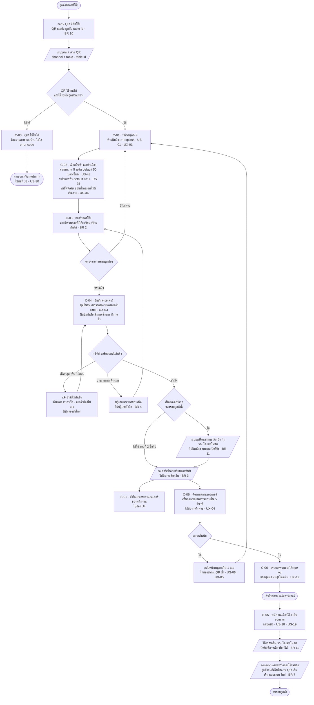
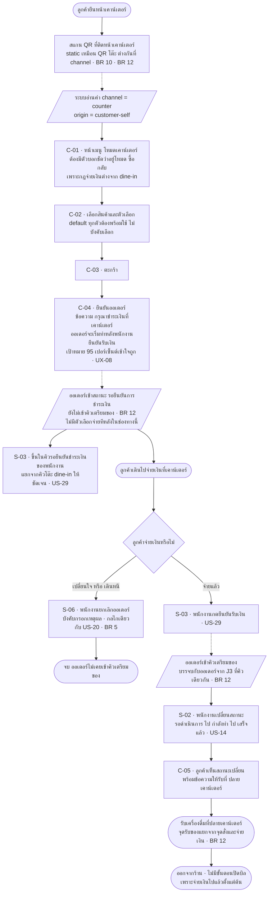
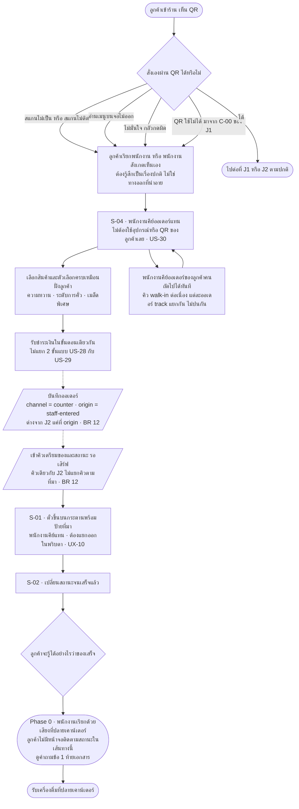
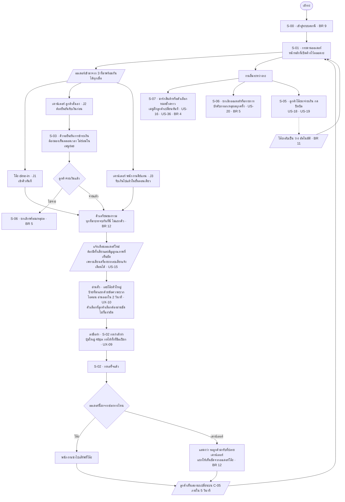
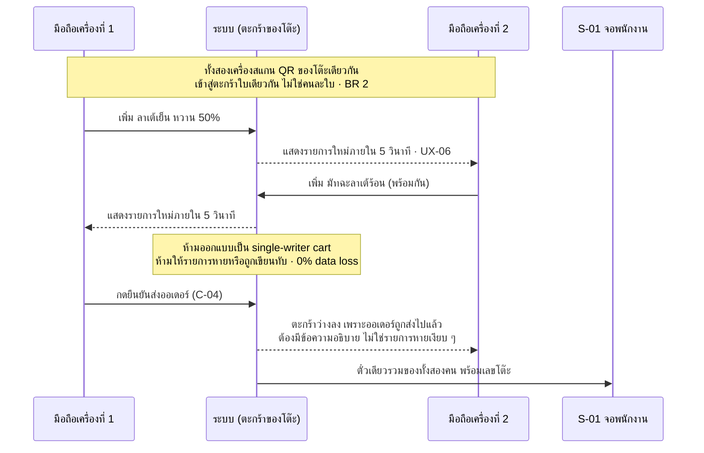
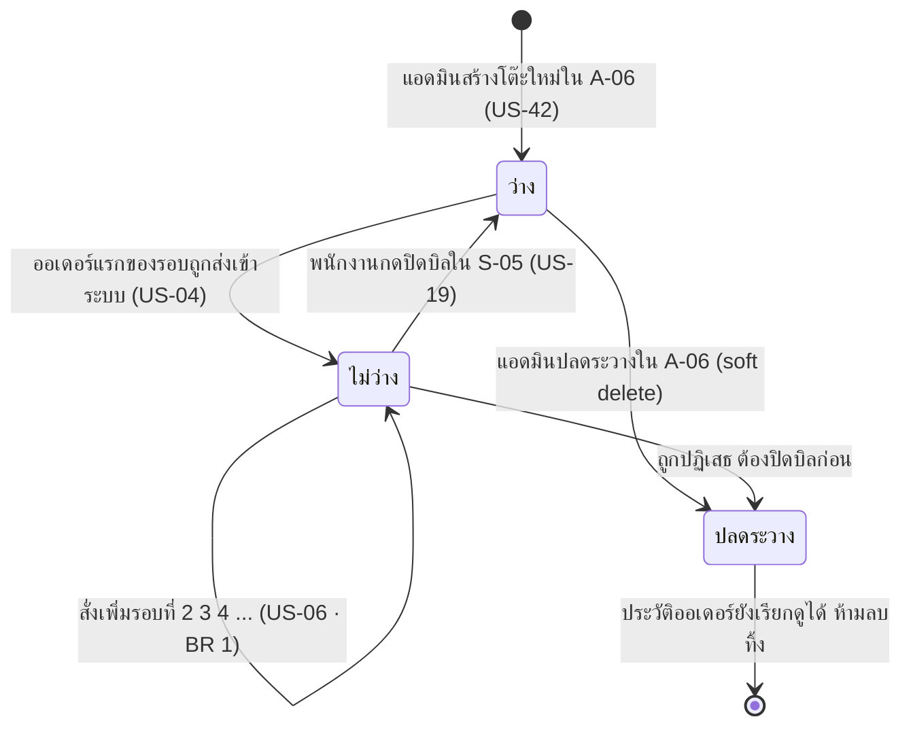
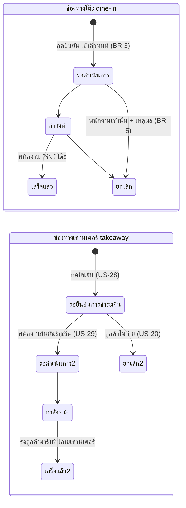

# User Flow v1 — Phase 0

> **สถานะ: DRAFT (ร่าง — รออนุมัติจาก Touch)**
> ต้นทาง: [[../../01-requirements/01-spec/ux-journey-map-v1|UX Journey Map v1]] (J1-J4) · [[../../01-requirements/01-spec/product-backlog-v1|Product Backlog v1]] (โดยเฉพาะ Business Rule ข้อ 2, 3, 4, 5, 7, 10, 11, 12) · [[../../01-requirements/01-spec/ux-requirements-v1|UX Requirements v1]]
> หน้าจอที่อ้างถึง (C-xx / S-xx / A-xx): [[screen-inventory-v1|Screen Inventory v1]]
> Design system: [[design-system-adoption-v1|Design System Adoption v1]]
> จัดทำโดย: COULSON (Web PM & Architect) — วันที่ 2026-08-15
> 🔴 **อยู่ใต้กฎ Precedence:** ดู [[design-system-adoption-v1|Design System Adoption v1]] หัวข้อ 0 — `01-requirements` คือ source of truth เสมอ · theme "Artisan Coffee" ให้มาแค่**สีและแนวการออกแบบ**เท่านั้น (คำสั่ง Touch: *"ให้ใช้ตามเอกสารเราครับ design เป็นเพียงตัวอย่างสีและการออกแบบ"*)
> **ทุก flow ในเอกสารนี้มาจาก journey map และ business rule ของเรา ไม่ได้มาจาก flow ของ theme** — theme เป็นแอปสั่งแบบ pick-up/delivery ซึ่งเป็นคนละโมเดลกับ QR โต๊ะ (dine-in) + QR เคาน์เตอร์ (takeaway) ตาม Business Rule ข้อ 12 จึงไม่ได้ใช้ flow ของ theme เลยแม้แต่เส้นเดียว

กลับไปที่ [[index|01-prototypes]]

---

## 0. วิธีอ่านเอกสารนี้

เอกสารนี้แปลง journey map 4 เส้นของ XAVIER ให้เป็น **flow ที่เดินตามหน้าจอจริงได้** — ทุกกล่องในแผนภาพผูกกับรหัสหน้าจอใน [[screen-inventory-v1|Screen Inventory v1]] และทุกจุดตัดสินใจผูกกับ Business Rule ที่บังคับมัน

**สัญลักษณ์ในแผนภาพ:**

| รูปแบบ | ความหมาย |
|---|---|
| `C-xx` | หน้าจอฝั่งลูกค้ามือถือ |
| `S-xx` | หน้าจอจอสถานีพนักงานหน้าร้าน |
| `A-xx` | หน้าจอฝั่งแอดมิน |
| `BR n` | Business Rule ข้อ n ที่บังคับจุดนั้น |
| กล่องสี่เหลี่ยมข้าวหลามตัด | จุดตัดสินใจ |
| เส้นประ | เหตุการณ์ที่ระบบทำเองอัตโนมัติ ไม่ใช่คนกด |

**หลักการที่ครอบทุก flow ในเอกสารนี้ — มาจาก Business Rule ที่ Touch ยืนยันแล้ว:**

1. **QR เป็นแบบ static ทุกใบ (BR 10)** — 1 โต๊ะ = 1 QR คงที่ตลอดอายุร้าน · QR เคาน์เตอร์ก็ static เช่นกัน · **ไม่มี flow ใดในเอกสารนี้ที่สร้าง/หมุนเวียน QR ใหม่** พิมพ์ครั้งเดียวติดไว้ได้เลย
2. **สถานะโต๊ะ derive จากออเดอร์เสมอ (BR 11)** — **ไม่มีปุ่ม "เปิดโต๊ะ"/"ปิดโต๊ะ" ในทุก flow** โต๊ะเปลี่ยนเป็น "ไม่ว่าง" อัตโนมัติเมื่อออเดอร์แรกของรอบเข้ามา และกลับเป็น "ว่าง" ที่จุดปิดบิลเท่านั้น
3. **กฎจ่ายเงินต่างกันตามช่องทาง (BR 12)** — โต๊ะ (dine-in) ออเดอร์เข้าคิวทันทีไม่รอจ่ายเงิน · เคาน์เตอร์ (takeaway) **ต้องจ่ายก่อนเสมอ ไม่มีตัวเลือกจ่ายทีหลัง**
4. **ตะกร้าเป็นของโต๊ะ ไม่ใช่ของคน และเขียนพร้อมกันได้จริง (BR 2)** — ดูหัวข้อ 5

---

## 1. J1 — Dine-in สั่งเอง กินที่ร้าน จ่ายที่เคาน์เตอร์ (P1 ฟ้า)

**Moment of truth ที่ flow นี้ต้องผ่านให้ได้ (จาก J1):**
1. **A1 → A6 ต้องไม่มีอะไรคั่นเลย** — ถ้ามีหน้า splash หรือโหลดนานเกิน 3 วินาที ฟ้าจะรู้สึกว่าไม่ต่างจากการรอพนักงาน ซึ่งทำลายเหตุผลทั้งหมดที่เธอเลือกร้านนี้
2. **A22 คิวจ่ายเงินช่วง peak** — เป็นจุดที่ประสบการณ์ "เร็ว" ทั้งเส้นถูกทำลายในนาทีสุดท้ายได้ **Phase 0 แก้ด้วยระบบไม่ได้** (การจ่ายออนไลน์คือ US-12 ของ Phase 2) — สิ่งที่ design ทำได้คือทำให้ S-05 ปิดบิลได้เร็วที่สุดเท่าที่เป็นไปได้

---

## 2. J2 — Takeaway ผ่าน QR เคาน์เตอร์ จ่ายก่อน รอรับ (P2 ต้น)

**ความต่างเชิงโครงสร้างจาก J1 ที่ห้ามพลาด:**

| | J1 dine-in | J2 takeaway |
|---|---|---|
| ออเดอร์เข้าคิวเมื่อไหร่ | ทันทีที่กดยืนยัน | **หลังพนักงานยืนยันรับเงินเท่านั้น** |
| จ่ายเงินเมื่อไหร่ | ตอนจะกลับ ที่เคาน์เตอร์ | **ก่อนออเดอร์เดินหน้า ภาคบังคับ** |
| มีสถานะ "รอยืนยันการชำระเงิน" | ❌ ไม่มี | ✅ มี |
| มีการปิดบิล | ✅ มี (US-19) | ❌ ไม่มี |
| มีสถานะโต๊ะเปลี่ยน | ✅ มี (BR 11) | ❌ ไม่มี — ไม่ผูกกับโต๊ะใด |
| มีหน้าสรุปยอด C-06 | ✅ มี | ❌ ไม่มี (ดูคำถามข้อ 3 ของ [[screen-inventory-v1|Screen Inventory v1]]) |
| จุดรับของ | พนักงานเสิร์ฟที่โต๊ะ | **ลูกค้าไปรับเองที่ปลายเคาน์เตอร์** |

🔴 **จุดเสี่ยงที่สุดของ J2 (จาก moment of truth #2):** ถ้าพนักงานยุ่งจนไม่ทันเห็นออเดอร์ในคิว "รอยืนยันการชำระเงิน" ออเดอร์จะค้างและลูกค้ายืนรอเก้อ — Phase 0 ลดความเสี่ยงด้วยการทำให้คิวนี้ **มองเห็นตลอดเวลาบน S-01 ไม่ซ่อนในเมนูย่อย** (การไฮไลต์เมื่อค้างนานคือ US-41 ของ Phase 1)

---

## 3. J3 — พนักงานคีย์ออเดอร์แทนลูกค้าที่สั่งด้วยวาจา (P3 ป้าน้อย · US-30)

**ข้อสังเกตสำคัญของ flow นี้:**
- US-30 คือ **ช่องทางเสริม ไม่ใช่ช่องทางหลัก** — การสั่งเองผ่าน QR ยังเป็น default ของระบบตามโจทย์ตั้งต้น เส้นนี้มีไว้เพื่อไม่ให้ลูกค้ากลุ่ม P3 เจอทางตัน
- 🔴 **ลูกค้าในเส้นนี้ไม่มีหน้าจอเลยตลอด flow** — ไม่มี C-05 ให้ติดตามสถานะ เพราะไม่มีอุปกรณ์เข้ามาเกี่ยวข้องเลยตั้งแต่ต้น จุดนี้เป็นช่องว่างจริงของ Phase 0 ที่ต้องตัดสินใจ (คำถามข้อ 1 ท้ายเอกสาร)
- Journey map ระบุไว้ตรง ๆ ว่า **ความเสี่ยงที่แท้จริงของเส้นนี้เป็นเรื่อง service ไม่ใช่ระบบ** — ถ้าพนักงานทำให้ป้าน้อยรู้สึกเป็นภาระ เธอจะไม่กลับมาอีก สิ่งที่ระบบทำได้คือทำให้ S-04 เร็วพอที่พนักงานจะไม่รู้สึกว่าถูกขัดจังหวะ

---

## 4. J4 — ฝั่งพนักงานหน้าร้าน ช่วง peak (P4 เบียร์)

🔴 **จุดที่ต้องเน้นกับ SHURI:** J4 ระบุว่า **เบียร์คือ single point of failure ของทั้งระบบ — ถ้าจอนี้พัง ทุก journey พังตาม** Phase 0 ยังไม่มี US-41 (จัดลำดับ + aging indicator) มาช่วยเลย ดังนั้นสิ่งเดียวที่ป้องกันได้ในเฟสนี้คือ **layout ของ S-01 ที่ยังอ่านออกเมื่อมีออเดอร์เข้าพร้อมกันหลายใบ** และ **การไม่ซ่อนคิวรอยืนยันชำระเงินไว้ในเมนูย่อย**

---

## 5. Business Rule ข้อ 2 — ตะกร้าที่เขียนพร้อมกันหลายเครื่อง

flow นี้ไม่ได้อยู่ใน journey map แต่เป็นกฎที่ **กระทบ C-03 และ C-01 ตลอดเวลา** และเป็นเรื่องที่ theme ไม่มีภาษาการออกแบบรองรับเลย

**สิ่งที่ design ต้องแก้ให้ได้:**
- ลูกค้าต้องเข้าใจว่า **ตะกร้าเป็นของโต๊ะ ไม่ใช่ของตัวเอง** ก่อนจะงงว่าของใครโผล่มา (pain point อันดับ 5 ของ journey map — ยังไม่มี US รองรับ เป็นงานของ UX/copy)
- 🔴 **จังหวะที่คนหนึ่งกดยืนยันแล้วอีกเครื่องเห็นตะกร้าว่างลง** เป็น edge case ที่ยังไม่มีใครเขียนถึงในทุกเอกสารต้นทาง — ต้องมี wireframe ของกรณีนี้ ไม่ใช่ปล่อยให้รายการหายเงียบ ๆ
- ป้ายกำกับ "เพิ่มจากอีกเครื่องที่โต๊ะนี้" ต้อง **ไม่ระบุตัวบุคคล** เพื่อไม่ให้ผิด BR 14 — ดูคำถามใน [[design-system-adoption-v1|Design System Adoption v1]] §8 ข้อ 4

---

## 6. State machine ที่ทุก flow ต้องเคารพ

### 6.1 สถานะโต๊ะ — derive จากออเดอร์เท่านั้น (BR 11)

🔴 **ไม่มีเส้นทางใดในแผนภาพนี้ที่พนักงานกดเปลี่ยนสถานะโต๊ะเอง** — ถ้า wireframe ใดมีปุ่ม "เปิดโต๊ะ"/"ปิดโต๊ะ" แปลว่าผิด BR 11 และต้องตีกลับ

### 6.2 สถานะออเดอร์ — ต่างกันตาม channel (BR 12)

**สรุปกฎที่ห้ามผิด:**
- ออเดอร์ **dine-in ไม่มีสถานะ "รอยืนยันการชำระเงิน" เด็ดขาด**
- ออเดอร์ **counter ไม่มีขั้นตอนปิดบิล** เพราะจ่ายไปแล้ว
- ออเดอร์จาก US-28 (ลูกค้าสั่งเอง) และ US-30 (พนักงานคีย์แทน) **ใช้ pipeline เดียวกันหลังจ่ายเงิน** ต่างกันแค่ field `origin` ที่ใช้ทำป้ายบนตั๋วเท่านั้น
- **ลูกค้ายกเลิกเองไม่ได้ทุกกรณีหลังกดยืนยัน** — ผ่านพนักงานเท่านั้นและต้องระบุเหตุผลทุกครั้ง (BR 5)
- คำที่ใช้ในทุกหน้าจอต้องเป็น **รอดำเนินการ / กำลังทำ / เสร็จแล้ว** เท่านั้น ทั้งฝั่งลูกค้าและฝั่งพนักงาน ห้ามใช้คำพ้องความหมายคนละหน้าจอ (Glossary ของ UX Requirements)

---

## 7. ประเด็นที่ต้องกลับไปถาม XAVIER / Touch

> **ห้ามแก้ไฟล์ใน `docs/01-requirements/` เอง** — ด้านล่างคือประเด็นที่โผล่จากการเขียน flow โดยเฉพาะ (คนละชุดกับที่อยู่ในอีกสองไฟล์)

### 🔴 ข้อ 1 (สำคัญที่สุดของเอกสารนี้) — ลูกค้าใน J3 จะรู้ได้อย่างไรว่าของเสร็จแล้ว?

**ปัญหา:** ใน J3 (US-30) ลูกค้าสั่งด้วยวาจา **ไม่มีอุปกรณ์เข้ามาเกี่ยวข้องเลยตั้งแต่ต้นจนจบ** จึงไม่มี C-05 ให้ติดตามสถานะ และ:
- US-21 (ใบเสร็จ ซึ่งอาจใช้เป็นเลขคิวได้) เป็น **Phase 1** ไม่มีใน Phase 0
- US-39 (แจ้งเตือนเชิงรุก) เป็น **Phase 1** และจำกัดเฉพาะ in-app อยู่แล้ว จึงช่วยเส้นนี้ไม่ได้เลย
- เครื่องพิมพ์สลิปยังไม่ถูกยืนยันว่ามีหรือไม่ (NEED-INPUT เดิมข้อ 3 ของ UX Requirements)
- Business Rule ข้อ 14 **ห้ามเก็บเบอร์โทรลูกค้า** จึงส่ง SMS ไม่ได้

**ผลคือ Phase 0 เหลือทางเดียว: พนักงานเรียกด้วยเสียงที่ปลายเคาน์เตอร์** — ซึ่งขัดกับความคาดหวังของ P2/P3 ที่ระบุใน journey map ว่าไม่อยากยืนเดาเอง และเพิ่มภาระให้ P4 เบียร์ที่เป็นคอขวดอยู่แล้ว
**คำถาม:** Phase 0 ยอมรับ "พนักงานเรียกด้วยเสียง" ได้หรือไม่ หรือควรเพิ่ม **หมายเลขออเดอร์ที่มองเห็นได้** (เขียนบนแก้ว / จอแสดงเลขที่พร้อมรับ / สลิปกระดาษ) เข้ามาใน Phase 0
**Default ที่ COULSON ใช้ไปก่อน:** พนักงานเรียกด้วยเสียง + **แสดงเลขออเดอร์ตัวใหญ่บนตั๋วใน S-01/S-02** เพื่อให้พนักงานเรียกเป็นเลขได้ (ต้นทุนศูนย์ ไม่ต้องเพิ่มอุปกรณ์) — แต่ถ้า Touch อยากให้ลูกค้าเห็นเลขด้วย ต้องมีสลิปหรือจอ ซึ่งเป็นสโคปเพิ่ม

### ข้อ 2 — สั่งเพิ่มรอบสองในช่องทางเคาน์เตอร์ทำได้หรือไม่?

US-06 เขียนสำหรับโต๊ะโดยเฉพาะ ("สั่งเพิ่มได้หลายรอบในโต๊ะเดียวกัน") แต่ **BR 12 กำหนดว่าช่องทางเคาน์เตอร์ต้องจ่ายก่อนทุกบิล/ทุกรอบ** ถ้าลูกค้า takeaway อยากสั่งเพิ่มหลังจ่ายไปแล้ว จะเป็นออเดอร์ใหม่ที่ต้องจ่ายอีกรอบใช่หรือไม่
**Default:** ใช่ — ช่องทางเคาน์เตอร์ **1 รอบสั่ง = 1 บิล = 1 การจ่ายเงิน** ไม่มีการสะสมรอบแบบโต๊ะ · flow ใน §2 สะท้อนตามนี้แล้ว

### ข้อ 3 — เมื่อคนหนึ่งกดยืนยันออเดอร์ อีกเครื่องที่โต๊ะเดียวกันควรเห็นอะไร?

ไม่มีเอกสารต้นทางฉบับใดเขียนถึง edge case นี้ ทั้งที่เป็นผลโดยตรงของ BR 2 + UX-06 — ตะกร้าร่วมจะว่างลงทันทีในเครื่องของคนที่ยังไม่ได้กด
**Default:** เครื่องอื่นเห็นข้อความชัดเจนว่า "มีคนที่โต๊ะนี้ส่งออเดอร์แล้ว" พร้อมพาไปหน้า C-05 ทันที **ไม่ใช่ปล่อยให้รายการหายเงียบ ๆ** — ออกแบบเป็น state บังคับของ C-03

### ข้อ 4 — ควรมีขั้นยืนยันก่อนส่งออเดอร์เมื่อมีคนอื่นกำลังแก้ตะกร้าอยู่พร้อมกันหรือไม่?

ถ้าฟ้ากดยืนยันในวินาทีที่เพื่อนกำลังเพิ่มของอยู่พอดี รายการของเพื่อนอาจไม่ทันเข้าออเดอร์รอบนั้น
**Default:** ไม่บล็อกการยืนยัน (จะทำให้ flow ช้าลงและขัดเป้าหมายความเร็วของ P1) แต่ **แสดงเวลาอัปเดตล่าสุดของตะกร้าบนหน้า C-04** ให้เห็นก่อนกดยืนยัน · รายการที่ตกรอบยังสั่งเพิ่มรอบถัดไปได้ตาม US-06 อยู่แล้ว

### ข้อ 5 — QR โต๊ะที่ถูกสแกนขณะโต๊ะยังมีบิลของลูกค้าชุดก่อนค้างอยู่

Journey map J1 ระบุ pain point นี้ไว้ ("ถ้าโต๊ะยังไม่ถูกเคลียร์จากลูกค้าก่อนหน้า จะสับสน") และบอกว่าเป็นเรื่อง operational — **แต่ในเชิงระบบมันไม่ใช่** เพราะ BR 7 กำหนดว่า session จบเมื่อปิดบิล ถ้ายังไม่ปิดบิล ลูกค้าใหม่ที่สแกนจะ **เห็นตะกร้าและออเดอร์ของลูกค้าชุดก่อน**
**Default:** C-01 แสดงสถานะโต๊ะให้เห็นเสมอ ("โต๊ะ 5 · มีบิลที่ยังไม่ปิด") และถ้ามีออเดอร์ค้างอยู่ ต้องมีข้อความให้แจ้งพนักงาน **ไม่ใช่ให้ลูกค้าใหม่สั่งต่อบิลเก่าโดยไม่รู้ตัว** — ต้องการให้ XAVIER ยืนยันว่าการตีความนี้ถูกต้อง เพราะเป็นเรื่องเงินของลูกค้า

---

ส่งงาน — COULSON → ทัช (งาน / ผลลัพธ์ / ค้าง-เสี่ยง / skill ที่ใช้)

**งาน:** แปลง journey map J1-J4 ของ XAVIER ให้เป็น user flow ระดับที่เดินตามหน้าจอจริงได้สำหรับ Phase 0 — ผูกทุกกล่องกับรหัสหน้าจอใน Screen Inventory และผูกทุกจุดตัดสินใจกับ Business Rule ที่บังคับมัน โดยเฉพาะ BR 10 (QR static), BR 11 (สถานะโต๊ะ derive จากออเดอร์), BR 12 (กฎจ่ายเงินต่างกันตามช่องทาง) และ BR 2 (ตะกร้าเขียนพร้อมกัน)

**ผลลัพธ์:** ไฟล์ `docs/02-design/01-prototypes/user-flow-v1.md` — flow diagram 4 เส้น (J1 dine-in · J2 takeaway · J3 พนักงานคีย์แทน · J4 ฝั่งพนักงาน) เป็น mermaid ที่ครอบคลุมทั้ง happy path และเส้นทางล้มเหลว (QR ผิด, เน็ตหลุด, สินค้าเพิ่งหมด, ลูกค้าไม่จ่ายเงิน) · sequence diagram ของตะกร้าที่เขียนพร้อมกันหลายเครื่อง · state machine 2 ชุด (สถานะโต๊ะที่ derive จากออเดอร์ และสถานะออเดอร์ที่แยกตาม channel) · ตารางเทียบความต่างเชิงโครงสร้างระหว่าง dine-in กับ takeaway 7 ประเด็น · ประเด็นถาม XAVIER/Touch 5 ข้อพร้อม default

**ค้าง/เสี่ยง:** **(1)** 🔴 พบช่องว่างจริงของ Phase 0 ที่ยังไม่มีเอกสารต้นทางฉบับใดเขียนถึง — **ลูกค้าใน J3 ไม่มีทางรู้เลยว่าเครื่องดื่มเสร็จแล้ว** เพราะไม่มีอุปกรณ์ ไม่มีใบเสร็จ (Phase 1) ไม่มีแจ้งเตือน (Phase 1) และห้ามเก็บเบอร์โทร (BR 14) เหลือทางเดียวคือพนักงานเรียกด้วยเสียง ซึ่งเพิ่มภาระให้จุดที่เป็นคอขวดอยู่แล้ว **(2)** edge case ตอนคนหนึ่งกดยืนยันแล้วตะกร้าร่วมว่างลงในเครื่องอื่น เป็นผลโดยตรงของ BR 2 แต่ไม่มีเอกสารใดกำหนดพฤติกรรมไว้ — ตั้ง default ไว้แล้วแต่ควรได้รับการยืนยัน **(3)** กรณีลูกค้าใหม่สแกน QR โต๊ะที่ยังมีบิลค้าง เป็นเรื่องเงินของลูกค้า ไม่ควรปล่อยเป็นเรื่อง operational อย่างเดียว **(4)** flow ทั้งหมดยังไม่ผ่านการเดินจริงกับ prototype — ต้องให้ OKOYE แปลงเป็น test case ตามเกณฑ์ในหัวข้อ 7 ของ UX Requirements หลัง SHURI ส่ง wireframe

**skill ที่ใช้:** scrutinize (เดิน flow ทีละเส้นเทียบกับ Business Rule แทนการวาดตาม journey map อย่างเดียว จนพบ 3 ช่องว่างที่เอกสารต้นทางไม่ได้ครอบคลุม — ลูกค้า J3 ไม่มีทางรู้ว่าของเสร็จ, พฤติกรรมของตะกร้าร่วมตอนมีคนกดยืนยัน, และการสแกน QR โต๊ะที่บิลยังไม่ปิด), management-talk (แยก 5 ประเด็นที่ต้องให้ XAVIER/Touch ตัดสินออกจากสิ่งที่ COULSON ตัดสินเองแล้ว โดยจัดข้อที่กระทบลูกค้าจริงไว้บนสุดพร้อม default ที่ทีมเดินงานต่อได้ทันที)
