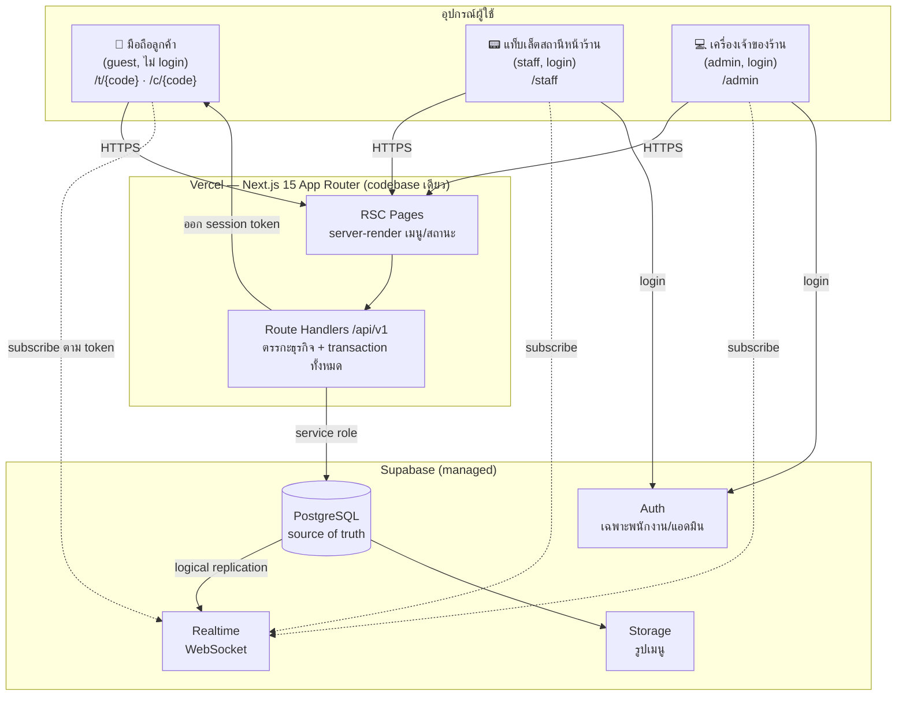
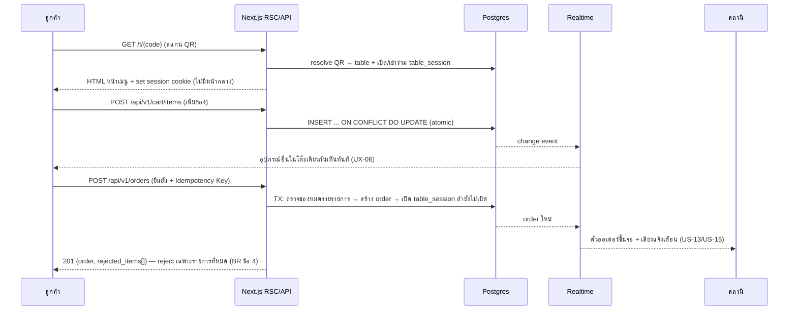

# Architecture v1 — ระบบสั่งอาหารด้วย QR Code (Phase 0)

> **สถานะ: DRAFT (ร่างสถาปัตยกรรม Phase 0 — รอ Touch/JARVIS อนุมัติก่อนเริ่ม build)**
> 🔴 **แก้ไข 2026-08-20 — ย้าย stack ไป VPS ของ TNM + Cloudflare (หัวข้อ 9) และเลือกกลไก auth ของพนักงาน/แอดมิน (หัวข้อ 10) · คำถามเปิดเรื่องเปิดให้หลายร้านใช้ (หัวข้อ 11) อ่าน [หัวข้อ 9](#9-คำตัดสินของ-touch--ย้ายจาก-supabase--vercel-ไป-vps-ของ-tnm--cloudflare-2026-08-20) ก่อนอ่านหัวข้อ 3 และ 5**
> ต้นทาง: [[../../01-requirements/01-spec/product-backlog-v1|Product Backlog v1]] (US-01..US-43, Business Rule ข้อ 1-23), [[../../01-requirements/01-spec/initial-menu-data-v1|Initial Menu Data v1]], [[../../01-requirements/01-spec/ux-requirements-v1|UX Requirements v1]], [[../../01-requirements/02-plan/release-roadmap-v1|Release Roadmap v1]], [[../../01-requirements/03-task/mvp-task-breakdown-v1|MVP Task Breakdown v1]]
> จัดทำโดย: COULSON (Web PM & Architect) — วันที่ 2026-08-15
> เอกสารพี่น้อง: [[data-model-v1|Data Model v1]] · [[api-design-v1|API Design v1]] · หน้าจอ/flow อยู่ที่ [[../01-prototypes/index|01-prototypes]] (COULSON อีก instance รับผิดชอบ)

กลับไปที่ [[index|02-technical]]

---

## 0. ขอบเขตของเอกสารนี้

เอกสารนี้ตอบคำถาม **"ระบบนี้ประกอบด้วยอะไร ทำงานร่วมกันอย่างไร และทำไมถึงเลือกแบบนี้"** สำหรับ **Phase 0 (MVP) เท่านั้น** — ครอบคลุม US-01..US-07, US-13..US-16, US-18..US-20, US-23, US-24, US-28..US-30, US-35, US-36, US-42, US-43 ตาม [[../../01-requirements/02-plan/release-roadmap-v1|Release Roadmap v1]]

**ไม่อยู่ในเอกสารนี้:** schema รายละเอียด (อยู่ที่ [[data-model-v1|Data Model v1]]), รายการ endpoint (อยู่ที่ [[api-design-v1|API Design v1]]), wireframe/design system (อยู่ที่ [[../01-prototypes/index|01-prototypes]]), และการออกแบบ ETA ของ US-38 ซึ่ง requirement ตัดสินใจแล้วว่า**เลื่อนทั้งก้อนไป Phase 1** (ดู [[../../01-requirements/03-task/mvp-task-breakdown-v1|MVP Task Breakdown v1]] หัวข้อ "งานข้ามกลุ่ม")

---

## 1. ข้อจำกัดจริงที่กำหนดสถาปัตยกรรม (Constraints First)

สถาปัตยกรรมนี้ไม่ได้เลือกจาก "เทคโนโลยีที่ดีที่สุด" แต่เลือกจากข้อจำกัดจริง 8 ข้อนี้ ทุกการตัดสินใจในหัวข้อ 3 ย้อนกลับมาอธิบายได้ด้วยข้อใดข้อหนึ่ง:

| # | ข้อจำกัด | ที่มา | ผลต่อสถาปัตยกรรม |
|---|---|---|---|
| C1 | **ห้ามมี app store / ห้ามติดตั้งแอป** | US-01 AC, UX-02 | ต้องเป็นเว็บที่เปิดจากกล้องมือถือได้ทันที → web app, ไม่ใช่ native |
| C2 | **สแกนแล้วต้องเห็นเมนูภายใน ≤3 วิ (4G) / ≤5 วิ (Slow 3G) และห้ามมีหน้ากลาง** | UX-01 | URL ใน QR ต้องเป็น**หน้าเมนูเอง** ไม่ใช่ redirect · ต้อง server-render + cache เมนู |
| C3 | **ต้อง realtime จริง ≤5 วิ ทั้ง 2 ทิศทาง** | UX-04, UX-06, US-05, US-13 | ต้องมีกลไก push ไม่ใช่ refresh เอง — และต้องเป็น push ที่ไม่ต้องดูแลเซิร์ฟเวอร์เอง |
| C4 | **ตะกร้าต่อโต๊ะเขียนพร้อมกันได้จริงจากหลายเครื่อง** | BR ข้อ 2, UX-06 | ต้องมี DB ที่มี transaction จริง (ไม่ใช่ localStorage/สถานะในเบราว์เซอร์) |
| C5 | **เจ้าของร้านไม่สายเทค แก้เมนู/โต๊ะเองได้ ≤5 นาที** | UX-11, US-23, US-42, persona P5 | ต้องมีหน้าแอดมินในระบบเดียวกัน ห้ามให้แก้ผ่านไฟล์/โค้ด/SQL |
| C6 | **งบจำกัด ร้านเดียว ไม่มีทีม ops** | โจทย์ตั้งต้น | ต้องเป็น managed service ที่มี free/low tier · ห้ามมี server ที่ต้อง patch เอง |
| C7 | **Phase 0 ห้ามเก็บข้อมูลส่วนบุคคลของลูกค้าเลย** | BR ข้อ 14, ข้อ 22 | ห้ามใช้ anonymous account / persistent device id · session token ต้องหมดอายุตามรอบบริการ |
| C8 | **QR ที่พิมพ์ติดโต๊ะเป็นของถาวร แก้ไม่ได้** | BR ข้อ 10, US-42 | **URL scheme ของ QR คือ public API ถาวร** — โดเมนและ path ห้ามเปลี่ยนตลอดอายุร้าน |

> 🔴 **C8 คือข้อจำกัดที่มองข้ามง่ายที่สุดและแพงที่สุดถ้าพลาด** — QR สติกเกอร์คือ artifact ทางกายภาพที่แก้ไม่ได้หลังพิมพ์ ถ้าเปลี่ยนโดเมน/เปลี่ยนรูปแบบ path ทีหลัง = ต้องพิมพ์ใหม่ทุกโต๊ะ ดูมาตรการที่หัวข้อ 6.3

---

## 2. ภาพรวมระบบ (System Overview)

### 2.1 Surface ทั้ง 3 = codebase เดียว



**หลักการสำคัญ 3 ข้อของภาพนี้:**

1. **ทุกการเขียนผ่าน Route Handler เท่านั้น** — ไม่มี client ตัวไหน (แม้ฝั่งพนักงาน) เขียน DB ตรง เพราะกฎธุรกิจที่ต้องอยู่ในทรานแซกชันเดียว (BR ข้อ 4 reject รายเดียว, BR ข้อ 11 สถานะโต๊ะ, BR ข้อ 12 gate การจ่ายเงิน) ถ้ากระจายไปอยู่ในโค้ดฝั่ง client จะบังคับใช้ไม่ได้จริง
2. **การอ่านแบบ realtime ไปตรงที่ Supabase Realtime** — เพราะ Vercel เป็น serverless ถือ WebSocket ค้างไม่ได้ (ดูหัวข้อ 3.3)
3. **codebase เดียว 3 route group** — `/t`,`/c` (ลูกค้า), `/staff`, `/admin` แยกด้วย Next.js route group + middleware ตรวจสิทธิ์ ไม่ใช่ 3 โปรเจกต์ เพราะทั้ง 3 surface ใช้ menu/option/order model ชุดเดียวกัน และ US-30 บังคับให้หน้าจอพนักงานใช้ตะกร้าตัวเดียวกับลูกค้า

### 2.2 Surface และผู้ใช้

| Surface | Path | ผู้ใช้ | ยืนยันตัวตน | อุปกรณ์อ้างอิง |
|---|---|---|---|---|
| **ลูกค้า — โต๊ะ (dine-in)** | `/t/{qr_code}` | ลูกค้า (guest) | session token จาก QR (ไม่มีบัญชี) | มือถือ 375×812 mobile-first |
| **ลูกค้า — เคาน์เตอร์ (takeaway)** | `/c/{qr_code}` | ลูกค้า (guest) | session token จาก QR | มือถือ เหมือนกัน |
| **สถานีหน้าร้าน** | `/staff` | พนักงานแคชเชียร์/หน้าร้าน (บทบาทรวม) | Supabase Auth (email/password) | แท็บเล็ตวางเคาน์เตอร์ ระยะอ่าน 50-80 ซม. |
| **แอดมิน** | `/admin` | เจ้าของร้าน | Supabase Auth (role=admin) | เดสก์ท็อป/แท็บเล็ต |

> **หมายเหตุตาม BR ข้อ 13:** สถานีหน้าร้านเป็น **จอเดียว** สำหรับ Phase 0 (คนรับเงิน = คนทำเครื่องดื่ม) แต่ data model แยก concept "สถานี" ไว้แล้ว (ดู [[data-model-v1|Data Model v1]] §3.5) — เพิ่มสถานีที่ 2 ใน Phase 2 (US-31) ได้โดยไม่ต้องรื้อ schema

---

## 3. การตัดสินใจทางเทคโนโลยี (Technology Decisions)

ทุกข้อระบุ **ทางเลือกที่ไม่เลือก + ข้อเสียจริงของมัน** ไม่ใช่แค่ยกมาให้ครบรูปแบบ

### 3.1 Framework / Runtime → **Next.js 15 (App Router) + TypeScript**

**เลือกเพราะ:** RSC ทำให้หน้าเมนูถูก render ที่เซิร์ฟเวอร์และส่ง HTML ที่มีเมนูครบมาเลย → ตอบ C2 (≤3 วิ ไม่มีหน้ากลาง) ได้โดยตรง · Route Handler ในโปรเจกต์เดียวกันทำให้ไม่ต้องมี backend แยกให้ deploy/ดูแล (C6) · TypeScript ทำให้ contract ระหว่าง 3 surface ที่แชร์ model กันไม่หลุด

| ทางเลือกที่ไม่เลือก | ข้อเสียจริงในบริบทนี้ |
|---|---|
| **Vite + React SPA + API แยก (Express/Fastify)** | SPA ต้องโหลด JS bundle ก่อนถึงจะเห็นเมนู → พัง C2 บนเน็ตร้านช้าเกือบแน่นอน และเพิ่มของที่ต้อง deploy/ดูแลเป็น 2 ชิ้น (C6) |
| **WordPress + WooCommerce plugin** | ทีมมี expertise จริง แต่ realtime ≤5 วิ ต้องต่อ plugin/บริการภายนอกเพิ่ม, ตะกร้าของ Woo เป็น single-session ต่อผู้ใช้ ขัด C4 ตรง ๆ, และต้องดูแล hosting+อัปเดตปลั๊กอินเอง (C6) |
| **No-code (LINE MyShop / Google Form / Notion)** | ตัด C3 (realtime), C4 (concurrent cart), C8 (คุม URL ถาวรไม่ได้) ทิ้งทั้งหมด — เร็วกว่าในสัปดาห์แรก แต่ไม่ตอบโจทย์ตั้งต้นที่ระบบต้องรู้ว่า "โต๊ะไหนสั่ง" และแสดงสถานะ realtime |
| **React Native / Flutter** | ขัด C1 ตรง ๆ (ต้องติดตั้งแอป) |

### 3.2 ฐานข้อมูล + Auth + Storage → ~~**Supabase (Postgres จัดการให้)**~~ → **Postgres self-host บน VPS** (แก้ไข 2026-08-20 — ดูหัวข้อ 9)

**เลือกเพราะ:** ต้องการ **relational + transaction จริง** เพราะกฎธุรกิจของระบบนี้เป็นเรื่อง invariant ข้ามหลาย entity (บิล ↔ ออเดอร์ ↔ รายการ ↔ ตัวเลือก ↔ สถานะโต๊ะ) การรีเจ็กต์รายการเดียวโดยไม่ล้มทั้งบิล (BR ข้อ 4) และการปิดบิลที่ชนกับการสั่งเพิ่ม (US-06 vs US-19) เขียนให้ถูกต้องได้เฉพาะเมื่อมี transaction + row lock · และ Supabase ให้ Realtime/Auth/Storage มาในบริการเดียว ตอบ C6 (ไม่มีทีม ops) · free tier รองรับร้านเดียวได้จริง

| ทางเลือกที่ไม่เลือก | ข้อเสียจริงในบริบทนี้ |
|---|---|
| **Firebase / Firestore** | realtime ดีมาก แต่เป็น document store ที่ไม่มี multi-document transaction ที่เขียนง่าย — invariant แบบ "ปิดบิลต้องไม่ชนกับออเดอร์ใหม่ในโต๊ะเดียวกัน" ต้องเขียนเอง และการรวมยอดบิลกลายเป็นงาน aggregation ที่ผิดพลาดง่าย · ค่าใช้จ่ายผูกกับจำนวน read ซึ่ง realtime ทำให้พุ่งได้ |
| **Postgres self-host (VPS) + Socket.io เอง** | ควบคุมได้เต็มที่และถูกกว่าในระยะยาว แต่ต้อง patch OS, ทำ backup, ต่อ SSL, monitor uptime เอง — ขัด C6 ชัดเจนสำหรับร้านที่ไม่มีคนดูแล |
| **PocketBase / Appwrite (self-host)** | เบาและมี realtime ในตัว แต่ยังต้องมี VPS ที่ใครสักคนดูแล (C6) และ ecosystem/เอกสารบางกว่าเมื่อเจอปัญหา production |
| **Planetscale / Neon + Auth แยก + Realtime แยก** | Postgres/MySQL ดีแต่ต้องประกอบ 3 บริการเอง → เพิ่มจุดที่พังได้และเพิ่มงาน integrate โดยไม่ได้อะไรที่ Supabase ไม่มี |

### 3.3 กลไก Realtime → ~~**Supabase Realtime**~~ → **`LISTEN/NOTIFY` → WebSocket ที่เราถือเอง** + polling fallback 5 วินาที (แก้ไข 2026-08-20 — ดูหัวข้อ 9)

**นี่คือการตัดสินใจ ไม่ใช่การยกทางเลือกทิ้งไว้** — requirement (กลุ่มงาน C ใน task breakdown) ระบุว่า "ต้องอัปเดตโดยลูกค้าไม่ต้องกดรีเฟรชเอง" และ UX-04/UX-06 กำหนด ≤5 วินาที

**เลือก WebSocket ผ่าน Supabase Realtime เป็นทางหลัก** เพราะ:
- เขียนที่ Postgres แล้ว event ไหลออกมาเอง (logical replication) → **ไม่มีทางที่ UI กับ DB จะไม่ตรงกันเพราะลืม publish event** ซึ่งเป็นบั๊กคลาสสิกของ pub/sub ที่แยกจาก DB
- ตอบ C6: ไม่มี WebSocket server ให้ดูแล และ Vercel serverless ถือ connection ค้างไม่ได้อยู่แล้ว
- latency จริงหลัก 100-500ms << 5 วินาที เหลือ headroom ให้เน็ตร้านช้า

**แต่ต้องมี polling fallback เสมอ** — เน็ตร้านกาแฟหลุด/WebSocket โดน captive portal หรือ proxy บล็อกเป็นเรื่องปกติ ถ้า WS ล้มแล้วจอนิ่งเงียบ พนักงาน (persona P4 เบียร์ = single point of failure ของทั้งระบบ) จะพลาดออเดอร์โดยไม่รู้ตัว ดังนั้น:
- ทุก client ที่ subscribe ต้องมี **heartbeat check**: ถ้าไม่ได้รับ event หรือ connection state ≠ `SUBSCRIBED` เกิน 10 วินาที → สลับเป็น polling `GET` ทุก 5 วินาทีอัตโนมัติ และ**แสดงป้ายบอกผู้ใช้ว่าอยู่ในโหมดสำรอง** (ไม่ใช่ degrade เงียบ ๆ)
- จอสถานี (`/staff`) ต้องมี **ตัวบ่งชี้สถานะการเชื่อมต่อที่มองเห็นตลอดเวลา** (ข้อความ+ไอคอน ไม่ใช้สีเดี่ยว ตาม UX-10/BR ข้อ 23)

| ทางเลือกที่ไม่เลือก | ข้อเสียจริงในบริบทนี้ |
|---|---|
| **Polling อย่างเดียว (ทุก 3-5 วิ)** | ทำได้และง่ายที่สุด แต่จอสถานีที่เปิดค้างทั้งวัน = ~20,000 request/วัน/เครื่อง ทั้งที่ 95% ไม่มีอะไรเปลี่ยน · และ UX-06 (2 เครื่องเห็นตะกร้ากันภายใน 5 วิ) จะรู้สึกกระตุกทุกครั้งที่เพื่อนร่วมโต๊ะเพิ่มของ ทำให้ "ตะกร้าแชร์" รู้สึกพัง ทั้งที่ทำงานถูก |
| **SSE (Server-Sent Events)** | ทางเดียว (server→client) พอสำหรับสถานะ แต่บน Vercel serverless การถือ stream ค้างนาน ๆ กิน execution time และ reconnect logic ต้องเขียนเอง — ได้ข้อเสียของ WebSocket โดยไม่ได้ข้อดี |
| **Socket.io server ของตัวเอง** | ยืดหยุ่นสุด แต่ต้องมี long-running server แยก (VPS/Fly.io) = ของชิ้นที่ 3 ที่ต้องดูแล ขัด C6 และเพิ่มความเสี่ยงว่า event กับ DB ไม่ตรงกัน |
| **Push Notification (Web Push)** | ต้องเก็บ push token ที่ผูกกับอุปกรณ์ข้ามครั้งการใช้งาน → **ขัด BR ข้อ 22 ตรง ๆ** (US-39 จำกัดเป็น in-app/session-scoped เท่านั้น) ห้ามใช้ |

**ช่องทางที่ subscribe (Phase 0):**

| ผู้ subscribe | ขอบเขตที่เห็น | บังคับด้วย |
|---|---|---|
| ลูกค้าโต๊ะ | cart_item + order + order_item ของ `table_session` ตัวเอง เท่านั้น | RLS อ่าน claim `tsid` จาก session token |
| ลูกค้าเคาน์เตอร์ | order ของ `customer_session` ตัวเอง เท่านั้น | RLS อ่าน claim `sid` |
| ทุก client (รวมลูกค้า) | `product.is_available`, `option_value.is_available` (สาธารณะ) | ตาราง read-public |
| จอสถานี | order/order_item ทั้งหมดที่ยังไม่ปิด + bill + table_session | role=staff |

### 3.4 การยืนยันตัวตน → **แยก 2 กลไกโดยเจตนา**

**พนักงาน/แอดมิน (BR ข้อ 9):** Supabase Auth (email+password) → JWT มี claim `role` (`staff` \| `admin`) · เก็บเฉพาะ username/hash/role เท่านั้นตาม BR ข้อ 21 · Phase 0 ใช้บัญชีต่อสถานี (พนักงาน 1 + แอดมิน 1) ตามที่ US-27 ระบุว่าเพียงพอ — **ข้อเสียที่ต้องรู้ตัว:** audit trail ของการยกเลิก/ปิดบิลจะบอกได้แค่ "บัญชีพนักงาน" ไม่ใช่ "คนไหน" (ดูความเสี่ยง R7)

**ลูกค้า (C7 + BR ข้อ 8/14):** **ไม่มีบัญชี และห้ามใช้ anonymous sign-in** — Supabase anonymous auth สร้าง user row ถาวรที่ระบุอุปกรณ์ข้ามครั้งการใช้บริการได้ = ขัด BR ข้อ 14 ตรง ๆ

แทนที่ด้วย **session token ที่ผูกกับรอบบริการ**:
- ลูกค้าสแกน QR → เซิร์ฟเวอร์สร้าง/เข้าร่วม `customer_session` แล้วออก JWT ที่มี claim `{ sid, tsid?, tid?, ch, exp }` — **ไม่มีข้อมูลส่วนบุคคลใด ๆ** เก็บใน cookie แบบ `HttpOnly; Secure; SameSite=Lax`
- อายุ: 60 นาทีตาม UX-05 ต่ออายุอัตโนมัติทุกครั้งที่มี activity **แต่ตายทันทีเมื่อบิลของโต๊ะถูกปิด** (BR ข้อ 7)
- token นี้เซ็นด้วย JWT secret เดียวกับ Supabase → ใช้ subscribe Realtime ได้โดย RLS ตรวจ `auth.jwt()->>'tsid'` ได้ตรง ๆ ไม่ต้องมี proxy realtime เอง

> **ผลข้างเคียงที่ยอมรับโดยเจตนา:** ใครก็ตามที่ถ่ายรูป QR โต๊ะไปสแกนจากที่อื่นจะเห็นตะกร้า/ยอดของโต๊ะนั้นได้ — **QR ทางกายภาพคือ credential** นี่เป็นผลตรงจาก BR ข้อ 10 (QR static) + ข้อ 8 (ไม่มีบัญชี) ที่ Touch ยืนยันแล้ว ไม่ใช่ช่องโหว่ที่เผลอทำ ความเสียหายสูงสุดคือเห็นรายการเครื่องดื่มของโต๊ะ (ไม่มีข้อมูลส่วนบุคคลให้รั่ว ตาม BR ข้อ 14) และแกล้งสั่งของเข้าโต๊ะคนอื่นได้ — มาตรการลดผลกระทบอยู่ที่ความเสี่ยง R6

### 3.5 ส่วนประกอบที่เหลือ

| ส่วน | เลือก | เหตุผลสั้น |
|---|---|---|
| Styling | Tailwind CSS + shadcn/ui | design token (ฟอนต์ ≥16px, contrast, ปุ่ม ≥44/48px ตาม BR ข้อ 23) บังคับได้ที่ระดับ token — SHURI/01-prototypes เป็นเจ้าของค่าจริง |
| ฟอร์ม/validation | React Hook Form + **Zod** | schema Zod ตัวเดียวใช้ validate ทั้งฝั่ง client และใน Route Handler → กันเคส client bypass |
| รูปเมนู | Supabase Storage + `next/image` (WebP, responsive) | เน็ตร้านช้าเป็นข้อจำกัดจริง (UX §4) รูปเมนูคือ payload ที่ใหญ่ที่สุด |
| สร้าง QR | สร้างเป็น PNG/SVG ฝั่งเซิร์ฟเวอร์ตอนแอดมินกดดาวน์โหลด (US-24/US-42) | ไม่ต้องเก็บไฟล์ QR — เนื้อหาคือ URL ที่ derive จาก `qr_code.code` ได้เสมอ |
| เวลา | เก็บเป็น `timestamptz` ทั้งหมด แสดงผลด้วย `Asia/Bangkok` | กันเคสรายงาน/กะข้ามวันเพี้ยนใน Phase 1 (US-17/US-25) |
| เงิน | **จำนวนเต็มหน่วยสตางค์ (integer)** | ไม่มี float error สะสมตอนรวมบิล — แปลงเป็นบาทเฉพาะตอนแสดงผล |
| ภาษา | ไทยเป็นหลัก โครงสร้าง content แยก string ออกจาก component | US-10 (สองภาษา) เป็น P2 แต่ต้องไม่ปิดทาง |

---

## 4. Flow หลักที่สถาปัตยกรรมต้องรองรับ

### 4.1 dine-in — ออเดอร์เข้าครัวได้เลย ไม่ต้องรอจ่าย (BR ข้อ 3)



### 4.2 counter/takeaway — ต้องจ่ายก่อนเสมอ (BR ข้อ 12)

- **ที่มา ก (US-28 ลูกค้าสั่งเอง):** ยืนยันออเดอร์ → order สถานะ `awaiting_payment` → **ไม่ขึ้นคิวทำ** → แคชเชียร์กดยืนยันรับเงิน (US-29) → order ไป `queued` และขึ้นคิวเดียวกับทุกช่องทาง
- **ที่มา ข (US-30 พนักงานคีย์แทน):** สร้างออเดอร์ + บันทึกรับเงิน **ในทรานแซกชันเดียว** → order เกิดมาเป็น `queued` ทันที ไม่ต้องมีขั้นยืนยันซ้ำ
- ทั้งสองที่มาบรรจบที่คิวเดียวกัน ต่างกันแค่ `origin` field เพื่อการ audit/แยกป้ายบนจอ (UX-10)

**invariant ที่บังคับที่ระดับฐานข้อมูล ไม่ใช่แค่ที่ UI:** ออเดอร์ channel=`counter` จะพ้นจาก `awaiting_payment` ได้ก็ต่อเมื่อบิลของมันมี `paid_at` แล้วเท่านั้น (ดู [[data-model-v1|Data Model v1]] §5 INV-3)

### 4.3 ปิดบิล (US-19) — จุดเดียวที่โต๊ะกลับเป็นว่าง

ไม่มี endpoint ใดในระบบที่เขียน "สถานะโต๊ะ" ได้โดยตรง — สถานะโต๊ะ **derive จากการมีอยู่ของ `table_session` ที่ยังเปิด** เท่านั้น (BR ข้อ 11) รายละเอียดที่ [[data-model-v1|Data Model v1]] §4.2

---

## 5. การ Deploy และสภาพแวดล้อม

### 5.1 สภาพแวดล้อม  ⚠️ ต้องเขียนใหม่ — ดูหัวข้อ 9.6

| สภาพแวดล้อม | Vercel | Supabase | ใช้ทำอะไร |
|---|---|---|---|
| `development` | local `next dev` | Supabase local (Docker) หรือ project แยก | พัฒนา |
| `preview` | auto ต่อ PR | project `staging` | OKOYE ทดสอบ + usability test ตาม UX §7 |
| `production` | domain จริง | project `production` | ร้านจริง |

**ห้ามให้ preview ชี้ไปที่ DB production เด็ดขาด** — การทดสอบ concurrent cart / ปิดบิล จะสร้างข้อมูลปลอมปนบิลจริง

### 5.2 CI/CD และ migration  ⚠️ ต้องเขียนใหม่ — ดูหัวข้อ 9.6

- Git → Vercel auto deploy (PR = preview, main = production)
- Schema เป็น **migration file ใน repo** (`supabase/migrations/*.sql`) เท่านั้น — ห้ามแก้ schema ผ่าน dashboard เพราะ environment จะไหลออกจากกันแล้ว reproduce บั๊กไม่ได้
- Seed data (เมนู 19 รายการ + option group 4 กลุ่ม จาก [[../../01-requirements/01-spec/initial-menu-data-v1|Initial Menu Data v1]]) เป็น seed script แยกจาก migration — เพราะราคาเป็น DRAFT ที่ Touch ต้องเคาะเอง และหลังเปิดร้านเจ้าของร้านแก้ผ่าน UI (US-23) ไม่ใช่แก้ seed
- **Gate ก่อน production:** OKOYE ต้องผ่าน checklist ใน [[../../03-testing/01-test-plan/index|01-test-plan]] รวม test case เฉพาะของ BR ข้อ 2 (concurrent cart) และ ข้อ 3/12 (กฎจ่ายเงิน) ตาม UX §7 ข้อ 5

### 5.3 โดเมนและ URL scheme ของ QR — สัญญาถาวร (C8)

**ตัดสินใจก่อนพิมพ์ QR ใบแรก และห้ามเปลี่ยนอีกเลย:**

```
https://<โดเมนสั้นของร้าน>/t/{code}   ← QR โต๊ะ (dine-in)
https://<โดเมนสั้นของร้าน>/c/{code}   ← QR เคาน์เตอร์ (takeaway)
```

- `{code}` = สตริงสุ่มสั้น (base32 8-10 ตัว) **ไม่ใช่ table id และไม่ใช่เลขโต๊ะ** → เดา URL ของโต๊ะอื่นไม่ได้ และเปลี่ยนชื่อโต๊ะแล้ว QR ไม่พัง (US-42)
- ใช้โดเมนที่ร้านเป็นเจ้าของเอง **ห้ามใช้ `*.vercel.app` บน QR ที่พิมพ์จริง** — ถ้าย้าย hosting ทีหลังจะต้องพิมพ์ QR ใหม่ทุกใบ
- path `/t/` และ `/c/` ต้องคง redirect ถาวรไว้ตลอดไปแม้จะ refactor route ภายใน
- **ก่อนสั่งพิมพ์เต็มจำนวน:** พิมพ์ต้นแบบ 1 ใบ ทดสอบ flow จริงบนมือถือ ≥2 รุ่น ตาม task ในกลุ่มงาน A

### 5.4 การสำรองข้อมูลและกู้คืน  ⚠️ ต้องเขียนใหม่ — ดูหัวข้อ 9.6 และความเสี่ยง R14

| รายการ | Phase 0 |
|---|---|
| Backup อัตโนมัติ | Supabase daily backup (ต้องยืนยันว่า tier ที่ใช้เปิดให้จริง — ดูความเสี่ยง R2) |
| Backup ที่ควบคุมเอง | `pg_dump` รายวันเก็บนอก Supabase (งานเล็ก คุ้มมากถ้าเทียบกับการเสียบิลทั้งวัน) |
| แผน rollback ของโค้ด | Vercel instant rollback ไป deployment ก่อนหน้า |
| แผน rollback ของ schema | ทุก migration ต้องมี down script หรือเป็น additive-only — **ห้าม migration ที่ลบคอลัมน์ในวันเปิดร้าน** |
| แผนสำรองตอนระบบล่ม | รับออเดอร์ด้วยกระดาษ + คีย์เข้าระบบย้อนหลังผ่าน US-30 เมื่อระบบกลับมา (ดู R1) |

---

## 6. ตารางความเสี่ยงทางเทคนิค

| # | ความเสี่ยง | โอกาส | ผลกระทบ | มาตรการ |
|---|---|---|---|---|
| **R1** | **เน็ตร้านล่ม/ช้า → ทั้งระบบใช้ไม่ได้** (cloud-dependent 100%, Phase 0 ไม่มี offline mode) | สูง | สูงสุด — สั่งอาหารไม่ได้เลยทั้งร้าน | (1) เตรียม mobile hotspot สำรองเป็น SOP ของร้าน (2) SOP กระดาษ + คีย์ย้อนหลังผ่าน US-30 (3) หน้าจอทุก surface ต้องแสดงสถานะ offline ชัดเจน ห้ามค้างเงียบ (4) พิจารณา PWA + service worker cache เมนูใน Phase 1 |
| **R2** | Supabase free tier มีเพดาน concurrent realtime connection และอาจ pause project ถ้าไม่ active | กลาง | สูง — จอสถานีหลุด realtime ช่วง peak | ยืนยัน tier ที่ใช้จริงก่อนเปิดร้าน · polling fallback (§3.3) ทำให้ยังทำงานต่อได้แม้ WS ตาย · monitor จำนวน connection |
| **R3** | Vercel serverless cold start + เน็ตช้า ทำให้พลาดเกณฑ์ UX-01 (≤3 วิ / ≤5 วิ) | กลาง | กลาง — ลูกค้าที่รีบ (persona ฟ้า) เลิกใช้ | เมนูเป็น static/ISR cache + revalidate ตอนแอดมินแก้ · บีบรูปเป็น WebP หลายขนาด · วัดจริงด้วย Lighthouse บนโปรไฟล์ Slow 3G ก่อน sign-off |
| **R4** | **บั๊ก concurrency ของตะกร้าแชร์** (BR ข้อ 2) — รายการหายหรือถูกเขียนทับ | กลาง | สูง — ทำเครื่องดื่มผิด/ขาด ลูกค้าไม่พอใจที่หน้าร้าน | API ระดับรายการ + `ON CONFLICT DO UPDATE` (ไม่มี PUT ทั้งตะกร้า) · optimistic version บนการตั้งจำนวน · test case เฉพาะของ OKOYE ตาม UX §7 ข้อ 5 (0% data loss, ≥3 รอบ) |
| **R5** | **ปิดบิลชนกับการสั่งเพิ่ม** → เก็บเงินขาด | กลาง | สูง — ความเสียหายเป็นเงินจริง | `SELECT ... FOR UPDATE` บน `table_session` ทั้ง 2 path · ปิดบิลต้องส่ง `expected_total` มาด้วย ถ้าไม่ตรง → 409 พร้อมรายการใหม่ ให้พนักงานยืนยันยอดใหม่ (ห้ามเก็บยอดเก่าเงียบ ๆ) — ดู [[api-design-v1|API Design v1]] §5.3 |
| **R6** | QR ทางกายภาพคือ credential — ถ่ายรูป QR ไปสั่งของเข้าโต๊ะคนอื่น/ดูยอดโต๊ะอื่นได้ | ต่ำ-กลาง | กลาง — ก่อกวน ไม่ใช่ข้อมูลรั่ว (Phase 0 ไม่มีข้อมูลส่วนบุคคล) | ผลตรงจาก BR ข้อ 8+10 ที่ยืนยันแล้ว · จำกัดผลด้วย rate limit ต่อ session · session ตายเมื่อปิดบิล · พนักงานยกเลิกรายการที่ผิดปกติได้ทันที (US-20) |
| **R7** | บัญชี login ใช้ร่วมกันต่อสถานี (US-27 เป็น P2) → audit บอกไม่ได้ว่าใครยกเลิก/ปิดบิล | สูง | ต่ำ-กลาง | ยอมรับใน Phase 0 ตามที่ backlog ระบุ · เก็บ `staff_user_id` ในทุก event ไว้แล้ว → พอ US-27 มา บัญชีรายคนใช้ field เดิมได้ทันทีโดยไม่ต้อง migrate |
| **R8** | เจ้าของร้านแก้ราคาเมนูระหว่างที่มีบิลเปิดค้าง → ยอดบิลเปลี่ยนย้อนหลัง | กลาง | สูง — ทะเลาะกับลูกค้าเรื่องเงิน | **snapshot ชื่อ+ราคา+ตัวเลือกลงใน `order_item` ตอนยืนยันออเดอร์** ราคาในเมนูเปลี่ยนภายหลังไม่กระทบบิลที่สั่งไปแล้ว (ดู [[data-model-v1|Data Model v1]] §3.3) |
| **R9** | จอสถานีเป็น single point of failure (BR ข้อ 13 สถานีเดียว, persona P4) | สูง | สูง | ออกแบบให้ `/staff` เปิดพร้อมกันได้หลายเครื่องโดยไม่ชนกัน (conditional update ตาม §5 ของ API doc) → ถ้าแท็บเล็ตตาย ใช้มือถือพนักงานเปิดแทนได้ทันที |
| **R10** | Vendor lock-in กับ Supabase/Vercel | ต่ำ | กลาง | core คือ Postgres มาตรฐาน + Next.js — ย้าย self-host ได้ · สิ่งที่ผูกจริงคือ Realtime กับ Auth ซึ่งถูกห่อไว้หลัง service layer ของเราเอง ไม่เรียกตรงจาก component |
| **R11** | ค่าใช้จ่ายบานปลายจาก realtime/รูปภาพเมื่อร้านเดินเครื่องเต็ม | ต่ำ | ต่ำ | ตั้ง billing alert · ควบคุมขนาดรูป · ทบทวนหลังเปิดร้าน 1 เดือน |
| **R12** | เวลา/เขตเวลาเพี้ยนทำให้รายงานกะ (Phase 1) ผิด | ต่ำ | กลาง | `timestamptz` ทุก field ตั้งแต่ Phase 0 + นิยาม "วันทำการ" ให้ชัดตอนออกแบบ US-17/US-25 |

---

## 7. สิ่งที่ Phase 0 จงใจ "ไม่ทำ" แต่ต้องไม่ปิดทาง

| ไม่ทำตอนนี้ | ทำไม | เตรียมทางไว้อย่างไร |
|---|---|---|
| ETA / จำนวนคิว (US-38) | requirement ตัดสินใจแล้วว่าเลื่อนทั้งก้อนไป Phase 1 พร้อมอัลกอริทึม | ไม่เตรียม schema ล่วงหน้าโดยเจตนา (ตามที่ task breakdown สั่ง) |
| Aging indicator (US-41) | Phase 1 | เก็บ `placed_at` + `status_changed_at` ของทุกออเดอร์ตั้งแต่ Phase 0 → คำนวณ aging ได้ทันทีโดยไม่ต้อง migrate |
| ปุ่มเรียกพนักงาน (US-37) | Phase 1 — เป็น event ใหม่ที่ไม่แตะ schema เดิม | ไม่ต้องเตรียมอะไร ยืนยันตามที่ task breakdown ประเมินไว้ |
| Loyalty + PDPA (US-11, US-32-34) | Phase 1 — **จุดเดียวที่จะเก็บข้อมูลส่วนบุคคล** | Phase 0 ไม่มีตารางลูกค้าเลย — เมื่อถึง Phase 1 จะเป็นตารางใหม่ที่แยกขาด ทำให้ scope ของ PDPA ชัดเจนโดยธรรมชาติ |
| Multi-station (US-31) | Phase 2 | `station` เป็นตารางจริงตั้งแต่ Phase 0 และ order มี `station_id` — Phase 2 แค่เพิ่มแถว + กฎ routing |
| Online payment (US-12) | Phase 2 | `payment` แยกจาก `bill` แล้ว → เพิ่ม method/gateway reference ได้โดยไม่แตะ order |
| ใบเสร็จ/คืนเงิน (US-21/22) | Phase 1 | `payment` เป็น ledger แบบ append — คืนเงินคือแถวใหม่ ไม่ใช่การแก้แถวเดิม |
| หลายภาษา (US-10) | Phase 2 | แยก string ออกจาก component ตั้งแต่ต้น · ชื่อสินค้าอังกฤษมีอยู่แล้วใน seed data |

---

## 8. ประเด็นที่ต้องกลับไปถาม XAVIER/Touch

ทั้งหมดนี้ **ไม่บล็อกการเริ่มออกแบบ/build** — COULSON ใช้ default ที่ระบุไว้ไปก่อนได้ แต่ต้องได้คำตอบก่อน **finalize schema** (ข้อ 1-3) หรือก่อนเปิดร้านจริง (ข้อ 4-6)

| # | ประเด็น | ทำไมถึงตอบเองไม่ได้ | Default ที่ใช้ไปก่อน |
|---|---|---|---|
| 1 | **"รอเสิร์ฟ" เป็น label หรือ status field จริง** — XAVIER flag ไว้เองใน US-30 และกลุ่มงาน F ว่าต้องยืนยันก่อน finalize schema | กระทบ enum ของสถานะออเดอร์โดยตรง ถ้าตัดสินผิดต้อง migrate ทีหลัง | **ใช้เป็น label ที่ derive** จาก (channel=counter AND status ∈ queued/in_progress/ready) + เพิ่ม transition `ready → completed` ("ส่งมอบแล้ว") เฉพาะช่องทางเคาน์เตอร์เพื่อเคลียร์กระดานจุดรับของ — ดู [[data-model-v1|Data Model v1]] §4.1 |
| 2 | **เมนูร้อน/เย็นเป็น 2 สินค้าแยก หรือ 1 สินค้า + ตัวเลือกอุณหภูมิ** — [[../../01-requirements/01-spec/initial-menu-data-v1|Initial Menu Data v1]] ให้หมวดหมู่เป็น "ร้อน/เย็น" แต่ให้ราคาร้อน+เย็นอยู่ในสินค้าแถวเดียวกัน สองอย่างนี้ขัดกันในเชิง data model | กระทบ UX-11 โดยตรง (เพิ่มสินค้าใหม่ 1 รายการ ≤5 นาที) — ถ้าเป็น 2 แถว เจ้าของร้านต้องกรอก 2 ครั้งต่อเมนู 1 ตัว | **1 สินค้า = 1 (เมนู × อุณหภูมิ)** อยู่ในหมวดร้อนหรือเย็น ราคาอยู่บนแถวสินค้า → 19 รายการกลายเป็น ~30 แถวสินค้า เหตุผล: หมวดหมู่ที่ Touch ยืนยันคือ ร้อน/เย็น และ "หมดชั่วคราว" ต้องมาร์กแยกอุณหภูมิได้จริง (น้ำแข็งหมด ≠ กาแฟร้อนหมด) |
| 3 | **ตัวเลือก "เปลี่ยนเป็นนมโอ๊ต" อยู่ Phase 0 หรือ Phase 1** — initial-menu-data ระบุว่ายังไม่มี US เฉพาะ ("ใกล้เคียงกลไก US-08 Phase 1") แต่ตารางเมนูใส่ไว้กับสินค้า 9 รายการแล้ว | ไม่มี US รองรับ = ไม่มีใครอนุมัติเข้า Phase 0 อย่างเป็นทางการ | **กลไกรองรับตั้งแต่ Phase 0** (เป็น option group ธรรมดา) แต่ **ไม่เปิดใช้ใน seed data ของ Phase 0** จนกว่าจะยืนยัน — เปิดทีหลังได้ในไม่กี่คลิกผ่าน US-23 โดยไม่ต้องแก้โค้ด |
| 4 | **อายุของ session ช่องทางเคาน์เตอร์** — BR ข้อ 7 นิยามการจบ session ของ**โต๊ะ**ไว้ชัด แต่ไม่มีกฎสำหรับลูกค้าที่สแกน QR เคาน์เตอร์แล้วเดินออกไปโดยไม่สั่ง/ไม่จ่าย | เป็นกฎธุรกิจ ไม่ใช่การตัดสินใจทางเทคนิค | session เคาน์เตอร์หมดอายุหลังไม่มี activity **30 นาที** และตะกร้าที่ยังไม่ยืนยันถูกทิ้ง · ออเดอร์ที่ค้าง `awaiting_payment` **ไม่หมดอายุเอง** ต้องให้พนักงานยกเลิกด้วย US-20 เสมอ (เพราะเป็นเงิน) |
| 5 | **ปิดบิลได้ไหมถ้ายังมีเครื่องดื่มค้างทำอยู่** — ในร้านจริงลูกค้าจ่ายเงินก่อนแล้วรอรับของบ่อยมาก แต่ US-19 ไม่ได้ระบุ | กระทบกฎเงินและลำดับงานหน้าร้าน | **ปิดได้ แต่ต้องมีคำเตือนที่บอกจำนวนออเดอร์ที่ยังไม่เสร็จ และให้พนักงานยืนยันอีกครั้ง** · ปิดบิลแล้วออเดอร์ที่ค้างจะ auto-complete พร้อมกัน |
| 6 | **โต๊ะที่เปิดบิลแล้วยกเลิกออเดอร์หมดทุกใบ ควรกลับเป็น "ว่าง" เองไหม** | BR ข้อ 11 บอกแค่ 2 จุด (ออเดอร์แรก / ปิดบิล) ไม่ครอบคลุมเคสนี้ | **ไม่กลับเองอัตโนมัติ** — session ยังเปิดจนกว่าพนักงานจะกดปิดบิล (ยอด 0 บาทได้) เพราะการ auto-close จะทำให้ลูกค้าที่ยังนั่งอยู่โดนตัด session กลางคัน |

**ประเด็นที่ requirement เปิดค้างอยู่แล้วและกระทบสถาปัตยกรรม (ไม่ใช่ของใหม่จาก COULSON):** NEED-INPUT ข้อ 3 และ 4 ของ [[../../01-requirements/01-spec/ux-requirements-v1|UX Requirements v1]] — อุปกรณ์จริงของจอสถานี และความเร็วเน็ตร้านจริง ข้อหลังกระทบโดยตรงว่าจะต้องลงทุนทำ PWA/offline cache ใน Phase 0 หรือรอ Phase 1 ได้ (ดูความเสี่ยง R1)

## 9. คำตัดสินของ Touch — ย้ายจาก Supabase + Vercel ไป VPS ของ TNM + Cloudflare (2026-08-20)

**สรุปสั้น:** ฐานข้อมูลยังเป็น **Postgres เหมือนเดิมทุกประการ** แต่ย้ายจาก Supabase managed มาเป็น **self-host บน VPS ของ TNM** และย้าย hosting จาก Vercel มาไว้หลัง **Cloudflare** — `data-model-v1` และ `api-design-v1` §5 ไม่ต้องแก้แม้แต่บรรทัดเดียว

### 9.1 ทำไมถึงเปลี่ยน — สมมติฐานของ C6 เปลี่ยน ไม่ใช่เทคโนโลยีผิด

C6 เดิมเขียนว่า *"งบจำกัด ร้านเดียว ไม่มีทีม ops · ห้ามมี server ที่ต้อง patch เอง"* — ประโยคนี้เป็นข้อเท็จจริงเกี่ยวกับ **ร้าน** ไม่ใช่เกี่ยวกับ **ผู้ดูแลระบบ** ตอนเขียนเอกสารรอบแรกยังไม่ได้ระบุว่าใครดูแลระบบหลังส่งมอบ จึงเหมารวมว่าไม่มีใครเลย

ตอนนี้ชัดแล้วว่า **TNM เป็นผู้ดูแลระบบให้ และ TNM มี VPS กับ Cloudflare ใช้งานจริงอยู่แล้ว** ข้อความ "ห้ามมีเซิร์ฟเวอร์ที่ต้อง patch เอง" จึงใช้ไม่ได้อีกต่อไป

> **C6 ฉบับแก้ไข (2026-08-20):** งบจำกัด ร้านเดียว · **เจ้าของร้านไม่มีทีม ops แต่ TNM เป็นผู้ดูแลระบบให้** → ห้ามให้เจ้าของร้านต้องแตะเซิร์ฟเวอร์เลย แต่ TNM รับภาระ patch / backup / monitor ได้

ผลคือแถว *"Postgres self-host (VPS) + Socket.io เอง"* ในตารางทางเลือกของ §3.2 ที่เคยถูกปัดด้วยเหตุผล "ขัด C6 ชัดเจนสำหรับร้านที่ไม่มีคนดูแล" **ไม่ถูกปัดอีกต่อไป** เพราะเงื่อนไขที่ใช้ปัดหายไปแล้ว

### 9.2 stack หลังเปลี่ยน

| ชั้น | เดิม | ใหม่ | หมายเหตุ |
|---|---|---|---|
| Framework | Next.js 15 App Router + TS | **เหมือนเดิม** | §3.1 ไม่กระทบ |
| ฐานข้อมูล | Supabase (managed Postgres) | **Postgres self-host บน VPS ของ TNM** | schema · migration · invariant · transaction เหมือนเดิมทั้งหมด |
| Realtime | Supabase Realtime (logical replication → WS) | **`LISTEN/NOTIFY` → WebSocket ที่เราถือเอง** | ดู 9.4 — ทำได้ง่ายขึ้นเพราะไม่ใช่ serverless แล้ว |
| Auth พนักงาน/แอดมิน | Supabase Auth | **ต้องเลือกใหม่** — session ใน Postgres เองหรือไลบรารีบน Next.js | 🔴 ยังไม่ตัดสิน ดู 9.5 |
| Auth ลูกค้า | session token จาก QR | **เหมือนเดิม** | ไม่เคยพึ่ง Supabase อยู่แล้ว |
| Storage รูปเมนู | Supabase Storage | **ดิสก์บน VPS + Cloudflare CDN หน้าบ้าน** | รูปเมนูไม่กี่สิบไฟล์ ไม่ต้องใช้ object storage |
| Hosting | Vercel | **VPS ของ TNM** | Node process ยาว ไม่ใช่ serverless |
| หน้าบ้าน | Vercel edge | **Cloudflare** — DNS · CDN · WAF · Tunnel | Tunnel = ไม่ต้องเปิดพอร์ตเข้า VPS |

### 9.3 สิ่งที่ไม่เปลี่ยนเลย — และนี่คือเหตุผลที่เลือกทางนี้

- [[data-model-v1|Data Model v1]] **ทั้งฉบับ** — 21 entity, invariant 22 ข้อ, CHECK constraint, `table_status_v` VIEW, state machine ทั้งสามตัว
- [[api-design-v1|API Design v1]] **§5.1–5.6 ทั้งหมด** — race condition ทั้ง 6 เคสยังแก้ด้วย `SELECT … FOR UPDATE` และ `ON CONFLICT DO UPDATE` เหมือนเดิม
- Business Rule ทุกข้อยังถูกบังคับด้วยโครงสร้างฐานข้อมูล ไม่ใช่ด้วยวินัยของคนเขียนโค้ด

R10 ในตารางความเสี่ยงเขียนไว้เองตั้งแต่แรกว่า *"core คือ Postgres มาตรฐาน + Next.js — ย้าย self-host ได้"* — การย้ายครั้งนี้คือการใช้ทางออกที่เอกสารเตรียมไว้ให้แล้ว ไม่ใช่การรื้อสถาปัตยกรรม

### 9.4 สิ่งที่ดีขึ้นจากการย้าย

1. **ข้อจำกัดที่บังคับให้เลือก Supabase Realtime หายไป** — §3.3 ระบุเหตุผลไว้ตรง ๆ ว่า *"Vercel serverless ถือ connection ค้างไม่ได้อยู่แล้ว"* พอรันบน VPS เป็น process ยาว เราถือ WebSocket เองได้ กลไกกลายเป็น `LISTEN/NOTIFY` ของ Postgres ยิงเข้า WS server ในโปรเจกต์เดียวกัน ซึ่ง **ยังคงคุณสมบัติสำคัญที่สุดของทางเลือกเดิมไว้ คือ event ออกจากฐานข้อมูลโดยตรง ไม่ใช่ pub/sub ที่แยกจาก DB แล้วลืม publish**
2. **R2 หายไปทั้งข้อ** — ไม่มีเพดาน concurrent realtime connection ของ free tier และไม่มีการ pause project ทิ้ง
3. **R10 หายไปทั้งข้อ** — ไม่มี vendor lock-in เหลือแล้ว
4. **C8 แข็งแรงขึ้น** — โดเมนอยู่บน Cloudflare ที่เราคุมเอง ไม่ต้องพะวงเรื่องผูกกับ `*.vercel.app` และย้าย origin ทีหลังได้โดย QR ที่พิมพ์แล้วไม่พัง
5. **ค่าใช้จ่ายคาดเดาได้** — VPS ราคาคงที่ ไม่ผูกกับจำนวน read/connection (R11 เบาลง)

### 9.5 สิ่งที่แย่ลง — ความเสี่ยงใหม่ที่ต้องเพิ่มเข้าตาราง §6

| # | ความเสี่ยง | โอกาส | ผลกระทบ | มาตรการ |
|---|---|---|---|---|
| **R13** | **ภาระ ops ย้ายมาอยู่ที่ TNM** — patch OS, ต่ออายุ SSL, monitor uptime, ดูแล backup | สูง | สูง — ถ้าไม่ทำ ระบบพังแบบไม่มีใครมากู้ให้ | ต้องมี runbook + monitoring/alert ตั้งแต่ก่อนเปิดร้าน ไม่ใช่หลังเปิด · Cloudflare Tunnel ตัดความเสี่ยงพอร์ตเปิดออกไปได้ส่วนหนึ่ง |
| **R14** | **backup ที่ "ตั้งไว้แล้ว" แต่กู้ไม่ได้จริง** | กลาง | สูงสุด — เสียข้อมูลบิลถาวร | 🔴 เคยเกิดจริงที่ระบบอื่นของ TNM (สคริปต์ backup เงียบไป 10 คืนโดยไม่มีใครรู้) → ต้อง **ทดสอบ restore จริง** ไม่ใช่แค่ดูว่าไฟล์ถูกสร้าง และต้องมี alert เมื่อ backup ไม่ผ่าน |
| **R15** | **VPS เครื่องเดียวคือ single point of failure** — เดิม Vercel/Supabase มี redundancy ให้ฟรี | กลาง | สูง | ยอมรับใน Phase 0 · ถ่าย snapshot ก่อน deploy ทุกครั้ง · แผนสำรองยังเป็น SOP กระดาษ + คีย์ย้อนหลังผ่าน US-30 เหมือน R1 |

**R2 และ R10 ให้ถือว่าปิดแล้ว** ไม่ต้องเฝ้าต่อ

### 9.6 หัวข้อที่ถูกแทนที่ด้วยหัวข้อนี้

| หัวข้อ | สถานะ |
|---|---|
| §1 C6 | แทนที่ด้วยฉบับแก้ไขใน 9.1 |
| §3.2 (Supabase) | หัวข้อและตารางทางเลือกยังอ่านได้เป็นบันทึกการตัดสินใจรอบแรก แต่ **ข้อสรุปถูกแทนที่ด้วย 9.2** |
| §3.3 (Supabase Realtime) | กลไกเปลี่ยนตาม 9.2 · **เหตุผลเรื่อง polling fallback 5 วินาทีและตัวบ่งชี้สถานะยังใช้ได้ทั้งหมด** |
| §3.4 (ยืนยันตัวตน 2 กลไก) | หลักการ "แยก 2 กลไกโดยเจตนา" ยังใช้ได้ · เฉพาะฝั่งพนักงาน/แอดมินที่ต้องเลือกกลไกใหม่แทน Supabase Auth |
| §5.1 · §5.2 · §5.4 | ต้องเขียนใหม่ทั้งหมด — สภาพแวดล้อม, CI/CD, และแผน backup ผูกกับ Vercel/Supabase โดยตรง |
| §5.3 (URL scheme ของ QR) | **ไม่กระทบ** และแข็งแรงขึ้นตาม 9.4 ข้อ 4 |
| §6 R2 · R10 | ปิด |

### 9.7 🔴 NEED-INPUT ใหม่ — Firebase เป็นข้อบังคับของวิชาหรือไม่

บทเรียนของวิชาใช้ **Firebase** เป็นตัวอย่าง ยังไม่ยืนยันว่าเป็นข้อบังคับในการส่งงานหรือเป็นเพียงตัวอย่างที่ผู้สอนใช้ **ต้องถามผู้สอนก่อน**

- **ถ้าเป็นเพียงตัวอย่าง** — เดินตามหัวข้อนี้ได้เลย ไม่มีอะไรค้าง
- **ถ้าเป็นข้อบังคับ** — จะเกิดความขัดแย้งจริงกับสถาปัตยกรรมนี้ ไม่ใช่เรื่องรสนิยม: Firestore ไม่มี row lock, ไม่มี CHECK constraint, ไม่มี VIEW และไม่มี multi-document transaction ที่เขียนตรงไปตรงมา ซึ่งแปลว่า **`api-design-v1` §5.1–5.6 และ `data-model-v1` §5 ต้องเขียนใหม่ทั้งหมด** และ Business Rule ข้อ 2, 3, 4, 11, 12 จะเลิกถูกบังคับด้วยโครงสร้าง กลายเป็นข้อตกลงที่ต้องอาศัยวินัยของผู้เขียนโค้ดแทน ซึ่งขัดกับหลักที่ [[data-model-v1|Data Model v1]] §4.2 ประกาศไว้เองว่า *"transition ที่ผิดกฎถูกกันด้วยโครงสร้าง ไม่ใช่ด้วยความตั้งใจของ developer"*
- **ทางออกที่เสนอถ้าบังคับจริง** — เก็บสถาปัตยกรรม Postgres ชุดนี้ไว้เป็นเอกสารหลักของโปรเจกต์ และทำเอกสารแยกอธิบายว่าถ้าต้องใช้ Firestore ต้องยอมเสียอะไรบ้าง ไม่ใช่แก้เอกสารหลักให้กลายเป็น Firestore เงียบ ๆ แล้วทิ้งเหตุผลเดิมไป

---

## 10. คำตัดสิน — กลไกยืนยันตัวตนของพนักงานและแอดมิน (2026-08-20)

ค้างมาจาก 9.2 · **เลือกแล้ว: ทำเองบน Postgres ไม่ใช้บริการ auth ภายนอก** — session token แบบทึบเก็บใน cookie `httpOnly` มีตาราง `staff_session` หนุนหลัง แบ่งเป็นสองชั้นคือ **เข้าสู่ระบบสถานี** (นาน ๆ ครั้ง) กับ **ปลดล็อกด้วย PIN** (บ่อย)

หัวข้อนี้ปิด NFR-06, NFR-10, NFR-11 ซึ่งเป็นสามข้อที่ `nfr-v1` §7 ระบุว่า `02-design` ยังไม่รองรับเลย และ NFR-06 เป็น exit criteria ของ Phase 0 โดยตรง

### 10.1 ทำไมไม่ใช้บริการ auth ภายนอก

1. **เพิ่งถอด vendor ออกไปในหัวข้อ 9 การเอา vendor ตัวใหม่เข้ามาคือการนำ R10 กลับมา** และ auth เป็นสิ่งที่แย่ที่สุดที่จะถูกล็อกไว้ เพราะมันถือ "ตัวตน" ซึ่งย้ายยากกว่าฐานข้อมูล
2. **ข้อกำหนดสามข้อของเราสวนทางกับค่าเริ่มต้นของบริการ auth เกือบทุกเจ้า** — เจ้าพวกนั้นออกแบบมาเพื่อ *ผู้ใช้หนึ่งคนต่อหนึ่ง session*, token อายุสั้น, และบังคับพิมพ์รหัสผ่านเต็มเมื่อหมดอายุ ส่วนเราต้องการ *บัญชีเดียวหลายเครื่องพร้อมกัน*, session ยาว 12 ชั่วโมง, และห้ามพิมพ์รหัสผ่านเต็ม ทุกข้อคือการฝืนค่าเริ่มต้น
3. **`staff_user` มีอยู่ใน schema แล้ว** และทุกการเขียนผ่าน Route Handler ที่เดียวอยู่แล้ว ไม่มีพื้นที่ auth ฝั่ง client ให้ต้องปกป้อง งานที่เหลือจึงเล็กกว่าที่คิดมาก

### 10.2 ชั้นที่ 1 — เข้าสู่ระบบสถานี (นาน ๆ ครั้ง)

- อีเมล + รหัสผ่าน แฮชด้วย **argon2id** · หนึ่งบัญชีต่อหนึ่งสถานี ตามที่ R7 ยอมรับไว้แล้วใน Phase 0
- สำเร็จแล้วเพิ่มแถวใน **`staff_session`** — `id` สุ่ม 256 บิต · `staff_user_id` · `station_id` · `device_label` · `created_at` · `last_seen_at` · `expires_at` · `revoked_at`
- cookie: `__Host-` prefix · `httpOnly` · `Secure` · `SameSite=Lax` · `Path=/`
- **ไม่จำกัดจำนวนเครื่อง ไม่มีการเด้งเครื่องเก่าออก** — เครื่องที่ 4 ล็อกอินคือการเพิ่มแถวที่ 4 ไม่มีอะไรไปลบแถวก่อนหน้า

> **NFR-06 ถูกปิดด้วยการ *ไม่ทำ* ฟีเจอร์ ไม่ใช่ด้วยการทำ** — ระบบเด้งเครื่องเก่าออกก็ต่อเมื่อมีคนเขียนโค้ดให้มันเด้ง ถ้า session เป็นแค่แถวในตาราง พฤติกรรมที่ถูกต้องคือค่าเริ่มต้นอยู่แล้ว นี่คือเหตุผลเดียวกับที่ §4.2 ของ [[data-model-v1|Data Model v1]] ทำให้สถานะโต๊ะแก้ด้วยมือไม่ได้ด้วยการไม่มีคอลัมน์ให้แก้

- อายุแบบเลื่อน: ทุก request อัปเดต `last_seen_at` · หมดอายุที่ `last_seen_at + 16 ชั่วโมง` (เผื่อกะ 12 ชั่วโมงบวกส่วนเกิน) → **NFR-10 ครึ่งแรก**
- 🔴 **กฎบังคับของ NFR-10 ครึ่งหลัง:** ห้ามหมดอายุถ้าสถานีนั้นยังมีออเดอร์ค้างในสถานะ `awaiting_payment` / `queued` / `in_progress` / `ready` — เขียนเป็นเงื่อนไขในคิวรีตรวจ session ไม่ใช่ cron แยก เพราะข้อมูลที่ต้องใช้อยู่ในฐานเดียวกันอยู่แล้ว

### 10.3 ชั้นที่ 2 — ปลดล็อกด้วย PIN (บ่อย)

- จอล็อกอัตโนมัติเมื่อไม่มีการใช้งาน (ตั้งค่าได้ ค่าเริ่มต้น 5 นาที) ปลดล็อกด้วย PIN 4–6 หลัก แฮชด้วย argon2id เช่นกัน
- 🔴 **PIN ไม่ใช่ credential ในตัวเอง** — มันปลดล็อกได้เฉพาะเครื่องที่ถือ cookie ของ session สถานีที่ยังใช้ได้อยู่แล้วเท่านั้น PIN ที่หลุดไปโดยไม่มีเครื่องจึงใช้ทำอะไรไม่ได้เลย และ PIN ไม่เคยถูกใช้ยืนยันตัวตนของ request ตามลำพัง
- จำกัดอัตรา: ผิด 5 ครั้งล็อก 60 วินาที แล้วเพิ่มขึ้นเรื่อย ๆ · ข้อความตอบกลับตอนผิดห้ามบอกว่าเป็น PIN ของใคร
- เป้าหมาย ≤3 วินาที ของ NFR-11 ทำได้สบายถ้าตั้งพารามิเตอร์ argon2id ให้ใช้เวลาราว 100–300 มิลลิวินาทีฝั่งเซิร์ฟเวอร์
- ⚠️ **ช่องกรอก PIN ห้ามใช้ `type="password"`** ให้ใช้คอมโพเนนต์ PIN แยกช่อง — เป็นบทเรียนจากระบบอื่นของ TNM: password manager จะเด้งกล่องแนะนำรหัสผ่านมาทับทั้งฟอร์มจนกรอกไม่ได้บนแท็บเล็ต

### 10.4 ฝั่งแอดมิน

ใช้กลไกเดียวกัน ต่างที่ `role=admin` **ไม่ทำระบบแยก** — หลักการ "แยก 2 กลไกโดยเจตนา" ของ §3.4 ยังอยู่ครบ เพราะเส้นแบ่งอยู่ระหว่าง *session token ของลูกค้าที่ได้จาก QR* กับ *session ของฝั่งร้าน* ไม่ใช่ระหว่างพนักงานกับแอดมิน

ต่างกันสองจุด: session ของแอดมินสั้นกว่า (8 ชั่วโมงพอ ไม่ต้องครอบกะ) และ **ไม่ต้องมี PIN unlock** เพราะข้อจำกัดทางกายภาพเรื่องมือเปียกเป็นของหน้าร้าน ไม่ใช่ของโต๊ะทำงาน

### 10.5 ทำไมไม่ใช้ JWT

- NFR-06 ต้องการ 2–4 เครื่องพร้อมกันโดยไม่เด้งกัน ซึ่งเป็นเรื่องธรรมดามากถ้า session คือแถวในตาราง · ถ้าใช้ JWT จะต้องมีรายการ token ที่ยังใช้ได้ฝั่งเซิร์ฟเวอร์อยู่ดี ซึ่งก็คือตาราง session ที่อ้อมกว่าเดิม
- **ต้องเพิกถอนได้ทันที** — แท็บเล็ตหายที่หน้าร้านคือเหตุการณ์ที่เกิดขึ้นจริง JWT เพิกถอนไม่ได้ถ้าไม่มี state ฝั่งเซิร์ฟเวอร์
- token ที่ฝังอายุไว้ในตัวเองสร้างเซอร์ไพรส์เชิงปฏิบัติการเสมอ — ระบบอื่นของ TNM เคยเจอ token อายุ 30 วันหมดอายุพร้อมกันมาแล้ว

### 10.6 สองเรื่องที่ต้องตามไปแก้

**(ก) NFR-14 อ้าง "ตาราง RLS" ซึ่งเป็นของ Supabase** — Row Level Security เป็นความสามารถของ Postgres เอง ใช้ต่อได้ แต่เมื่อ **ทุกการเขียนผ่าน Route Handler ที่เดียวด้วย DB role เดียว** RLS แทบไม่ได้เพิ่มการป้องกันจริง มีแต่เพิ่มความซับซ้อนตอน debug · **เสนอ: ไม่ใช้ RLS** แล้วพึ่งทางเขียนทางเดียวบวกการตรวจความเป็นเจ้าของอย่างชัดเจน ซึ่ง NFR-15 บังคับไว้อยู่แล้ว — ต้องแก้ช่อง Design ของ NFR-14 ให้ตรง

**(ข) Cloudflare ห้าม cache หน้าที่ล็อกอินแล้ว** — ทุก response ของ `/staff` และ `/admin` ต้องเป็น `Cache-Control: private, no-store` ถ้า Cloudflare cache หน้า HTML ที่ผ่านการยืนยันตัวตนไว้ แล้วเสิร์ฟให้อีกเครื่อง คือการรั่วข้ามผู้ใช้เต็มรูปแบบ · เป็นความเสี่ยงใหม่ที่มาพร้อมการมี CDN คั่นหน้า ซึ่งตอนอยู่บน Vercel ไม่ต้องคิดเพราะไม่มีชั้นนี้

### 10.7 ทางเลือกเสริมที่ยังไม่ได้เลือก — ทำให้ PIN ผูกกับ *คน* แล้ว R7 เกือบปิด

R7 ยอมรับไว้ว่าบัญชีใช้ร่วมกันต่อสถานี ทำให้ audit บอกไม่ได้ว่าใครยกเลิกหรือใครปิดบิล และเลื่อน US-27 (บัญชีรายคน) ไป Phase 2

แต่ถ้า **PIN ผูกกับคน ไม่ใช่ผูกกับสถานี** เราจะรู้ทันทีว่าใครเป็นคนปลดล็อกเครื่อง ณ ตอนที่เกิดการกระทำ และ `staff_user_id` ที่ [[data-model-v1|Data Model v1]] เก็บไว้ใน `order_status_event` กับ `payment` อยู่แล้วจะกลายเป็นข้อมูลจริงตั้งแต่วันแรก แทนที่จะเป็นค่าว่างรอ US-27

- **ได้:** R7 เลื่อนจาก "ยอมรับแบบตาบอด" เป็น "เห็นเกือบครบ" · พอ US-27 มาถึงไม่ต้อง migrate
- **เสีย:** ต้องมีแถวของแต่ละคนใน `staff_user` ตั้งแต่ Phase 0 และมีหน้าจัดการ PIN รายคน ซึ่งเป็นงานที่ไม่ได้อยู่ในสโคปเดิม
- TNM ใช้รูปแบบ PIN แบบนี้อยู่แล้วในระบบอื่น (PIN ของผู้จัดการสำหรับอนุมัติ และรูปแบบ maker-checker) จึงไม่ใช่ของใหม่ที่ต้องคิดจากศูนย์

**รอ Touch ตัดสิน** — ถ้าไม่เอา Phase 0 ใช้ PIN ผูกกับสถานีแบบเดียวก็เดินได้ตามที่ออกแบบไว้ทุกข้อ

---

## 11. คำถามเปิด — เซิร์ฟเวอร์เป็นของเราแล้ว ให้ร้านอื่นมาใช้ด้วยได้ไหม (2026-08-20)

Touch ตั้งคำถามหลังคำตัดสินหัวข้อ 9 ว่าถ้าเครื่องเป็นของเราเอง ก็เปิดให้ร้านอื่นมาใช้ได้ด้วยหรือเปล่า

**คำตอบสั้น: ได้ และไม่ต้องตัดสินตอนนี้ก็ได้ — แต่มีของสองอย่างที่ต้องตัดสินตอนนี้เพราะย้อนกลับไม่ได้**

### 11.1 นี่คือคำถามเชิงผลิตภัณฑ์ ไม่ใช่เชิงเทคนิค

การเปิดให้ร้านอื่นใช้เปลี่ยนโปรเจกต์จาก *ระบบของร้านหนึ่งร้าน* เป็น *ผลิตภัณฑ์ที่มีลูกค้าหลายราย* ซึ่งพ่วงงานที่ไม่มีอยู่ในเอกสารชุดนี้เลย — การเก็บเงินรายเดือน, การเปิดร้านใหม่เข้าระบบ, การซัพพอร์ต, ระดับบริการที่รับปากไว้, และการที่ TNM กลายเป็นผู้ประมวลผลข้อมูลให้ลูกค้าธุรกิจ

**เป็นการตัดสินใจของ Touch ในฐานะเจ้าของกิจการ ไม่ใช่ของ COULSON** เอกสารนี้จึงไม่เสนอคำตอบ แต่เสนอสิ่งที่ต้องทำเพื่อไม่ให้ประตูปิดตายไปก่อน

### 11.2 🔴 ของชิ้นที่หนึ่งที่ย้อนกลับไม่ได้ — URL ใน QR

C8 บอกไว้แล้วว่า **QR ที่พิมพ์แล้วแก้ไม่ได้** และเป็นข้อจำกัดที่แพงที่สุดถ้าพลาด · §5.3 เขียน URL ไว้ว่า

```
https://<โดเมนสั้นของร้าน>/t/{code}
```

**ถ้าตีความ "โดเมนของร้าน" เป็นโดเมนแยกต่อร้านจริง ๆ ประตู multi-tenant จะปิดทันทีที่พิมพ์ QR ใบแรก** เพราะร้านที่สองจะมาใช้โดเมนเดิมไม่ได้ และร้านแรกจะย้ายมารวมทีหลังไม่ได้โดยไม่พิมพ์ใหม่ทุกโต๊ะ

**เสนอ: โดเมนเดียวสำหรับทุกร้าน และให้ `{code}` ไม่ซ้ำกันทั้งระบบ**

```
https://<โดเมนของบริการ>/t/{code}     ← code สุ่ม ไม่ซ้ำข้ามร้าน
```

ข้อดีคือ **ไม่ต้องเปลี่ยนอะไรเลยในสิ่งที่ออกแบบไว้แล้ว** — §5.3 ระบุอยู่แล้วว่า `{code}` เป็นสตริงสุ่ม base32 ที่ไม่ใช่ table id และไม่ใช่เลขโต๊ะ แค่ขยายขอบเขตความไม่ซ้ำจาก "ไม่ซ้ำในร้าน" เป็น "ไม่ซ้ำทั้งระบบ" ซึ่ง base32 8–10 ตัวรองรับสบาย · `{code}` จะ resolve ไปเป็น (ร้าน, โต๊ะ) แทนที่จะเป็น (โต๊ะ) เฉย ๆ

ถ้าภายหลังตัดสินว่าไม่ทำ multi-tenant ก็ไม่เสียอะไร — โดเมนเดียวใช้กับร้านเดียวได้ปกติ **ต้นทุนของการเผื่อไว้คือศูนย์ ต้นทุนของการไม่เผื่อคือพิมพ์ QR ใหม่ทุกโต๊ะทุกร้าน**

### 11.3 🔴 ของชิ้นที่สองที่แพงถ้าทำทีหลัง — `shop_id` ใน schema

ตอนนี้ schema เป็นแบบร้านเดียวโดยปริยาย — `zone`, `shop_table`, `qr_code`, `category`, `product`, `option_group`, `staff_user`, `station` ไม่มีตัวไหนบอกว่าเป็นของร้านไหน เพราะมีร้านเดียว

**เสนอ: ใส่ `shop_id` ตั้งแต่วันแรก แม้ตาราง `shop` จะมีแถวเดียว**

- **ทำตอนนี้** = เพิ่มคอลัมน์ตอนที่ยังไม่มีข้อมูลจริงสักแถว แทบไม่มีต้นทุน
- **ทำทีหลัง** = migration บนระบบที่ร้านกำลังขายอยู่ บวกการไล่แก้ทุกคิวรีในระบบ และ**ทุกคิวรีที่ลืมใส่เงื่อนไขคือการรั่วข้ามร้าน** ซึ่งเป็นบั๊กที่ไม่ดังตอนทดสอบด้วยร้านเดียว

นี่เป็นเหตุผลเดียวกับที่ §3.5 ของ [[data-model-v1|Data Model v1]] แยกแนวคิด "สถานี" ไว้แล้วทั้งที่ Phase 0 มีสถานีเดียว — เผื่อทางไว้ในที่ที่การเผื่อมีต้นทุนต่ำ

### 11.4 สิ่งที่ **ไม่** ต้องทำตอนนี้

เพื่อไม่ให้สโคป Phase 0 บวม — การเก็บเงินและแพ็กเกจ, หน้าเปิดร้านใหม่แบบบริการตัวเอง, หน้าแอดมินระดับผู้ให้บริการ, การแยกโดเมนย่อยต่อร้าน, การทดสอบการรั่วข้ามร้านอย่างเป็นระบบ, และการรับปากระดับบริการ **ทั้งหมดนี้รอได้** เพราะไม่มีอะไรในนั้นที่ทำทีหลังแล้วแพงกว่าทำตอนนี้

### 11.5 สิ่งที่เปลี่ยนไปในตารางความเสี่ยงถ้าเดินทางนี้จริง

| ความเสี่ยง | เปลี่ยนอย่างไร |
|---|---|
| **R15** VPS เครื่องเดียว | จาก "ร้านเดียวขายไม่ได้" เป็น **"ทุกร้านขายไม่ได้พร้อมกัน"** — รัศมีความเสียหายคูณด้วยจำนวนลูกค้า |
| **R14** backup กู้ไม่ได้ | จากความเสียหายของเราเอง เป็น**ความรับผิดต่อลูกค้าธุรกิจ** ซึ่งเป็นคนละเรื่องกันโดยสิ้นเชิง |
| **R13** ภาระ ops | จากงานที่ทำเมื่อว่าง เป็นงานที่มีคนรออยู่ปลายสาย |
| **ใหม่** ข้อมูลรั่วข้ามร้าน | คิวรีที่ลืมเงื่อนไข `shop_id` หนึ่งบรรทัด = ร้าน ก. เห็นยอดขายร้าน ข. · ทดสอบด้วยร้านเดียวจะผ่านเสมอ |

### 11.6 ผลย้อนกลับไปที่หัวข้อ 10.6

10.6 (ก) เสนอให้ **ไม่ใช้ RLS** โดยให้เหตุผลว่าเมื่อทุกการเขียนผ่านทางเดียว RLS แทบไม่เพิ่มการป้องกัน — **ข้อสรุปนั้นใช้ได้เฉพาะกับระบบร้านเดียว**

ถ้ามีหลายร้านอยู่ในฐานเดียวกัน RLS กลับมามีค่าจริง เพราะมันคือแนวป้องกันชั้นที่สองที่ทำงานแม้คิวรีจะเขียนผิด และความผิดพลาดที่มันกันคือชนิดที่ทดสอบด้วยร้านเดียวไม่มีวันเจอ

> **สรุปสำหรับหัวข้อ 10.6 (ก):** ถ้าคำตอบของหัวข้อ 11 คือ "อาจจะ" ให้ **เก็บ RLS ไว้** อย่าเพิ่งตัดทิ้ง

---

---

ส่งงาน — COULSON → ทัช (งาน / ผลลัพธ์ / ค้าง-เสี่ยง / skill ที่ใช้)

**งาน:** ออกแบบสถาปัตยกรรม Phase 0 ของระบบสั่งอาหารด้วย QR code ต่อจาก backlog ที่ XAVIER ปิดแล้ว — เลือก stack, กลไก realtime, รูปแบบการยืนยันตัวตนของทั้ง 3 surface, แผน deploy และประเมินความเสี่ยงทางเทคนิค

**ผลลัพธ์:** `docs/02-design/02-technical/architecture-v1.md` — ข้อจำกัดจริง 8 ข้อที่กำหนดสถาปัตยกรรม (C1-C8), ภาพรวม 3 surface บน codebase เดียว (Next.js 15 + Supabase + Vercel) พร้อมทางเลือกที่ไม่เลือกและข้อเสียจริงของแต่ละตัว, **ตัดสินใจเรื่อง realtime แล้ว** (Supabase Realtime WebSocket + polling fallback 5 วิ พร้อมตัวบ่งชี้สถานะที่มองเห็น — ไม่ปล่อยเป็นทางเลือกลอย), รูปแบบ session token ของลูกค้าที่ไม่ขัด BR ข้อ 14 (ห้ามใช้ anonymous account), แผน deploy 3 สภาพแวดล้อม + สัญญา URL ถาวรของ QR, และตารางความเสี่ยง 12 ข้อพร้อมมาตรการ

**ค้าง/เสี่ยง:** ความเสี่ยงสูงสุดคือ **R1 — ระบบพึ่งเน็ตร้าน 100% ไม่มี offline mode ใน Phase 0** ถ้าเน็ตล่มคือขายไม่ได้ทั้งร้าน ต้องมี SOP กระดาษ + hotspot สำรองเป็นเงื่อนไขของการเปิดร้าน ไม่ใช่ทางเลือก · รองลงมาคือ R5 (ปิดบิลชนกับสั่งเพิ่ม = เก็บเงินขาด) และ R4 (concurrency ของตะกร้าแชร์) ซึ่งทั้งคู่มีมาตรการระดับ transaction แล้วแต่ต้องให้ OKOYE ทดสอบเฉพาะทาง · มี 6 ประเด็นที่ต้องกลับไปถาม XAVIER/Touch โดย 3 ข้อแรกต้องได้คำตอบก่อน finalize schema (ความหมายของ "รอเสิร์ฟ", เมนูร้อน/เย็นเป็น 1 หรือ 2 สินค้า, สถานะของตัวเลือกนมโอ๊ตที่ไม่มี US รองรับ) ทุกข้อมี default ที่ใช้เดินงานต่อได้แล้ว

**skill ที่ใช้:** scrutinize (ตรวจว่าทุกการเลือกเทคโนโลยีย้อนกลับไปหาข้อจำกัดจริงของร้านได้ ไม่ใช่เลือกตามความคุ้นเคย และไล่จับจุดที่ requirement ขัดกันเอง เช่น หมวดหมู่ร้อน/เย็น vs ราคา 2 คอลัมน์ในสินค้าแถวเดียว), management-talk (แยกประเด็นที่ Touch ต้องตัดสินในฐานะเจ้าของร้าน ออกจาก default ทางเทคนิคที่ COULSON เดินต่อเองได้)
