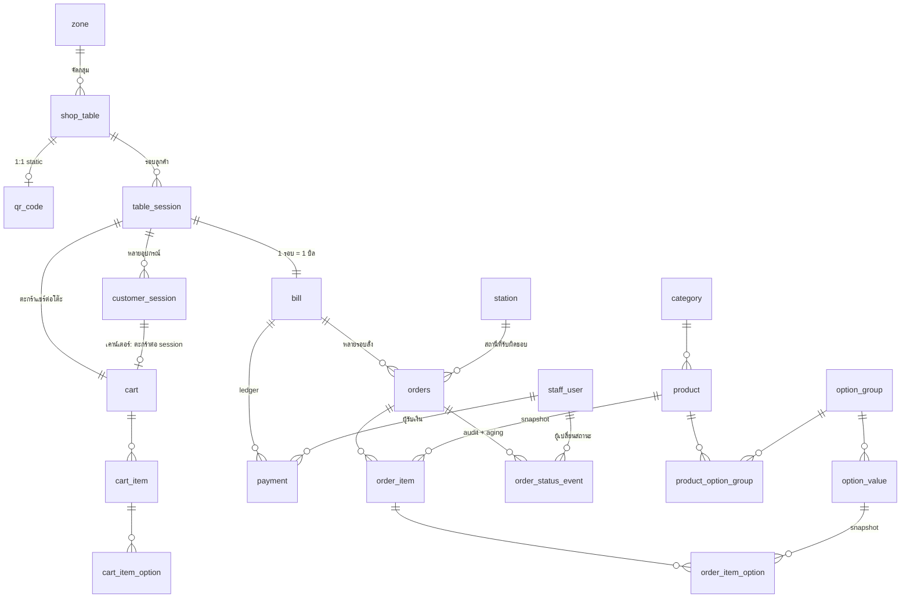
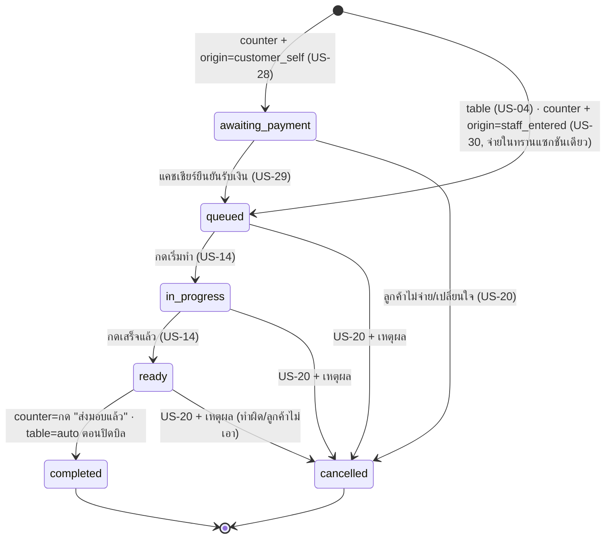
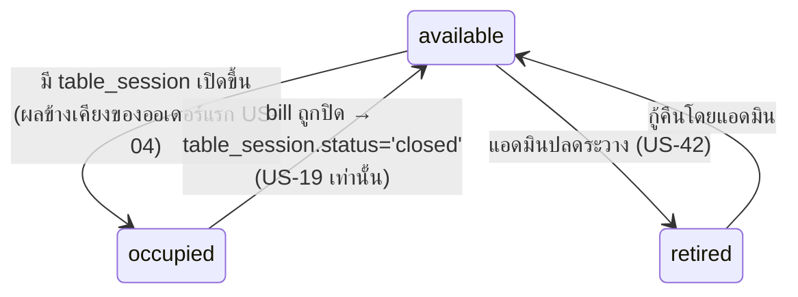

# Data Model v1 — ระบบสั่งอาหารด้วย QR Code (Phase 0)

> **สถานะ: DRAFT (ร่าง schema Phase 0 — รอปิดประเด็นในหัวข้อ 8 ก่อน finalize)**
> ต้นทาง: [[../../01-requirements/01-spec/product-backlog-v1|Product Backlog v1]] (Business Rule ข้อ 1-23), [[../../01-requirements/01-spec/initial-menu-data-v1|Initial Menu Data v1]], [[../../01-requirements/03-task/mvp-task-breakdown-v1|MVP Task Breakdown v1]]
> จัดทำโดย: COULSON (Web PM & Architect) — วันที่ 2026-08-15
> เอกสารพี่น้อง: [[architecture-v1|Architecture v1]] · [[api-design-v1|API Design v1]]

กลับไปที่ [[index|02-technical]]

---

## 1. หลักการที่ใช้ตลอดทั้ง schema

| # | หลักการ | เหตุผล |
|---|---|---|
| P1 | **ทุก PK เป็น `uuid` (v7 ถ้าใช้ได้ ไม่งั้น v4)** และไม่มีความหมายทางธุรกิจ | BR ข้อ 10 + US-42: QR ผูกกับ id ภายในที่คงที่ตลอดไป ห้ามผูกกับเลขโต๊ะที่แก้ได้ |
| P2 | **แยก "ข้อมูลที่แก้ได้" ออกจาก "ข้อมูลที่พิมพ์ไปแล้ว/บันทึกไปแล้ว"** เสมอ | เปลี่ยนชื่อโต๊ะ/ราคาเมนูทีหลังต้องไม่ทำให้ QR พังหรือบิลเก่าเปลี่ยนยอด |
| P3 | **ไม่ลบข้อมูลจริง (soft delete) สำหรับทุก entity ที่มีประวัติผูกอยู่** — `retired_at` / `deleted_at` | US-42 (ปลดระวางโต๊ะ), CLAUDE.md ("ห้ามลบเอกสารทิ้ง" เป็นหลักคิดเดียวกัน) |
| P4 | **เงินเป็น `integer` หน่วยสตางค์** (`price_satang`) ไม่ใช่ float | ไม่มี error สะสมตอนรวมบิล — 75 บาท = 7500 |
| P5 | **เวลาเป็น `timestamptz` ทั้งหมด** แสดงผลด้วย `Asia/Bangkok` | กันรายงานกะข้ามวันเพี้ยนใน Phase 1 |
| P6 | **สถานะที่ derive ได้ ห้ามเก็บเป็น field ที่เขียนตรงได้** | BR ข้อ 11 (สถานะโต๊ะ) — ถ้ามี column ที่ UPDATE ตรงได้ ไม่ช้าก็เร็วจะมีคน UPDATE |
| P7 | **snapshot ข้อมูลที่ใช้คิดเงินลงในออเดอร์ตอนยืนยัน** | R8 ใน [[architecture-v1|Architecture v1]] — แอดมินแก้ราคาได้ตลอดเวลา (US-23) บิลเก่าต้องไม่ขยับ |

> **ข้อยกเว้นการตั้งชื่อ:** ตารางทั้งหมดเป็นเอกพจน์ ยกเว้น `orders` เพราะ `order` เป็น reserved word ของ SQL — จงใจไม่ใช้ชื่อที่ต้องใส่ double quote ทุกครั้ง

---

## 2. ภาพรวมความสัมพันธ์ (ER Overview)



**รวม 21 entity** แบ่งเป็น 5 กลุ่ม: เมนู (5) · ร้าน/โต๊ะ/QR (5) · session/ตะกร้า (5) · ออเดอร์/เงิน (5) · พนักงาน (1)

---

## 3. รายละเอียดตาราง

### 3.1 กลุ่มเมนู (รองรับ US-02, US-23, US-35, US-36, US-43)

#### `category` — หมวดหมู่เมนู
| field | type | หมายเหตุ |
|---|---|---|
| `id` | uuid PK | |
| `name` | text NOT NULL | seed: "ร้อน", "เย็น" — **ห้าม hardcode ในโค้ด** (task กลุ่มงาน B) |
| `sort_order` | int NOT NULL default 0 | ลำดับที่แอดมินจัดเอง |
| `is_active` | boolean NOT NULL default true | ซ่อนจากเมนูลูกค้าโดยไม่ลบ |
| `deleted_at` | timestamptz NULL | soft delete (P3) |
| `created_at` / `updated_at` | timestamptz | |

#### `product` — สินค้า
| field | type | หมายเหตุ |
|---|---|---|
| `id` | uuid PK | |
| `category_id` | uuid FK → category | |
| `name` | text NOT NULL | เช่น "ลาเต้ (ร้อน)" |
| `name_en` | text NULL | มีอยู่แล้วใน seed data — เตรียมทาง US-10 (P2) |
| `description` | text NULL | |
| `price_satang` | int NOT NULL CHECK ≥ 0 | 70 บาท = 7000 |
| `image_url` | text NULL | Supabase Storage |
| `is_available` | boolean NOT NULL default true | **"หมดชั่วคราว" ของ US-16** — พนักงาน toggle ได้ |
| `sort_order` | int NOT NULL default 0 | |
| `is_active` | boolean NOT NULL default true | ต่างจาก `is_available`: active=ยังขายอยู่ในเมนู, available=ตอนนี้มีของ |
| `deleted_at` | timestamptz NULL | |

**Index:** `(category_id, sort_order) WHERE deleted_at IS NULL` · `(is_available)` สำหรับ realtime filter

> ⚠️ **จุดที่ยังไม่ปิด:** 1 สินค้า = 1 (เมนู × อุณหภูมิ) หรือ 1 สินค้า + option อุณหภูมิ — ดูหัวข้อ 8 ข้อ 2 · ค่าที่ใช้ไปก่อนคือแบบแรก (ลาเต้ร้อน กับ ลาเต้เย็น เป็นคนละแถว คนละหมวด คนละราคา มาร์กหมดแยกกันได้)

#### `option_group` — กลุ่มตัวเลือก (**กลไกทั่วไป ห้าม hardcode**)
| field | type | หมายเหตุ |
|---|---|---|
| `id` | uuid PK | |
| `name` | text NOT NULL | "ความหวาน", "ระดับการคั่ว", "เมล็ดพิเศษ", "ชนิดนม" |
| `selection_type` | enum(`single`,`multi`) NOT NULL | Phase 0 ใช้ `single` ทั้งหมด แต่ `multi` ต้องมีตั้งแต่ต้นเพื่อ US-08 (ท็อปปิ้ง) |
| `source_type` | enum(`fixed`,`dynamic`) NOT NULL | `fixed` = รายการคงที่ (หวาน/คั่ว) · `dynamic` = ผูกกับ availability ที่แอดมินเปิด-ปิด (เมล็ดพิเศษ US-36) |
| `is_required` | boolean NOT NULL default false | Phase 0 = false ทุกกลุ่ม (US-35/US-43 ระบุว่าไม่บังคับเลือก) |
| `default_option_value_id` | uuid NULL FK → option_value | **ความหวาน→50% · คั่ว→กลาง · เมล็ดพิเศษ→NULL** |
| `hide_when_empty` | boolean NOT NULL default false | true สำหรับ `dynamic` → ถ้าไม่มี value ที่ available เลย **ซ่อนทั้งกลุ่ม** (US-35 AC ข้อ 4) |
| `sort_order`, `is_active`, `deleted_at` | | |

#### `option_value` — ตัวเลือกย่อย
| field | type | หมายเหตุ |
|---|---|---|
| `id` | uuid PK | |
| `option_group_id` | uuid FK → option_group | |
| `name` | text NOT NULL | "0%", "25%", "50%", "75%", "100%" / "อ่อน","กลาง","เข้ม" / "เอธิโอเปีย เยิร์กาเชฟ" |
| `price_delta_satang` | int NOT NULL default 0 | Phase 0 = 0 ทุกค่า (ทุกตัวเลือกฟรี) แต่ field ต้องมีเพราะ US-08 (เพิ่มช็อต/ไซส์) จะใช้ |
| `is_available` | boolean NOT NULL default true | **กลไก "หมดชั่วคราว" ระดับตัวเลือก** (US-36 + BR ข้อ 4 ที่ขยายในรอบ 7) |
| `sort_order`, `is_active`, `deleted_at` | | |

#### `product_option_group` — ผูกสินค้ากับกลุ่มตัวเลือก (แอดมินกำหนดเอง)
| field | type | หมายเหตุ |
|---|---|---|
| `product_id` | uuid FK, PK ส่วนที่ 1 | |
| `option_group_id` | uuid FK, PK ส่วนที่ 2 | |
| `sort_order` | int | ลำดับที่แสดงบนหน้าสั่ง |
| `is_required_override` | boolean NULL | ถ้า NULL ใช้ค่าจาก group |
| `default_option_value_id_override` | uuid NULL | เผื่อสินค้าบางตัวมี default ต่างจากกลุ่ม |

**นี่คือตารางที่ทำให้ US-43 AC ข้อ 4 เป็นจริง** — เอสเปรสโซ/อเมริกาโน่/ดริป **ไม่มีแถว**ในตารางนี้ที่ชี้ไปกลุ่ม "ความหวาน" → หน้าสั่งไม่แสดงตัวเลือกความหวานเลย โดยไม่ต้องมี if ในโค้ด และแอดมินเปิด/ปิดเองได้ผ่าน UI (ไม่ต้องแก้โค้ด)

**ตัวอย่าง seed ตาม [[../../01-requirements/01-spec/initial-menu-data-v1|Initial Menu Data v1]]:**

| สินค้า | กลุ่มตัวเลือกที่ผูก |
|---|---|
| ลาเต้ (ร้อน/เย็น) | ความหวาน · ระดับการคั่ว · เมล็ดพิเศษ |
| อเมริกาโน่ | ระดับการคั่ว · เมล็ดพิเศษ (ไม่มีความหวาน) |
| มัทฉะลาเต้ | ความหวาน (ไม่มีคั่ว/เมล็ด เพราะไม่ใช่กาแฟ) |
| บานอฟฟี่ ลาเต้ (SIG-01) | **ไม่มีเลย** — สูตรซิกเนเจอร์คงที่ |
| ดริป Discovery / Exclusive | **ไม่มีเลย** — ชนิดเมล็ดคือตัวเมนูเอง |

---

### 3.2 กลุ่มร้าน / โต๊ะ / QR (รองรับ US-01, US-24, US-42, BR ข้อ 10-13)

#### `zone` — โซนของผัง (US-42 "ผังอย่างง่าย")
`id` uuid PK · `name` text ("ในร้าน" / "นอกร้าน" / "ริมหน้าต่าง") · `sort_order` int · `deleted_at`

#### `shop_table` — โต๊ะ 🔴 หัวใจของ US-42
| field | type | หมายเหตุ |
|---|---|---|
| `id` | uuid PK | **immutable ตลอดอายุร้าน — QR ผูกกับ id นี้เท่านั้น ห้ามเปลี่ยน ห้าม reuse** |
| `display_name` | text NOT NULL | "โต๊ะ 5" → "โต๊ะ A5" → "โต๊ะริมหน้าต่าง" **แก้ได้อิสระ QR เดิมไม่พัง** |
| `zone_id` | uuid NULL FK → zone | |
| `sort_order` | int NOT NULL default 0 | ลำดับในผัง (US-42: จัดลำดับได้ ไม่ต้อง drag-and-drop floor plan) |
| `seat_count` | int NULL | ข้อมูลประกอบ ไม่บังคับ |
| `retired_at` | timestamptz NULL | **soft delete** — ปลดระวางแล้วสร้างออเดอร์ใหม่ไม่ได้ แต่ประวัติยังอยู่ครบ |
| `created_at` / `updated_at` | | |

**ไม่มี column `status`** — สถานะว่าง/ไม่ว่างอ่านจาก view เท่านั้น (ดู §4.2 และ P6)

**Index:** `(zone_id, sort_order) WHERE retired_at IS NULL` · unique `(display_name) WHERE retired_at IS NULL` (กันตั้งชื่อซ้ำจนพนักงานสับสน)

#### `qr_code` — QR ทั้งโต๊ะและเคาน์เตอร์
| field | type | หมายเหตุ |
|---|---|---|
| `id` | uuid PK | |
| `code` | text UNIQUE NOT NULL | สตริงสุ่ม base32 8-10 ตัว → เป็น path ใน URL (`/t/{code}`) **ไม่ใช่เลขโต๊ะ เดาไม่ได้** |
| `channel` | enum(`table`,`counter`) NOT NULL | BR ข้อ 12 |
| `table_id` | uuid NULL FK → shop_table | NOT NULL เมื่อ channel=`table` · NULL เมื่อ channel=`counter` |
| `label` | text NULL | "QR เคาน์เตอร์" สำหรับให้แอดมินจำได้ |
| `is_active` | boolean default true | |
| `created_at` | | |

**Constraint สำคัญ:**
```sql
-- 1 โต๊ะ = 1 QR ที่ใช้งานอยู่ ตลอดอายุร้าน (BR ข้อ 10)
CREATE UNIQUE INDEX qr_one_active_per_table
  ON qr_code (table_id) WHERE table_id IS NOT NULL AND is_active;
-- channel กับ table_id ต้องสอดคล้องกันเสมอ
ALTER TABLE qr_code ADD CONSTRAINT qr_channel_shape CHECK (
  (channel = 'table'   AND table_id IS NOT NULL) OR
  (channel = 'counter' AND table_id IS NULL)
);
```
**ไม่มี field `expires_at` และไม่มี endpoint `regenerate`** — จงใจ ตาม BR ข้อ 10 (ลดสโคปตามที่ task breakdown ระบุ)

#### `station` — สถานีเตรียมของ (BR ข้อ 13, เตรียมทาง US-31)
`id` uuid PK · `name` text ("สถานีหน้าร้าน") · `is_default` boolean · `is_active` boolean

Phase 0 มีแถวเดียว และ `orders.station_id` ชี้มาที่แถวนี้เสมอ — **ไม่มี UI ให้จัดการ (US-31 คือ P2)** แต่ตารางมีจริงตั้งแต่วันแรก เพื่อให้ Phase 2 เพิ่มสถานี + กฎ routing ได้โดยไม่ต้อง migrate `orders`

#### `shop_setting` — ค่าตั้งของร้าน (key-value)
`key` text PK · `value` jsonb · `updated_at` · `updated_by`
Phase 0 ใช้เก็บ: `accepting_orders` (เตรียมทาง US-26 Phase 1), `shop_name`, `session_idle_minutes`

#### `staff_user` — โปรไฟล์พนักงาน (BR ข้อ 9, 21)
| field | type | หมายเหตุ |
|---|---|---|
| `id` | uuid PK = `auth.users.id` ของ Supabase | |
| `display_name` | text | |
| `role` | enum(`staff`,`admin`) NOT NULL | |
| `is_active` | boolean default true | ปิดบัญชีคนที่ลาออก (US-27 P2 มาต่อยอด) |

**เก็บเท่านี้เท่านั้น** ตาม BR ข้อ 21 — ไม่มีเลขบัตรประชาชน/ที่อยู่/เบอร์โทร รหัสผ่านอยู่ใน `auth.users` ของ Supabase (hash) ไม่ใช่ตารางนี้

---

### 3.3 กลุ่ม session และตะกร้า (รองรับ BR ข้อ 2, 7, 14 · UX-05, UX-06)

#### `table_session` — "รอบลูกค้า" 🔴 หัวใจของ BR ข้อ 11
| field | type | หมายเหตุ |
|---|---|---|
| `id` | uuid PK | |
| `table_id` | uuid FK → shop_table | |
| `status` | enum(`open`,`closed`) NOT NULL | |
| `opened_at` | timestamptz NOT NULL | ตอนออเดอร์แรกของรอบเข้าระบบ |
| `closed_at` | timestamptz NULL | ตอนแคชเชียร์ปิดบิล |
| `closed_by_staff_id` | uuid NULL FK | |

**Constraint ที่ทำให้ทั้งระบบไม่พัง:**
```sql
-- 1 โต๊ะ มี session ที่เปิดอยู่ได้ไม่เกิน 1 รอบ ณ เวลาใดก็ตาม
CREATE UNIQUE INDEX one_open_session_per_table
  ON table_session (table_id) WHERE status = 'open';
```
นี่คือ constraint ที่ทำให้ race condition "สองคนสั่งพร้อมกันตอนโต๊ะยังว่าง" ไม่สามารถสร้าง 2 บิลได้ — คนที่สองจะชน unique index แล้วโค้ดวนไปใช้ session ที่มีอยู่แทน

#### `customer_session` — session ต่ออุปกรณ์ (ไม่ใช่ต่อคน ไม่ใช่ตัวตน)
| field | type | หมายเหตุ |
|---|---|---|
| `id` | uuid PK | ใส่เป็น claim `sid` ใน token |
| `channel` | enum(`table`,`counter`) | |
| `table_session_id` | uuid NULL FK | สำหรับ dine-in — หลาย customer_session ชี้ session เดียวกันได้ (= หลายคนที่โต๊ะเดียวกัน) |
| `qr_code_id` | uuid FK | สแกนมาจาก QR ใบไหน |
| `cart_id` | uuid NULL FK | เคาน์เตอร์: ตะกร้าส่วนตัวต่อ session · โต๊ะ: NULL (ใช้ตะกร้าของ table_session) |
| `started_at` / `last_seen_at` / `expires_at` | timestamptz | |

🔴 **PDPA guardrail (BR ข้อ 14):** ตารางนี้ **ห้ามมี** ชื่อ/เบอร์โทร/อีเมล/IP/user-agent/device fingerprint/cookie id ที่คงอยู่ข้ามครั้งการมาใช้บริการ — เก็บได้เฉพาะ id สุ่มที่ตายพร้อมรอบบริการ · มี job ลบแถวที่ `expires_at` ผ่านไปแล้ว 24 ชั่วโมง

> ⚠️ **ล้าสมัยบางส่วนตั้งแต่ 2026-08-16 — รอ COULSON ออกแบบใหม่** · Touch ตัดสินให้ **เรียกรับของด้วยชื่อเล่นคู่กับเลขคิว** (โมเดลแบบ Starbucks) จึงต้องมี **field ชื่อเล่น 1 ตัวผูกกับออเดอร์** ซึ่งขัดกับ guardrail ที่เขียนไว้ข้างบน
> **Touch ตัดสินระยะเวลาเก็บแล้ว 2026-08-16:** ชื่อเล่นอยู่กับ **ออเดอร์** และถูก **ล้างเป็น `NULL` เมื่อออเดอร์อายุครบ 90 วัน** ด้วย job ที่รันเป็นประจำ
> 🔴 **เป็น column-level purge ไม่ใช่ row-level — จุดนี้พังง่ายที่สุดของทั้งข้อ** · job ล้างข้อมูลที่มีอยู่ตอนนี้ (`customer_session`/`cart` อายุ 24 ชม.) **ลบทั้งแถว** · ถ้าเขียน job ใหม่ตามแบบเดิม จะ **ลบออเดอร์อายุเกิน 90 วันทิ้งทั้งแถว = ข้อมูลบัญชี/ภาษีหาย** กู้ไม่ได้ และจะรู้ตัวตอนปิดงบ · **ต้อง `UPDATE … SET <ช่องชื่อ> = NULL` เท่านั้น ห้าม `DELETE`**
> ต้องอัปเดต **§7 ข้อ 7 (ระยะเวลาเก็บข้อมูล)** ให้สอดคล้องด้วย — เดิมระบุว่า `orders` เก็บไว้ไม่มีกำหนดโดยไม่มีข้อยกเว้นรายคอลัมน์
> ข้อจำกัดที่ยังต้องคงไว้ไม่ว่าจะวางตรงไหน: **ห้ามผูกชื่อเล่นข้ามออเดอร์เป็นโปรไฟล์ลูกค้า** · **ห้ามบังคับกรอก** · **เลขคิวยังเป็นตัวอ้างอิงหลักที่ค้นหาได้** · ยังห้ามเบอร์โทร/อีเมล/LINE ID/device fingerprint ทั้งหมดตามเดิม
> ทดสอบด้วย **TC-072 / TC-072a / TC-072b** ที่แก้แล้วใน [[../../03-testing/01-test-plan/test-case-v1|Test Case Specification v1]]

#### `cart` — ตะกร้า (ยังไม่ยืนยัน แก้ได้อิสระ ตาม glossary UX §6)
`id` uuid PK · `scope` enum(`table_session`,`customer_session`) · `table_session_id` uuid NULL · `customer_session_id` uuid NULL · `created_at`

- **dine-in: 1 `table_session` = 1 `cart` เดียว ที่ทุกอุปกรณ์ในโต๊ะเขียนร่วมกัน** ← นี่คือหัวใจของ BR ข้อ 2
- **counter: 1 `customer_session` = 1 `cart`** (คนละคนที่ยืนหน้าเคาน์เตอร์ต้องไม่ปนตะกร้ากัน)

#### `cart_item` และ `cart_item_option`
| field | type | หมายเหตุ |
|---|---|---|
| `id` | uuid PK | |
| `cart_id` | uuid FK | |
| `product_id` | uuid FK | |
| `qty` | int NOT NULL CHECK > 0 | |
| `line_signature` | text NOT NULL | hash ของ (product_id + option_value_id ที่เรียงแล้ว + note) |
| `version` | int NOT NULL default 1 | optimistic concurrency ตอนตั้งจำนวน |
| `added_by_session_id` | uuid FK → customer_session | เพื่อแสดง "เพิ่มโดยอุปกรณ์นี้/อุปกรณ์อื่น" — **ไม่ใช่ตัวตน เป็น id สุ่มที่ตายพร้อม session** |
| `created_at` / `updated_at` | | |

```sql
-- กันรายการหายจากการเขียนพร้อมกัน (BR ข้อ 2 / UX-06)
CREATE UNIQUE INDEX cart_item_line ON cart_item (cart_id, line_signature);
```
การ "เพิ่มลงตะกร้า" ใช้ `INSERT ... ON CONFLICT (cart_id, line_signature) DO UPDATE SET qty = cart_item.qty + EXCLUDED.qty` → **commutative** สองเครื่องกดพร้อมกันได้ผลรวมถูกเสมอ ไม่มี lost update (รายละเอียดที่ [[api-design-v1|API Design v1]] §5.1)

`cart_item_option`: `cart_item_id` FK · `option_group_id` FK · `option_value_id` FK · PK(cart_item_id, option_group_id, option_value_id)

---

### 3.4 กลุ่มออเดอร์และเงิน (รองรับ US-04..US-07, US-13..US-20, US-28..US-30)

#### `bill` — บิล (นิยามตาม glossary UX §6: ยอดรวมของทุกออเดอร์ในรอบลูกค้าเดียวกัน)
| field | type | หมายเหตุ |
|---|---|---|
| `id` | uuid PK | |
| `channel` | enum(`table`,`counter`) NOT NULL | |
| `table_session_id` | uuid NULL FK | NOT NULL เมื่อ channel=`table` |
| `status` | enum(`open`,`awaiting_payment`,`paid`,`voided`) NOT NULL | |
| `total_satang` | int NOT NULL default 0 | ยอดที่คำนวณจาก order_item ที่ยัง active (คำนวณใหม่ทุกครั้งที่มีการเปลี่ยนแปลง ไม่ใช่ค่าที่พิมพ์เข้ามาเอง) |
| `paid_at` | timestamptz NULL | 🔴 gate ของ BR ข้อ 12 |
| `closed_by_staff_id` | uuid NULL FK | |
| `created_at` | | |

- **dine-in:** 1 `table_session` = 1 `bill` (status `open` → `paid` ตอนปิดบิล)
- **counter:** 1 ออเดอร์ = 1 `bill` (status `awaiting_payment` → `paid`) เพราะแต่ละคนที่ซื้อกลับจ่ายจบเป็นราย ๆ

#### `orders` — ออเดอร์ 1 รอบการกดยืนยัน
| field | type | หมายเหตุ |
|---|---|---|
| `id` | uuid PK | |
| `bill_id` | uuid FK → bill | |
| `channel` | enum(`table`,`counter`) NOT NULL | BR ข้อ 12 |
| `origin` | enum(`customer_self`,`staff_entered`) NOT NULL | 🔴 **แยกจาก channel เด็ดขาด** (US-30, BR ข้อ 12) |
| `table_id` | uuid NULL FK | denormalize ไว้เพื่อให้จอสถานีแสดงเลขโต๊ะได้โดยไม่ join ลึก |
| `table_session_id` | uuid NULL FK | |
| `customer_session_id` | uuid NULL FK | NULL เมื่อ origin=`staff_entered` |
| `station_id` | uuid FK → station | Phase 0 = สถานี default เสมอ |
| `status` | enum(`awaiting_payment`,`queued`,`in_progress`,`ready`,`completed`,`cancelled`) | ดู §4.1 |
| `sequence_no` | int NOT NULL | ลำดับรอบที่สั่งของบิลนั้น ("รอบที่ 2 ของโต๊ะ 5") |
| `placed_at` | timestamptz NOT NULL default now() | 🔴 **task ที่ Week 3 สั่งเตรียมไว้ให้ US-41** |
| `status_changed_at` | timestamptz NOT NULL default now() | เวลาที่เข้าสถานะปัจจุบัน → คำนวณ aging ได้ตรงตาม AC ของ US-41 |
| `created_by_staff_id` | uuid NULL FK | NOT NULL เมื่อ origin=`staff_entered` (US-30) |
| `cancelled_at` / `cancelled_by_staff_id` / `cancel_reason` | | BR ข้อ 5: **เหตุผลบังคับกรอกเสมอ** |
| `idempotency_key` | text NULL | กันกดยืนยันซ้ำ (UX §5 double-submit) |

**Index:** `(status, placed_at) WHERE status IN ('awaiting_payment','queued','in_progress','ready')` — คิวหน้าจอสถานี · `(bill_id, sequence_no)` · unique `(customer_session_id, idempotency_key)`

#### `order_item` — รายการในออเดอร์ (snapshot ทุกอย่างที่ใช้คิดเงิน)
| field | type | หมายเหตุ |
|---|---|---|
| `id` | uuid PK | |
| `order_id` | uuid FK | |
| `product_id` | uuid FK | อ้างอิงไว้เพื่อทำรายงาน — **แต่ห้ามใช้ join เพื่อเอาชื่อ/ราคามาแสดงบนบิล** |
| `product_name_snapshot` | text NOT NULL | P7 |
| `unit_price_satang_snapshot` | int NOT NULL | P7 — ราคา ณ เวลาที่กดยืนยัน |
| `qty` | int NOT NULL CHECK > 0 | |
| `line_total_satang` | int NOT NULL | (unit_price + Σ option price_delta) × qty |
| `status` | enum(`active`,`rejected_unavailable`,`cancelled`) NOT NULL | 🔴 `rejected_unavailable` = BR ข้อ 4 (reject รายเดียว ไม่ล้มทั้งบิล) |
| `note` | text NULL | US-09 เป็น Phase 1 แต่ field มีตั้งแต่ต้น (roadmap สั่งให้เผื่อ) |
| `cancel_reason` / `cancelled_by_staff_id` | | US-20 ยกเลิกบางรายการ |

#### `order_item_option` — ตัวเลือกที่เลือกไว้ (snapshot เช่นกัน)
`id` · `order_item_id` FK · `option_group_id` · `option_group_name_snapshot` · `option_value_id` · `option_value_name_snapshot` · `price_delta_satang_snapshot`

**ทำไมต้อง snapshot ชื่อ option ด้วย:** แอดมินลบเมล็ดพิเศษ "เอธิโอเปีย เยิร์กาเชฟ" ออกจากระบบสัปดาห์หน้า (US-36) — ตั๋วออเดอร์และประวัติของวันนี้ต้องยังอ่านออกว่าลูกค้าสั่งเมล็ดอะไร

#### `order_status_event` — audit + ที่มาของ aging
`id` · `order_id` FK · `from_status` · `to_status` · `changed_by_staff_id` NULL · `changed_at` · `reason` NULL

เล็กและถูกมาก แต่ให้ 3 อย่าง: audit ว่าใครยกเลิก (US-20), ข้อมูลดิบสำหรับ aging (US-41 Phase 1), และ debug ตอนสถานะไม่ตรงกับที่พนักงานจำได้

#### `payment` — ledger การเงิน (append-only)
| field | type | หมายเหตุ |
|---|---|---|
| `id` | uuid PK | |
| `bill_id` | uuid FK | |
| `kind` | enum(`payment`,`refund`) NOT NULL | Phase 0 ใช้แค่ `payment` — `refund` รอ US-22 (Phase 1) |
| `method` | enum(`cash`,`card`) NOT NULL | ไม่มี online gateway ใน Phase 0 (BR ข้อ 12) |
| `amount_satang` | int NOT NULL | |
| `received_by_staff_id` | uuid FK → staff_user | |
| `received_at` | timestamptz NOT NULL | |
| `note` | text NULL | |

**append-only:** คืนเงินคือแถวใหม่ `kind='refund'` ไม่ใช่การแก้/ลบแถวเดิม → US-22 ต่อยอดได้โดยไม่ต้องแก้ schema

---

## 4. State Machine

### 4.1 สถานะออเดอร์



| transition | ถูกกฎ? | เงื่อนไข/เหตุผล |
|---|---|---|
| `awaiting_payment → queued` | ✅ | **เฉพาะเมื่อ `bill.paid_at IS NOT NULL`** — INV-3 |
| `queued → in_progress → ready` | ✅ | US-14 · ทุกครั้งอัปเดต `status_changed_at` และเขียน `order_status_event` |
| `queued → ready` (ข้าม in_progress) | ✅ | **อนุญาต** — BR ข้อ 13 สถานีเดียว พนักงานลงมือทันทีที่เห็น ขั้น "กำลังทำ" แทบไม่มีช่วงเวลา (US-14 Notes) การบังคับให้กด 2 ครั้งคือการเพิ่มงานให้ persona P4 โดยไม่ได้อะไร |
| `ready → in_progress` (ถอยกลับ) | ✅ | กดพลาดเกิดขึ้นจริงในสภาพมือเปียก (UX-09) — อนุญาตถอย 1 ขั้น บันทึกใน event log |
| `completed → *` | ❌ | ปิดแล้วปิดเลย — การแก้ไขหลังจบคือ **คืนเงิน (US-22, Phase 1)** ไม่ใช่การย้อนสถานะ |
| `cancelled → *` | ❌ | ยกเลิกแล้วต้องสั่งใหม่ |
| `* → cancelled` โดยลูกค้า | ❌ | **BR ข้อ 5: ลูกค้ายกเลิกเองไม่ได้เด็ดขาดหลังกดยืนยัน** — endpoint ยกเลิกอยู่ใต้ role staff เท่านั้น |
| `* → cancelled` โดยไม่ระบุเหตุผล | ❌ | BR ข้อ 5 — `cancel_reason` NOT NULL enforced ที่ระดับ API + CHECK |
| `awaiting_payment` สำหรับ channel=`table` | ❌ | BR ข้อ 3: dine-in ห้ามบล็อกออเดอร์ด้วยการจ่ายเงิน — CHECK constraint กันไว้ |

> **"รอเสิร์ฟ" ของ US-30 ถูกตีความเป็น label ที่ derive ได้** = `channel='counter' AND status IN ('queued','in_progress','ready')` **ไม่ใช่ status ใหม่** — ตรงกับการตีความที่ XAVIER เขียนไว้ใน US-30 Notes แต่ **ต้องให้ Touch ยืนยันก่อน finalize** ตามที่ task breakdown กลุ่มงาน F สั่งไว้ (หัวข้อ 8 ข้อ 1)

### 4.2 สถานะโต๊ะ — derive เท่านั้น (BR ข้อ 11)



**วิธี implement ที่ทำให้ "ห้ามเป็น manual toggle" เป็นจริงเชิงโครงสร้าง ไม่ใช่แค่ข้อตกลง:**

```sql
CREATE VIEW table_status_v AS
SELECT t.id,
       t.display_name,
       t.zone_id,
       t.sort_order,
       CASE
         WHEN t.retired_at IS NOT NULL                THEN 'retired'
         WHEN ts.id IS NOT NULL                       THEN 'occupied'
         ELSE 'available'
       END AS status,
       ts.id AS open_session_id
FROM shop_table t
LEFT JOIN table_session ts
  ON ts.table_id = t.id AND ts.status = 'open';
```

- **ไม่มี column `status` ใน `shop_table`** → ไม่มีอะไรให้ UPDATE → ไม่มี endpoint "เปิด/ปิดโต๊ะ" (BR ข้อ 11 บอกให้ไม่มี)
- transition ที่ผิดกฎถูกกันด้วยโครงสร้าง ไม่ใช่ด้วยความตั้งใจของ developer

| transition | ถูกกฎ? | เหตุผล |
|---|---|---|
| `available → occupied` โดยพนักงานกดปุ่ม | ❌ | ไม่มีปุ่มนี้ในระบบ |
| `occupied → available` โดยไม่ปิดบิล | ❌ | ทางเดียวคือปิด `table_session` ซึ่งทำได้ผ่าน endpoint ปิดบิลเท่านั้น |
| `occupied → retired` | ❌ | **ต้องปิดบิลก่อน** (US-42 AC) — 409 `TABLE_HAS_OPEN_BILL` |
| `retired → occupied` | ❌ | โต๊ะที่ปลดระวางเปิด session ใหม่ไม่ได้ (สแกน QR เดิมได้ error ที่อ่านเข้าใจ) |
| ลบแถว `shop_table` | ❌ | P3 soft delete — ประวัติออเดอร์ต้องอยู่ครบ (US-42 AC, เชื่อม US-17/US-25) |

### 4.3 สถานะบิล

| จาก | ไป | ใคร/เมื่อไร |
|---|---|---|
| — | `open` | dine-in: ตอนเปิด table_session |
| — | `awaiting_payment` | counter: ตอนลูกค้ายืนยันออเดอร์ (US-28) |
| `awaiting_payment` | `paid` | แคชเชียร์ยืนยันรับเงิน (US-29) หรือ US-30 ในทรานแซกชันเดียว |
| `open` | `paid` | แคชเชียร์ปิดบิล (US-19) → ปิด table_session → โต๊ะกลับเป็นว่าง |
| `awaiting_payment` | `voided` | ลูกค้าไม่จ่าย → ยกเลิก (US-20/US-29) |
| `paid` | ❌ ไม่มี transition ออก | คืนเงินคือแถวใหม่ใน `payment` (US-22, Phase 1) |

---

## 5. Invariant ที่ต้องบังคับที่ระดับฐานข้อมูล

ไม่ใช่กฎที่ "โค้ดควรทำตาม" แต่เป็นกฎที่ **DB ต้องปฏิเสธถ้ามีใครทำผิด** ไม่ว่าจะมาจาก UI ไหน:

| ID | Invariant | บังคับด้วย |
|---|---|---|
| INV-1 | 1 โต๊ะมี `table_session` ที่ `open` ได้ไม่เกิน 1 รอบ | partial unique index |
| INV-2 | 1 โต๊ะที่ยังไม่ปลดระวาง มี QR ที่ active ได้ 1 ใบเท่านั้น | partial unique index |
| INV-3 | ออเดอร์ channel=`counter` จะออกจาก `awaiting_payment` ได้ต่อเมื่อ `bill.paid_at IS NOT NULL` | trigger `BEFORE UPDATE` บน `orders` |
| INV-4 | ออเดอร์ channel=`table` ห้ามมีสถานะ `awaiting_payment` | CHECK constraint |
| INV-5 | `orders.origin='staff_entered'` ⇒ `created_by_staff_id IS NOT NULL` | CHECK constraint |
| INV-6 | `orders.status='cancelled'` ⇒ `cancel_reason IS NOT NULL` (BR ข้อ 5) | CHECK constraint |
| INV-7 | สร้าง `table_session` ใหม่บนโต๊ะที่ `retired_at IS NOT NULL` ไม่ได้ | trigger |
| INV-8 | ปิด `table_session` ไม่ได้ถ้า `bill.status` ยังไม่เป็น `paid` หรือ `voided` | trigger |
| INV-9 | `bill.total_satang` = Σ `order_item.line_total_satang` ที่ `status='active'` | คำนวณใน service layer ภายในทรานแซกชันเดียวกับที่แก้รายการ + มี job ตรวจสอบความสอดคล้องรายวัน |
| INV-10 | `cart_item` unique ต่อ `(cart_id, line_signature)` | unique index (BR ข้อ 2) |

---

## 6. schema นี้รองรับข้อกำหนดที่ล็อกไว้ 12 ข้ออย่างไร (ไล่ทีละข้อ)

| # | ข้อกำหนดที่ล็อกไว้ | รองรับด้วยอะไร | สถานะ |
|---|---|---|---|
| **1** | table entity แยก internal id (คงที่) ออกจากชื่อ/เลขโต๊ะที่แสดง (แก้ได้) — QR ผูกกับ id | `shop_table.id` (uuid immutable) กับ `shop_table.display_name` (แก้อิสระ) เป็นคนละ field · `qr_code.table_id` → `id` เท่านั้น · `qr_code.code` เป็นสตริงสุ่ม ไม่ผูกกับทั้ง id และชื่อ → เปลี่ยนชื่อโต๊ะไม่แตะ QR เลยแม้แต่ระดับ URL | ✅ ปิด |
| **2** | QR static 1:1 ต่อโต๊ะตลอดอายุร้าน ไม่มี flow regenerate | `qr_code` ไม่มี `expires_at`/`rotated_at` และไม่มี endpoint regenerate ใน [[api-design-v1|API Design v1]] · partial unique index INV-2 บังคับ 1:1 | ✅ ปิด |
| **3** | สถานะโต๊ะ derive จากวงจรชีวิตออเดอร์เท่านั้น ห้าม manual toggle | **`shop_table` ไม่มี column `status` เลย** — อ่านจาก `table_status_v` (§4.2) · เปิดจาก `table_session` ที่ถูกสร้างเป็นผลข้างเคียงของออเดอร์แรก · ปิดจาก endpoint ปิดบิลเท่านั้น · ไม่มี API ให้เขียนสถานะโต๊ะ | ✅ ปิด |
| **4** | ตะกร้า/session ต่อโต๊ะรองรับการเขียนพร้อมกันหลายคน/หลายอุปกรณ์ + ทุกจอ realtime | `cart` ผูกกับ `table_session` (ไม่ใช่กับอุปกรณ์) · หลาย `customer_session` ชี้ `table_session` เดียวกันได้ · `cart_item` unique ที่ `line_signature` + เพิ่มด้วย `ON CONFLICT DO UPDATE qty+` (commutative) · `version` สำหรับการตั้งจำนวนแบบ optimistic · realtime subscribe ที่ `cart_item`/`orders` filter ด้วย `table_session_id` | ✅ ปิด (ต้องผ่าน test 0% data loss ของ OKOYE ตาม UX §7) |
| **5** | 2 channel กฎจ่ายเงินตรงข้ามกัน + origin field แยกจาก channel | `orders.channel` (`table`/`counter`) และ `orders.origin` (`customer_self`/`staff_entered`) เป็น**คนละคอลัมน์** · INV-3 บังคับ prepay ของ counter ที่ระดับ trigger · INV-4 กัน dine-in ไม่ให้มีสถานะรอจ่าย · ทั้ง 2 origin ใช้ `status` และคิวเดียวกัน ต่างแค่ป้าย (UX-10) | ✅ ปิด |
| **6** | soft delete โต๊ะที่ปลดระวาง · ห้ามลบประวัติ · ห้ามแก้/ปลดโต๊ะที่มีบิลเปิดค้าง | `shop_table.retired_at` (ไม่มี DELETE ในทุก endpoint) · ประวัติอยู่ที่ `orders.table_id` ที่ยังชี้ได้เสมอ · INV-7 กันการเปิด session บนโต๊ะที่ปลดระวาง · การปลดระวางตรวจ `table_status_v.status='occupied'` → 409 | ✅ ปิด |
| **7** | option-group เป็นกลไกทั่วไป: fixed 5 ค่า default 50% · fixed 3 ค่า default กลาง · dynamic ผูก availability · นมโอ๊ต · แอดมินผูกสินค้ากับกลุ่มเองได้ | `option_group.source_type` (`fixed`/`dynamic`) + `selection_type` + `default_option_value_id` + `hide_when_empty` · `option_value.is_available` = กลไก "หมด" ระดับตัวเลือก (US-36) · `product_option_group` = แอดมินผูกเอง ไม่มี if ในโค้ด · **ไม่มีที่ไหนใน schema ที่เอ่ยถึงคำว่า "ความหวาน"/"การคั่ว"** ทั้งหมดเป็นข้อมูล ไม่ใช่โครงสร้าง | ✅ ปิดฝั่งกลไก · ⚠️ นมโอ๊ตยังไม่มี US รองรับ (หัวข้อ 8 ข้อ 3) |
| **8** | race condition ของหมด — reject เฉพาะรายการ ไม่ล้มทั้งออเดอร์ ทั้งระดับสินค้าและระดับ option value | `order_item.status = 'rejected_unavailable'` เป็นสถานะระดับ **รายการ** ไม่ใช่ระดับออเดอร์ · ตรวจซ้ำทั้ง `product.is_available` และ `option_value.is_available` ในทรานแซกชันยืนยันออเดอร์ · `bill.total` นับเฉพาะ `status='active'` → ยอดถูกต้องอัตโนมัติ · contract ของ response อยู่ที่ [[api-design-v1|API Design v1]] §5.2 | ✅ ปิด |
| **9** | 🔴 **กฎเปลี่ยนแล้ว 2026-08-16 — ข้อความในช่องขวายังเป็นของกฎเดิม** · กฎใหม่: Phase 0 เก็บข้อมูลส่วนบุคคลได้ **1 ชนิด คือชื่อเล่นผูกกับออเดอร์** เพื่อเรียกรับของคู่เลขคิว · ที่เหลือห้ามตามเดิม · แจ้งเตือนต้อง session-scoped **· รอ COULSON ออกแบบใหม่ ดูหมายเหตุที่ตาราง `customer_session`** | **ทั้ง schema ไม่มีตาราง `customer`** และไม่มี field ชื่อ/เบอร์โทร/อีเมล/device id ที่ข้ามครั้งการใช้บริการ · `customer_session` เก็บได้เฉพาะ id สุ่ม + เวลา + หมดอายุ + job ลบทิ้ง · ไม่มี push token/SMS field ใด ๆ (BR ข้อ 22) · **guardrail นี้ต้องถูกตรวจซ้ำทุกครั้งที่มีการเพิ่มคอลัมน์ในตารางกลุ่ม session/order** | ✅ ปิด (เป็น guardrail ต่อเนื่อง ไม่ใช่งานที่ทำครั้งเดียวจบ) |
| **10** | station model configurable — default สถานีรวมเดียว ห้าม hardcode | `station` เป็นตารางจริง + `orders.station_id` FK ตั้งแต่ Phase 0 · Phase 0 มี 1 แถว ไม่มี UI (US-31 = P2) · Phase 2 เพิ่มแถว + กฎ routing โดยไม่ต้อง migrate `orders` | ✅ ปิด |
| **11** | พนักงานทุกจอ login · ลูกค้าเป็น guest ไม่มีบัญชี | `staff_user` ผูกกับ Supabase Auth (role `staff`/`admin`) เก็บข้อมูลขั้นต่ำตาม BR ข้อ 21 · ฝั่งลูกค้าไม่มีตารางบัญชี ใช้ session token ที่ไม่มีข้อมูลส่วนบุคคล (ดู [[architecture-v1|Architecture v1]] §3.4) | ✅ ปิด · ⚠️ Phase 0 ใช้บัญชีร่วมต่อสถานี → audit บอกได้แค่ระดับบัญชี (ความเสี่ยง R7) |
| **12** | เก็บ timestamp ตอนออเดอร์เข้าระบบเพื่อคำนวณ aging ทีหลัง · **ไม่ต้อง**ออกแบบ ETA ล่วงหน้า | `orders.placed_at` + `orders.status_changed_at` + `order_status_event` → US-41 คำนวณ aging ได้ทันทีโดยไม่ migrate · **ไม่มีตาราง/คอลัมน์ใดที่เตรียมไว้ให้ ETA (US-38) เลยโดยเจตนา** ตามที่ task breakdown ตัดสินใจไว้ | ✅ ปิด |

**สรุป: 12/12 ข้อรองรับที่ระดับ schema แล้ว** — จุดที่ยังไม่ปิดสนิทมี 2 จุดและทั้งคู่ไม่ใช่ช่องว่างของ schema แต่เป็นคำถามที่ต้องได้คำตอบจาก Touch (ตัวเลือกนมโอ๊ตยังไม่มี US รองรับ · บัญชีพนักงานร่วมต่อสถานีทำให้ audit หยาบ ซึ่ง backlog ยอมรับไว้แล้วใน US-27)

---

## 7. Seed Data ของ Phase 0

| ชุด | ที่มา | หมายเหตุ |
|---|---|---|
| `category` | ร้อน, เย็น | 2 หมวดเท่านั้น (ตัดปั่นออกแล้ว) — **seed ไม่ใช่ hardcode** |
| `product` | 19 เมนู × อุณหภูมิที่มีราคา ≈ 30 แถว | ราคาเป็น **DRAFT** ที่ Touch ต้องเคาะก่อนเปิดร้าน |
| `option_group` | ความหวาน (fixed, default 50%) · ระดับการคั่ว (fixed, default กลาง) · เมล็ดพิเศษ (dynamic, hide_when_empty) · ชนิดนม (fixed, default นมปกติ — **ยังไม่เปิดใช้ รอยืนยัน**) | |
| `option_value` | หวาน 5 ค่า · คั่ว 3 ค่า · เมล็ดพิเศษตามที่ร้านมีจริง | |
| `product_option_group` | ตามคอลัมน์ "ตัวเลือกที่มี" ของ [[../../01-requirements/01-spec/initial-menu-data-v1|Initial Menu Data v1]] | เอสเปรสโซ/อเมริกาโน่/ดริป/ซิกเนเจอร์ ไม่ผูกกลุ่มความหวาน |
| `shop_table` + `qr_code` | โต๊ะตัวอย่างสำหรับทดสอบ | **จำนวนโต๊ะจริงเจ้าของร้านสร้างเองผ่าน US-42** ไม่ใช่ค่าคงที่ของระบบ |
| `qr_code` (counter) | 1 ใบ | |
| `station` | "สถานีหน้าร้าน" 1 แถว | |
| `staff_user` | บัญชีพนักงาน 1 + แอดมิน 1 | รหัสผ่านตั้งตอน provision ห้าม commit ลง repo |

---

## 8. ประเด็นที่ต้องกลับไปถาม XAVIER/Touch (ก่อน finalize schema)

| # | ประเด็น | กระทบ schema ตรงไหน | ค่าที่ใช้ไปก่อน |
|---|---|---|---|
| 1 | **"รอเสิร์ฟ" เป็น label หรือ status field** (XAVIER flag ไว้เองใน US-30 + กลุ่มงาน F ว่าต้องยืนยันก่อน finalize) | enum `order_status` | label ที่ derive ได้ + เพิ่ม transition `ready → completed` ("ส่งมอบแล้ว") เฉพาะช่องทางเคาน์เตอร์ |
| 2 | **เมนูร้อน/เย็น = 2 สินค้า หรือ 1 สินค้า + option อุณหภูมิ** — requirement ขัดกันเอง: หมวดหมู่เป็น "ร้อน/เย็น" แต่ตารางเมนูให้ราคาร้อน+เย็นในสินค้าแถวเดียว | `product` (จำนวนแถว), `category`, UX ของ US-23 | 2 สินค้าแยกแถว (มาร์กหมดแยกอุณหภูมิได้ ซึ่งเป็นความจริงของหน้าร้าน: น้ำแข็งหมด ≠ กาแฟหมด) |
| 3 | **"เปลี่ยนเป็นนมโอ๊ต" อยู่ Phase 0 หรือไม่** — [[../../01-requirements/01-spec/initial-menu-data-v1|Initial Menu Data v1]] ใส่ไว้กับสินค้า 9 รายการ แต่ระบุเองว่า "ยังไม่มี US เฉพาะ" | `option_group` 1 แถว + `product_option_group` 9 แถว ใน seed | สร้าง group ไว้แต่ **ยังไม่ผูกกับสินค้า** — เปิดได้ในไม่กี่คลิกผ่าน US-23 เมื่อ Touch ยืนยัน |
| 4 | **อายุ session ของช่องทางเคาน์เตอร์** — BR ข้อ 7 ครอบคลุมเฉพาะโต๊ะ | `customer_session.expires_at` + job ล้างข้อมูล | idle 30 นาที · แต่ออเดอร์ที่ `awaiting_payment` **ไม่หมดอายุเอง** ต้องให้พนักงานยกเลิกเสมอเพราะเป็นเงิน |
| 5 | **ปิดบิลได้ไหมถ้ายังมีออเดอร์ค้างทำ** | transition `ready→completed` แบบ auto และ INV-8 | ปิดได้ พร้อมคำเตือนจำนวนออเดอร์ที่ค้าง + ต้องยืนยันซ้ำ · ออเดอร์ที่ค้าง auto-complete |
| 6 | **ยกเลิกออเดอร์หมดทุกใบแล้วโต๊ะควรว่างเองไหม** | ไม่มี transition นี้ใน §4.2 | ไม่ว่างเอง — ต้องปิดบิล (ยอด 0 บาทได้) เพราะ auto-close จะตัด session ลูกค้าที่ยังนั่งอยู่ |
| 7 | **ระยะเวลาเก็บข้อมูลออเดอร์/ตะกร้าของ Phase 0** — BR ข้อ 17 พูดถึงเฉพาะข้อมูล loyalty (Phase 1) ไม่ครอบคลุมข้อมูลปฏิบัติการ | job ล้าง `customer_session`/`cart` | ล้าง session+cart ที่หมดอายุเกิน 24 ชม. · **เก็บ `orders`/`bill`/`payment` ไว้ไม่มีกำหนด** เพราะเป็นข้อมูลบัญชี/ภาษี ไม่ใช่ข้อมูลส่วนบุคคล (ควรให้นักบัญชียืนยันระยะเวลาที่ต้องเก็บจริง) · 🔴 **ข้อยกเว้นรายคอลัมน์ ใหม่ 2026-08-16: ช่องชื่อเล่นบนออเดอร์ต้องถูกล้างเป็น `NULL` เมื่อออเดอร์อายุครบ 90 วัน** — `UPDATE` เท่านั้น **ห้าม `DELETE` แถว** ดูหมายเหตุที่ตาราง `customer_session` · ทดสอบด้วย TC-072c |

---

ส่งงาน — COULSON → ทัช (งาน / ผลลัพธ์ / ค้าง-เสี่ยง / skill ที่ใช้)

**งาน:** ออกแบบ data model / ER schema ของ Phase 0 ให้ครบทุก entity พร้อม state machine ของออเดอร์และโต๊ะ และพิสูจน์ทีละข้อว่ารองรับข้อกำหนดที่ requirement ล็อกไว้ 12 ข้อได้จริง

**ผลลัพธ์:** `docs/02-design/02-technical/data-model-v1.md` — **21 entity** ใน 5 กลุ่ม (เมนู 5 · ร้าน/โต๊ะ/QR 5 · session/ตะกร้า 5 · ออเดอร์/เงิน 5 · พนักงาน 1) พร้อม field/type/ความสัมพันธ์/index, state machine ของออเดอร์และโต๊ะที่ระบุ transition ที่ถูกกฎ **และที่ผิดกฎพร้อมเหตุผล**, **invariant 10 ข้อที่บังคับที่ระดับฐานข้อมูล** (ไม่ใช่แค่ที่ UI), ตารางไล่ข้อกำหนด 12 ข้อทีละข้อ, seed data ของ Phase 0

**ค้าง/เสี่ยง:** การตัดสินใจที่มีน้ำหนักที่สุดคือ **สถานะโต๊ะไม่มีคอลัมน์เก็บเลย** — อ่านจาก view ที่คำนวณจาก `table_session` ทำให้ BR ข้อ 11 ("ห้ามเป็น manual toggle") บังคับได้เชิงโครงสร้าง ไม่ใช่แค่ข้อตกลงที่รอวันมีคนเผลอ UPDATE · ผลข้างเคียงที่ต้องยอมรับคือหน้าจอสถานีต้อง join view ทุกครั้ง (คุ้มมาก เทียบกับความเสี่ยงข้อมูลไม่ตรง) · **12/12 ข้อที่ล็อกไว้รองรับครบ** แต่มี **7 ประเด็นที่ต้องได้คำตอบก่อน finalize** โดย 3 ข้อแรกกระทบ schema จริง: ความหมายของ "รอเสิร์ฟ" (XAVIER flag ไว้เองแล้ว), เมนูร้อน/เย็นเป็น 1 หรือ 2 สินค้า (**requirement ขัดกันเอง** — หมวดหมู่เป็นร้อน/เย็นแต่ตารางเมนูให้ราคา 2 คอลัมน์ในแถวเดียว), และตัวเลือกนมโอ๊ตที่ถูกใส่ไว้ในเมนู 9 รายการทั้งที่ยังไม่มี US รองรับ

**skill ที่ใช้:** scrutinize (ไล่ตรวจว่ากฎธุรกิจแต่ละข้อ *บังคับได้จริง* ที่ระดับ constraint/trigger หรือเป็นแค่ความตั้งใจที่รอคนทำผิด — เป็นที่มาของตาราง invariant 10 ข้อ และของการตัดคอลัมน์ `status` ออกจากตารางโต๊ะ, และเป็นตัวจับความขัดแย้งเรื่องหมวดหมู่ร้อน/เย็น vs ราคา 2 คอลัมน์), management-talk (แยกสิ่งที่ปิดแล้วออกจากสิ่งที่ต้องให้ Touch ตัดสิน และบอกตรง ๆ ว่าข้อไหนยังไม่ปิดแทนที่จะเขียนให้ดูเหมือนครบ)
