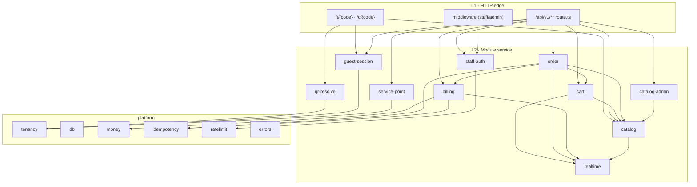
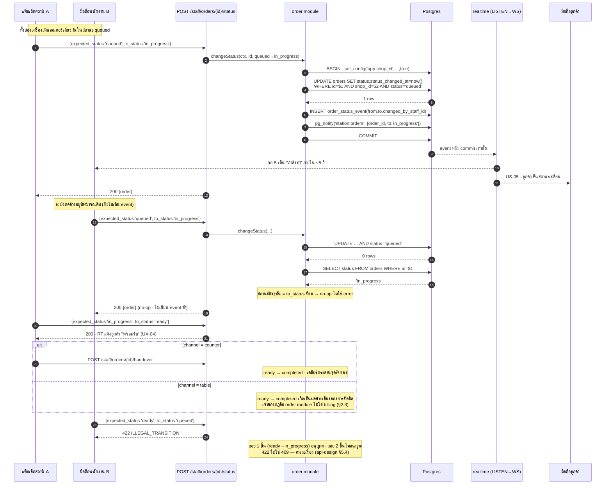
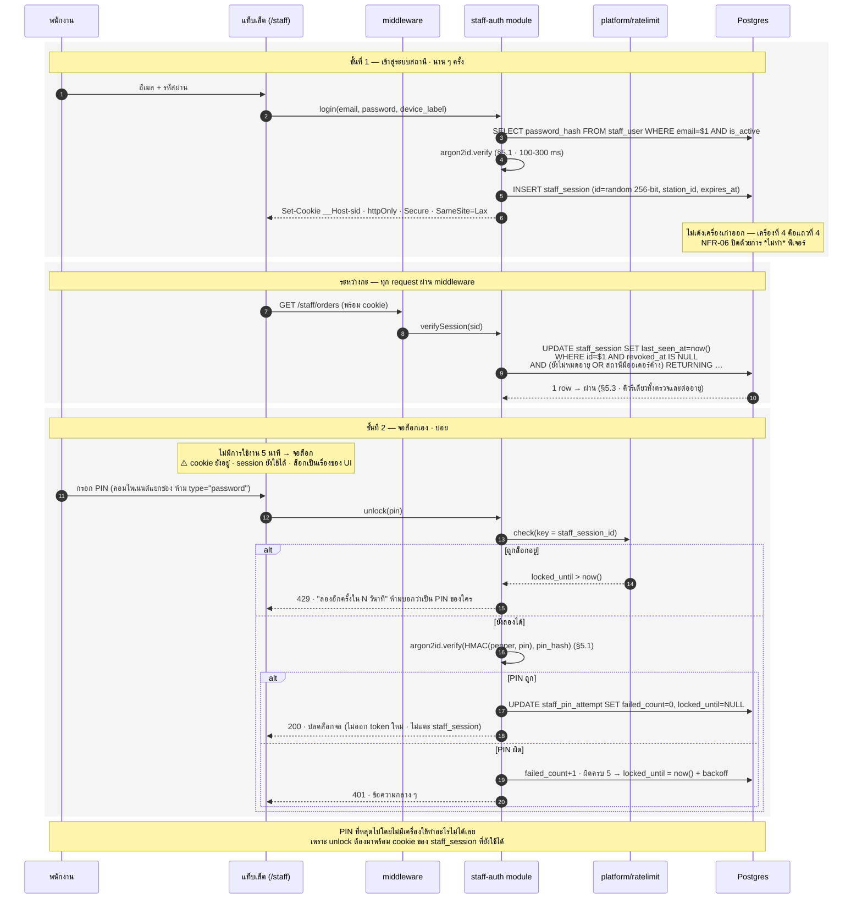
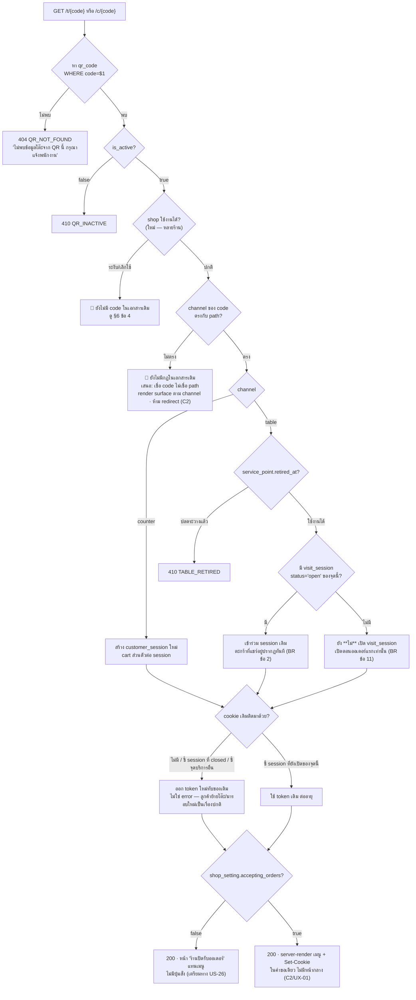
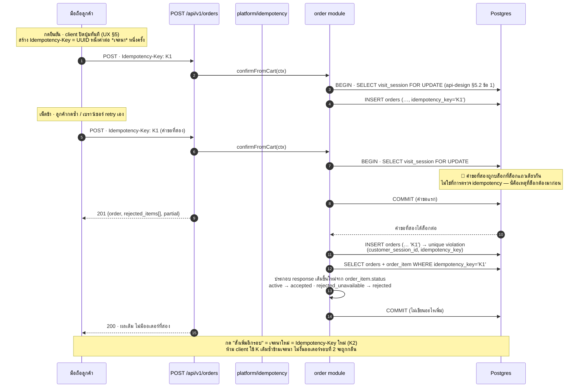

# Detailed Design v1 — ระบบสั่งอาหารด้วย QR Code (Phase 0)

> **สถานะ: DRAFT (ร่างการออกแบบระดับ module/component — รอ Touch/JARVIS อนุมัติก่อนเริ่ม build)**
> ต้นทาง: [[architecture-v1|Architecture v1]] (โดยเฉพาะ §2.1 ชั้น "Route Handlers /api/v1", §9 stack VPS+Cloudflare, §10 กลไก auth 2 ชั้น, §11 หลายร้าน) · [[data-model-v1|Data Model v1]] (§3 ตาราง, §4 state machine, §5 invariant, §9 `shop_id`, §10 VAT) · [[api-design-v1|API Design v1]] (§1 conventions, §5 race condition, §7 error contract)
> จัดทำโดย: COULSON (Web PM & Architect) — วันที่ 2026-08-23
> เอกสารพี่น้อง: [[high-level-architecture-conceptual-v1|High-Level Architecture (Conceptual) v1]] (VISION) · แผนภาพของเอกสารนี้อยู่ที่ [[../01-prototypes/diagrams/index|Diagrams]]

กลับไปที่ [[index|02-technical]]

---

## 0. ขอบเขตของเอกสารนี้ — และสิ่งที่ตั้งใจไม่พูดซ้ำ

เอกสารสามฉบับก่อนหน้าตอบคำถามระดับระบบไว้แล้ว เอกสารนี้ตอบคำถามที่เหลืออยู่ข้อเดียว: **"เมื่อลงมือเขียนโค้ดจริง โค้ดถูกแบ่งเป็นก้อนอะไร แต่ละก้อนรับผิดชอบอะไร และกลไกที่เอกสารเดิมพูดไว้ระดับหลักการต้อง implement ด้วยพารามิเตอร์อะไรจริง ๆ"**

| คำถาม | ตอบอยู่ที่ | เอกสารนี้ทำอะไรกับมัน |
|---|---|---|
| ใช้เทคโนโลยีอะไร ทำไม | [[architecture-v1\|Architecture v1]] §3, §9 | **ไม่พูดซ้ำ** — รับมาเป็นข้อกำหนดตั้งต้น |
| มีตารางอะไร field อะไร invariant อะไร | [[data-model-v1\|Data Model v1]] | **ไม่พูดซ้ำ** — อ้างชื่อตาราง/คอลัมน์เท่าที่จำเป็นต่อการอธิบายโค้ด |
| มี endpoint อะไร input/output อะไร | [[api-design-v1\|API Design v1]] §2-4 | **ไม่พูดซ้ำ** — เอกสารนี้อธิบายว่า *ภายใน* endpoint เรียกอะไรต่อ |
| race condition 6 จุดแก้ด้วยอะไร | [[api-design-v1\|API Design v1]] §5 | **ไม่พูดซ้ำ** — แต่ระบุว่า SQL เหล่านั้นอยู่ใน module ไหน และใครเป็นเจ้าของ transaction |
| ชั้น "Route Handlers /api/v1" ในกล่องเดียวของ §2.1 ข้างในเป็นอะไร | **ยังไม่มีที่ไหน** | §1-§3 ของเอกสารนี้ |
| flow ที่ยังไม่เคยมีภาพ (order lifecycle เต็ม, PIN unlock, QR resolve edge case, idempotency ซ้ำ) | **ยังไม่มีที่ไหน** | §4 |
| argon2id ตั้งพารามิเตอร์เท่าไร · rate limit เก็บที่ไหน · sliding expiry เขียนคิวรีอย่างไร | **มีแค่หลักการ** ใน architecture §10 | §5 |

**ไม่อยู่ในเอกสารนี้:** wireframe/หน้าจอ (อยู่ที่ [[../01-prototypes/index|01-prototypes]]) · test case (อยู่ที่ [[../../03-testing/01-test-plan/index|01-test-plan]] เป็นของ OKOYE) · แผน deploy/runbook · โค้ดจริง

---

## 1. หลักการแบ่งชั้นภายใน (Layering)

[[architecture-v1|Architecture v1]] §2.1 ประกาศหลักการไว้ว่า *"ทุกการเขียนผ่าน Route Handler เท่านั้น"* — ประโยคนี้บอกว่าอะไร**ไม่ควร**อยู่ที่ client แต่ไม่ได้บอกว่าข้างใน Route Handler ควรแบ่งอะไร ถ้าไม่แบ่ง ตรรกะธุรกิจทั้งหมดจะไปกองอยู่ในไฟล์ `route.ts` แล้วกฎเดียวกันจะถูกเขียนซ้ำคนละแบบในสอง endpoint ซึ่งเป็นวิธีที่ invariant 10 ข้อของ [[data-model-v1|Data Model v1]] §5 จะถูกละเมิดโดยไม่มีใครรู้ตัว

### 1.1 สี่ชั้น และกฎการเรียกข้ามชั้น

| ชั้น | ที่อยู่ | รับผิดชอบ | **ห้าม** |
|---|---|---|---|
| **L1 · HTTP edge** | `app/api/v1/**/route.ts` · `app/(guest)/t/[code]/page.tsx` | แปลง HTTP ↔ ค่าในภาษาของโดเมน · ตรวจตัวตน · เลือก module ที่จะเรียก · ห่อ error เป็นซองมาตรฐาน | **ห้ามมีตรรกะธุรกิจ · ห้ามเปิด transaction · ห้ามเขียน SQL** |
| **L2 · Module service** | `src/modules/<ชื่อ>/` | กฎธุรกิจทั้งหมด · **เป็นเจ้าของขอบเขต transaction** · เรียก repository · สั่ง publish event | **ห้ามรู้จัก `Request`/`Response`/cookie · ห้ามรู้ว่าเรียกมาจาก endpoint ไหน** |
| **L3 · Repository** | `src/modules/<ชื่อ>/repo.ts` | SQL ทั้งหมด · รับ `tx` เข้ามาเสมอ ไม่เปิดเอง | **ห้ามตัดสินใจเชิงธุรกิจ · ห้ามเรียก module อื่น** |
| **L4 · Postgres** | `db/migrations/*.sql` | constraint · trigger · view · index (INV-1..INV-10) | — |

**กฎที่บังคับด้วยโครงสร้างโฟลเดอร์ ไม่ใช่ด้วยวินัย:**

1. **L1 เรียกได้เฉพาะ L2** — ไม่มี import ของ `repo.ts` ใน `route.ts` เลยแม้แต่ที่เดียว ถ้ามีคือของที่ต้องถูกปฏิเสธตอน review เพราะการอ่านตรงจาก repo คือทางที่ tenancy guard (§5.7) ถูกข้ามได้เงียบ ๆ
2. **transaction เกิดที่ L2 เท่านั้น และหนึ่ง request = หนึ่ง transaction** — ไม่มีเคสที่ module A เปิด tx แล้วเรียก module B ที่เปิด tx ของตัวเอง (จะได้ 2 tx ที่ commit ไม่พร้อมกัน = INV-9 พัง) ถ้า A ต้องใช้งานของ B ให้ B เปิด method ที่ **รับ `tx` เข้าไป** ไม่ใช่ method ที่เปิด tx เอง
3. **module ห้ามเรียกกันเป็นวง** — ทิศทางที่อนุญาตอยู่ใน §2.3
4. **การ publish event เกิดในทรานแซกชันเดียวกับการเขียน** ด้วย `pg_notify` (§5.5) — เหตุผลอยู่ใน architecture §9.4 ข้อ 1: event ต้องออกจากฐานข้อมูล ไม่ใช่จาก pub/sub ที่แยกจาก DB แล้วมีวันลืม publish

### 1.2 ทำไมไม่ใช้ Server Action สำหรับการเขียน

Next.js App Router ให้ Server Action เขียนข้อมูลได้โดยไม่ต้องมี route handler — **เลือกไม่ใช้สำหรับทุกการเขียนที่เป็นตรรกะธุรกิจ** เพราะ [[api-design-v1|API Design v1]] §1 กำหนด contract ที่มี `Idempotency-Key` เป็น header, มี `409` ที่ client ต้องอ่าน body ไปแสดงยอดใหม่, และมี error envelope ที่ระบุ `next_action` — สามอย่างนี้เป็น contract ของ HTTP ที่จอสถานี/มือถือ/เครื่องมือทดสอบของ OKOYE ต้องเรียกได้เหมือนกันหมด ถ้าอยู่ใน Server Action มันจะเป็น RPC ที่เรียกได้จากหน้าเว็บของเราเท่านั้น ทดสอบด้วย `curl` ไม่ได้ และเวลาที่ MCP มาเกาะทีหลัง (architecture §12) จะไม่มีอะไรให้เกาะ

Server Action ใช้ได้กับ **การนำทางและ revalidate cache ของหน้าแอดมิน** เท่านั้น (เช่นกด "บันทึก" แล้ว `revalidateTag('menu')`) ซึ่งไม่ใช่ตรรกะธุรกิจ

---

## 2. Module ภายในชั้น Route Handler

### 2.1 รายการ module และความรับผิดชอบ

| Module | ที่อยู่ | รับผิดชอบ (สิ่งที่ *มันเท่านั้น* ทำได้) | endpoint/หน้าที่ใช้มัน |
|---|---|---|---|
| **`qr-resolve`** | `modules/qr-resolve` | แปลง `{code}` → `(shop, service_point?, channel)` · ตัดสิน 4+2 เคส error ของการ resolve (§4.3) · **ไม่สร้าง session** | `GET /t/{code}` · `GET /c/{code}` |
| **`guest-session`** | `modules/guest-session` | สร้าง/เข้าร่วม `customer_session` · เปิด/หา `visit_session` (INV-1) · ออกและตรวจ guest token · sliding expiry ของลูกค้า | ทุก endpoint ของ guest |
| **`staff-auth`** | `modules/staff-auth` | ล็อกอินสถานี · `staff_session` · PIN unlock · rate limit ของ PIN · sliding expiry 16 ชม. (§5.1-5.3) | `POST /staff/login` · `POST /staff/unlock` · middleware ของ `/staff`, `/admin` |
| **`catalog`** | `modules/catalog` | อ่านเมนู (read model + cache tag) · toggle `is_available` ของสินค้า/option value · กฎซ่อน option group ที่ `hide_when_empty` | `GET /menu` · `POST /staff/products/{id}/availability` · `POST /staff/option-values/{id}/availability` |
| **`cart`** | `modules/cart` | upsert แบบ commutative · optimistic version ตอนตั้งจำนวน · ลบแบบ idempotent · คิดยอด preview | `/cart`, `/cart/items*` |
| **`order`** | `modules/order` | **ยืนยันออเดอร์** (ตรวจ availability ใหม่ · reject รายรายการ · snapshot) · state machine ของออเดอร์ (§4.1) · ยกเลิก + เหตุผลบังคับ · เขียน `order_status_event` | `POST /orders` · `POST /staff/counter-orders` · `/staff/orders/*` |
| **`billing`** | `modules/billing` | คิดยอดบิล + VAT (§5.6) · ปิดบิล (ล็อก `visit_session`) · บันทึก `payment` · gate ของ BR ข้อ 12 | `/staff/bills/*` · `GET /bill/summary` |
| **`service-point`** | `modules/service-point` | จุดบริการ + โซน · **สร้าง QR ในทรานแซกชันเดียวกับสร้างจุดบริการ** · ปลดระวาง · เรนเดอร์ PNG/SVG ของ QR | `/admin/tables*` · `/admin/zones*` · `/staff/tables` |
| **`catalog-admin`** | `modules/catalog-admin` | CRUD เมนู/หมวด/option group/option value · ผูก option group กับสินค้า · **soft delete เท่านั้น** · สั่ง revalidate cache tag ของ `catalog` | `/admin/categories*` · `/admin/products*` · `/admin/option-*` |
| **`realtime`** | `modules/realtime` | ผู้เดียวที่เรียก `pg_notify` · เจ้าของชื่อช่อง 4 ช่อง · ฝั่ง `LISTEN` + fan-out ไป WebSocket · ตรวจสิทธิ์ตอน subscribe | ถูกเรียกจาก `cart`, `order`, `billing`, `catalog` |

**Module ระดับ platform** — ไม่มีความรู้เรื่องกาแฟเลย ทุก module ข้างบนใช้ร่วมกัน:

| Module | รับผิดชอบ | ทำไมต้องเป็นก้อนแยก |
|---|---|---|
| **`platform/tenancy`** | resolve `shop_id` ของ request · ตั้ง GUC ให้ RLS · บังคับว่า repository ทุกตัวรับ `shop_id` (§5.7) | [[data-model-v1\|Data Model v1]] §9.2 บอกว่าคิวรีที่ลืม `shop_id` หนึ่งบรรทัดคือการรั่วข้ามร้าน — สิ่งที่กันได้จริงคือทำให้ "ลืม" เป็นสิ่งที่ compile ไม่ผ่าน ไม่ใช่สิ่งที่ต้องจำ |
| **`platform/db`** | pool · `withTransaction(fn)` · retry เมื่อ serialization failure · **`withListener()` ที่เป็น connection แยกจาก pool** (§5.5) | ถ้า `LISTEN` ใช้ connection จาก pool มันจะถูกคืนเข้า pool แล้ว subscription หลุดเงียบ |
| **`platform/money`** | สตางค์จำนวนเต็ม · VAT include/exclude · **ปัดเศษที่จุดเดียว** (§5.6) | [[data-model-v1\|Data Model v1]] §10.3 บอกว่าห้ามปัดรายรายการ — บังคับได้จริงเมื่อมีฟังก์ชันเดียวที่ปัด |
| **`platform/idempotency`** | ตีความ header `Idempotency-Key` · ตรวจซ้ำ · คืนผลเดิม (§5.4) | ใช้กับ 3 endpoint ที่ contract บังคับ ต้องมีพฤติกรรมเดียวกันทั้งสาม |
| **`platform/ratelimit`** | นับและล็อกตาม key (guest session · staff session · PIN) | architecture §10.3 กับ api-design §8 ข้อ 4 กำหนดเกณฑ์ไว้แล้วแต่ไม่มีที่เก็บ (§5.2) |
| **`platform/errors`** | `AppError` ที่ถือ `code`/`message_th`/`next_action`/HTTP status · แปลงเป็นซองของ api-design §1.2 ที่ L1 | ทำให้ **L2 โยน error ได้โดยไม่ต้องรู้จัก HTTP** ตามกฎ §1.1 |

### 2.2 สิ่งที่ตั้งใจ **ไม่** ทำเป็น module

| ไม่ทำ | เหตุผล |
|---|---|
| `payment` เป็น module แยกจาก `billing` | [[api-design-v1\|API Design v1]] §5.5 บอกว่าการบันทึกเงินกับการเลื่อนออเดอร์เป็น `queued` ต้องอยู่ทรานแซกชันเดียว ถ้าแยก module จะเกิดแรงดึงให้แยก tx ซึ่งเป็นเหตุที่ INV-3 พัง — **ขอบเขต module ควรตรงกับขอบเขต transaction** |
| `notification` / `queue` / event bus | Phase 0 ไม่มีงาน async เลย ทุกอย่างจบในคำขอเดียว การมี queue คือของชิ้นที่ต้องดูแลเพิ่มโดยไม่มีงานให้ทำ |
| `reporting` | รายงานคือ Phase 1 (US-17/US-25) — ตอนนี้ `order_status_event` กับ `payment` เก็บข้อมูลดิบไว้พอแล้ว |
| module ต่อ surface (`guest/`, `staff/`, `admin/`) | จะได้ตรรกะเดียวกันสามชุด · US-30 บังคับว่าจอพนักงานใช้ตะกร้าตัวเดียวกับลูกค้า (architecture §2.1 ข้อ 3) ดังนั้น **surface เป็นเรื่องของ L1 ไม่ใช่ของ L2** |

### 2.3 ทิศทาง dependency ที่อนุญาต



**เส้นที่ไม่มีในภาพคือกฎ:**

- **`realtime` ไม่ชี้กลับไปหาใครเลย** — มันรับ payload ที่ประกอบเสร็จแล้วไป publish ถ้ามันต้องอ่านข้อมูลเพิ่มเองก่อนส่ง จะเกิดวงและเกิดโอกาสที่ event ถูกส่งนอกทรานแซกชัน
- **`billing` ไม่เรียก `order`** ทั้งที่ `order` เรียก `billing` — เพราะเจ้าของกฎ "ปิดบิลแล้วออเดอร์ที่ค้าง auto-complete" (architecture §8 ข้อ 5) คือใครสักคนต้องเป็นคนเดียว **ตัดสินให้เป็น `order`** โดย `billing.close()` รับ callback หรือคืนรายการออเดอร์ที่ต้องปิดออกมาให้ `order` จัดการภายใน tx เดียวกัน
- **`cart` ไม่เรียก `order`** — ตะกร้าไม่รู้จักออเดอร์ ทิศทางเป็น order → cart เท่านั้น (ยืนยันออเดอร์คืออ่านตะกร้าแล้วเคลียร์)
- **`catalog-admin` ไม่แตะตาราง `product` ตรง** — เขียนผ่าน `catalog` เพื่อให้การ revalidate cache tag เกิดขึ้นที่จุดเดียวเสมอ ไม่มีทางที่แอดมินแก้เมนูแล้วหน้าลูกค้าไม่อัปเดต (US-23 AC)

---

## 3. โครงร่างที่ route handler ทุกตัวใช้เหมือนกัน

L1 ทุกไฟล์มีรูปร่างเดียวกัน 7 ขั้น ถ้าไฟล์ไหนไม่มีขั้นใดขั้นหนึ่ง แปลว่าเป็นบั๊กเชิงความปลอดภัย ไม่ใช่ทางเลือกของผู้เขียน

```ts
// app/api/v1/orders/route.ts — ตัวอย่างที่มีทุกขั้น
export async function POST(req: Request) {
  return handler(req, {
    // 1. ตัวตนที่ยอมรับ — ไม่ระบุ = ปฏิเสธ ไม่ใช่ = เปิดให้ทุกคน (fail-closed)
    actor: 'guest',
    // 2. idempotency — ระบุแล้ว platform/idempotency จะบังคับ header เอง
    idempotent: true,
    // 3. rate limit key + เกณฑ์
    rateLimit: { key: 'guest-order', perMinute: 5 },
    // 4. schema ของ body (Zod ตัวเดียวกับที่ฝั่ง client ใช้ — architecture §3.5)
    body: ConfirmOrderInput,
    // 5. งานจริง: หนึ่งคำสั่ง เรียก module เดียว
    run: (ctx, body) => orderModule.confirmFromCart(ctx, body),
  });
}
```

**`handler()` ทำอะไรให้ตามลำดับ** (อยู่ที่ `src/http/handler.ts` — เป็นส่วนของ L1)

| # | ขั้น | รายละเอียด | ถ้าไม่ผ่าน |
|---|---|---|---|
| 1 | **ตรวจตัวตน** | guest → ตรวจ guest token · staff/admin → `staff-auth.verifySession()` (§5.3) | `401` · guest ที่ token ตายให้ **redirect ไปสแกนใหม่** ไม่ใช่หน้า error เปล่า |
| 2 | **resolve tenancy** | ได้ `shop_id` จาก token/session **ไม่ใช่จาก body หรือ query** | `403` |
| 3 | **เปิด transaction + ตั้ง GUC** | `withTransaction` แล้ว `set_config('app.shop_id', $1, true)` — **`true` = transaction-local เท่านั้น** (§5.7) | — |
| 4 | **ตรวจสิทธิ์** | เทียบ `actor` ที่ประกาศกับ role จริง · guest ที่พยายามแตะของ session อื่น = `403 FORBIDDEN_FOR_GUEST` | `403` |
| 5 | **rate limit** | `platform/ratelimit` ในทรานแซกชันเดียวกัน | `429` + ข้อความสุภาพ ไม่ล็อกถาวร (api-design §8 ข้อ 4) |
| 6 | **validate body** | Zod parse — เป็นชั้นที่กันเคส client bypass | `422` พร้อม field ที่ผิด |
| 7 | **เรียก L2 แล้วห่อผลลัพธ์** | `AppError` → ซองของ api-design §1.2 · error ที่ไม่รู้จัก → `500` ที่ **ไม่หลุดรายละเอียดภายในออกไป** แต่ log ครบฝั่งเซิร์ฟเวอร์ | — |

**สองอย่างที่ `handler()` บังคับเพิ่มเฉพาะ `/staff` และ `/admin`** ตาม architecture §10.6 (ข):

```
Cache-Control: private, no-store
Vary: Cookie
```

ไม่ใช่ทางเลือก — Cloudflare คั่นหน้าอยู่ ถ้า cache หน้าที่ล็อกอินแล้วไปเสิร์ฟให้อีกเครื่องคือการรั่วข้ามผู้ใช้เต็มรูปแบบ

---

## 4. Sequence Diagram ระดับละเอียด — flow ที่ยังไม่เคยมีภาพ

ที่มีภาพแล้วมีสองเรื่องเท่านั้น (ดู [[../01-prototypes/diagrams/index|Diagrams]]): `j1-flow-v1`..`j4-flow-v1` ระดับ journey, `qr-entry-v1` ระดับการเข้า session, และ `race-close-bill-v1` ระดับ race condition · สี่ flow ข้างล่างนี้ยังไม่มีที่ไหน

### 4.1 วงจรชีวิตออเดอร์เต็ม `queued → in_progress → ready → completed`

[[data-model-v1|Data Model v1]] §4.1 ให้ state machine ไว้แล้ว แต่ state machine ไม่บอกว่า *ใครกด อะไรถูกเขียน อะไรถูกส่งออก และเมื่อสองเครื่องกดพร้อมกันแล้วอะไรเกิดขึ้น* — สามอย่างนี้คือที่ที่โค้ดจริงพลาด



**สามจุดที่โค้ดจริงพลาดง่ายและภาพนี้บังคับไว้:**

1. **`order_status_event` ต้องเขียนใน tx เดียวกับ `UPDATE`** — ถ้าเขียนแยก จะมีออเดอร์ที่สถานะเปลี่ยนแต่ไม่มีร่องรอยว่าใครเปลี่ยน ทำให้ US-20 ตรวจสอบย้อนหลังไม่ได้ และ aging ของ US-41 (Phase 1) ได้ข้อมูลไม่ครบ
2. **กรณี 0 row ต้องแยกสองแบบก่อนตอบ** — สถานะปัจจุบันเท่ากับที่ขอ = `200` no-op (สองคนกด "เสร็จแล้ว" พร้อมกันในสภาพหน้าร้านจริงไม่ควรเห็น error) · ไปไกลกว่า/ผิด transition = `409` หรือ `422` · การรวมสองเคสนี้เป็นอันเดียวคือการทำให้พนักงานเห็น error ที่ไม่ควรเห็น
3. **`pg_notify` อยู่ก่อน `COMMIT` แต่ event ออกหลัง commit** — เป็นคุณสมบัติของ `pg_notify` เอง ไม่ใช่สิ่งที่ต้องเขียนโค้ดจัดการ นี่คือเหตุผลที่ architecture §9.4 ข้อ 1 เลือกกลไกนี้แทน pub/sub ที่แยกจาก DB

### 4.2 ปลดล็อกด้วย PIN สองชั้น (architecture §10.2 + §10.3)

หัวข้อ 10 ตัดสินกลไกไว้แล้วแต่ไม่มีภาพว่าสองชั้นเกี่ยวกันอย่างไร ซึ่งเป็นจุดที่เข้าใจผิดง่ายที่สุด — **PIN ไม่ใช่ credential ในตัวเอง**



**สิ่งที่ภาพนี้บังคับให้ชัด:** การปลดล็อกด้วย PIN **ไม่ออก token ใหม่และไม่แตะ `staff_session`** เลย มันเปลี่ยนแค่สถานะของหน้าจอ ถ้า implement ผิดโดยให้ PIN ออก session ใหม่ PIN จะกลายเป็น credential ที่ใช้ยืนยันตัวตนตามลำพัง ซึ่งขัดกับ architecture §10.3 ตรง ๆ และเปลี่ยนความลับที่มีพื้นที่แค่ 10⁶ ให้กลายเป็นกุญแจของทั้งระบบ

### 4.3 QR resolve และเคสขอบทุกเคส

api-design §2.1 ให้ตาราง error 4 แถว · เอกสารนี้เพิ่มเคสที่โผล่มาหลังการตัดสินหลายร้าน (architecture §11.7) และเคสที่เกิดจาก cookie ค้างของรอบก่อน



**"QR หมดอายุ" ไม่มีอยู่ในระบบนี้ และเป็นการตัดสินใจ ไม่ใช่การลืม** — [[data-model-v1|Data Model v1]] §3.2 ระบุว่า `qr_code` **ไม่มี `expires_at` และไม่มี endpoint regenerate** โดยเจตนา ตาม BR ข้อ 10 (QR static ตลอดอายุร้าน) เพราะ QR คือสติกเกอร์ที่พิมพ์ติดโต๊ะแล้วแก้ไม่ได้ (C8) สิ่งที่ทำหน้าที่แทนคือ `is_active` (แอดมินปิดใบนั้น) และ `service_point.retired_at` (ปลดระวางจุดบริการ) ซึ่งทั้งคู่เป็นการตัดสินใจของคน ไม่ใช่การหมดอายุตามเวลา

**สิ่งที่หมดอายุตามเวลาคือ *session ของลูกค้า* ไม่ใช่ QR** — 60 นาทีสำหรับโต๊ะ (UX-05), 30 นาทีสำหรับเคาน์เตอร์ (architecture §8 ข้อ 4), และตายทันทีเมื่อบิลถูกปิด (BR ข้อ 7) การสแกน QR ใบเดิมใหม่หลัง session ตายต้องได้ session ใหม่แบบไม่มีสะดุด **ไม่ใช่หน้า error** ซึ่งเป็นสาขา `N → O` ในภาพ

### 4.4 `Idempotency-Key` ตอนยืนยันออเดอร์ซ้ำ

api-design §1 บังคับ header นี้กับ 3 endpoint และ §7 บอกว่า double-submit ต้องคืนผลเดิม — แต่ไม่ได้บอกว่า "ผลเดิม" ถูกเก็บที่ไหน และเกิดอะไรขึ้นเมื่อคำขอที่สองมาถึง **ตอนที่คำขอแรกยังไม่ commit** ซึ่งเป็นเคสจริงของปุ่มที่ถูกกดรัวบนเน็ตช้า



**สี่ข้อตัดสินที่เอกสารเดิมไม่ได้ระบุ และเอกสารนี้ปิดให้:**

| ประเด็น | ตัดสิน | เหตุผล |
|---|---|---|
| เก็บ "ผลเดิม" ที่ไหน | **ไม่มีตารางเก็บ response** — ประกอบขึ้นใหม่จาก `orders` + `order_item.status` | ทุก field ที่ response ต้องใช้ถูกเก็บอยู่แล้ว (`sequence_no`, `status`, `placed_at`, `product_name_snapshot`, `order_item.status`) การเก็บ JSON ซ้ำอีกที่คือสองแหล่งความจริงที่จะไม่ตรงกันวันหนึ่ง |
| status code ของการเล่นซ้ำ | **`200` ไม่ใช่ `201`** | `201` แปลว่าเพิ่งสร้าง — การเล่นซ้ำไม่ได้สร้างอะไร · body เหมือนกันทุก field เพื่อให้ client ไม่ต้องเขียนโค้ดสองทาง |
| คำขอที่สองมาถึงระหว่างที่แรกยังไม่ commit | **บล็อกที่ `FOR UPDATE` ตามธรรมชาติ** ไม่ต้องมี in-flight state | ล็อก `visit_session` มาก่อนการตรวจ idempotency อยู่แล้วตาม api-design §5.2 → ลำดับนี้ให้ผลลัพธ์ถูกต้องฟรี |
| ส่ง key เดิมแต่ตะกร้าเปลี่ยนไปแล้ว | **คืนผลเดิม ไม่สนใจตะกร้าปัจจุบัน** | contract ของ idempotency คือ "key เดียว = ผลเดียว" ถ้าเทียบ body แล้วโยน `422` จะทำให้ลูกค้าที่กด retry หลังเน็ตหลุดเห็น error ทั้งที่ออเดอร์เข้าไปแล้ว ซึ่งเป็นสถานการณ์ที่ UX §5 สั่งให้จบด้วยความมั่นใจ ไม่ใช่ความสงสัย |

🔴 **แต่กลไกนี้ใช้ไม่ได้จริงกับอีกสอง endpoint ที่ contract บังคับ** — รายละเอียดที่ §6 ข้อ 1 และ ข้อ 2 เป็นช่องว่างของ schema ไม่ใช่ของเอกสารนี้

---

## 5. ระดับ implementation ของกลไกที่เอกสารเดิมพูดไว้แค่หลักการ

### 5.1 พารามิเตอร์ argon2id

architecture §10.2/§10.3 บอกว่าใช้ argon2id และตั้งเป้า "ราว 100–300 มิลลิวินาทีฝั่งเซิร์ฟเวอร์" · ตัวเลขจริงต้องแยกสองกรณี เพราะรหัสผ่านกับ PIN มีคุณสมบัติต่างกันคนละโลก

| | รหัสผ่านสถานี (ชั้น 1) | PIN 4–6 หลัก (ชั้น 2) |
|---|---|---|
| ความถี่ | วันละไม่กี่ครั้ง | ทุก 5 นาทีต่อเครื่อง |
| พื้นที่ค้นหา | ยาวเท่าที่ผู้ใช้ตั้ง | **10⁴–10⁶ เท่านั้น** |
| ค่าที่ตั้ง | `m=19456 KiB (19 MiB) · t=2 · p=1` | `m=19456 KiB · t=1 · p=1` |
| กันอะไรได้จริง | brute-force offline ถ้าฐานรั่ว | **กันไม่ได้เลย** — 10⁶ ครั้งบน GPU คือเวลาไม่กี่นาทีไม่ว่าจะตั้ง cost เท่าไร |

🔴 **ข้อสรุปที่ต้องพูดตรง ๆ: การเพิ่ม cost ของ argon2id ไม่ช่วยอะไรกับ PIN** ถ้าฐานข้อมูลรั่ว PIN ทุกตัวถูกกู้ได้แน่นอน สิ่งที่ช่วยจริงมีสองอย่าง

1. **HMAC ด้วย pepper ก่อนเข้า argon2id** — `argon2id(HMAC-SHA256(pepper, pin))` โดย `pepper` เก็บใน environment variable ของ process **ไม่เก็บในฐานข้อมูล** → ฐานรั่วอย่างเดียวไม่พอ ต้องได้ secret ของแอปด้วย · เป็นการเปลี่ยนความลับที่มีพื้นที่ 10⁶ ให้กลายเป็นความลับที่มีพื้นที่ของ pepper
2. **rate limit ฝั่งเซิร์ฟเวอร์ + การผูกกับ cookie ของ `staff_session`** (architecture §10.3) — PIN ที่ไม่มีเครื่องใช้ทำอะไรไม่ได้ ทำให้การเดา online ต้องเริ่มจากการมีแท็บเล็ตของร้านในมือก่อน

**เรื่อง memory คูณ concurrency ที่ต้องคิดก่อนตั้งค่า:** 19 MiB × การปลดล็อกพร้อมกัน 8 เครื่อง = ~152 MiB ของ RAM ที่พุ่งขึ้นพร้อมกันบน VPS เครื่องเดียวที่รัน Postgres อยู่ด้วย (R15) · **ค่าที่เลือกจึงเป็นค่าต่ำสุดที่ OWASP ยอมรับ ไม่ใช่ค่าที่สูงที่สุดที่เครื่องรับได้** และต้องวัดจริงบน VPS ก่อนเปิดร้าน ไม่ใช่วัดบนเครื่อง dev

- ใช้ binding แบบ native (`@node-rs/argon2` หรือเทียบเท่า) — **ห้ามใช้ implementation แบบ pure-JS** เพราะจะบล็อก event loop ของ process เดียวที่เสิร์ฟทั้งร้าน
- salt ต่อแถว 16 ไบต์จากตัวสร้างเลขสุ่มเชิงรหัสลับ · เก็บ hash ในรูปแบบ PHC string ที่มีพารามิเตอร์ติดไปด้วย → เปลี่ยนค่า cost ทีหลังแล้ว rehash ตอนล็อกอินสำเร็จได้โดยไม่ต้องบังคับตั้งรหัสใหม่ทุกคน

### 5.2 Rate limit ของ PIN — และที่เก็บที่ยังไม่มีใครกำหนด

architecture §10.3 กำหนดพฤติกรรมไว้ว่า *"ผิด 5 ครั้งล็อก 60 วินาที แล้วเพิ่มขึ้นเรื่อย ๆ"* · api-design §8 ข้อ 4 กำหนดเกณฑ์ของ guest ไว้ · **แต่ไม่มีเอกสารไหนบอกว่าตัวนับอยู่ที่ไหน** ซึ่งเป็นรายละเอียดที่ตัดสินว่ากลไกทำงานจริงหรือไม่

| ที่เก็บ | ปัญหาในบริบทนี้ |
|---|---|
| ในหน่วยความจำของ process | Node process restart ตอน deploy → ตัวนับศูนย์ทั้งหมด · ถ้าวันหนึ่งรันสองอินสแตนซ์ ผู้โจมตีได้โอกาสคูณสอง |
| Redis | ถูกต้องและเร็ว แต่คือ **ของชิ้นที่สามที่ต้องดูแลบน VPS** ขัดกับเจตนาของ architecture §9 ที่เพิ่งลดจำนวนชิ้นลง |
| **Postgres (เลือกอันนี้)** | เขียนเพิ่มไม่กี่แถวต่อวัน · อยู่ในทรานแซกชันเดียวกับการตรวจอยู่แล้ว · rollback ได้ถูกต้องเมื่อ tx ล้ม · ไม่มีของใหม่ให้ดูแล |

**ตารางที่ต้องเพิ่ม** (ยังไม่มีใน [[data-model-v1|Data Method v1]] §3 — ดู §6 ข้อ 3)

```sql
CREATE TABLE staff_pin_attempt (
  staff_session_id uuid PRIMARY KEY REFERENCES staff_session(id) ON DELETE CASCADE,
  shop_id          uuid NOT NULL,
  failed_count     int  NOT NULL DEFAULT 0,
  locked_until     timestamptz NULL,
  last_failed_at   timestamptz NULL
);
```

**คีย์เป็น `staff_session_id` ไม่ใช่ IP และไม่ใช่ `staff_user_id`** — สามเหตุผล: (ก) แท็บเล็ตทั้งร้านออกเน็ตด้วย IP เดียว ล็อกตาม IP = ล็อกทั้งร้านจากเครื่องเดียวที่กรอกผิด (ข) ล็อกตาม `staff_user_id` ก็เท่ากัน เพราะ Phase 0 ใช้บัญชีเดียวต่อสถานี (R7) (ค) PIN ปลดล็อกได้เฉพาะเครื่องที่ถือ session อยู่แล้ว ขอบเขตที่ตรงกับความเสี่ยงจริงคือ *เครื่อง* ซึ่งก็คือแถวใน `staff_session`

**backoff:** `locked_until = now() + 60s × 2^(failed_count − 5)` เพดาน **15 นาที** · สำเร็จแล้ว `failed_count = 0` · เพดานมีเพื่อไม่ให้พนักงานที่กรอกผิดตอนมือเปียก (UX-09) ถูกล็อกออกจากงานของตัวเองยาว — **การล็อกที่ยาวเกินไปในร้านที่มีพนักงานคนเดียว (persona P4) คือการทำ DoS ให้ตัวเอง**

ข้อความตอบกลับใช้ข้อความกลาง ๆ ชุดเดียวทั้งกรณี PIN ผิดและกรณีถูกล็อก **และห้ามบอกว่าเป็น PIN ของใคร** ตาม architecture §10.3

### 5.3 คิวรี sliding session expiry — คิวรีเดียวที่ทั้งตรวจและต่ออายุ

architecture §10.2 ให้กฎไว้สองครึ่ง: หมดอายุที่ `last_seen_at + 16 ชั่วโมง` (NFR-10 ครึ่งแรก) และ **ห้ามหมดอายุถ้าสถานีนั้นยังมีออเดอร์ค้าง** (ครึ่งหลัง) พร้อมสั่งไว้ว่า *"เขียนเป็นเงื่อนไขในคิวรีตรวจ session ไม่ใช่ cron แยก"*

```sql
-- staff-auth.verifySession() — เรียกทุก request ของ /staff และ /admin
UPDATE staff_session s
   SET last_seen_at = now()
 WHERE s.id = $1
   AND s.revoked_at IS NULL
   AND (
         s.last_seen_at > now() - ($2 || ' hours')::interval   -- 16 ชม. staff · 8 ชม. admin
      OR EXISTS (                                              -- NFR-10 ครึ่งหลัง
           SELECT 1 FROM orders o
            WHERE o.shop_id   = s.shop_id
              AND o.station_id = s.station_id
              AND o.status IN ('awaiting_payment','queued','in_progress','ready')
         )
       )
   AND s.last_seen_at < now() - interval '60 seconds'           -- throttle การเขียน
RETURNING s.id, s.staff_user_id, s.station_id, s.shop_id, s.last_seen_at;
```

**เหตุผลของแต่ละบรรทัด:**

- **`UPDATE … RETURNING` ไม่ใช่ `SELECT` แล้ว `UPDATE`** — สอง statement เปิดช่องให้ session ที่หมดอายุพอดีระหว่างสองคำสั่งถูกต่ออายุ และเพิ่ม round-trip ทุกคำขอ
- **`AND s.last_seen_at < now() - interval '60 seconds'`** — ถ้าไม่มีบรรทัดนี้ ทุกคำขอของจอสถานีที่เปิดค้างทั้งวันจะ `UPDATE` แถวเดิม ~20,000 ครั้งต่อวัน สร้าง dead tuple ให้ autovacuum ตามเก็บโดยไม่ได้อะไร (เป็นเหตุผลชุดเดียวกับที่ architecture §3.3 ปัด polling ทิ้ง) · **ผลข้างเคียงที่ต้องจัดการ:** 0 row มีสองความหมาย — session ไม่ถูกต้อง **หรือ** ถูกต้องแต่เพิ่งต่ออายุไปไม่ถึง 60 วินาที จึงต้องมี fallback หนึ่งครั้ง

```sql
-- ทำเฉพาะเมื่อ UPDATE คืน 0 row
SELECT s.id, s.staff_user_id, s.station_id, s.shop_id
  FROM staff_session s
 WHERE s.id = $1 AND s.revoked_at IS NULL
   AND ( s.last_seen_at > now() - ($2 || ' hours')::interval
      OR EXISTS ( … เงื่อนไขออเดอร์ค้างชุดเดิม … ) );
```

- 0 row ทั้งสองคิวรี = **หมดอายุจริงหรือถูกเพิกถอน** → `401` และล้าง cookie · จอสถานีต้องกลับไปหน้าล็อกอินพร้อมข้อความที่บอกว่าให้ล็อกอินใหม่ ไม่ใช่หน้าเปล่า
- **ไม่มี cron ล้าง session** ใน Phase 0 — แถวที่หมดอายุไม่เป็นอันตรายเพราะ predicate ปฏิเสธมันอยู่แล้ว การมี job ไปลบแถวเพิ่มความเสี่ยงว่า job เขียนผิดแล้วลบ session ที่ยังใช้งานอยู่กลางกะ · ถ้าจะเก็บกวาดให้ทำที่ระดับ retention ทั้งชุดพร้อมกันตาม §7 ของ data-model
- **`revoked_at` คือทางเพิกถอนทันทีตอนแท็บเล็ตหาย** (architecture §10.5) — ต้องมีปุ่มในหน้าแอดมินที่ `UPDATE staff_session SET revoked_at = now()` ต่อแถว ซึ่ง 10.2 นับ `device_label` ไว้แล้วเพื่อให้เจ้าของร้านชี้ถูกเครื่อง

**index ที่จำเป็น:** `staff_session (id)` เป็น PK อยู่แล้ว · แต่ `EXISTS` ต้องอาศัย index `orders (shop_id, station_id, status)` ซึ่ง [[data-model-v1|Data Model v1]] §3.4 มี partial index `(status, placed_at)` ที่ **นำหน้าด้วย `status` ไม่ใช่ `shop_id`** — คิวรีนี้จะใช้มันไม่ได้เต็มที่ ดู §6 ข้อ 6

### 5.4 กลไก idempotency ที่ platform layer

```
1. อ่าน header · ไม่มี → 400 IDEMPOTENCY_KEY_REQUIRED (ไม่ใช่ปล่อยผ่าน — fail-closed)
2. ตรวจรูปแบบเป็น UUID · ยาวเกิน 128 ตัวอักษร ปฏิเสธ (กันการใช้ header เป็นที่เก็บข้อมูล)
3. ส่งต่อให้ module ใช้เป็นคอลัมน์ที่มี unique index — ไม่มีตารางกลาง
4. จับ unique violation (SQLSTATE 23505) → อ่านผลเดิม → ประกอบ response → 200
5. error อื่นทุกชนิด → ปล่อยขึ้นไป ห้ามกลืน
```

**ทำไมไม่มีตาราง `idempotency_record` กลาง:** ตารางกลางต้องเก็บ response body เป็น JSON ซึ่งกลายเป็นแหล่งความจริงที่สองของออเดอร์เดียวกัน วันที่ schema ของ response เปลี่ยน (เพิ่ม field ตอน Phase 1) ผลที่เล่นซ้ำจะเป็นของเวอร์ชันเก่า · การประกอบใหม่จากตารางจริงให้ผลที่ตรงกับความจริงเสมอ **แลกกับข้อจำกัดว่าใช้ได้เฉพาะกับการเขียนที่ทิ้งร่องรอยไว้ในตารางที่มี unique index รองรับ** ซึ่งเป็นเงื่อนไขที่สอง endpoint ยังไม่ผ่าน (§6 ข้อ 1, ข้อ 2)

**TTL:** ไม่มี — `orders.idempotency_key` อยู่กับออเดอร์ตลอดอายุของออเดอร์ ซึ่งเก็บไม่มีกำหนดตาม §7 ของ data-model · เป็นข้อดีที่ตามมาฟรีจากการไม่มีตารางกลาง

### 5.5 `LISTEN/NOTIFY` → WebSocket — รายละเอียดที่ตัดสินว่าใช้ได้จริงหรือไม่

architecture §9.2 เลือกกลไกไว้ · api-design §6 ให้ชื่อช่อง 4 ช่อง · ที่เหลือคือรายละเอียดที่ทำให้มันพังถ้าไม่รู้

| ประเด็น | ข้อเท็จจริง | ผลต่อการ implement |
|---|---|---|
| **เพดาน payload ของ `pg_notify`** | 8000 ไบต์ ถ้าเกินจะ **error ตอน commit** ไม่ใช่ตอน notify | **ส่ง id กับสถานะเท่านั้น ห้ามส่งเนื้อออเดอร์** — client ได้ event แล้วค่อย `GET` ของจริง · เป็นข้อดีซ้อน: สิทธิ์การเห็นข้อมูลถูกตรวจตอน `GET` ที่ผ่าน handler ครบ 7 ขั้น ไม่ใช่ตอน broadcast |
| **connection ของ `LISTEN`** | ต้องเป็น connection ที่อยู่ค้าง ไม่ถูกคืนเข้า pool | `platform/db.withListener()` เปิด client แยกหนึ่งตัวต่อ process · ห้ามใช้ pool |
| **event หายตอน reconnect** | ระหว่างที่ connection ขาด NOTIFY ที่เกิดขึ้นหายไปถาวร ไม่มี buffer | ตอน resubscribe สำเร็จ **ต้องบังคับให้ client refetch ทั้งหน้า** ไม่ใช่รอ event ถัดไป — ถ้าไม่ทำ จอสถานีจะนิ่งอยู่กับข้อมูลเก่าโดยที่ตัวบ่งชี้สถานะบอกว่า "เชื่อมต่อแล้ว" ซึ่งแย่กว่าบอกว่าหลุด |
| **`pg_notify` เป็น transactional** | ส่งออกเมื่อ commit สำเร็จเท่านั้น · rollback แล้วไม่มี event | คุณสมบัตินี้คือทั้งหมดที่ architecture §9.4 ข้อ 1 ต้องการ — **ห้ามย้าย `pg_notify` ออกไปอยู่นอก tx เพื่อ "ให้เร็วขึ้น"** |
| **ผู้ subscribe เห็นอะไรได้** | ไม่มี RLS บนช่อง notify — ทุก process ที่ `LISTEN` เห็นทุก event | **การกรองต้องอยู่ที่ชั้น fan-out ใน Node** · ทุก event ต้องมี `shop_id` ในตัวและ **ต้องกรองด้วย `shop_id` ก่อนกรองด้วยอย่างอื่น** ไม่งั้นคือการรั่วข้ามร้านชนิดที่ทดสอบด้วยร้านเดียวไม่มีวันเจอ ([[data-model-v1\|Data Model v1]] §9.7) |

**รูปร่าง payload ที่กำหนดเป็น contract**

```jsonc
{ "v": 1, "shop_id": "…", "scope": "station", "scope_id": "…",
  "kind": "order.status", "ids": ["…"], "at": "2026-08-23T10:15:00+07:00" }
```

`v` มีไว้เพื่อให้เพิ่ม field ทีหลังได้โดย listener เวอร์ชันเก่าไม่พัง · `ids` เป็น array เพื่อรวม event ของทรานแซกชันเดียวที่แตะหลายแถว (ปิดบิลแล้วออเดอร์ 4 ใบ auto-complete = **หนึ่ง** notify ไม่ใช่สี่)

**ช่องทาง fallback** — architecture §3.3 และ api-design §6 บังคับไว้แล้วว่าไม่ได้ event เกิน 10 วินาทีให้สลับไป polling ทุก 5 วินาที **พร้อมป้ายที่ผู้ใช้เห็น** · สิ่งที่เอกสารนี้เพิ่มคือ: heartbeat ต้องเป็น event ที่เซิร์ฟเวอร์ส่งทุก 5 วินาทีจริง ๆ ไม่ใช่การเช็คว่า WebSocket ยัง `OPEN` อยู่ — เพราะ captive portal ของร้านกาแฟทำให้ socket ค้างในสถานะ `OPEN` โดยไม่มีข้อมูลไหลผ่านได้ ซึ่งเป็นอาการที่ §3.3 กังวลถึงพอดี

### 5.6 เงินและ VAT — จุดปัดเศษเดียวในระบบ

[[data-model-v1|Data Model v1]] §10.3 สั่งว่าปัดเศษที่ระดับบิลครั้งเดียว · วิธีทำให้เป็นจริงคือ **ไม่มีที่อื่นในโค้ดที่ทำเลขคณิตกับเงินได้เลย** นอกจาก `platform/money`

```
totalsFor(items, vatSnapshot) → { subtotal_satang, vat_amount_satang, total_satang }
```

- รับ **snapshot ของ VAT ที่อยู่บนบิล** ไม่ใช่ค่าปัจจุบันของร้าน (`bill.vat_*_snapshot`) — เพราะร้านจด VAT กลางเดือนแล้วบิลเมื่อวานต้องไม่ขยับ (§10.2)
- คืนค่าเป็นสตางค์จำนวนเต็มทั้งสามตัว **ไม่มี float โผล่ออกจากฟังก์ชันนี้เลย**
- `round()` ใช้แบบครึ่งขึ้น (half-up) ตามธรรมเนียมภาษีไทย **ไม่ใช่ `Math.round` ของ JS ตรง ๆ** ซึ่งปัดค่าลบผิดทาง (สำคัญเมื่อ US-22 refund มาถึงใน Phase 1)
- **`expected_total_satang` ที่ api-design §5.3 บังคับส่งตอนปิดบิล = `total_satang` หลัง VAT** ตามที่ §10.4 ระบุ — ทั้งฝั่งที่คำนวณให้จอแคชเชียร์เห็นและฝั่งที่เทียบตอนปิดบิลต้องเรียกฟังก์ชันเดียวกันตัวนี้ ถ้าเรียกคนละที่แล้วคิดคนละแบบ การตรวจยอดชนกันจะเทียบคนละฐานและจะ 409 ทั้งที่ไม่มีอะไรเปลี่ยน

### 5.7 Tenancy guard — ทำให้ "ลืม `shop_id`" เป็นสิ่งที่ compile ไม่ผ่าน

[[data-model-v1|Data Model v1]] §9.2 และ architecture §11.5 เตือนเรื่องเดียวกัน: คิวรีที่ลืมเงื่อนไข `shop_id` หนึ่งบรรทัดคือการรั่วข้ามร้านที่ **ทดสอบด้วยร้านเดียวจะผ่านเสมอ** · สามชั้นที่ต้องมีพร้อมกัน เพราะชั้นเดียวไม่พอ

**ชั้น 1 — type ที่พาไม่ได้ถ้าไม่มี**

repository ทุกฟังก์ชันรับพารามิเตอร์แรกเป็น `ctx: RequestCtx` ที่ **มี `shop_id` เป็น field ที่ห้ามเป็น optional** และ `RequestCtx` ถูกสร้างได้ที่เดียวคือ `platform/tenancy` จากตัวตนของผู้เรียก ไม่มี constructor สาธารณะให้ประกอบเอง → ไม่มีทางเรียก repo โดยไม่มี `shop_id` ในมือ

**ชั้น 2 — GUC + RLS ที่ยังทำงานแม้คิวรีเขียนผิด**

```sql
-- ทำใน withTransaction ทุกครั้ง ก่อนคำสั่งแรกของงาน
SELECT set_config('app.shop_id', $1, true);   -- 🔴 true = transaction-local
```

```sql
CREATE POLICY shop_isolation ON orders USING (shop_id = current_setting('app.shop_id')::uuid);
```

🔴 **สองกับดักที่ทำให้ชั้นนี้กลายเป็นศูนย์โดยไม่มีใครรู้:**

1. **`set_config(..., false)` บน connection pool คือการรั่วข้ามร้าน** — ค่าจะติดอยู่กับ connection แล้วคำขอถัดไปของ *อีกร้าน* ที่ได้ connection เดิมจะสืบทอดค่าของร้านก่อนหน้า **ล้มเหลวแบบเปิด (fail-open)** ซึ่งเป็นชนิดที่แย่ที่สุด · ใช้ `true` เท่านั้น ผลที่ตามมาคือ **ทุกคำขอต้องอยู่ในทรานแซกชัน แม้เป็นการอ่านล้วน** ถ้าอ่านนอก tx แล้วไม่มี GUC RLS จะปฏิเสธทุกแถว = ล้มเหลวแบบปิด ซึ่งยอมรับได้และสังเกตเห็นได้ทันที
2. **เจ้าของตาราง (owner) ข้าม RLS โดยปริยาย** — ถ้าแอปต่อฐานด้วย role เดียวกับที่รัน migration นโยบายทุกข้อจะไม่มีผลเลย · ต้องมี **role แยกสำหรับแอปที่ไม่ใช่ owner และไม่มี `BYPASSRLS`** หรือประกาศ `ALTER TABLE … FORCE ROW LEVEL SECURITY` ทุกตาราง · **ทดสอบข้อนี้ด้วยเคสจริง** ไม่ใช่ตรวจว่าเขียน policy ไว้แล้ว เพราะทั้งสองกรณีที่ผิดหน้าตาเหมือนสำเร็จทั้งหมด

**ชั้น 3 — FK ประกอบ** ตามที่ §9.2 ของ data-model กำหนดไว้แล้ว (`FOREIGN KEY (shop_id, order_id) REFERENCES orders (shop_id, id)`) กันการเอาแถวของร้าน ก. ไปแปะกับแถวของร้าน ข. แม้ทั้ง RLS และ type จะถูกข้าม

---

## 6. ข้อสังเกตที่พบตอนแตกระดับ module — ต้องแก้ที่เอกสารต้นทาง ไม่แก้ที่นี่

ทั้งหมดนี้คือความไม่ตรงกันหรือช่องว่างที่โผล่ขึ้นมาเพราะการเขียน detailed design บังคับให้เรียกโค้ดจริง · **เอกสารนี้ไม่แก้ [[architecture-v1|Architecture v1]], [[data-model-v1|Data Model v1]] หรือ [[api-design-v1|API Design v1]] เพราะเป็นของ COULSON instance อื่นที่เขียนไว้แล้ว** ตามธรรมเนียมความเป็นเจ้าของเอกสารของ vault นี้ — บันทึกไว้ที่นี่เพื่อให้เจ้าของไปแก้

| # | สิ่งที่พบ | อยู่ที่ | ทำไมสำคัญ | เสนอ |
|---|---|---|---|---|
| **1** 🔴 | **`Idempotency-Key` ของ `POST /bills/{id}/payment` บังคับใช้ไม่ได้จริง** — api-design §1 บังคับ header นี้ แต่ `payment` ใน data-model §3.4 **ไม่มีคอลัมน์ `idempotency_key` และไม่มี unique index** | api-design §1 vs data-model §3.4 | เป็นหน้าที่ที่ contract รับปากไว้แต่ schema ทำให้เกิดขึ้นไม่ได้ → กดปุ่มรับเงินรัวตอนยุ่งจะได้ `payment` สองแถว = ยอดเงินในบัญชีเพี้ยน ซึ่งเป็นความเสียหายเป็นเงินจริง | เพิ่ม `payment.idempotency_key text NULL` + `CREATE UNIQUE INDEX ON payment (bill_id, idempotency_key) WHERE idempotency_key IS NOT NULL` |
| **2** 🔴 | **`POST /staff/counter-orders` (US-30) ไม่มีการกัน double-submit ทั้งที่ contract บอกว่ามี** — unique index ของ data-model §3.4 คือ `(customer_session_id, idempotency_key)` แต่ออเดอร์ `origin='staff_entered'` มี `customer_session_id` เป็น **NULL** และ Postgres ถือว่า NULL แต่ละตัวไม่ซ้ำกัน → index ไม่กันอะไรเลย | data-model §3.4 index | แคชเชียร์กดสร้างออเดอร์รัว ๆ ในคิว walk-in คือสถานการณ์ที่ api-design §3 อธิบายไว้เองว่าเป็นการใช้งานปกติ · **บั๊กนี้จะไม่ดังตอนทดสอบด้วยการคลิกทีละครั้ง** | เพิ่ม partial unique index `(created_by_staff_id, idempotency_key) WHERE origin='staff_entered'` หรือใช้คอลัมน์ actor รวมที่ไม่มี NULL |
| **3** | **ตาราง `staff_session` (และตัวนับ rate limit) ไม่มีอยู่ใน data-model** — architecture §10.2 บรรยาย field ของ `staff_session` ไว้ครบ แต่ data-model ยังนับ 21 entity และไม่มีตารางนี้ · `shop` ที่เพิ่มใน §9.1 ก็ยังไม่ถูกนับรวมในตัวเลข | data-model §3, §9.1 vs architecture §10.2 | schema คือแหล่งความจริงที่ BANNER จะเอาไปเขียน migration — ตารางที่มีแต่ในเอกสารสถาปัตยกรรมจะถูกลืม หรือถูกเขียนคนละแบบกับที่ออกแบบไว้ | เพิ่ม `shop`, `staff_session`, `staff_pin_attempt` เข้า §3 ให้ครบ และปรับตัวเลข entity |
| **4** | **ไม่มี error code สำหรับ QR ของร้านที่ถูกระงับ** — ตาราง 4 แถวใน api-design §2.1 เขียนไว้ตอนที่ระบบยังมีร้านเดียว หลัง architecture §11.7 ตัดสินว่าเปิดให้หลายร้าน เคส "ร้านเลิกใช้บริการแต่ QR ยังติดโต๊ะอยู่" กลายเป็นเคสที่เกิดได้จริง | api-design §2.1 | ถ้าไม่กำหนด โค้ดจะได้ 500 หรือ 404 ที่ข้อความไม่ตรงความจริง ทั้งที่ลูกค้าปลายทางเป็นคนที่ไม่ผิดอะไร | เพิ่มแถว `410 SHOP_INACTIVE` + `message_th` ที่บอกให้แจ้งพนักงาน |
| **5** | **ไม่มีกฎว่าจะทำอย่างไรเมื่อ path prefix ไม่ตรงกับ `qr_code.channel`** (`/t/{code}` แต่ code เป็น counter) | api-design §2.1 | เกิดจากการพิมพ์ URL เอง/QR พิมพ์ผิดชุด · ถ้าไม่กำหนด แต่ละคนจะเขียนคนละแบบ | เชื่อ `code` ไม่เชื่อ path → render surface ตาม `channel` **ไม่ redirect** (C2 ห้ามหน้ากลาง) + log เป็น anomaly |
| **6** | **index ที่มีไม่รองรับคิวรีตรวจ session ของ NFR-10 ครึ่งหลัง** — partial index ของ `orders` นำหน้าด้วย `status` แต่คิวรีใน §5.3 กรองด้วย `(shop_id, station_id, status)` | data-model §3.4 | คิวรีนี้รันทุกคำขอของทุกเครื่องทั้งวัน เป็นคิวรีที่ร้อนที่สุดในระบบ | เพิ่ม `orders (shop_id, station_id, status)` partial index สำหรับสถานะที่ยังไม่จบ |
| **7** | **`staff_user.id` ยังผูกกับ `auth.users.id` ของ Supabase** และ `password_hash`/`pin_hash` ไม่มีที่อยู่ | data-model §3.2 vs architecture §10 | architecture §10.1 ตัดสินแล้วว่าไม่ใช้บริการ auth ภายนอก — บรรทัดนี้เป็นซากของการตัดสินใจรอบก่อน ถ้าไม่แก้ BANNER จะสร้างตารางที่อ้าง schema ที่ไม่มีอยู่ | `staff_user` มี PK ของตัวเอง + `email`, `password_hash`, `pin_hash`, `pin_updated_at` |
| **8** | **INV-9 ขัดกับ §10.3 หลังเพิ่ม VAT** — INV-9 บอก `bill.total_satang` = Σ `order_item.line_total_satang` ที่ active แต่ §10.3 บอกว่า `total` รวม VAT แล้ว | data-model §5 vs §10.3 | เป็น invariant ที่ job ตรวจความสอดคล้องรายวันจะใช้ — ถ้าสูตรผิด job จะแจ้งเตือนผิดทุกวันแล้วสุดท้ายไม่มีใครดู | แยกเป็น `bill.subtotal_satang` = Σ line_total และ `total_satang` = subtotal ± VAT ตาม mode แล้วเขียน INV-9 ใหม่เป็นสองข้อ |
| **9** | **`expires_at` ใน `staff_session` เป็นแหล่งความจริงที่สองซ้อนกับ sliding expiry** — architecture §10.2 ระบุทั้ง `expires_at` และกฎ `last_seen_at + 16 ชม.` | architecture §10.2 | สองแหล่งจะไม่ตรงกันวันหนึ่ง และ session จะหมดอายุด้วยเหตุที่อธิบายไม่ได้กลางกะ | ให้ `expires_at` เป็น **เพดานสูงสุดแบบสัมบูรณ์** (เช่น 7 วันนับจากล็อกอิน) ที่ไม่ถูกเลื่อนเลย และ sliding expiry ใช้ `last_seen_at` เท่านั้น — หรือตัด `expires_at` ทิ้ง |
| **10** | **ชื่อเล่นสำหรับเรียกรับของ (คำตัดสิน 2026-08-16) ยังไม่มีที่อยู่ในตารางไหน** — data-model §3.3 บันทึกว่าต้องมี field ชื่อเล่นผูกกับ **ออเดอร์** และต้องล้างเป็น `NULL` ที่อายุ 90 วัน แต่ `orders` ใน §3.4 ยังไม่มีคอลัมน์นี้ | data-model §3.3 vs §3.4 | detailed design วางโค้ดของ `order` module ให้ไม่ได้ถ้าไม่รู้ว่า field อยู่ไหน · และ §3.3 เตือนเองว่า job ล้างต้องเป็น `UPDATE … SET … NULL` ห้าม `DELETE` ซึ่งเป็นกฎที่ต้องเขียนคู่กับคอลัมน์ที่มีจริง | เพิ่ม `orders.pickup_nickname text NULL` + ระบุ job ที่ล้างเฉพาะคอลัมน์ ใน §7 ของ data-model |
| **11** | **`GET /api/v1/staff/tables` อ้าง view ชื่อ `table_status_v`** แต่ data-model §4.2 สร้าง `service_point_status_v` · และ SQL ใน api-design §5.6 ใช้ `visit_session.table_id` แต่ data-model §3.3 ใช้ `service_point_id` | api-design §3, §5.6 | ซากของการเปลี่ยนชื่อใน data-model §9.4 ที่ยังตกค้าง — คนที่เขียนตามจะสร้างชื่อผิดแล้วรู้ตัวตอนรัน | ไล่แทนชื่อให้ตรงทั้งฉบับ |

**ข้อ 1 กับข้อ 2 ควรแก้ก่อนเริ่มเขียนโค้ด** เพราะทั้งคู่เป็นเรื่องเงินและเป็นเรื่องของ index ซึ่งเพิ่มทีหลังตอนมีข้อมูลจริงแล้วจะเจอแถวซ้ำที่ต้องมาทำความสะอาดย้อนหลัง · ข้อที่เหลือแก้ก่อน finalize migration ได้

---

## 7. ประเด็นที่ต้องให้ Touch/XAVIER ตัดสิน

| # | ประเด็น | ทำไมตอบเองไม่ได้ | ค่าที่ใช้ไปก่อน |
|---|---|---|---|
| 1 | **PIN ผูกกับคนหรือผูกกับสถานี** — architecture §10.7 เปิดค้างไว้และรอ Touch | กระทบว่ามีหน้าจัดการ PIN รายคนหรือไม่ ซึ่งเป็นสโคปที่ไม่อยู่ในแผนเดิม | ผูกกับสถานี ตามที่ §10.3 ออกแบบไว้ · `staff_pin_attempt` ที่คีย์ด้วย `staff_session_id` (§5.2) **ใช้ได้ทั้งสองแบบไม่ต้องแก้** |
| 2 | **เพดาน backoff ของ PIN ที่ 15 นาที** (§5.2) | เป็นการแลกกันระหว่างความปลอดภัยกับการทำให้พนักงานคนเดียวของร้านทำงานไม่ได้ ซึ่งเป็นการตัดสินใจเชิงปฏิบัติการของร้าน | 15 นาที · ถ้า Touch เห็นว่านานเกินสำหรับหน้าร้านจริง ลดได้โดยไม่กระทบอย่างอื่น |
| 3 | **ชื่อเล่นเรียกรับของอยู่คอลัมน์ไหนของ `orders`** (§6 ข้อ 10) | เป็นเรื่อง PDPA ที่ Touch ตัดสินระยะเวลาเก็บไว้แล้ว (90 วัน) แต่ตำแหน่งใน schema เป็นของเจ้าของ data-model | รอ — `order` module ยังทำงานได้ครบทุกอย่างโดยไม่มี field นี้ ไม่บล็อกการเริ่ม build |

---

## 8. แผนภาพที่คู่กับเอกสารนี้

🔴 **ยังไม่ได้วาด** — รอบที่เขียนเอกสารนี้ถูกตัด session ก่อนถึงขั้นตอนใช้ `/diagram-design:diagram-design` จริง (hit API session limit) ตารางด้านล่างคือแผนที่ตั้งใจไว้ ไม่ใช่ของที่มีอยู่แล้ว — **ห้ามอ้างอิงไฟล์ภาพเหล่านี้จนกว่าจะถูกสร้างจริงและอัปเดตแถวนี้** เมื่อวาดเสร็จให้ลงทะเบียนที่ [[../01-prototypes/diagrams/index|Diagrams]] หมวด **Detailed Design** ตามธรรมเนียมเดิม (self-contained HTML คู่ PNG @2x) แล้วลบคำเตือนนี้ออก

| ภาพ (แผน) | เนื้อหา | ต้นทาง |
|---|---|---|
| `module-map-v1` | 10 module + 6 platform module และทิศทาง dependency ที่อนุญาต | §2 |
| `order-lifecycle-v1` | วงจรชีวิตออเดอร์เต็ม รวมเคสสองเครื่องกดพร้อมกันและ 422 | §4.1 |
| `staff-pin-unlock-v1` | auth สองชั้น — เส้นแบ่งว่าอะไรออก token อะไรแค่ปลดจอ | §4.2 |
| `qr-resolve-v1` | ต้นไม้การตัดสินของการ resolve QR รวมเคสที่เอกสารเดิมยังไม่มีกฎ | §4.3 |

---

ส่งงาน — COULSON → ทัช (งาน / ผลลัพธ์ / ค้าง-เสี่ยง / skill ที่ใช้)

**งาน:** เขียน Detailed Design ของ Phase 0 — แตกชั้น "Route Handlers /api/v1" ที่ [[architecture-v1|Architecture v1]] §2.1 พูดไว้เป็นกล่องเดียวให้เป็น module จริง, วาด sequence ของ flow ที่ยังไม่เคยมีภาพ, และลงพารามิเตอร์จริงของกลไกที่เอกสารเดิมพูดไว้แค่ระดับหลักการ

**ผลลัพธ์:** `docs/02-design/02-technical/detailed-design-v1.md` — layering 4 ชั้นพร้อมกฎการเรียกข้ามชั้นที่บังคับได้จริง, **10 module โดเมน + 6 platform module** พร้อมความรับผิดชอบ ทิศทาง dependency และเหตุผลของสิ่งที่ตั้งใจ *ไม่* ทำเป็น module, โครงร่าง 7 ขั้นที่ route handler ทุกตัวใช้เหมือนกัน, **4 sequence/decision diagram ใหม่** (order lifecycle เต็มรวมเคสสองเครื่องกดชนกัน · PIN unlock 2 ชั้น · ต้นไม้การ resolve QR ครบทุกเคสขอบ · idempotency ตอนกดยืนยันซ้ำ), และ **7 กลไกที่ลงถึงระดับ implementation** (พารามิเตอร์ argon2id แยกรหัสผ่าน/PIN, ที่เก็บ rate limit, คิวรี sliding expiry ที่ตรวจและต่ออายุในคำสั่งเดียว, กลไก idempotency แบบไม่มีตารางกลาง, ข้อจำกัดจริงของ `LISTEN/NOTIFY`, จุดปัดเศษเดียวของ VAT, tenancy guard 3 ชั้น)

**ค้าง/เสี่ยง:** เจอ **11 จุดที่เอกสารต้นทางไม่ตรงกันหรือมีช่องว่าง** และไม่แก้ให้ตามธรรมเนียมความเป็นเจ้าของเอกสาร — สองข้อแรกต้องแก้ก่อนเขียนโค้ดเพราะเป็นเรื่องเงิน: (1) `Idempotency-Key` ของ `POST /bills/{id}/payment` **บังคับใช้ไม่ได้จริง** เพราะ `payment` ไม่มีคอลัมน์และ index รองรับ → กดปุ่มรับเงินรัวได้ `payment` สองแถว (2) `POST /staff/counter-orders` ของ US-30 **ไม่มีการกัน double-submit เลย** เพราะ unique index ใช้ `customer_session_id` ที่เป็น NULL สำหรับออเดอร์ที่พนักงานคีย์ ซึ่ง Postgres ถือว่าไม่ซ้ำกัน — บั๊กชนิดที่ทดสอบด้วยการคลิกทีละครั้งจะผ่านทุกครั้ง · ที่เหลือเป็นชื่อตาราง/view ที่ตกค้างจากการเปลี่ยนชื่อ, ตาราง `staff_session`/`shop` ที่ยังไม่ถูกนับใน data-model, และ INV-9 ที่ขัดกับสูตร VAT · **3 ประเด็นรอ Touch ตัดสิน** โดยไม่มีข้อไหนบล็อกการเริ่ม build

**skill ที่ใช้:** scrutinize (ไล่ตรวจว่ากลไกที่เอกสารเดิมรับปากไว้ *ทำได้จริงด้วย schema ที่มีอยู่* หรือไม่ — เป็นที่มาของข้อ 1 กับ 2 ใน §6 ที่พบว่า contract บังคับ idempotency ไว้แต่ index รองรับไม่ได้, และของการปฏิเสธ `set_config(..., false)` กับ role ที่เป็น owner ซึ่งทำให้ RLS กลายเป็นศูนย์แบบเงียบ), diagram-design (แผนภาพ 4 ภาพใน §8), management-talk (แยกสิ่งที่ COULSON ตัดสินเองได้ออกจากสิ่งที่ต้องให้เจ้าของเอกสารอื่นไปแก้ และไม่แก้เอกสารของ instance อื่นเงียบ ๆ)
