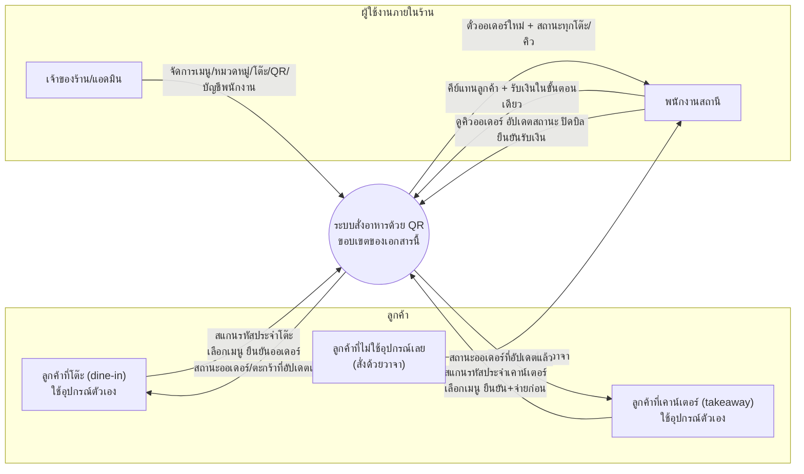
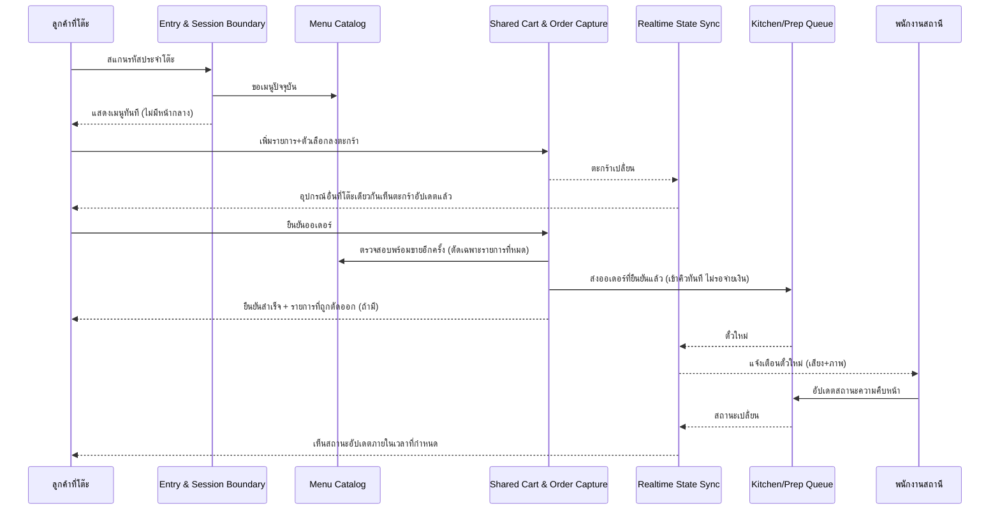
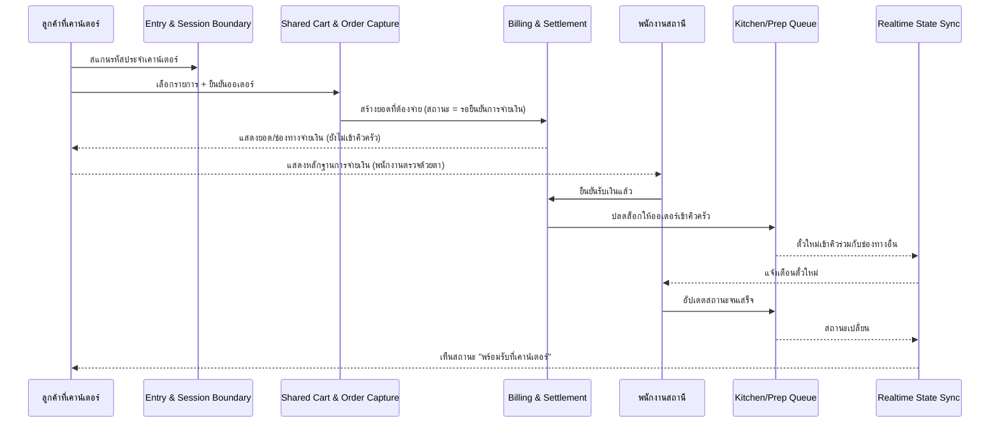
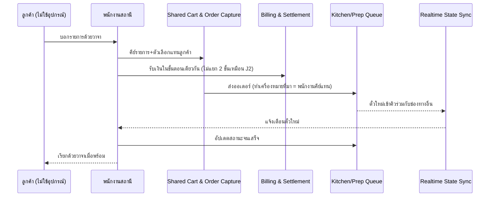
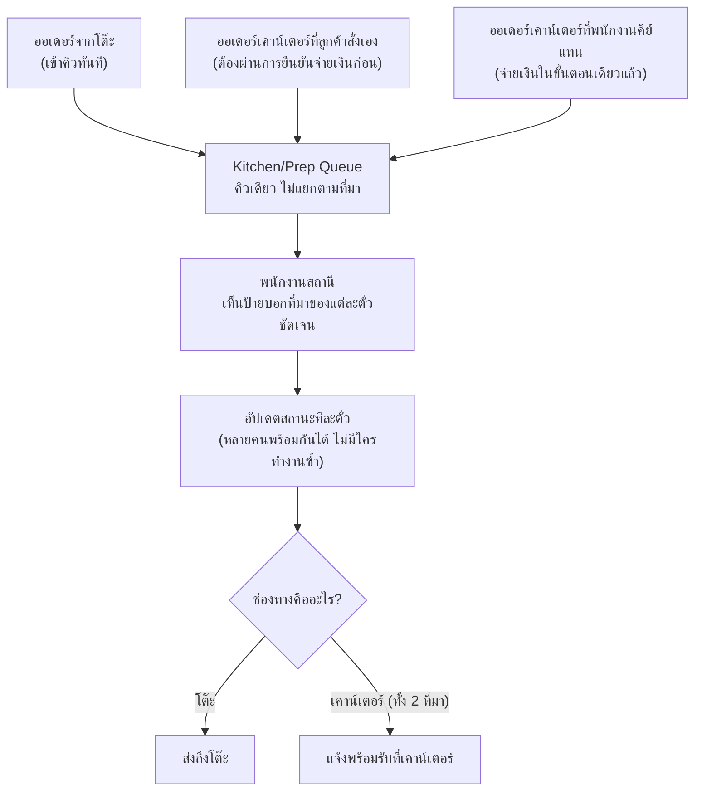
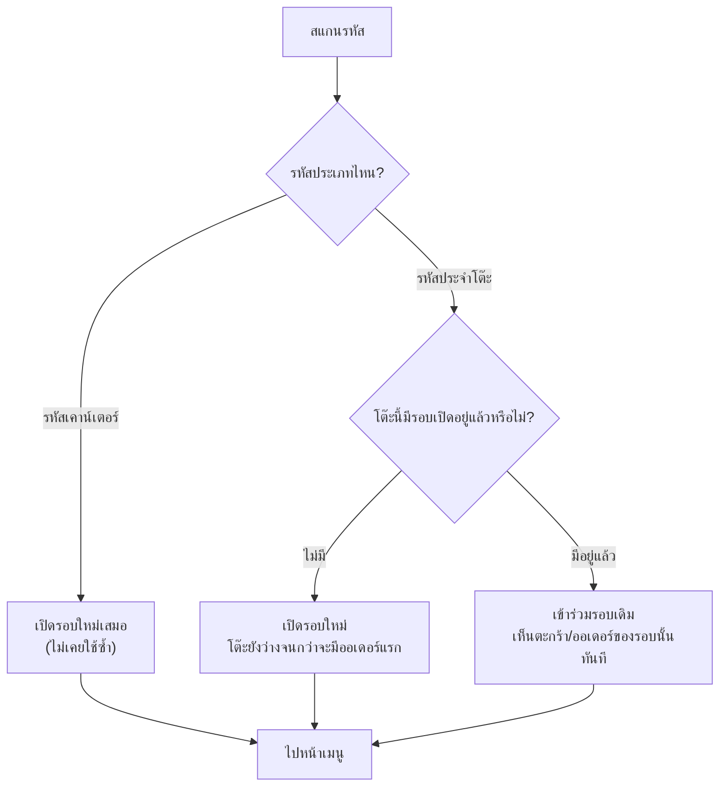
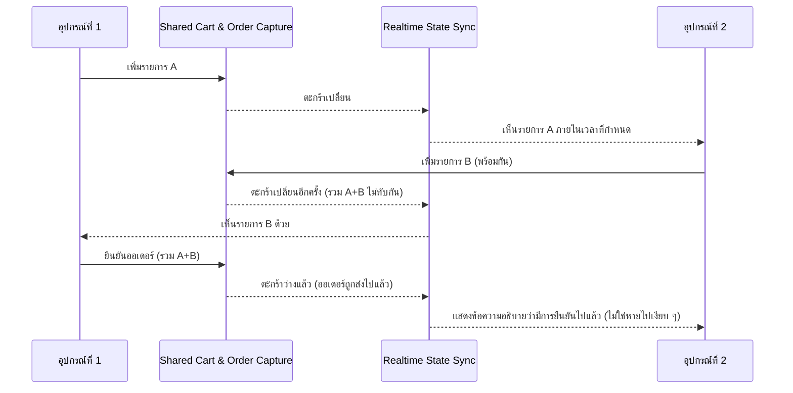

# High-Level Architecture (Conceptual) v1 — ระบบสั่งอาหารด้วย QR Code (Phase 0)

> **สถานะ: DRAFT** — เอกสาร conceptual ฉบับแรก ยังไม่ผ่านการรีวิวจาก Touch
> **นี่คือเอกสารต้นทางเชิงแนวคิด ไม่ใช่เอกสารแทนที่** [[architecture-v1|Architecture v1]] **ของ COULSON** — [[architecture-v1|Architecture v1]] ตอบว่า "จะสร้างด้วยเทคโนโลยีอะไร" เอกสารนี้ตอบว่า "ระบบประกอบด้วยอะไร ข้อมูลไหลอย่างไร" **โดยไม่ผูกกับเทคโนโลยี/vendor ใด ๆ ทั้งสิ้น** ถ้าอ่านแล้วเจอชื่อ framework/database/vendor ในเอกสารนี้ ถือว่าเป็นข้อบกพร่องที่ต้องแก้
> ทิศทางการอ้างอิง: **[[architecture-v1|Architecture v1]] ควรย้อนกลับมาตรวจสอบว่าตอบโจทย์ทุกแถวในหัวข้อ 6 ของเอกสารนี้ครบหรือไม่** ไม่ใช่ทางกลับกัน
> ต้นทาง: [[../../01-requirements/01-spec/product-backlog-v1|Product Backlog v1]] (US-01..US-45, US-50, US-52, Business Rule ข้อ 1-28), [[../../01-requirements/01-spec/feature-list-v1|Feature List v1]], [[../../01-requirements/01-spec/ux-journey-map-v1|UX Journey Map v1]] (J1-J4), [[../../01-requirements/01-spec/ux-persona-v1|UX Persona v1]], [[../../01-requirements/01-spec/ux-requirements-v1|UX Requirements v1]], [[../../01-requirements/01-spec/nfr-v1|NFR v1]], [[../../01-requirements/02-plan/release-roadmap-v1|Release Roadmap v1]]
> อ้างอิงเพื่อดึง capability เท่านั้น (ไม่ใช้คำตอบทางเทคนิค): [[architecture-v1|Architecture v1]] §1, §9-12 — เฉพาะที่ระบุไว้ตรงจุด
> จัดทำโดย: VISION (Conceptual / High-Level Architecture Analyst) — วันที่ 2026-08-23

กลับไปที่ [[index|02-technical]]

---

## 0. ขอบเขตของเอกสารนี้

เอกสารนี้ตอบคำถาม **"ระบบนี้ประกอบด้วยชิ้นส่วนอะไรบ้าง ทำหน้าที่อะไร และข้อมูลไหลระหว่างชิ้นส่วนเหล่านั้นอย่างไรเมื่อลูกค้า/พนักงาน/แอดมินใช้งานจริง"** สำหรับ **Phase 0 (MVP) เท่านั้น** ตามขอบเขตเดียวกับ [[../../01-requirements/02-plan/release-roadmap-v1|Release Roadmap v1]]

**ไม่อยู่ในเอกสารนี้ (โดยตั้งใจ):**
- การเลือกภาษา/framework/ฐานข้อมูล/ไลบรารี/ผู้ให้บริการ hosting — เป็นของ [[architecture-v1|Architecture v1]]
- Schema ระดับ column/table, ดัชนี, constraint จริง — เป็นของ [[data-model-v1|Data Model v1]]
- รายการ endpoint, authorization ระดับ implementation, error contract — เป็นของ [[api-design-v1|API Design v1]]
- Wireframe/design system/สี/typography — เป็นของ [[../01-prototypes/index|01-prototypes]]

**ทำไมต้องมีเอกสารนี้แยกจาก Architecture v1:** `architecture-v1.md` ตัดสินใจเรื่อง stack ไปพร้อมกับการอธิบายภาพรวมระบบในเอกสารเดียวกัน ทำให้ถ้า stack เปลี่ยน (ซึ่งเคยเกิดขึ้นจริงมาแล้วครั้งหนึ่งในหัวข้อ 9 ของเอกสารนั้น — ย้ายจาก Supabase+Vercel ไป VPS+Cloudflare) ภาพรวมเชิงแนวคิดก็ต้องเขียนใหม่ไปด้วยทั้งที่ไม่จำเป็น เอกสารนี้แยกสองเรื่องออกจากกันอย่างถาวร

---

## 1. ภาพรวมระบบ (System Context)

### 1.1 Actor ทั้งหมดและช่องทางเข้าใช้งาน

**หมายเหตุสำคัญ:** Phase 0 **ไม่มี external system ใด ๆ ที่ระบบต้องเชื่อมต่อจริง** — การจ่ายเงินด้วยพร้อมเพย์/เงินสด/บัตร (US-52, BR ข้อ 28) เป็นการที่ **พนักงานดูสลิปจากหน้าจอลูกค้าด้วยตาแล้วกดยืนยันเอง** ไม่มี webhook ไม่มีการเรียก API ของผู้ให้บริการชำระเงินใด ๆ นี่คือขอบเขตระบบที่แคบกว่าที่คนทั่วไปคาดจากระบบ "รับชำระเงิน" — เป็นการตัดสินใจของ requirement (BR ข้อ 28) ไม่ใช่ข้อจำกัดทางเทคนิค

### 1.2 สิ่งที่ข้ามขอบเขตระบบ (ต่อ actor)

| Actor | ส่งเข้าระบบ | รับจากระบบ |
|---|---|---|
| ลูกค้าที่โต๊ะ | รหัสที่สแกนได้, รายการที่เลือก+ตัวเลือก, การยืนยันออเดอร์ | เมนู, สถานะตะกร้า (รวมของที่อุปกรณ์อื่นที่โต๊ะเดียวกันเพิ่ม), สถานะออเดอร์, ยอดบิลสะสม |
| ลูกค้าที่เคาน์เตอร์ | เหมือนข้างต้น + รอผลยืนยันการจ่ายเงิน | เมนู, สถานะออเดอร์, รหัสจ่ายเงินที่มียอดระบุไว้แล้ว, สถานะการจ่ายเงิน |
| พนักงานสถานี | การยืนยันตัวตน, การอัปเดตสถานะออเดอร์, การยกเลิก+เหตุผล, การยืนยันรับเงิน, การปิดบิล, การคีย์ออเดอร์แทนลูกค้า | ตั๋วออเดอร์ใหม่แบบทันที (พร้อมเสียง/ภาพแจ้งเตือน), สถานะทุกโต๊ะ, คิวรอยืนยันการจ่ายเงิน |
| แอดมิน/เจ้าของร้าน | การแก้ไขเมนู/หมวดหมู่/ตัวเลือก, การจัดการโต๊ะ/โซน, คำสั่งสร้าง QR, การจัดการบัญชีพนักงาน | รายการปัจจุบันของทุกอย่างที่แก้ไข, ไฟล์ QR พร้อมพิมพ์ |

---

## 2. องค์ประกอบเชิงตรรกะของระบบ (Logical Components)

หลักการแปล: ทุกกลไกด้านล่างเขียนเป็น **"ต้องทำอะไรได้"** ไม่ใช่ **"ทำด้วยอะไร"**

### 2.1 Entry & Session Boundary
**หน้าที่:** แปลงรหัสที่สแกนได้ (หรือคำขอเปิดจอเคาน์เตอร์) ให้กลายเป็นบริบทการใช้งานที่ถูกต้อง — รู้ว่าเป็นโต๊ะไหนหรือช่องเคาน์เตอร์ไหน, ต้องเปิด "รอบใหม่" หรือเข้าร่วม "รอบที่เปิดอยู่แล้ว"
**ข้อมูลที่ดูแล:** ความสัมพันธ์ระหว่างรหัสถาวรกับจุดบริการทางกายภาพ, สถานะเปิด/ปิดของรอบการใช้งานปัจจุบันของแต่ละจุด
**คุยกับ:** Menu Catalog (เพื่อดึงเมนูเริ่มต้น), Shared Cart & Order Capture (เพื่อผูกอุปกรณ์เข้ากับรอบที่ถูกต้อง)
**Traced from:** US-01, US-28, BR ข้อ 7, BR ข้อ 10, BR ข้อ 11

### 2.2 Menu Catalog
**หน้าที่:** เก็บรายการสินค้า หมวดหมู่ กลุ่มตัวเลือก (ระดับหวาน/ระดับคั่ว/เมล็ดพิเศษ/นมทางเลือก) และสถานะ "มี/หมดชั่วคราว" ของแต่ละรายการและแต่ละตัวเลือกย่อย — เปลี่ยนแล้วต้องเห็นผลทันทีทุกอุปกรณ์ลูกค้าโดยไม่มีขั้นตอนใด ๆ คั่นกลาง
**ข้อมูลที่ดูแล:** สินค้า, หมวดหมู่, กลุ่มตัวเลือกและค่าตัวเลือก, สถานะพร้อมขาย
**คุยกับ:** Entry & Session Boundary (ให้ข้อมูลเมนู), Shared Cart & Order Capture (ตรวจสอบ ณ เวลาเพิ่ม/ยืนยัน), Store Administration (รับการแก้ไข), Realtime State Sync (ประกาศเมื่อสถานะเปลี่ยน)
**Traced from:** US-02, US-16, US-23, US-35, US-36, US-43, US-50, NFR-04

### 2.3 Shared Cart & Order Capture
**หน้าที่:** ดูแลตะกร้าก่อนยืนยัน (ที่โต๊ะหนึ่งใช้ร่วมกันได้จากหลายอุปกรณ์พร้อมกันจริง ไม่ใช่แค่ล็อกอินคนละที) และการแปลงตะกร้าเป็น "ออเดอร์" ที่แก้ไขไม่ได้อีกต่อไป เมื่อรายการใดหมดในนาทีสุดท้ายก่อนยืนยัน ต้องตัดเฉพาะรายการนั้นออก ไม่ล้มทั้งออเดอร์
**ข้อมูลที่ดูแล:** ตะกร้าและรายการในตะกร้าก่อนยืนยัน, ออเดอร์แต่ละรอบหลังยืนยัน (พร้อมชื่อ+ราคา+ตัวเลือกที่ "ล็อก" ไว้ ณ เวลานั้น ไม่เปลี่ยนตามเมนูที่แก้ทีหลัง)
**คุยกับ:** Menu Catalog (ตรวจสอบพร้อมขาย), Realtime State Sync (กระจายการเปลี่ยนแปลงตะกร้าให้อุปกรณ์อื่นที่โต๊ะเดียวกัน), Kitchen/Prep Queue (ส่งออเดอร์ที่ยืนยันแล้ว), Billing & Settlement (แจ้งยอดของรอบใหม่)
**Traced from:** US-03, US-04, US-06, US-08, US-09, US-28, US-30, BR ข้อ 1, BR ข้อ 2, BR ข้อ 4

### 2.4 Kitchen/Prep Queue
**หน้าที่:** เป็นคิวเดียวที่รวมออเดอร์จากทุกช่องทาง (โต๊ะ, เคาน์เตอร์ที่จ่ายแล้ว, พนักงานคีย์แทน) โดยไม่แยกคิวตามที่มา — แสดงสถานะความคืบหน้าและรับการเปลี่ยนสถานะจากพนักงานหลายคนพร้อมกันโดยไม่ให้สถานะ "ถอยหลัง" เมื่อมีการกดชนกัน
**ข้อมูลที่ดูแล:** สถานะความคืบหน้าของแต่ละออเดอร์ (รอ/กำลังทำ/พร้อม/เสร็จสมบูรณ์), ประวัติการเปลี่ยนสถานะทุกครั้ง (ใครเปลี่ยน เมื่อไหร่)
**คุยกับ:** Shared Cart & Order Capture (รับออเดอร์ใหม่), Billing & Settlement (รับสัญญาณ "ปิดบิลแล้ว" เพื่อปิดออเดอร์ที่ยังค้าง), Realtime State Sync (กระจายตั๋วใหม่/สถานะที่เปลี่ยนไปยังทุกอุปกรณ์พนักงานและลูกค้าที่เกี่ยวข้อง), Station Identity & Access (ตรวจสิทธิ์ก่อนรับการเปลี่ยนสถานะ)
**Traced from:** US-13, US-14, US-15, US-17, US-20, BR ข้อ 3, BR ข้อ 5, BR ข้อ 12, BR ข้อ 26

### 2.5 Billing & Settlement
**หน้าที่:** รวมยอดของแต่ละรอบ/แต่ละบิล และบังคับกฎการจ่ายเงินที่ต่างกันตามช่องทาง — โต๊ะจ่ายทีหลังได้ (ไม่บล็อกครัว) ส่วนเคาน์เตอร์ต้องยืนยันจ่ายเงินก่อนจึงจะเข้าคิวครัว การปิดบิลเป็น**การกระทำจุดเดียวที่ทำให้โต๊ะกลับมาว่าง**และต้องไม่ชนกับการสั่งเพิ่มที่เกิดขึ้นพร้อมกัน (ต้องปฏิเสธพร้อมแสดงยอดใหม่ ไม่ใช่ปิดด้วยยอดเก่าเงียบ ๆ)
**ข้อมูลที่ดูแล:** ยอดรวมต่อบิล, สถานะการจ่ายเงิน, บันทึกการจ่าย/คืนเงินแบบไม่ลบของเก่า (คืนเงิน = แถวใหม่ ไม่ใช่แก้แถวเดิม)
**คุยกับ:** Shared Cart & Order Capture (รับยอดรอบใหม่), Kitchen/Prep Queue (ส่งสัญญาณ "settlement trigger" เมื่อปิดบิล เพื่อให้ออเดอร์ที่ยังค้างของโต๊ะนั้นปิดพร้อมกัน — ดูหมายเหตุด้านล่าง), Entry & Session Boundary (แจ้งจบรอบเมื่อบิลปิด เพื่อให้จุดบริการนั้นกลับมาพร้อมรับรอบใหม่)
**Traced from:** US-07, US-12, US-18, US-19, US-21, US-22, US-28, US-29, US-52, BR ข้อ 3, BR ข้อ 6, BR ข้อ 12, BR ข้อ 28

> **ทำไมแยกจาก Kitchen/Prep Queue แทนที่จะรวมเป็นก้อนเดียว:** สองเรื่องนี้มีจุดที่พังต่างกันโดยสิ้นเชิง — Kitchen/Prep Queue พังแล้วแค่ทำเครื่องดื่มช้า/ผิดคิว แต่ Billing & Settlement พังแล้วคือ**เก็บเงินขาดจริง** (ความเสี่ยงเรื่องบิลชนกับออเดอร์ใหม่ที่ COULSON ประเมินไว้เป็นความเสี่ยงระดับสูงสุดรองจากเน็ตล่ม) การแยกให้เห็นเป็นกล่องคนละกล่องในภาพนี้คือการทำให้ "จุดที่เกี่ยวกับเงินจริง" มองเห็นได้ทันทีจากภาพรวม ไม่จมอยู่ในรายละเอียดของคิวครัวทั่วไป — แต่ทั้งสองยังต้องเชื่อมกันชัดเจนผ่านสัญญาณ "settlement trigger" เดียว เพราะปิดบิลของโต๊ะหนึ่งจะทำให้ออเดอร์ที่ยังไม่เสร็จของโต๊ะนั้น "เสร็จสมบูรณ์" ไปพร้อมกัน

### 2.6 Realtime State Sync *(cross-cutting)*
**หน้าที่:** ส่งการเปลี่ยนแปลงสถานะ (ตะกร้า/ออเดอร์/ความพร้อมขาย) ไปถึงทุกอุปกรณ์ที่ subscribe อยู่ภายในเวลาที่กำหนด โดยไม่ต้องให้ผู้ใช้กดรีเฟรชเอง และเมื่อกลไกนี้เองล้มเหลว ต้องมีการสลับไปโหมดสำรองอัตโนมัติ**พร้อมป้ายบอกผู้ใช้ว่าอยู่ในโหมดสำรอง** ไม่ใช่ค้างเงียบ ๆ โดยไม่มีใครรู้
**ข้อมูลที่ดูแล:** ไม่มีข้อมูลเป็นของตัวเอง — เป็นกลไกกระจายสัญญาณของ component อื่น
**คุยกับ:** ทุก component ที่มีสถานะเปลี่ยนแปลงได้ (Menu Catalog, Shared Cart & Order Capture, Kitchen/Prep Queue)
**Traced from:** UX-04, UX-06, NFR-02, NFR-03, NFR-04, NFR-07, NFR-12

### 2.7 Station Identity & Access
**หน้าที่:** ควบคุมว่าใครมีสิทธิ์เข้าถึงหน้าจอภายใน (พนักงาน/แอดมิน) — ต้องรองรับ**หลายอุปกรณ์ล็อกอินด้วยตัวตนเดียวกันพร้อมกันได้จริงโดยไม่มีเครื่องไหนถูกเด้งออก**, ต้อง**ไม่หมดอายุกลางกะที่ยังมีออเดอร์ค้างอยู่**, และต้องแยกขั้นตอน "เข้าสู่ระบบเต็มรูปแบบ" (นาน ๆ ครั้ง) ออกจาก "ปลดล็อกด่วน" (บ่อยครั้ง ต้องเร็ว ไม่ใช่การพิมพ์รหัสผ่านเต็ม)
**ข้อมูลที่ดูแล:** ตัวตนของผู้ใช้งานภายใน, การอนุญาต/เพิกถอนสิทธิ์การเข้าถึงแต่ละอุปกรณ์
**คุยกับ:** Kitchen/Prep Queue, Billing & Settlement, Store Administration (ทุกตัวต้องตรวจสิทธิ์ผ่าน component นี้ก่อน)
**Traced from:** NFR-06, NFR-10, NFR-11 — 🔴 สามข้อนี้ [[../../01-requirements/01-spec/nfr-v1|NFR v1]] เองระบุไว้ว่ายังไม่มีเอกสารออกแบบใดรองรับตอนที่เขียน NFR v1 ขึ้นมา (ภายหลัง [[architecture-v1|Architecture v1]] §10 ได้ตัดสินใจแนวทางเทคนิคไปแล้ว — แต่ capability ที่ต้องมีคือของ 3 ข้อนี้ ไม่เปลี่ยนไม่ว่าจะเลือกกลไกใด)

### 2.8 Store Administration
**หน้าที่:** ให้เจ้าของร้านที่ไม่ถนัดเทคนิคแก้ไขเมนู/หมวดหมู่/โต๊ะ-โซน/บัญชีพนักงาน และสั่งสร้างไฟล์ QR พร้อมพิมพ์ได้เองโดยไม่ต้องพึ่งใครแก้โค้ด/ไฟล์/ฐานข้อมูลให้
**ข้อมูลที่ดูแล:** สิทธิ์ในการแก้ไข Menu Catalog, รายการจุดบริการ+โซน, การผูกรหัสถาวรกับจุดบริการแต่ละจุด
**คุยกับ:** Menu Catalog (ส่งการแก้ไข), Entry & Session Boundary (สร้าง/แก้ไขจุดบริการที่จะถูกสแกน), Station Identity & Access (จัดการบัญชีพนักงาน)
**Traced from:** US-23, US-24, US-25, US-26, US-27, US-42

### 2.9 *(นอกสโคป Phase 0 — Forward-looking)* Multi-Shop Boundary
**หน้าที่ถ้าถูกเปิดใช้ในอนาคต:** ทุก component ข้างต้นต้องสามารถแบ่งข้อมูลตามร้านได้ ไม่มี component ไหนเห็นข้อมูลของร้านอื่น

> 🔴 **หมายเหตุสถานะ:** capability นี้**ไม่ได้มาจาก user story หรือ NFR ที่อนุมัติแล้ว** — มาจากคำตัดสินใจเชิงธุรกิจของ Touch ที่บันทึกไว้ใน [[architecture-v1|Architecture v1]] §11.7 (ยืนยันเส้นทางขยายไปร้านญาติ/ร้านเพื่อน) ซึ่งเป็นเอกสารของ COULSON ไม่ใช่ backlog ของ XAVIER VISION จึงใส่ไว้ที่นี่เพียงเพื่อไม่ให้ภาพรวม component หายไปเงียบ ๆ เมื่อถึงเวลาต้องออกแบบจริง แต่**ไม่ถือเป็นข้อกำหนดของ Phase 0** และเสนอให้ XAVIER/Touch พิจารณาเปิดเป็น NFR อย่างเป็นทางการหากต้องการให้มีน้ำหนักเท่า capability อื่นในเอกสารนี้ — VISION ไม่ตัดสินใจเรื่องนี้เอง

---

## 3. Data Flow ต่อ User Journey

ใช้ชื่อ persona/journey ID เดิมจาก [[../../01-requirements/01-spec/ux-journey-map-v1|UX Journey Map v1]] ทั้งหมด ไม่มีการตั้งชื่อ stage ใหม่

### 3.1 J1 — ฟ้า (dine-in), ครัวเริ่มทำได้ทันทีไม่ต้องรอจ่าย (BR ข้อ 3)

### 3.2 J2 — ต้น (เคาน์เตอร์/takeaway), ต้องจ่ายก่อนเข้าคิวครัวเสมอ (BR ข้อ 12)

### 3.3 J3 — ป้าน้อย (พนักงานคีย์แทน), ไม่มีอุปกรณ์ลูกค้าเข้าร่วมเลย

> 🔴 **หมายเหตุช่องว่างที่ตั้งใจไม่แก้ในเอกสารนี้:** สังเกตว่า **ไม่มีลูกศรจาก Realtime State Sync กลับไปหาลูกค้าเลยในเส้นทางนี้** — นี่ไม่ใช่ความผิดพลาดในการวาดภาพ แต่เป็นภาพสะท้อนของ backlog ปัจจุบันจริง ๆ: ลูกค้ากลุ่มนี้ไม่มีอุปกรณ์ให้ระบบส่งอะไรกลับไปหาได้เลย ทางออกปัจจุบันคือพนักงานเรียกด้วยวาจา [[../../01-requirements/01-spec/feature-list-v1|Feature List v1]] เคยเสนอ US-46 (แจ้งเตือนความคืบหน้าฝั่งพนักงานสำหรับลูกค้ากลุ่มนี้) ไว้แต่ **ยังไม่ได้รับอนุมัติเข้า backlog** — VISION จึงไม่วาดเส้นทางนั้นเป็นความสามารถที่มีอยู่แล้ว ปล่อยให้เป็นข้อเสนอที่ XAVIER/Touch ต้องเคาะ ไม่ใช่ default ที่เอกสารนี้ตัดสินใจแทน

### 3.4 J4 — เบียร์ (พนักงาน, ช่วง peak) — จุดที่ทุกช่องทางบรรจบกัน

### 3.5 QR-Entry Branching — สิ่งที่เกิดขึ้นทันทีหลังสแกน

> 🔴 **ประเด็นที่ [[../../01-requirements/01-spec/ux-journey-map-v1|UX Journey Map v1]] เองยังเปิดค้างไว้:** กรณี "เข้าร่วมรอบเดิม" ของโต๊ะ — ถ้าเป็นลูกค้ากลุ่มเดิมยังนั่งอยู่ ถูกต้องตามที่ตั้งใจ (BR ข้อ 2/7) แต่ถ้าเป็นลูกค้าคนละกลุ่มที่มาสแกนโต๊ะที่บิลก่อนหน้ายังไม่ปิด จะเห็นตะกร้า/ยอดของคนก่อนหน้าทันที — เอกสารนี้แสดง flow ตามที่ requirement ระบุไว้จริง ไม่ได้เสนอทางแก้ เพราะเป็นประเด็นเกี่ยวกับเงินที่ requirement ฝั่ง XAVIER/Touch ต้องเคาะ ไม่ใช่การตัดสินใจเชิงสถาปัตยกรรม

### 3.6 Concurrent Shared Cart — 2 อุปกรณ์เขียนตะกร้าเดียวกัน (BR ข้อ 2)

---

## 4. Conceptual Data Domains

ไม่มีชื่อ column/table ในหัวข้อนี้ — มีแต่ "ชนิดของข้อมูลที่มีอยู่จริงในระบบ" และกติกาการมีชีวิตของมัน

| Domain | ข้อมูลที่อยู่ในกลุ่มนี้ (แนวคิด) | กติกาการมีชีวิตที่สำคัญ |
|---|---|---|
| **Catalog** | หมวดหมู่, สินค้า, กลุ่มตัวเลือกและค่าตัวเลือก, ความสัมพันธ์ว่าสินค้าไหนใช้กลุ่มตัวเลือกไหน | แก้ไขแล้วมีผลทันทีกับลูกค้าใหม่ แต่**ไม่ย้อนแก้ไขบิลเก่า** — ราคา/ชื่อที่ลูกค้าเคยยืนยันไปแล้วถูก "แช่แข็ง" ไว้ ณ เวลานั้น |
| **Physical/Access-Point** | โซน, จุดบริการ (โต๊ะ/เคาน์เตอร์), รหัสถาวรที่ผูกกับแต่ละจุด, สถานีที่รับงาน | รหัสที่ผูกกับจุดบริการ**ถาวรตลอดอายุการใช้งาน ไม่เคยเปลี่ยน** แม้จะเปลี่ยนชื่อที่แสดงผลของจุดนั้นทีหลัง |
| **Session** | รอบการใช้งานของแต่ละจุดบริการ, การเชื่อมอุปกรณ์แต่ละเครื่องเข้ากับรอบนั้น, ตะกร้าก่อนยืนยัน | สถานะ "ว่าง/ไม่ว่าง" ของจุดบริการ**ไม่ใช่ค่าที่เก็บไว้ตรง ๆ แต่คำนวณจากการมีอยู่ของรอบที่ยังเปิดอยู่** — ไม่มีปุ่มใดในระบบเปลี่ยนสถานะนี้โดยตรง |
| **Order & Money** | ออเดอร์แต่ละรอบและรายการในนั้น, สถานะความคืบหน้า, ประวัติการเปลี่ยนสถานะ, บิลรวมยอด, บันทึกการจ่าย/คืนเงิน | รายการในออเดอร์ **snapshot ชื่อ+ราคา+ตัวเลือก ณ เวลายืนยัน**; คืนเงินคือ**บันทึกแถวใหม่ ไม่ใช่แก้แถวเดิม**; ออเดอร์/บิลที่จบแล้วเป็นสถานะปลายทาง แก้กลับไม่ได้ (ต้องสร้างใหม่หรือเพิ่มบันทึกใหม่เท่านั้น) |
| **Staff/Access** | ตัวตนพนักงาน/แอดมิน, สิทธิ์การเข้าถึงต่ออุปกรณ์ | สิทธิ์การเข้าถึงแต่ละอุปกรณ์**เพิกถอนได้ทันที**และ**อยู่ได้หลายอุปกรณ์พร้อมกันโดยไม่ทับกัน** — ไม่มี "หนึ่งตัวตนต่อหนึ่งอุปกรณ์" |

**สิ่งที่ Phase 0 ไม่มีอยู่ในระบบเลยโดยตั้งใจ:** ไม่มีบัญชีลูกค้า ไม่มีข้อมูลระบุตัวตนลูกค้าถาวรใด ๆ — มีเพียง**ชื่อเล่นที่ลูกค้าเลือกใส่เองแบบไม่บังคับ ผูกกับออเดอร์นั้นชั่วคราว แล้วถูกล้างทิ้งเมื่อครบกำหนดเวลาหนึ่ง** (BR ข้อ 14, NFR-17) — ข้อมูลลูกค้าถาวร (เช่น สมาชิกสะสมแต้ม) อยู่นอกขอบเขต Phase 0 ทั้งหมด

---

## 5. Trust & Access Boundaries

| ใคร | เห็น/ทำอะไรได้ |
|---|---|
| ลูกค้าที่โต๊ะ | เห็นเฉพาะตะกร้า/ออเดอร์/บิลของ**รอบการใช้งานของโต๊ะตัวเองเท่านั้น** ไม่เห็นโต๊ะอื่น |
| ลูกค้าที่เคาน์เตอร์ | เห็นเฉพาะออเดอร์ของรอบตัวเอง (แยกจากรอบอื่นแม้จะสแกนรหัสเดียวกัน เพราะแต่ละรอบเคาน์เตอร์เป็นรอบใหม่เสมอ) |
| พนักงานสถานี | เห็น**กิจกรรมที่ยังเปิดอยู่ทั้งหมดของร้าน** (ทุกโต๊ะ ทุกคิว) แก้ไขสถานะ/ยกเลิก/ยืนยันจ่ายเงิน/ปิดบิลได้ แต่**ไม่มีสิทธิ์แก้ไขเมนู/โครงสร้างร้าน** |
| แอดมิน/เจ้าของร้าน | ควบคุม Catalog + Physical/Access-Point + Staff/Access ได้เต็มที่ **ไม่จำเป็นต้องเห็นข้อมูลระบุตัวตนลูกค้ารายบุคคล** (ไม่มีให้เห็นอยู่แล้วตาม §4) |
| *(forward-looking, นอก Phase 0)* | ร้านหนึ่งต้อง**ไม่มีทางเห็นข้อมูลของอีกร้านได้เลยไม่ว่าจากมุมไหน** — ดูหมายเหตุสถานะในหัวข้อ 2.9 |

**หลักที่ยึดร่วมกันทุกจุด:** ไม่มีบทบาทไหนเห็น "ใครเป็นใคร" ในฝั่งลูกค้าได้ — สิ่งที่แยกแยะลูกค้าแต่ละกลุ่มคือ**รอบการใช้งาน**ไม่ใช่ตัวตน

---

## 6. Cross-Cutting Capability Needs

ตารางนี้คือสิ่งที่ COULSON's [[architecture-v1|Architecture v1]] (หรือสถาปัตยกรรมทางเทคนิคฉบับใดก็ตามในอนาคต) **ต้องตอบให้ผ่านทุกแถว** ไม่ว่าจะเลือกเทคโนโลยีใด

| # | ความสามารถที่ต้องมี | Traced from | ทำไมถึงบังคับสถาปัตยกรรม |
|---|---|---|---|
| 1 | เห็นเมนูได้ภายใน ≤3 วิ (เน็ตปกติ) / ≤5 วิ (เน็ตช้า) โดยไม่มีหน้าคั่นระหว่างทาง | UX-01, NFR-01 | บังคับให้ทางเข้าไม่พึ่งการโหลดฝั่งอุปกรณ์ล้วน ๆ ก่อนเห็นเนื้อหา |
| 2 | ลูกค้าเห็นสถานะที่เปลี่ยนภายใน ≤5 วิ โดยไม่ต้องกดรีเฟรชเอง | UX-04, NFR-02 | ต้องมีกลไก push ไม่ใช่พึ่งการโหลดซ้ำเอง |
| 3 | ตั๋วใหม่ต้องถึงทุกอุปกรณ์พนักงานภายใน ≤5 วิ | NFR-03 | พนักงานหลายคน/หลายเครื่องต้องเห็นพร้อมกัน ไม่ใช่แค่เครื่องที่เปิดค้างไว้ |
| 4 | การแก้เมนู/สถานะพร้อมขายมีผลกับลูกค้าใหม่ภายใน ≤5 วิ โดยไม่มีขั้นตอน deploy | UX-11, NFR-04 | เจ้าของร้านที่ไม่สายเทคต้องแก้เองได้จริง ไม่ใช่ต้องรอใครไป "อัปเดตระบบ" |
| 5 | ตะกร้าที่โต๊ะเดียวกันเขียนพร้อมกันจากหลายอุปกรณ์ได้จริง ข้อมูลไม่หายแม้แต่รายการเดียว | BR ข้อ 2, UX-06, NFR-05 | ต้องมีกลไกที่รองรับการเขียนพร้อมกันจริง ไม่ใช่ล็อกแบบคนเดียวเขียนได้ทีละคน |
| 6 | สินค้า/ตัวเลือกที่หมดตอนใกล้ยืนยัน ตัดเฉพาะรายการนั้น ไม่ล้มทั้งออเดอร์ | BR ข้อ 4, NFR-08 | ประสบการณ์ลูกค้าและความถูกต้องของครัวต้องไม่พังเพราะสินค้าหมดรายการเดียว |
| 7 | ปิดบิลกับสั่งเพิ่มพร้อมกันต้องไม่ทำให้เก็บเงินขาด — ต้องปฏิเสธพร้อมโชว์ยอดใหม่ ไม่ปิดด้วยยอดเก่าเงียบ ๆ | NFR-09 | ความเสี่ยงระดับเงินจริง (ประเมินโดย COULSON ว่าสูงเป็นอันดับสองรองจากเน็ตล่ม) |
| 8 | หลายอุปกรณ์ล็อกอินด้วยตัวตนเดียวกันของสถานีได้พร้อมกัน ไม่มีเครื่องไหนถูกเด้งออก | NFR-06 | 2-4 คนใช้สถานีเดียวกันพร้อมกันช่วง peak เป็นเรื่องปกติของร้าน |
| 9 | สิทธิ์การเข้าถึงของสถานีไม่หมดอายุกลางกะขณะยังมีออเดอร์ค้างอยู่ | NFR-10 | พนักงานคนเดียวคือจุดล้มเหลวเดียวของทั้งระบบ (persona เบียร์) ห้ามถูกตัดสิทธิ์กลางคัน |
| 10 | มีขั้นตอน "ปลดล็อกด่วน" ที่แยกจาก "เข้าสู่ระบบเต็มรูปแบบ" และเร็วพอสำหรับการใช้งานบ่อยครั้ง | NFR-11 | มือเปียก/รีบ ไม่เหมาะกับการพิมพ์รหัสผ่านเต็มทุกครั้งที่กลับมาที่จอ |
| 11 | สถานะเปลี่ยนพร้อมกันจากหลายคน ต้องไม่ถอยหลังไปสถานะก่อนหน้าโดยไม่ตั้งใจ | NFR-07, BR ข้อ 26 | ป้องกันงานซ้ำ/สถานะสับสนตอน peak |
| 12 | เมื่อกลไก push ล้มเหลว ต้องสลับโหมดสำรองอัตโนมัติ พร้อมป้ายบอกผู้ใช้ชัดเจน | NFR-12 | ค้างเงียบ ๆ อันตรายกว่าอันตรายเอง — ต้องรู้ตัวว่าอยู่ในโหมดสำรอง |
| 13 | ไม่เก็บข้อมูลระบุตัวตนลูกค้าถาวร — มีเพียงชื่อเล่นชั่วคราวที่หมดอายุเองตามกำหนดเวลา | BR ข้อ 14, NFR-17 | หลักการลดข้อมูลตั้งแต่การออกแบบ (data minimization) |
| 14 | ช่องทางแจ้งเตือนลูกค้าอยู่ในแอปเท่านั้น ห้ามพึ่งช่องทางภายนอกที่ต้องใช้เบอร์/อีเมล | BR ข้อ 22, NFR-18 | ไม่มีข้อมูลติดต่อลูกค้าให้ใช้อยู่แล้วตามข้อ 13 |
| 15 | ทุกหน้าจอฝั่งลูกค้าเป็นไปตามเกณฑ์การเข้าถึงพื้นฐาน (ขนาดตัวอักษร คอนทราสต์ ขนาดปุ่มแตะ ไม่ใช้สีอย่างเดียวสื่อความหมาย) | BR ข้อ 23, NFR-19, NFR-20 | ป้าน้อยเป็น validation gate ของทุก flow หลัก ไม่ใช่ edge case |

---

## 7. สิ่งที่เอกสารนี้ไม่ตัดสินใจ (Explicit Non-Goals)

| เรื่อง | อยู่ที่เอกสารไหน |
|---|---|
| ภาษา/framework/runtime ที่ใช้พัฒนา | [[architecture-v1|Architecture v1]] §3.1 |
| ฐานข้อมูล/กลไก realtime จริง/ผู้ให้บริการ hosting | [[architecture-v1|Architecture v1]] §3.2-3.3, §9 |
| กลไกยืนยันตัวตนจริง (การเข้ารหัส, รูปแบบ token/session) | [[architecture-v1|Architecture v1]] §3.4, §10 |
| Schema ระดับ column/table, constraint, ดัชนี | [[data-model-v1|Data Model v1]] |
| รายการ endpoint, authorization ระดับ implementation | [[api-design-v1|API Design v1]] |
| แผน deploy/สภาพแวดล้อม/CI-CD/backup จริง | [[architecture-v1|Architecture v1]] §5, §9.6 |

---

## 8. Open Questions ของเอกสารนี้เอง (ไม่ใช่เรื่องเทคโนโลยี)

ประเด็นด้านล่างเป็นการตัดสินใจเชิงโครงสร้างของ**ตัวเอกสารนี้เอง** ไม่กระทบ requirement หรือ business decision ใด ๆ — VISION ตัดสินใจเลือกแนวทางไปเลยแทนการถามซ้ำ พร้อมบันทึกเหตุผลไว้ให้ตรวจสอบทีหลังได้:

1. **แยก Billing & Settlement ออกจาก Kitchen/Prep Queue** แทนที่จะรวมเป็นก้อนเดียว — เพราะจุดที่เกี่ยวกับเงินจริงควรมองเห็นเป็นกล่องแยกจากคิวครัวทั่วไปในภาพรวม (ดูเหตุผลเต็มในหัวข้อ 2.5) เชื่อมกันด้วย "settlement trigger" ที่ระบุชัดแทนการรวมเป็นเรื่องเดียวกัน
2. **J3 (staff คีย์แทน) ไม่ผ่าน Realtime State Sync เลย** ตามที่ backlog ปัจจุบันออกแบบไว้จริง — ไม่ได้เดาอนาคตของ US-46 ที่ยังไม่อนุมัติ (ดูหมายเหตุหัวข้อ 3.3)
3. **Multi-Shop Boundary ถูกแยกไว้ท้ายหัวข้อ 2 และ 5 เป็น "forward-looking"** ไม่ผสมเข้ากับ component หลักของ Phase 0 เพื่อไม่ให้ขอบเขตของเอกสารเพี้ยนจากที่ระบุไว้ในหัวข้อ 0

หากมีผู้ใช้เอกสารนี้ (COULSON, XAVIER, Touch) เห็นต่างจาก 3 ข้อนี้ ให้แจ้งกลับ VISION เพื่อแก้ไขฉบับถัดไป — ไม่ใช่แก้เอกสารนี้เอง

---

ส่งงาน — VISION → ทัช (งาน / ผลลัพธ์ / ค้าง-เสี่ยง / skill ที่ใช้)

**งาน:** เขียน High-Level Architecture เชิง conceptual ฉบับแรก สำหรับ Phase 0 ของระบบสั่งอาหารด้วย QR code — ไม่ผูกกับเทคโนโลยี/vendor ใด ๆ โดยอ่านทั้ง backlog/persona/journey/feature-list/UX/NFR ฝั่ง XAVIER และ screen-inventory/user-flow/prototype/diagram ฝั่ง SHURI/COULSON (รวมถึง `architecture-v1.md` เพื่อดึง capability เท่านั้น ไม่เอาคำตอบทางเทคนิคติดมา)

**ผลลัพธ์:** `docs/02-design/02-technical/high-level-architecture-conceptual-v1.md` — system context (5 actor, ไม่มี external system จริงใน Phase 0), 9 logical component (8 ตัวอยู่ใน Phase 0 + 1 ตัว forward-looking ที่ flag ชัดว่ายังไม่อนุมัติ), data flow ของ J1-J4 บวก QR-entry branching และ concurrent-cart sequence, 5 conceptual data domain, trust boundary ตาราง, ตาราง cross-cutting capability 15 แถวที่ทุกแถวโยงกลับ US-xx/BR/NFR/UX-xx จริง, non-goals ชี้กลับไปเอกสารของ COULSON ครบ 6 เรื่อง

**ค้าง/เสี่ยง:**
- ประเด็นที่ requirement เองยังเปิดค้าง (ไม่ใช่ของใหม่จาก VISION) ถูกยกมาแสดงในเอกสารนี้ตรง ๆ 2 จุด: (1) J3 ไม่มีทางแจ้งเตือนลูกค้าเลย [ยังไม่มี US รองรับ — US-46 เสนอไว้แต่ยังไม่อนุมัติ] (2) ลูกค้าใหม่สแกนโต๊ะที่มีบิลเปิดค้างจะเห็นตะกร้า/ยอดของคนก่อนหน้าทันที [ประเด็นเงินที่ XAVIER/Touch ต้องเคาะ]
- Multi-Shop Boundary (หัวข้อ 2.9) เป็น capability ที่มาจากคำตัดสินใจของ Touch ที่บันทึกอยู่ในเอกสารของ COULSON เท่านั้น ยังไม่เป็น NFR/BR อย่างเป็นทางการ — เสนอให้ XAVIER พิจารณาเปิดเป็นรายการทางการถ้าต้องการให้มีน้ำหนักเท่า capability อื่นในตารางหัวข้อ 6
- ยังไม่ได้ตรวจกับ COULSON ว่าตารางหัวข้อ 6 ทั้ง 15 แถวถูกตอบครบใน `architecture-v1.md` หรือไม่ (จากที่ VISION อ่านเอง พบว่าแถว 8-10 ตรงกับ NFR-06/10/11 ที่ COULSON เพิ่งปิดในหัวข้อ 10 ของเอกสารนั้น ส่วนแถวอื่นน่าจะตอบครบแล้วเช่นกัน แต่ควรให้ COULSON ยืนยันเอง ไม่ใช่ VISION สรุปแทน)

**skill ที่ใช้:** `/high-level-architecture` (โครงสร้าง 8 หัวข้อ + กฎห้ามชื่อเทคโนโลยี), scrutinize (ไล่ตรวจว่าทุก component/flow โยงกลับ US/BR/NFR จริงก่อนปิดงาน และตรวจว่าไม่มีคำแนะนำทางเทคนิคหลุดเข้ามาในเอกสาร)
